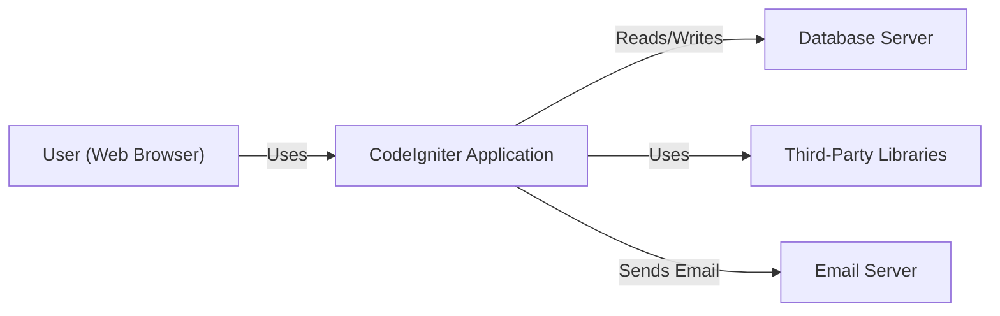
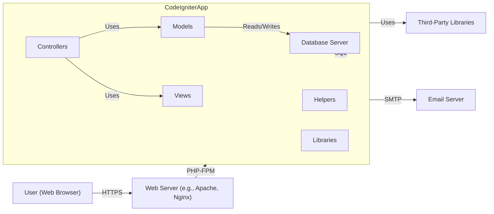
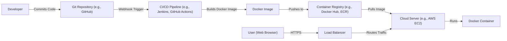

Okay, let's create a design document for the CodeIgniter project, focusing on aspects relevant for threat modeling.

# BUSINESS POSTURE

CodeIgniter is a PHP framework for building web applications.  It's an open-source project, suggesting a community-driven development model.  The business priorities likely revolve around:

*   Ease of Use:  Making it simple for developers to build applications quickly.
*   Community Growth:  Attracting and retaining a vibrant community of users and contributors.
*   Maintainability:  Ensuring the framework remains relevant and updated over time.
*   Performance:  Providing a framework that allows for the creation of performant web applications.
*   Adoption: Increasing the number of projects and companies using CodeIgniter.

Based on these priorities, the most important business risks are:

*   Security Vulnerabilities:  Vulnerabilities in the framework could expose applications built with it to attacks, damaging the reputation and adoption of CodeIgniter. This is the most critical risk.
*   Lack of Maintenance:  If the project is not actively maintained, it will become outdated, insecure, and less attractive to developers.
*   Competition:  Other PHP frameworks (Laravel, Symfony, etc.) compete for market share. CodeIgniter needs to remain competitive in features, security, and performance.
*   Community Fragmentation:  A divided or inactive community can hinder development and support.

# SECURITY POSTURE

Based on the provided GitHub repository, the following security controls and accepted risks can be identified.  It's important to note that this is an assessment of the *framework* itself, not necessarily of applications built *with* the framework.  Application-level security is heavily dependent on how developers use CodeIgniter.

*   security control: Input Validation: CodeIgniter provides libraries and helpers for input validation (form validation library, input filtering). Implemented in system/libraries/Form_validation.php and system/core/Input.php.
*   security control: Output Encoding:  CodeIgniter encourages output encoding to prevent Cross-Site Scripting (XSS) through its templating engine and helper functions. Implemented in system/core/Output.php and related view handling.
*   security control: CSRF Protection: CodeIgniter offers built-in Cross-Site Request Forgery (CSRF) protection. Implemented in system/core/Security.php and configured in application/config/config.php.
*   security control: Database Security: CodeIgniter uses parameterized queries (when used correctly) to help prevent SQL injection. Implemented in system/database/DB_driver.php and its subclasses.
*   security control: Session Management: CodeIgniter provides session management features. Implemented in system/libraries/Session.php.
*   security control: File Upload Handling: CodeIgniter includes a file upload class with some security checks. Implemented in system/libraries/Upload.php.
*   security control: Error Handling and Logging: CodeIgniter has error handling and logging capabilities. Implemented in system/core/Exceptions.php and related configuration.
*   security control: Security-related configuration options: The config.php file contains various security-related settings. Described in application/config/config.php.
*   accepted risk: Developer Misuse:  CodeIgniter, like any framework, can be used insecurely.  The framework provides tools, but it's the developer's responsibility to use them correctly. This is a significant accepted risk, inherent in providing a development framework.
*   accepted risk: Third-Party Libraries:  Applications built with CodeIgniter may use third-party libraries, which are outside the scope of the framework's security.
*   accepted risk: Outdated Versions: Users may be running outdated versions of CodeIgniter with known vulnerabilities.

Recommended Security Controls (High Priority):

*   security control: Dependency Management Security: Implement a robust system for managing dependencies and ensuring they are up-to-date and free of known vulnerabilities. This could involve using tools like Composer and regularly scanning for vulnerabilities.
*   security control: Content Security Policy (CSP) Support:  Provide helpers or guidance for implementing CSP to mitigate XSS and other code injection attacks.
*   security control: HTTP Security Headers: Encourage or facilitate the setting of security-related HTTP headers (e.g., Strict-Transport-Security, X-Frame-Options, X-Content-Type-Options).
*   security control: Regular Security Audits: Conduct regular security audits and penetration testing of the framework itself.

Security Requirements:

*   Authentication: The framework should provide mechanisms or guidance for secure user authentication, including password hashing (using strong, modern algorithms like Argon2 or bcrypt) and secure storage of credentials. While CodeIgniter provides session management, specific authentication implementations are left to the developer.
*   Authorization: The framework should provide mechanisms or guidance for implementing role-based access control (RBAC) or other authorization schemes.  This is largely left to the developer, but the framework should offer tools to facilitate it.
*   Input Validation: All user-supplied input (including form data, URL parameters, and headers) must be validated rigorously to prevent injection attacks (SQL injection, XSS, command injection, etc.).  CodeIgniter provides libraries for this, but their correct use is crucial.
*   Cryptography: The framework should provide secure cryptographic functions for tasks such as password hashing, encryption, and secure random number generation.  It should use well-vetted libraries and algorithms.
*   Output Encoding: All output to the browser must be properly encoded to prevent XSS vulnerabilities.  CodeIgniter's templating system and helper functions should encourage this.

# DESIGN

## C4 CONTEXT

Element Descriptions:

*   Element:
    *   Name: User (Web Browser)
    *   Type: Person
    *   Description: A person interacting with the CodeIgniter application through a web browser.
    *   Responsibilities: Sends requests to the application, views responses, interacts with the application's features.
    *   Security controls: Browser-based security controls (e.g., same-origin policy, cookie security), user-implemented security measures (e.g., strong passwords, antivirus).

*   Element:
    *   Name: CodeIgniter Application
    *   Type: Software System
    *   Description: A web application built using the CodeIgniter framework.
    *   Responsibilities: Handles user requests, processes data, interacts with the database and other systems, generates responses.
    *   Security controls: Input validation, output encoding, CSRF protection, session management, database security (parameterized queries), file upload handling, error handling and logging.

*   Element:
    *   Name: Database Server
    *   Type: Software System
    *   Description: A database server (e.g., MySQL, PostgreSQL) used to store application data.
    *   Responsibilities: Stores and retrieves data, manages database users and permissions.
    *   Security controls: Database access controls, encryption at rest, regular backups, auditing.

*   Element:
    *   Name: Third-Party Libraries
    *   Type: Software System
    *   Description: External libraries used by the CodeIgniter application (e.g., Composer packages).
    *   Responsibilities: Provide specific functionality not included in the core framework.
    *   Security controls: Regular updates, vulnerability scanning, security audits of critical libraries.

*   Element:
    *   Name: Email Server
    *   Type: Software System
    *   Description: An email server used to send emails from the application (e.g., password reset emails, notifications).
    *   Responsibilities: Sends emails on behalf of the application.
    *   Security controls: Secure authentication, encryption in transit (TLS), spam filtering.

## C4 CONTAINER

Element Descriptions:

*   Element:
    *   Name: Web Server (e.g., Apache, Nginx)
    *   Type: Container
    *   Description: A web server that receives requests from users and forwards them to the CodeIgniter application.
    *   Responsibilities: Handles HTTP requests, serves static content, manages SSL/TLS certificates.
    *   Security controls: Web server configuration hardening, firewall rules, regular security updates.

*   Element:
    *   Name: CodeIgniter Application
    *   Type: Container
    *   Description: The CodeIgniter application itself, running within a PHP environment (e.g., PHP-FPM).
    *   Responsibilities: Processes requests, interacts with the database and other systems, generates responses.
    *   Security controls: Input validation, output encoding, CSRF protection, session management, database security (parameterized queries), file upload handling, error handling and logging.

*   Element:
    *   Name: Controllers
    *   Type: Component
    *   Description: CodeIgniter controllers that handle incoming requests and coordinate the application's response.
    *   Responsibilities: Receive requests, interact with models and views, return responses.
    *   Security controls: Input validation, authorization checks.

*   Element:
    *   Name: Models
    *   Type: Component
    *   Description: CodeIgniter models that represent the application's data and business logic.
    *   Responsibilities: Interact with the database, encapsulate data access and manipulation.
    *   Security controls: Data validation, secure database interactions.

*   Element:
    *   Name: Views
    *   Type: Component
    *   Description: CodeIgniter views that generate the HTML output sent to the user.
    *   Responsibilities: Present data to the user, format output.
    *   Security controls: Output encoding to prevent XSS.

*   Element:
    *   Name: Helpers
    *   Type: Component
    *   Description: CodeIgniter helper functions that provide common utility functions.
    *   Responsibilities: Provide reusable code for tasks like form handling, string manipulation, etc.
    *   Security controls: Secure coding practices within helper functions.

*   Element:
    *   Name: Libraries
    *   Type: Component
    *   Description: CodeIgniter libraries that provide specific functionality (e.g., database access, session management).
    *   Responsibilities: Provide reusable code for specific tasks.
    *   Security controls: Secure coding practices within library code.

*   Element:
    *   Name: Database Server
    *   Type: Container
    *   Description: A database server (e.g., MySQL, PostgreSQL) used to store application data.
    *   Responsibilities: Stores and retrieves data, manages database users and permissions.
    *   Security controls: Database access controls, encryption at rest, regular backups, auditing.

*   Element:
    *   Name: Third-Party Libraries
    *   Type: Container
    *   Description: External libraries used by the CodeIgniter application (e.g., Composer packages).
    *   Responsibilities: Provide specific functionality not included in the core framework.
    *   Security controls: Regular updates, vulnerability scanning, security audits of critical libraries.

*   Element:
    *   Name: Email Server
    *   Type: Container
    *   Description: An email server used to send emails from the application.
    *   Responsibilities: Sends emails on behalf of the application.
    *   Security controls: Secure authentication, encryption in transit (TLS), spam filtering.

## DEPLOYMENT

Possible deployment solutions:

1.  Traditional Hosting: Deploying the CodeIgniter application to a shared or dedicated hosting environment with a LAMP (Linux, Apache, MySQL, PHP) or similar stack.
2.  Cloud Hosting (IaaS): Deploying to virtual machines on a cloud provider like AWS EC2, Google Compute Engine, or Azure Virtual Machines. This offers more control over the environment.
3.  Platform as a Service (PaaS): Using a PaaS provider like AWS Elastic Beanstalk, Google App Engine, or Heroku to simplify deployment and scaling.
4.  Containerization (Docker): Packaging the application and its dependencies into a Docker container and deploying it to a container orchestration platform like Kubernetes or Docker Swarm.
5.  Serverless: While CodeIgniter isn't inherently designed for serverless, parts of the application (e.g., API endpoints) could be implemented as serverless functions (e.g., AWS Lambda, Google Cloud Functions).

Chosen Solution (for detailed description): Cloud Hosting (IaaS) with Docker

Element Descriptions:

*   Element:
    *   Name: Developer
    *   Type: Person
    *   Description: A developer working on the CodeIgniter application.
    *   Responsibilities: Writes code, commits changes to the Git repository.
    *   Security controls: Secure coding practices, code reviews, two-factor authentication for repository access.

*   Element:
    *   Name: Git Repository (e.g., GitHub)
    *   Type: System
    *   Description: A Git repository hosting the application's source code.
    *   Responsibilities: Stores code, tracks changes, manages versions.
    *   Security controls: Access controls, branch protection rules, code signing.

*   Element:
    *   Name: CI/CD Pipeline (e.g., Jenkins, GitHub Actions)
    *   Type: System
    *   Description: A continuous integration and continuous deployment pipeline that automates the build, test, and deployment process.
    *   Responsibilities: Builds the Docker image, runs tests, pushes the image to the container registry, deploys the application.
    *   Security controls: Secure configuration, access controls, vulnerability scanning of build environment.

*   Element:
    *   Name: Docker Image
    *   Type: Artifact
    *   Description: A Docker image containing the CodeIgniter application and its dependencies.
    *   Responsibilities: Provides a consistent and reproducible runtime environment for the application.
    *   Security controls: Use of minimal base images, regular security updates of base images and dependencies, vulnerability scanning of the image.

*   Element:
    *   Name: Container Registry (e.g., Docker Hub, ECR)
    *   Type: System
    *   Description: A registry for storing and managing Docker images.
    *   Responsibilities: Stores Docker images, provides access control.
    *   Security controls: Access controls, vulnerability scanning of stored images.

*   Element:
    *   Name: Cloud Server (e.g., AWS EC2)
    *   Type: Node
    *   Description: A virtual machine on a cloud provider running the Docker container.
    *   Responsibilities: Provides the compute resources for running the application.
    *   Security controls: Firewall rules, security groups, regular security updates of the operating system, intrusion detection systems.

*   Element:
    *   Name: Docker Container
    *   Type: Container
    *   Description: A running instance of the Docker image.
    *   Responsibilities: Executes the CodeIgniter application.
    *   Security controls: Resource limits (CPU, memory), read-only file system (where possible), minimal privileges.

*   Element:
    *   Name: User (Web Browser)
    *   Type: Person
    *   Description: A person interacting with the CodeIgniter application.
    *   Responsibilities: Sends requests, views responses.
    *   Security controls: Browser security settings, user-implemented security.

*   Element:
    *   Name: Load Balancer
    *   Type: Node
    *   Description: Distributes the traffic across multiple instances of application.
    *   Responsibilities: Accept incoming traffic and distribute to backend servers.
    *   Security controls: SSL termination, DDoS protection.

## BUILD

The build process for a CodeIgniter application, especially when containerized, typically involves the following steps:

1.  Code Checkout: The CI/CD pipeline checks out the latest code from the Git repository.
2.  Dependency Installation: Dependencies are installed (e.g., using Composer for PHP dependencies).
3.  Testing: Automated tests (unit tests, integration tests) are run to ensure code quality and functionality.
4.  Security Scans:
    *   Static Application Security Testing (SAST): Tools like PHPStan, Psalm, or commercial SAST tools are used to analyze the code for potential security vulnerabilities.
    *   Dependency Scanning: Tools like Composer audit or OWASP Dependency-Check are used to identify known vulnerabilities in third-party libraries.
    *   Container Image Scanning: If using Docker, the Docker image is scanned for vulnerabilities using tools like Trivy, Clair, or Anchore.
5.  Build Artifact: The application code, along with its dependencies, is packaged into a deployable artifact (e.g., a Docker image).
6.  Artifact Storage: The build artifact is pushed to a storage location (e.g., a container registry).

```mermaid
graph LR
    Developer["Developer"] -- "Commits Code" --> GitRepo["Git Repository"]
    GitRepo -- "Triggers" --> CI_CD["CI/CD Pipeline"]
    subgraph CI_CD
        Checkout["Code Checkout"] --> InstallDeps["Dependency Installation"]
        InstallDeps --> Testing["Testing (Unit, Integration)"]
        Testing --> SAST["SAST Scanning"]
        SAST --> DependencyCheck["Dependency Scanning"]
        DependencyCheck --> BuildArtifact["Build Artifact (e.g., Docker Image)"]
        BuildArtifact --> ContainerScan["Container Image Scanning"]
        ContainerScan --> PushArtifact["Push Artifact to Registry"]
    end
    PushArtifact --> ContainerRegistry["Container Registry"]

```

# RISK ASSESSMENT

*   Critical Business Processes:
    *   User Registration and Login: Ensuring the secure handling of user accounts and credentials.
    *   Data Processing: Protecting the integrity and confidentiality of data processed by applications built with CodeIgniter.
    *   Application Availability: Maintaining the availability of applications built with the framework.

*   Data Sensitivity:
    *   Personally Identifiable Information (PII): Usernames, email addresses, passwords (hashed), addresses, phone numbers, etc. (High Sensitivity)
    *   Financial Data: Payment information, transaction history (if applicable). (High Sensitivity)
    *   Application-Specific Data: Data specific to the application's functionality (e.g., content, user-generated data). (Variable Sensitivity - depends on the application)
    *   Session Data: Session identifiers and associated data. (Medium Sensitivity)
    *   Configuration Data: Database credentials, API keys, etc. (High Sensitivity)

# QUESTIONS & ASSUMPTIONS

*   Questions:
    *   What specific version control system is used (GitHub, GitLab, Bitbucket, etc.)? This impacts the specifics of CI/CD integration and security controls.
    *   What specific CI/CD platform is used (Jenkins, GitHub Actions, GitLab CI, etc.)? This affects the implementation details of the build and deployment process.
    *   What specific database system(s) are commonly used with CodeIgniter applications? This influences database security recommendations.
    *   What is the typical deployment environment for CodeIgniter applications (shared hosting, cloud, etc.)? This impacts the deployment diagram and security considerations.
    *   Are there any existing security policies or guidelines for CodeIgniter development or deployment?
    *   What level of security expertise is assumed for developers using CodeIgniter?

*   Assumptions:
    *   BUSINESS POSTURE: The primary goal is to provide a flexible and easy-to-use framework, with security being a critical but not necessarily the *sole* driving factor.
    *   SECURITY POSTURE: Developers have a basic understanding of web security principles, but may not be security experts. The framework provides some security features, but secure usage is ultimately the developer's responsibility.
    *   DESIGN: A standard LAMP-like stack is a common deployment environment. Composer is used for dependency management. A CI/CD pipeline is desirable but may not always be present.
    *   The project is open source and community driven.
    *   The project is actively maintained.
    *   Developers using the framework have varying levels of security expertise.
    *   Applications built with CodeIgniter may handle sensitive data.
    *   A significant portion of the security responsibility lies with the developers using the framework.