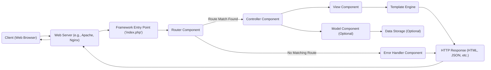
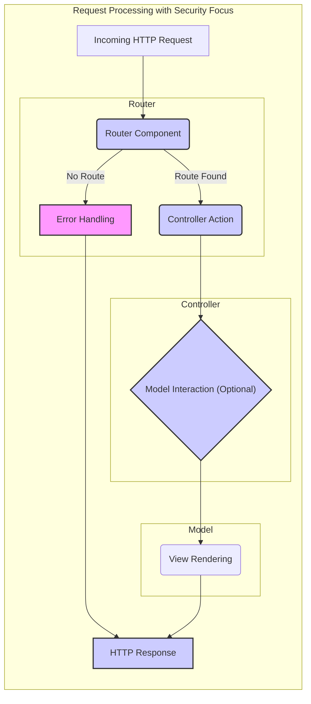

# Project Design Document: Fat-Free Framework

**Version:** 1.1
**Date:** October 26, 2023
**Author:** AI Software Architect

## 1. Introduction

This document provides a detailed architectural design of the Fat-Free Framework (F3), a micro web framework for PHP, based on the project repository found at [https://github.com/bcosca/fatfree](https://github.com/bcosca/fatfree). This document aims to provide a comprehensive understanding of the framework's structure, components, and data flow, which will serve as the foundation for subsequent threat modeling activities. This revision includes more detail on potential security considerations within each component.

## 2. Goals and Objectives

The primary goal of the Fat-Free Framework is to provide a lightweight, yet powerful, foundation for building web applications in PHP. Key objectives include:

*   **Simplicity:** Offer an easy-to-learn and use API, reducing the likelihood of developer errors that could introduce vulnerabilities.
*   **Performance:** Minimize overhead and maximize execution speed, indirectly contributing to security by reducing resource exhaustion attack surfaces.
*   **Flexibility:** Allow developers to choose their preferred tools and libraries, requiring careful consideration of the security implications of those choices.
*   **Extensibility:** Provide mechanisms for extending the framework's functionality, necessitating thorough security reviews of any extensions.

## 3. High-Level Architecture

The Fat-Free Framework follows a Model-View-Controller (MVC) architectural pattern, although it provides a flexible approach and doesn't strictly enforce it. The core components interact to handle incoming HTTP requests and generate responses.

## 4. Detailed Component Design

This section describes the key components of the Fat-Free Framework in detail, with a focus on potential security implications.

### 4.1. Core Engine

*   **`Base` Class:** The central class managing configuration, routing, and acting as a service locator.
    *   **Security Consideration:** Improper access control or vulnerabilities within the `Base` class could compromise the entire application. Configuration settings managed here, like database credentials, are sensitive.
*   **`Registry`:** Stores application-wide variables and objects.
    *   **Security Consideration:**  Sensitive data stored in the `Registry` without proper protection could be exposed. Ensure appropriate access controls and sanitization when retrieving data.
*   **`Config`:** Loads and manages configuration settings.
    *   **Security Consideration:** Configuration files often contain sensitive information. Secure storage and access control are crucial. Ensure proper parsing to prevent injection vulnerabilities if configuration is dynamically loaded.
*   **`Router`:** Maps HTTP requests to controller actions.
    *   **Security Consideration:**  Vulnerabilities in route definitions can lead to unauthorized access or allow attackers to trigger unintended functionality. Ensure proper input validation and avoid overly permissive route patterns.
*   **`Dispatcher`:** Invokes the appropriate controller method.
    *   **Security Consideration:**  The dispatcher relies on the router's output. If the router is compromised, the dispatcher could execute unintended code.
*   **`ErrorHandler`:** Handles exceptions and errors.
    *   **Security Consideration:**  Detailed error messages can reveal sensitive information to attackers. Implement custom error handling that logs details securely but provides minimal information to the client in production environments.
*   **`Lexicon`:** Provides internationalization and localization.
    *   **Security Consideration:**  Improper handling of localized strings could lead to cross-site scripting (XSS) vulnerabilities if user-provided translations are not sanitized.

### 4.2. Request Handling

*   **Entry Point (`index.php`):** Initializes the framework and starts the routing process.
    *   **Security Consideration:** This file should be carefully secured to prevent unauthorized modification or execution of arbitrary code.
*   **Request Object (Implicit):**  Accessed through global variables (`$_GET`, `$_POST`, `$_COOKIE`, etc.) or helper methods.
    *   **Security Consideration:**  Directly accessing superglobals requires careful sanitization and validation of all user inputs to prevent injection attacks (SQL injection, XSS, etc.).
*   **Response Object (Implicit):** Managed through PHP's output buffering and header functions.
    *   **Security Consideration:**  Ensure proper encoding of output to prevent XSS. Setting appropriate security headers (e.g., Content-Security-Policy, X-Frame-Options) is crucial.

### 4.3. Model Layer (Optional)

*   Fat-Free does not enforce a specific ORM.
*   Developers integrate their preferred database interaction methods.
    *   **Security Consideration:**  The security of the model layer heavily depends on the chosen database interaction method. Ensure proper parameterized queries or prepared statements are used to prevent SQL injection. Validate and sanitize data before interacting with the database.

### 4.4. View Layer

*   **Template Engine:** Supports various engines (internal, Smarty, Twig).
    *   **Security Consideration:**  Template engines can be vulnerable to Server-Side Template Injection (SSTI) if user input is directly embedded into templates without proper escaping. Use auto-escaping features and avoid allowing user-controlled template logic.
*   **View Files:** Contain presentation logic and HTML.
    *   **Security Consideration:**  Ensure proper encoding of data displayed in views to prevent XSS vulnerabilities.
*   **Template Rendering:**  Data is passed from controllers to views.
    *   **Security Consideration:**  Sanitize data in the controller before passing it to the view to prevent malicious scripts from being rendered.

### 4.5. Extensibility

*   **Plugins:** Extend functionality.
    *   **Security Consideration:**  Plugins can introduce vulnerabilities. Thoroughly review and vet any third-party plugins before using them. Ensure plugins operate with the least necessary privileges.
*   **Middleware (Implicit):** Achieved through routing logic.
    *   **Security Consideration:**  Ensure middleware logic is correctly implemented to enforce security policies (e.g., authentication, authorization) before requests reach the core application logic.
*   **Events/Hooks:** Allow hooking into the request lifecycle.
    *   **Security Consideration:**  Event handlers should be carefully reviewed as they can modify application behavior and potentially introduce vulnerabilities if not properly secured.

## 5. Data Flow

The typical data flow for a request in the Fat-Free Framework, highlighting potential security checkpoints, is as follows:

1. A client sends an HTTP request to the web server.
    *   **Security Checkpoint:** Web server security configurations (firewall, HTTPS).
2. The web server forwards the request to the Fat-Free Framework's entry point (`index.php`).
    *   **Security Checkpoint:** File system permissions on `index.php`.
3. The `Base` class initializes the framework and loads configuration settings.
    *   **Security Checkpoint:** Secure storage and access control for configuration files.
4. The `Router` analyzes the request URI and matches it against defined routes.
    *   **Security Checkpoint:**  Route definitions should prevent unauthorized access.
5. If a matching route is found, the `Dispatcher` instantiates the corresponding controller and executes the associated action method.
    *   **Security Checkpoint:** Input validation and sanitization within the controller action.
6. The controller may interact with the Model layer to retrieve or manipulate data.
    *   **Security Checkpoint:**  Parameterized queries or prepared statements to prevent SQL injection.
7. The controller prepares data to be displayed by the View layer.
    *   **Security Checkpoint:** Sanitization of data before passing to the view.
8. The specified template engine renders the view using the provided data.
    *   **Security Checkpoint:**  Template engine configuration to prevent SSTI, proper output encoding.
9. The rendered output is sent back as the HTTP response through the web server to the client.
    *   **Security Checkpoint:**  Setting appropriate security headers in the response.
10. If no matching route is found, the `ErrorHandler` handles the request.
    *   **Security Checkpoint:**  Preventing the disclosure of sensitive information in error messages.

## 6. Key Components for Threat Modeling

The following components are critical to consider during threat modeling due to their direct involvement in handling user input, data processing, and security-sensitive operations:

*   **Router Component:**  Misconfigurations can lead to unauthorized access. Focus on route definitions and parameter handling.
*   **Controller Component:**  Handles user input and business logic. Primary target for injection attacks. Emphasize input validation and sanitization.
*   **Model Component (Database Interaction):**  Vulnerable to SQL injection. Focus on secure database query practices.
*   **Template Engine:** Susceptible to SSTI. Focus on output encoding and avoiding user-controlled template logic.
*   **Configuration Management:**  Sensitive data needs protection. Focus on secure storage and access control.
*   **Error Handler Component:**  Can leak sensitive information. Focus on custom error handling in production.
*   **Session Management (if implemented by the application):**  Vulnerabilities can lead to session hijacking. Focus on secure session ID generation and storage.
*   **Cookie Handling (if used by the application):**  Improperly secured cookies can be exploited. Focus on `HttpOnly` and `Secure` flags.
*   **File Uploads (if implemented by the application):**  Require strict validation and sanitization. Focus on preventing malicious file uploads and execution.
*   **Authentication and Authorization (if implemented by the application):**  Critical for access control. Focus on secure authentication mechanisms and robust authorization logic.

## 7. Dependencies

Applications built on Fat-Free will depend on:

*   **PHP:**  Vulnerabilities in the PHP runtime can affect the application. Keep PHP updated and review security advisories.
*   **Web Server (e.g., Apache, Nginx):**  Web server vulnerabilities can be exploited. Ensure the web server is properly configured and updated.
*   **Database Driver (if a database is used):**  Vulnerabilities in database drivers can be exploited. Keep drivers updated.
*   **Template Engine (optional):**  Third-party template engines may have their own vulnerabilities. Stay informed about security updates.
*   **Other Libraries:**  Any additional libraries introduced can introduce new vulnerabilities. Conduct security assessments of all dependencies.

## 8. Deployment Considerations

The deployment environment significantly impacts security:

*   **Web Server Configuration:**  Disable directory listing, set appropriate security headers (e.g., HSTS), and configure access controls.
*   **PHP Configuration:**  Disable dangerous functions, set appropriate `php.ini` directives (e.g., `expose_php = Off`), and enable security extensions.
*   **Operating System Security:**  Keep the OS and its components updated with security patches. Implement strong user access controls.
*   **Network Security:**  Use firewalls to restrict access, implement intrusion detection/prevention systems.
*   **HTTPS:**  Enforce HTTPS for all communication using TLS certificates.
*   **Secure Storage of Secrets:**  Use environment variables or dedicated secret management tools for sensitive credentials.

## 9. Future Considerations

Potential future enhancements that could impact architecture and security:

*   **Explicit Request and Response Objects:**  Could provide more control over input validation and output encoding.
*   **Built-in Middleware Support:**  Would offer a more standardized and potentially more secure way to handle cross-cutting concerns.
*   **Enhanced Security Features:**  Integration of features like CSRF protection or input sanitization helpers directly into the framework.
*   **Standardized ORM Integration:**  Could promote more secure database interaction patterns.

This revised document provides a more detailed architectural overview of the Fat-Free Framework, with a stronger emphasis on security considerations relevant for threat modeling. This information will be valuable for identifying potential vulnerabilities and designing appropriate mitigation strategies.
