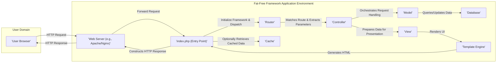

# Project Design Document: Fat-Free Framework

**Version:** 1.1
**Date:** October 26, 2023
**Author:** Gemini (AI Language Model)

## 1. Introduction

This document provides an enhanced architectural design of the Fat-Free Framework (F3), a micro web framework for PHP, based on the project repository found at [https://github.com/bcosca/fatfree](https://github.com/bcosca/fatfree). This revised document aims to provide a more detailed and nuanced understanding of the framework's structure, components, and data flow, explicitly tailored for subsequent threat modeling activities. It elaborates on key interactions and potential security implications within the framework.

## 2. Project Overview

Fat-Free Framework (F3) is a lightweight yet powerful PHP web framework designed for rapid development. It prioritizes simplicity, flexibility, and high performance. F3 offers essential building blocks for constructing web applications, RESTful APIs, and various other web-based services, without enforcing a strict, opinionated structure. Its core design principles emphasize a minimal footprint, ease of integration, and extensibility through plugins.

## 3. Goals and Objectives

The primary goals of F3 are:

*   To offer a minimalistic and highly efficient foundation for PHP web development.
*   To provide a flexible and expressive routing system for precisely mapping HTTP request URIs to specific application logic.
*   To facilitate straightforward data handling, including seamless interaction with diverse data sources.
*   To enable the creation of dynamic and interactive web pages through an adaptable templating engine system.
*   To promote code reusability, modularity, and long-term maintainability of applications.
*   To maintain a remarkably small codebase and minimize external dependencies to enhance performance and reduce potential attack surface.

## 4. Target Audience

This design document is primarily intended for:

*   Security engineers and architects tasked with performing threat modeling, security architecture reviews, and penetration testing of applications built on F3.
*   Developers who are new to the Fat-Free Framework and require a comprehensive understanding of its internal architecture and component interactions.
*   Operations and DevOps teams responsible for the secure deployment, configuration, and ongoing maintenance of F3-based applications.

## 5. Architectural Overview

Fat-Free predominantly follows a Model-View-Controller (MVC) architectural pattern, although it's designed to be unopinionated, allowing developers the freedom to deviate as needed. The central element of the framework is its sophisticated routing mechanism, complemented by a collection of utility classes and functions encapsulated within the `Base` class. This design promotes loose coupling and modularity.

## 6. Core Components

The main components of the Fat-Free Framework include:

*   **`index.php` (Application Entry Point):** This is the initial PHP script executed by the web server upon receiving an HTTP request. Its primary responsibilities include:
    *   Bootstrapping the Fat-Free Framework environment.
    *   Loading configuration settings.
    *   Dispatching the incoming request to the Router.
*   **`Base` Class (Framework Core):** The foundational class of F3, providing a wide range of core functionalities:
    *   **Configuration Management:** Loading, accessing, and managing application configuration parameters from various sources.
    *   **Request Handling:**  Providing methods to access and process details of the incoming HTTP request (parameters, headers, methods, etc.).
    *   **Response Handling:** Offering tools to construct and send HTTP responses (setting headers, status codes, and output body).
    *   **Error Handling and Debugging:**  Managing error reporting, exception handling, and providing debugging utilities.
    *   **Plugin Management:**  Facilitating the registration and execution of extensions and plugins to enhance framework functionality.
    *   **Event Handling (Hooks):** Allowing developers to hook into specific points in the framework's execution lifecycle.
*   **Router:**  A crucial component responsible for:
    *   Receiving the request URI from `index.php`.
    *   Matching the URI against a set of defined routes (patterns).
    *   Extracting parameters from the URI based on the matched route.
    *   Invoking the associated controller action or function.
*   **Controller:**  Serves as the intermediary between the Model and the View, responsible for:
    *   Receiving control from the Router.
    *   Orchestrating application logic to handle the specific request.
    *   Interacting with Models to retrieve or manipulate data.
    *   Preparing data to be passed to the View for rendering.
*   **Model:** Represents the data structures and business logic of the application, typically responsible for:
    *   Interacting with data sources (databases, APIs, files).
    *   Implementing data validation rules.
    *   Encapsulating business rules and logic related to data manipulation.
*   **View:**  Focuses on the presentation layer, responsible for:
    *   Receiving data from the Controller.
    *   Rendering the user interface, typically in HTML format.
    *   Utilizing a Template Engine to dynamically generate content.
*   **Template Engine:** Enables the separation of presentation logic from application logic, offering features such as:
    *   Embedding PHP code within templates.
    *   Using a specific template syntax (e.g., for loops, conditionals).
    *   Layout inheritance and template partials.
    *   Support for various template engines (e.g., the built-in engine or third-party options like Twig).
*   **Database Abstraction Layer (DAL):** Provides a consistent and simplified interface for interacting with different database systems, abstracting away database-specific syntax and complexities.
*   **Cache Engine:** Offers mechanisms for storing frequently accessed data in memory or other fast storage to improve application performance by reducing database load.
*   **Session Management:** Handles user sessions, including:
    *   Creating and managing session IDs.
    *   Storing session data.
    *   Providing mechanisms for session security (e.g., preventing session fixation).
*   **Flash Messaging:**  A mechanism for displaying temporary, one-time messages to the user (e.g., success or error messages after form submissions).
*   **Command-Line Interface (CLI):**  Provides tools for executing command-line tasks related to the application (e.g., database migrations, running scripts).
*   **Plugin System:**  Allows developers to extend the framework's core functionality by integrating external libraries and components.

## 7. Data Flow

**Detailed Data Flow Description:**

1. A user initiates an action in their web browser (`'User Browser'`), resulting in an HTTP request.
2. The web server (`'Web Server (e.g., Apache/Nginx)'`) receives the incoming HTTP request.
3. The web server directs the request to the `index.php` file (`'index.php (Entry Point)'`), which serves as the application's entry point.
4. `index.php` initializes the Fat-Free Framework, loads necessary configurations, and dispatches the request to the `'Router'`.
5. The `'Router'` analyzes the request URI and matches it against the defined routing rules. Upon a successful match, it extracts any parameters from the URI.
6. The `'Router'` then invokes the corresponding `'Controller'` responsible for handling the specific request.
7. The `'Controller'` receives control and orchestrates the application logic required to fulfill the request. This often involves:
    *   Interacting with the `'Model'` to retrieve, create, update, or delete data.
    *   The `'Model'` communicates with the `'Database'` to persist or retrieve data.
    *   Optionally, the `'Controller'` might interact with the `'Cache'` to retrieve frequently accessed data, improving performance.
8. Once the necessary data is processed, the `'Controller'` prepares it for presentation.
9. The `'Controller'` passes the prepared data to the `'View'`.
10. The `'View'` utilizes the `'Template Engine'` to render the user interface, dynamically generating HTML markup based on the provided data.
11. The `'Template Engine'` outputs the generated HTML back to `index.php`.
12. `index.php` constructs the final HTTP response, including headers and the HTML body.
13. `index.php` sends the HTTP response back to the `'Web Server (e.g., Apache/Nginx)'`.
14. The web server delivers the HTTP response back to the `'User Browser'`, completing the request cycle.

## 8. External Dependencies

While Fat-Free aims for minimal core dependencies, applications built upon it will likely rely on:

*   **PHP (>= 5.3):** The fundamental programming language. Specific features or extensions might require newer versions.
*   **Web Server (e.g., Apache, Nginx with PHP-FPM):**  Essential for serving the application and processing PHP requests.
*   **Database System (e.g., MySQL/MariaDB, PostgreSQL, SQLite, MongoDB):**  If the application requires persistent data storage. Specific PHP extensions are needed for each database type (e.g., `pdo_mysql`, `pdo_pgsql`).
*   **PHP Extensions:**  Various PHP extensions may be required depending on the application's functionality, including:
    *   `pdo`: For database interaction.
    *   `curl`: For making HTTP requests to external services.
    *   `mbstring`: For handling multibyte strings.
    *   `openssl`: For cryptographic functions (HTTPS, encryption).
    *   `gd`: For image manipulation.
    *   `json`: For working with JSON data.
*   **Composer (Dependency Management):** While not strictly required for the framework itself, Composer is highly recommended for managing third-party libraries and dependencies within an F3 application.
*   **Template Engines (Optional):** While F3 has a built-in template engine, developers might choose to use external engines like Twig or Smarty, requiring their respective libraries.

## 9. Deployment Considerations

Deploying Fat-Free applications involves several common strategies:

*   **Traditional Web Hosting Environments:** Deploying to shared or dedicated servers running Apache or Nginx, with PHP configured through mod_php or PHP-FPM. This often involves uploading files via FTP/SFTP or using version control systems.
*   **Cloud-Based Virtual Machines (VMs):** Utilizing cloud provider services like AWS EC2, Azure Virtual Machines, or Google Compute Engine. Deployment often involves provisioning a VM, configuring the web server and PHP, and deploying the application code.
*   **Containerization (Docker, Kubernetes):** Packaging the application and its dependencies into Docker containers for consistent and reproducible deployments. Orchestration platforms like Kubernetes can manage and scale containerized F3 applications.
*   **Platform-as-a-Service (PaaS):** Utilizing platforms like Heroku, AWS Elastic Beanstalk, or Google App Engine, which handle much of the underlying infrastructure management. Deployment often involves pushing code changes through Git or using platform-specific deployment tools.

Common deployment steps include:

*   Transferring application files to the web server's document root or a designated application directory.
*   Configuring the web server to correctly route requests to the `index.php` file (e.g., through virtual host configurations or rewrite rules).
*   Setting up necessary environment variables or configuration files (e.g., database credentials, API keys).
*   Ensuring the correct PHP version and required extensions are installed and enabled on the server.
*   Configuring database connections and ensuring the database server is accessible.
*   Setting appropriate file system permissions to protect sensitive files and directories.

## 10. Security Considerations (Pre-Threat Modeling)

Before a formal threat modeling exercise, several key security considerations are apparent:

*   **Input Validation & Sanitization:** The framework relies heavily on developers to implement robust input validation and sanitization to prevent common injection vulnerabilities such as SQL Injection, Cross-Site Scripting (XSS), and Command Injection. Lack of proper validation is a significant risk.
*   **Output Encoding:** Developers are responsible for correctly encoding output data before rendering it in views to mitigate XSS vulnerabilities. Failure to do so can allow attackers to inject malicious scripts.
*   **Session Management Security:** Secure session handling is critical to prevent session hijacking and fixation attacks. Developers need to ensure proper session configuration (e.g., `httponly`, `secure` flags) and implement mechanisms to regenerate session IDs.
*   **Cross-Site Request Forgery (CSRF) Protection:** F3 does not provide built-in CSRF protection. Developers must implement their own mechanisms (e.g., synchronizer tokens) to prevent unauthorized actions on behalf of legitimate users.
*   **File Upload Security:** Secure handling of file uploads is essential to prevent malicious file uploads that could lead to remote code execution or other vulnerabilities. This includes validating file types, sizes, and sanitizing file names.
*   **Error Handling and Information Disclosure:** Improperly configured error reporting can expose sensitive information about the application's internal workings. Production environments should have detailed error reporting disabled.
*   **Dependency Vulnerabilities:**  Applications using third-party libraries are susceptible to vulnerabilities in those dependencies. Regular dependency updates and security audits are crucial.
*   **HTTPS Enforcement:** Ensuring all communication occurs over HTTPS is vital to protect data in transit from eavesdropping and manipulation.
*   **Configuration Security:** Securely storing and managing sensitive configuration data, such as database credentials and API keys, is paramount. Avoid storing sensitive information directly in code.
*   **Authentication and Authorization:** Implementing secure authentication mechanisms to verify user identities and authorization controls to restrict access to resources based on user roles is fundamental.
*   **Denial of Service (DoS) Attacks:**  Consideration should be given to potential vulnerabilities that could be exploited to launch DoS attacks, such as resource exhaustion or excessive request handling.

## 11. Conclusion

This enhanced design document provides a more detailed and security-focused overview of the Fat-Free Framework's architecture, components, and data flow. By elaborating on key interactions and potential security considerations, it aims to provide a stronger foundation for subsequent threat modeling activities. A thorough understanding of these aspects is crucial for proactively identifying and mitigating potential security vulnerabilities in applications built with F3.
