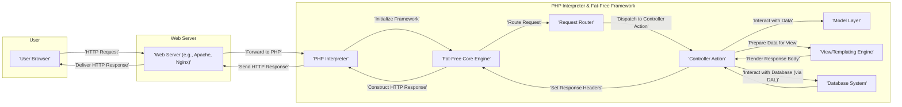

## Project Design Document: Fat-Free Framework (Improved)

**1. Introduction**

This document provides an enhanced design overview of the Fat-Free Framework (F3), a micro web framework for PHP. It is specifically designed to serve as a robust foundation for threat modeling activities, offering a detailed understanding of the framework's architecture, components, and data flow. This document aims to clearly outline the key elements of F3 to facilitate the identification of potential security vulnerabilities, attack surfaces, and associated risks.

**2. Project Overview**

The Fat-Free Framework is a lightweight and agile PHP web framework engineered for rapid web application development. Its core philosophy emphasizes simplicity and high performance, providing essential tools for request routing, template rendering, and database interactions without enforcing a complex or overly prescriptive structure. This minimalist design makes it well-suited for developing small to medium-sized web applications, RESTful APIs, and microservices.

**3. Goals**

* Deliver a precise and comprehensive architectural blueprint of the Fat-Free Framework.
* Clearly identify the framework's core components and their interactions within the application lifecycle.
* Detail the typical data flow within an application built using F3, highlighting potential points of interest for security analysis.
* Proactively highlight potential areas of security concern and common vulnerability patterns to guide subsequent threat modeling efforts.

**4. Target Audience**

This document is primarily intended for:

* Security engineers and architects tasked with performing threat modeling, security assessments, and penetration testing.
* Software developers utilizing the Fat-Free Framework who require a deeper understanding of its internal workings and security implications.
* DevOps and operations teams responsible for the secure deployment and maintenance of applications built with F3.

**5. System Architecture**

The Fat-Free Framework loosely adheres to the Model-View-Controller (MVC) architectural pattern, offering flexibility in its implementation. Key architectural components include:

* **Core Framework Engine:** The central processing unit of F3, responsible for application bootstrapping, request lifecycle management, and providing core utilities.
* **Request Router:**  Analyzes incoming HTTP requests and maps them to specific controller actions based on user-defined route configurations. This is a critical entry point for user interaction.
* **Controller Layer:**  Houses the application's business logic, handling user input, orchestrating interactions with data models, and preparing data for presentation in the view.
* **Model Layer:** Represents the data structures and business rules of the application. F3 provides basic database interaction capabilities, often implemented through simple PHP classes or more sophisticated data mappers.
* **View and Templating Engine:**  Responsible for rendering the user interface, typically using HTML templates that can embed PHP code or utilize a dedicated templating language (e.g., Twig via a plugin). This is a key area for output encoding considerations.
* **Database Abstraction Layer (DAL):** Provides a consistent interface for interacting with various relational database management systems (RDBMS), abstracting away database-specific syntax.
* **Configuration Management:**  Handles the loading and management of application settings and parameters, often stored in configuration files. Secure configuration is paramount.
* **Request and Response Objects:** Encapsulate the details of incoming HTTP requests (headers, body, parameters) and outgoing responses (headers, body, status codes).
* **Plugin and Extension System:** Allows developers to extend the framework's core functionality with reusable components, potentially introducing new attack surfaces if not vetted.

**6. Data Flow (Detailed)**

The typical lifecycle of an HTTP request within a Fat-Free application involves the following steps:

* A user initiates an action in their browser, generating an **HTTP Request**.
* The **Web Server** (e.g., Apache, Nginx) receives the incoming request.
* The web server forwards the request to the **PHP Interpreter**.
* The **Fat-Free Core Engine** is initialized, bootstrapping the application environment.
* The **Request Router** examines the request URI and matches it against the defined routing rules.
* The **Router** dispatches the request to the designated **Controller Action**.
* The **Controller Action** executes the application's business logic:
    * It may interact with **Model** classes to retrieve, create, update, or delete data.
    * Database interactions occur through the **Database Abstraction Layer**.
    * It prepares data to be presented to the user.
* The **View/Templating Engine** uses the prepared data and the appropriate template to generate the **HTTP Response Body** (typically HTML).
* The **Controller Action** sets any necessary **Response Headers** (e.g., content type, caching directives).
* The framework constructs the complete **HTTP Response**.
* The **PHP Interpreter** sends the **HTTP Response** back to the **Web Server**.
* The **Web Server** delivers the **HTTP Response** to the **User's Browser**.

**7. Security Considerations (Detailed)**

Based on the framework's architecture and data flow, key security considerations for threat modeling include:

* **Input Validation and Sanitization:**
    * **Threat:** Injection attacks (SQL Injection, Cross-Site Scripting (XSS), Command Injection, etc.) due to unsanitized user input.
    * **Considerations:**  Identify all points where user-supplied data enters the application (e.g., request parameters, headers, file uploads). Assess the effectiveness of input validation and sanitization mechanisms. F3 itself provides limited built-in sanitization; developers are responsible for implementing robust validation.
* **Output Encoding:**
    * **Threat:** Cross-Site Scripting (XSS) vulnerabilities arising from displaying untrusted data in the view without proper encoding.
    * **Considerations:** Analyze how data is rendered in templates. Ensure appropriate encoding is applied based on the output context (HTML, JavaScript, URL). Templating engines often offer encoding functions that should be utilized.
* **Authentication and Authorization:**
    * **Threat:** Unauthorized access to resources and functionality due to weak or missing authentication and authorization mechanisms.
    * **Considerations:**  F3 does not enforce a specific authentication scheme. Evaluate how authentication is implemented (e.g., session-based, token-based). Assess the strength of password hashing and storage. Analyze the authorization logic to ensure users only have access to permitted resources.
* **Database Security:**
    * **Threat:** Data breaches and manipulation due to SQL Injection vulnerabilities or insecure database configurations.
    * **Considerations:**  Verify the use of parameterized queries or prepared statements to prevent SQL Injection. Assess database connection security and access controls.
* **Session Management:**
    * **Threat:** Session hijacking, session fixation, and other session-related attacks.
    * **Considerations:**  Evaluate the security of session ID generation, storage, and transmission (e.g., use of `httponly` and `secure` flags). Assess session timeout mechanisms.
* **Cross-Site Request Forgery (CSRF) Protection:**
    * **Threat:** Malicious actions performed on behalf of an authenticated user without their knowledge.
    * **Considerations:**  Determine if CSRF protection mechanisms (e.g., synchronizer tokens) are implemented for state-changing requests.
* **File Upload Security:**
    * **Threat:** Malicious file uploads leading to code execution, information disclosure, or denial of service.
    * **Considerations:**  Analyze file upload handling logic. Ensure proper validation of file types, sizes, and content. Assess where uploaded files are stored and if they are accessible to the public.
* **Dependency Management:**
    * **Threat:** Vulnerabilities in third-party libraries and components used by the application.
    * **Considerations:**  Identify all dependencies. Assess the process for tracking and updating dependencies to patch known vulnerabilities.
* **Configuration Security:**
    * **Threat:** Exposure of sensitive information (e.g., database credentials, API keys) through insecure configuration.
    * **Considerations:**  Analyze how configuration data is stored and managed. Avoid storing sensitive information directly in code or publicly accessible files.
* **Error Handling and Logging:**
    * **Threat:** Information leakage through overly verbose error messages or insecure logging practices.
    * **Considerations:**  Evaluate error handling mechanisms to prevent the disclosure of sensitive information. Assess logging practices to ensure sensitive data is not logged inappropriately.
* **Routing Security:**
    * **Threat:** Unintended access to application functionality or information due to insecurely defined routes.
    * **Considerations:**  Review route definitions to ensure they are appropriately restricted and do not expose administrative or internal endpoints without proper authentication.

**8. Deployment Considerations (Security Focused)**

Secure deployment of Fat-Free applications requires careful attention to the following:

* **Web Server Hardening:**
    * Disable unnecessary modules and features.
    * Configure appropriate access controls and permissions.
    * Implement security headers (e.g., `Strict-Transport-Security`, `X-Frame-Options`, `Content-Security-Policy`).
* **PHP Configuration Hardening:**
    * Disable dangerous functions (e.g., `eval()`, `system()`).
    * Set appropriate `open_basedir` restrictions.
    * Disable `display_errors` in production environments.
* **Network Security:**
    * Implement firewalls to restrict access to the application.
    * Use network segmentation to isolate application components.
    * Employ intrusion detection and prevention systems (IDS/IPS).
* **HTTPS/TLS Enforcement:**
    * Ensure all communication is encrypted using HTTPS.
    * Configure TLS correctly, using strong ciphers and protocols.
* **Regular Security Updates:**
    * Keep the operating system, web server, PHP, and all dependencies updated with the latest security patches.
* **Secure File Permissions:**
    * Set appropriate file system permissions to prevent unauthorized access to application files.
* **Container Security (if applicable):**
    * Use minimal base images.
    * Follow container security best practices.
    * Regularly scan container images for vulnerabilities.

**9. Dependencies (Security Implications)**

The Fat-Free Framework's core has minimal dependencies, which can be a security advantage. However, applications built with F3 often rely on additional libraries:

* **PHP Extensions:**  Ensure that any required PHP extensions are from trusted sources and are kept up-to-date. Vulnerabilities in PHP extensions can directly impact the application's security.
* **Third-Party Libraries (via Composer):**  Carefully vet any third-party libraries used in the project.
    * **Supply Chain Attacks:** Be aware of the risk of malicious code being introduced through compromised dependencies.
    * **Vulnerability Management:** Implement a process for tracking and updating dependencies to address known security vulnerabilities. Tools like `composer audit` can help with this.
* **Database Drivers (PDO):** Ensure the PDO drivers used to connect to the database are up-to-date and from reputable sources.

**10. Future Considerations (Security Enhancements)**

Potential future security enhancements for the Fat-Free Framework could include:

* **Built-in CSRF Protection:**  Providing a more integrated mechanism for CSRF protection.
* **Input Sanitization Helpers:**  Offering more robust and convenient input sanitization functions.
* **Content Security Policy (CSP) Integration:**  Facilitating the implementation of CSP headers.
* **Security Audits and Best Practices Documentation:**  Regularly auditing the framework's codebase and providing comprehensive security best practices documentation for developers.
* **Community Security Engagement:**  Establishing clear channels for reporting and addressing security vulnerabilities within the framework.

**11. Conclusion**

This enhanced design document provides a comprehensive and security-focused overview of the Fat-Free Framework. It highlights key architectural components, details the data flow, and emphasizes critical security considerations for threat modeling. By understanding these aspects, security professionals and developers can effectively identify and mitigate potential vulnerabilities, leading to the development of more secure and resilient web applications built with the Fat-Free Framework.