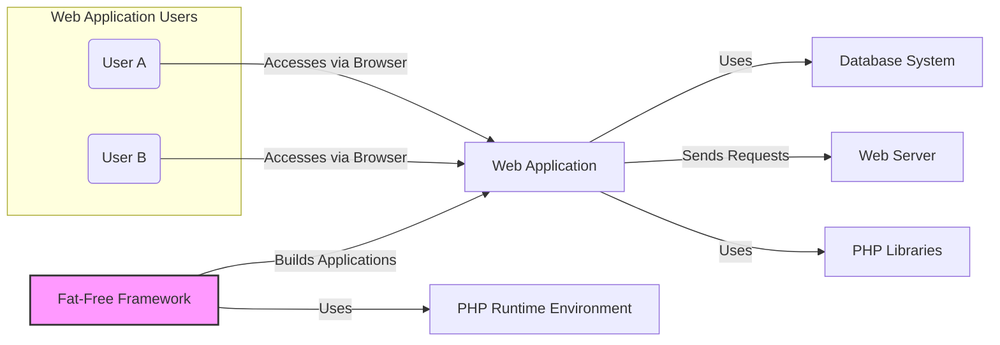
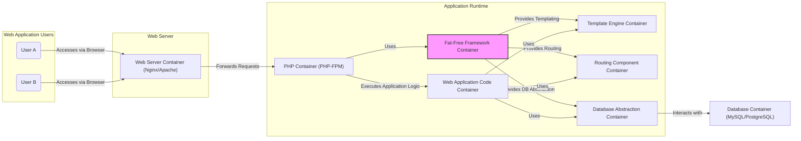
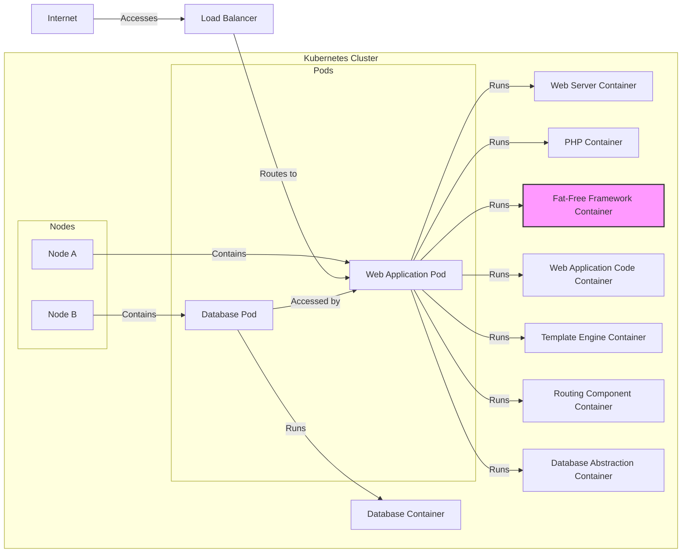
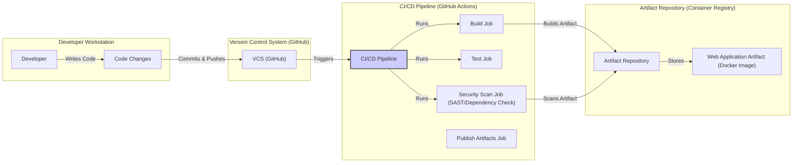

# BUSINESS POSTURE

This project, Fat-Free Framework (fatfree), is a lightweight yet powerful PHP web framework designed to help developers build web applications quickly and efficiently.

- Business Priorities:
  - Rapid Application Development: Fatfree aims to simplify and accelerate the web development process, allowing developers to bring applications to market faster.
  - Ease of Use: The framework is designed to be intuitive and easy to learn, reducing the learning curve for new developers and increasing productivity.
  - Flexibility: Fatfree provides a flexible foundation that can be adapted to a wide range of web application types and complexities.
  - Performance: As a lightweight framework, performance is a key consideration, ensuring applications built with Fatfree are responsive and efficient.
- Business Goals:
  - Empower developers to create web applications with minimal overhead and maximum efficiency.
  - Provide a robust and reliable framework that can be used for both small and medium-sized projects.
  - Foster a community of developers around the framework, encouraging contributions and improvements.
- Business Risks:
  - Security Vulnerabilities: As a web framework, vulnerabilities in Fatfree could directly impact the security of applications built upon it. This is a critical risk, especially if the framework is widely adopted.
  - Lack of Updates and Maintenance: If the framework is not actively maintained and updated, it could become outdated and potentially insecure over time.
  - Compatibility Issues: Changes in PHP or related technologies could lead to compatibility issues if the framework is not kept up-to-date.
  - Adoption Rate: If the framework fails to gain sufficient adoption, its long-term viability and community support may be limited.

# SECURITY POSTURE

- Security Controls:
  - security control: Input validation is expected to be implemented by developers using the framework within their applications. (Implementation responsibility is on the application developer using the framework).
  - security control: Output encoding is expected to be implemented by developers using the framework within their applications. (Implementation responsibility is on the application developer using the framework).
  - security control: Secure coding practices are recommended for developers using the framework. (Documented in best practices and community guidelines, if available).
- Accepted Risks:
  - accepted risk: Security vulnerabilities in applications built using Fatfree due to developer error. The framework provides tools, but ultimately application security depends on the developer's implementation.
  - accepted risk: Outdated dependencies in applications built using Fatfree if developers do not actively manage their application dependencies.
- Recommended Security Controls:
  - security control: Implement automated security scanning (SAST/DAST) for the Fatfree framework itself to identify and address potential vulnerabilities proactively.
  - security control: Establish a clear process for reporting and patching security vulnerabilities in the framework.
  - security control: Provide security guidelines and best practices documentation for developers using Fatfree to build secure applications.
  - security control: Encourage and facilitate community security audits and contributions to enhance the framework's security posture.
  - security control: Implement dependency scanning for the framework's dependencies to ensure no known vulnerabilities are present in third-party libraries.
- Security Requirements:
  - Authentication:
    - Applications built with Fatfree will likely require authentication mechanisms to verify user identities. The framework should provide tools or libraries to facilitate secure authentication implementation (e.g., session management, integration with authentication libraries).
  - Authorization:
    - Applications will need authorization mechanisms to control user access to resources and functionalities. The framework should offer features or guidance for implementing role-based access control (RBAC) or other authorization models.
  - Input Validation:
    - Robust input validation is crucial to prevent injection attacks. The framework should encourage and simplify input validation at all application entry points. This includes providing tools for sanitizing and validating user inputs.
  - Cryptography:
    - Applications may need to handle sensitive data that requires encryption. The framework should support or integrate with cryptography libraries to enable secure data storage and transmission. This includes providing guidance on secure key management practices.

# DESIGN

## C4 CONTEXT

### C4 Context Elements

- Context Element:
  - Name: User A, User B
  - Type: Person
  - Description: End-users who interact with web applications built using the Fat-Free Framework. They access the applications through web browsers.
  - Responsibilities: Access and use the web application to fulfill their needs.
  - Security Controls: Browser security controls, user authentication (implemented by the Web Application).
- Context Element:
  - Name: Web Application
  - Type: Software System
  - Description: A web application built using the Fat-Free Framework. This is the system being designed and analyzed from a security perspective.
  - Responsibilities: Provides web-based functionalities to users, processes user requests, interacts with the database, and presents information to users.
  - Security Controls: Input validation, output encoding, authentication, authorization, session management, error handling, logging, secure configuration (implemented by application developers using Fat-Free Framework).
- Context Element:
  - Name: Fat-Free Framework
  - Type: Software System
  - Description: A lightweight PHP web framework that provides the foundation and tools for building web applications.
  - Responsibilities: Provides core functionalities for routing, templating, database interaction, and other common web application tasks. Simplifies development and promotes code organization.
  - Security Controls: Framework-level security features (e.g., protection against common web vulnerabilities, secure defaults where applicable), security guidelines for developers (implemented by Fat-Free Framework developers).
- Context Element:
  - Name: Database System
  - Type: Software System
  - Description: A database system (e.g., MySQL, PostgreSQL, MongoDB) used by the Web Application to store and retrieve data.
  - Responsibilities: Persistently stores application data, provides data access and manipulation capabilities.
  - Security Controls: Database access controls, data encryption at rest, data encryption in transit, database hardening, regular backups (implemented by database administrators and application developers).
- Context Element:
  - Name: Web Server
  - Type: Software System
  - Description: A web server (e.g., Apache, Nginx) that hosts and serves the Web Application. It handles HTTP requests and responses.
  - Responsibilities: Receives user requests, serves static files, forwards dynamic requests to the PHP runtime environment, and delivers responses to users.
  - Security Controls: Web server hardening, access controls, TLS/SSL configuration, DDoS protection, web application firewall (WAF) (implemented by system administrators and DevOps).
- Context Element:
  - Name: PHP Runtime Environment
  - Type: Software System
  - Description: The PHP runtime environment that executes the Web Application code and the Fat-Free Framework.
  - Responsibilities: Executes PHP code, manages resources, provides core PHP functionalities.
  - Security Controls: PHP configuration hardening, keeping PHP version up-to-date with security patches (implemented by system administrators and DevOps).
- Context Element:
  - Name: PHP Libraries
  - Type: Software System
  - Description: External PHP libraries and packages that the Web Application might depend on for additional functionalities.
  - Responsibilities: Provide reusable code and functionalities to extend the capabilities of the Web Application.
  - Security Controls: Dependency vulnerability scanning, using trusted and updated libraries (implemented by application developers).

## C4 CONTAINER

### C4 Container Elements

- Container Element:
  - Name: Web Server Container (Nginx/Apache)
  - Type: Container
  - Description: A web server container responsible for handling HTTP requests, serving static content, and proxying dynamic requests to the PHP container.
  - Responsibilities: Listen for incoming HTTP requests, serve static files (HTML, CSS, JavaScript, images), forward dynamic requests to the PHP container, handle TLS/SSL termination.
  - Security Controls: Web server configuration hardening, TLS/SSL configuration, access controls, rate limiting, WAF integration (implemented by system administrators and DevOps).
- Container Element:
  - Name: PHP Container (PHP-FPM)
  - Type: Container
  - Description: A PHP-FPM (FastCGI Process Manager) container that executes the PHP code of the web application and the Fat-Free Framework.
  - Responsibilities: Execute PHP scripts, manage PHP processes, handle requests from the web server, interact with the database and other services.
  - Security Controls: PHP configuration hardening (disable dangerous functions, limit resource usage), keeping PHP version up-to-date, process isolation, secure coding practices in PHP (implemented by system administrators, DevOps, and application developers).
- Container Element:
  - Name: Fat-Free Framework Container
  - Type: Container
  - Description: The Fat-Free Framework itself, providing the core functionalities and structure for building the web application.
  - Responsibilities: Provide routing, templating, database abstraction, request handling, and other framework features. Enforce framework-level security best practices.
  - Security Controls: Framework security features (CSRF protection, input filtering, etc.), secure coding practices in framework development, regular security audits of the framework code (implemented by Fat-Free Framework developers).
- Container Element:
  - Name: Web Application Code Container
  - Type: Container
  - Description: The custom application code developed using the Fat-Free Framework. This contains the business logic, controllers, models, and views of the specific web application.
  - Responsibilities: Implement the specific functionalities of the web application, handle user requests, interact with the framework and database, generate responses.
  - Security Controls: Input validation, output encoding, authentication, authorization, secure session management, secure coding practices in application development, vulnerability scanning of application code (implemented by application developers).
- Container Element:
  - Name: Template Engine Container
  - Type: Container
  - Description: The templating engine component within Fat-Free Framework responsible for rendering dynamic web pages by combining templates and data.
  - Responsibilities: Process templates, inject data into templates, generate HTML output.
  - Security Controls: Protection against template injection vulnerabilities, output encoding of dynamic content (implemented by Fat-Free Framework developers and application developers using templating engine securely).
- Container Element:
  - Name: Routing Component Container
  - Type: Container
  - Description: The routing component within Fat-Free Framework that maps incoming HTTP requests to specific application controllers or handlers.
  - Responsibilities: Parse incoming requests, match URLs to routes, dispatch requests to appropriate handlers.
  - Security Controls: Protection against routing-related vulnerabilities (e.g., insecure redirects), secure route definitions (implemented by Fat-Free Framework developers and application developers defining routes securely).
- Container Element:
  - Name: Database Abstraction Container
  - Type: Container
  - Description: The database abstraction layer within Fat-Free Framework that simplifies database interactions and provides protection against SQL injection vulnerabilities.
  - Responsibilities: Provide an interface to interact with different database systems, abstract database-specific syntax, help prevent SQL injection.
  - Security Controls: Parameterized queries or prepared statements to prevent SQL injection, secure database connection management (implemented by Fat-Free Framework developers).
- Container Element:
  - Name: Database Container (MySQL/PostgreSQL)
  - Type: Container
  - Description: The database system container responsible for storing and managing application data.
  - Responsibilities: Persist data, manage database connections, enforce database security policies.
  - Security Controls: Database access controls, data encryption at rest and in transit, database hardening, regular backups, monitoring and auditing (implemented by database administrators and DevOps).

## DEPLOYMENT

Deployment Solution: Cloud-based Deployment using Docker and Kubernetes

### Deployment Elements

- Deployment Element:
  - Name: Kubernetes Cluster
  - Type: Environment
  - Description: A Kubernetes cluster providing container orchestration and management for the web application and database.
  - Responsibilities: Manage container deployment, scaling, and networking. Ensure high availability and resilience.
  - Security Controls: Kubernetes RBAC, network policies, pod security policies/admission controllers, secrets management, cluster monitoring and logging, regular security audits of the Kubernetes cluster (implemented by DevOps and platform engineers).
- Deployment Element:
  - Name: Nodes (Node A, Node B)
  - Type: Infrastructure
  - Description: Worker nodes in the Kubernetes cluster that host pods and containers.
  - Responsibilities: Provide compute resources for running containers.
  - Security Controls: Operating system hardening, node security updates, access controls, monitoring and logging (implemented by DevOps and system administrators).
- Deployment Element:
  - Name: Web Application Pod
  - Type: Container Instance
  - Description: A Kubernetes pod containing the containers for the web server, PHP runtime, Fat-Free Framework, and web application code.
  - Responsibilities: Run the web application containers, serve web requests, interact with the database pod.
  - Security Controls: Container image security scanning, least privilege container configurations, resource limits, network policies to restrict pod-to-pod communication, application-level security controls (as described in Container section) (implemented by DevOps and application developers).
- Deployment Element:
  - Name: Database Pod
  - Type: Container Instance
  - Description: A Kubernetes pod containing the database container.
  - Responsibilities: Run the database container, store and manage application data.
  - Security Controls: Database container image security scanning, persistent volume encryption, database access controls, network policies to restrict access to the database pod, database-level security controls (as described in Container section) (implemented by DevOps and database administrators).
- Deployment Element:
  - Name: Load Balancer
  - Type: Infrastructure
  - Description: A load balancer that distributes incoming traffic across multiple instances of the Web Application Pod for high availability and scalability.
  - Responsibilities: Distribute traffic, perform health checks on application pods, provide a single entry point to the application.
  - Security Controls: DDoS protection, TLS/SSL termination, access control lists (ACLs), security monitoring (implemented by cloud provider and DevOps).
- Deployment Element:
  - Name: Internet
  - Type: Network
  - Description: The public internet from which users access the web application.
  - Responsibilities: Provide network connectivity for users to reach the application.
  - Security Controls: General internet security measures, reliance on application and infrastructure security controls for protection against internet-based threats.

## BUILD

### Build Elements

- Build Element:
  - Name: Developer
  - Type: Person
  - Description: Software developers who write and modify the code for the Fat-Free Framework or applications built with it.
  - Responsibilities: Write code, commit changes to version control, participate in code reviews.
  - Security Controls: Secure coding practices, code review process, access control to development environment and code repositories (implemented by developers and development team).
- Build Element:
  - Name: Version Control System (GitHub)
  - Type: Tool
  - Description: A version control system (e.g., Git on GitHub) used to manage the source code of the Fat-Free Framework and applications.
  - Responsibilities: Store code versions, track changes, facilitate collaboration, manage branches and releases.
  - Security Controls: Access control to repositories, branch protection rules, audit logging, secure authentication for developers (implemented by development team and VCS administrator).
- Build Element:
  - Name: CI/CD Pipeline (GitHub Actions)
  - Type: Tool
  - Description: A CI/CD pipeline (e.g., GitHub Actions) that automates the build, test, security scanning, and publishing process.
  - Responsibilities: Automate build process, run unit and integration tests, perform security scans (SAST, dependency checks), build and publish artifacts (e.g., Docker images).
  - Security Controls: Secure pipeline configuration, access control to pipeline definitions and secrets, secure build environment, integration of security scanning tools, artifact signing (implemented by DevOps and security engineers).
- Build Element:
  - Name: Build Job
  - Type: Process
  - Description: A job within the CI/CD pipeline responsible for compiling code, packaging dependencies, and creating build artifacts.
  - Responsibilities: Compile code, manage dependencies, create deployable artifacts (e.g., Docker images, packages).
  - Security Controls: Secure build environment, dependency management, artifact integrity checks (implemented by CI/CD pipeline).
- Build Element:
  - Name: Test Job
  - Type: Process
  - Description: A job within the CI/CD pipeline that runs automated tests (unit tests, integration tests) to verify code quality and functionality.
  - Responsibilities: Execute automated tests, report test results, ensure code quality.
  - Security Controls: Secure test environment, test data management, code coverage analysis (implemented by CI/CD pipeline and development team).
- Build Element:
  - Name: Security Scan Job (SAST/Dependency Check)
  - Type: Process
  - Description: A job within the CI/CD pipeline that performs static application security testing (SAST) and dependency vulnerability checks.
  - Responsibilities: Scan code for security vulnerabilities, identify vulnerable dependencies, report security findings.
  - Security Controls: Integration of SAST and dependency scanning tools, vulnerability reporting and tracking, fail-build on critical vulnerabilities (implemented by CI/CD pipeline and security engineers).
- Build Element:
  - Name: Publish Artifacts Job
  - Type: Process
  - Description: A job within the CI/CD pipeline that publishes the build artifacts (e.g., Docker images) to an artifact repository.
  - Responsibilities: Publish artifacts to repository, version artifacts, ensure artifact availability.
  - Security Controls: Secure artifact repository, access control to artifact repository, artifact signing and verification (implemented by CI/CD pipeline and DevOps).
- Build Element:
  - Name: Artifact Repository (Container Registry)
  - Type: Tool
  - Description: A repository (e.g., Docker Registry, GitHub Container Registry) for storing and managing build artifacts, such as Docker images.
  - Responsibilities: Store and manage artifacts, provide access to artifacts for deployment.
  - Security Controls: Access control to artifact repository, vulnerability scanning of stored artifacts, audit logging, secure artifact storage (implemented by DevOps and artifact repository administrator).
- Build Element:
  - Name: Web Application Artifact (Docker Image)
  - Type: Artifact
  - Description: The final deployable artifact, in this case, a Docker image containing the web application and Fat-Free Framework.
  - Responsibilities: Be deployed to target environments, contain all necessary components to run the application.
  - Security Controls: Artifact signing, vulnerability scanning of the image, minimal image size, secure base image (implemented during build process and artifact repository).

# RISK ASSESSMENT

- Critical Business Processes:
  - Serving web content and applications to users.
  - User authentication and authorization for accessing application features.
  - Data processing and storage within the application.
  - Maintaining application availability and performance.
- Data Sensitivity:
  - Potentially sensitive user data (depending on the application built with Fatfree). This could include personal information, credentials, financial data, etc. The sensitivity level is highly application-dependent.
  - Application code and configuration, which are critical for application functionality and security.
  - Database credentials and API keys, which are highly sensitive and must be protected.

# QUESTIONS & ASSUMPTIONS

- Questions:
  - What type of applications are primarily being built with Fatfree? (e.g., e-commerce, blogs, APIs, internal tools). This would help refine the risk assessment and security requirements.
  - What is the expected scale and user base of applications built with Fatfree? (small, medium, large). This impacts scalability and performance considerations in the design.
  - Are there any specific compliance requirements (e.g., GDPR, PCI DSS, HIPAA) that applications built with Fatfree need to adhere to? This would introduce specific security controls and requirements.
  - What is the organization's risk appetite regarding security vulnerabilities in web applications? (startup vs. Fortune 500). This influences the prioritization of security controls.
  - What existing security infrastructure and tools are already in place within the organization? (WAF, vulnerability scanners, SIEM). This helps to integrate Fatfree application security with existing security practices.

- Assumptions:
  - BUSINESS POSTURE: The primary goal is rapid and efficient web application development. Security is important but should not overly hinder development speed.
  - SECURITY POSTURE: Developers using Fatfree are expected to take responsibility for application-level security. The framework provides tools and guidance, but the ultimate security posture depends on the application development practices.
  - DESIGN: Applications built with Fatfree will likely be deployed in cloud environments using containerization and orchestration technologies like Kubernetes. A typical three-tier architecture (web server, application runtime, database) is assumed. The build process is automated using CI/CD pipelines and includes basic security checks.