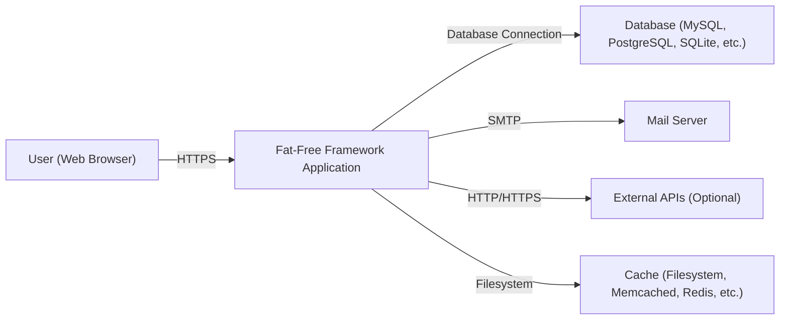
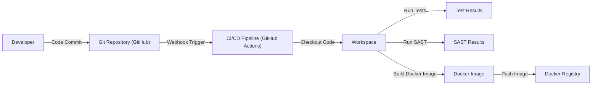

Okay, let's create a design document for the Fat-Free Framework (F3) based on the provided GitHub repository.

# BUSINESS POSTURE

Business Priorities and Goals:

*   Provide a lightweight, easy-to-use, and fast PHP framework for web developers.
*   Minimize the learning curve for developers familiar with PHP.
*   Offer a modular design, allowing developers to use only the components they need.
*   Enable rapid prototyping and development of web applications.
*   Maintain a small codebase for easy understanding and contribution.
*   Provide sufficient features for common web development tasks without unnecessary bloat.

Most Important Business Risks:

*   Security vulnerabilities in the framework could lead to widespread exploitation of applications built with it.
*   Lack of maintenance or updates could lead to the framework becoming obsolete or incompatible with newer PHP versions.
*   Insufficient documentation or community support could hinder adoption and usage.
*   Competition from other, more feature-rich or popular PHP frameworks.
*   Performance bottlenecks could limit the scalability of applications built with the framework.

# SECURITY POSTURE

Existing Security Controls:

*   security control: Input validation: F3 provides mechanisms for filtering and validating user input (e.g., the `scrub()` method, input filtering rules). Described in documentation and implemented in core components.
*   security control: Output encoding: F3 encourages proper encoding of output to prevent XSS vulnerabilities (e.g., using template engines with built-in escaping). Described in documentation.
*   security control: Session management: F3 provides a session management component with options for secure session handling (e.g., using HTTPS, setting appropriate session cookie parameters). Described in documentation and implemented in `lib/session.php`.
*   security control: CSRF protection: F3 includes features to mitigate CSRF attacks (e.g., generating and validating CSRF tokens). Described in documentation.
*   security control: SQL injection prevention: F3's database abstraction layer (if used) provides parameterized queries or prepared statements to prevent SQL injection. Described in documentation and implemented in database related components.
*   security control: Password hashing: F3 recommends using strong password hashing algorithms (e.g., bcrypt, Argon2) via PHP's built-in functions. Described in documentation.
*   security control: File upload handling: F3 provides guidance on securely handling file uploads (e.g., validating file types, storing files outside the web root). Described in documentation.

Accepted Risks:

*   accepted risk: The framework's minimalist nature means developers are responsible for implementing some security best practices themselves, which may lead to vulnerabilities if not handled correctly.
*   accepted risk: Reliance on third-party plugins or extensions may introduce security risks if those components are not properly vetted or maintained.
*   accepted risk: Older versions of PHP (below the officially supported minimum version) may have known vulnerabilities that F3 cannot mitigate.

Recommended Security Controls:

*   security control: Implement a Content Security Policy (CSP) to mitigate XSS and other code injection attacks.
*   security control: Regularly update the framework and all dependencies to patch security vulnerabilities.
*   security control: Implement robust logging and monitoring to detect and respond to security incidents.
*   security control: Use a dependency analysis tool to identify and address vulnerabilities in third-party libraries.
*   security control: Conduct regular security audits and penetration testing of applications built with F3.

Security Requirements:

*   Authentication:
    *   The framework should provide mechanisms or guidance for secure user authentication, including password hashing, session management, and optional multi-factor authentication.
*   Authorization:
    *   The framework should support role-based access control (RBAC) or other authorization mechanisms to restrict access to sensitive resources.
*   Input Validation:
    *   All user input must be validated and sanitized to prevent common web vulnerabilities like XSS, SQL injection, and command injection.
*   Cryptography:
    *   The framework should provide or recommend secure cryptographic practices for handling sensitive data, including encryption and key management.
    *   Use secure hashing algorithms (e.g., bcrypt, Argon2) for password storage.
    *   Use authenticated encryption (e.g., AES-GCM) for data confidentiality and integrity.

# DESIGN

## C4 CONTEXT



Element Descriptions:

*   Element:
    *   Name: User (Web Browser)
    *   Type: Person
    *   Description: A user interacting with the Fat-Free Framework application through a web browser.
    *   Responsibilities: Sends requests to the application, receives and renders responses.
    *   Security controls: Browser-based security mechanisms (e.g., same-origin policy, HTTPS).

*   Element:
    *   Name: Fat-Free Framework Application
    *   Type: Software System
    *   Description: The web application built using the Fat-Free Framework.
    *   Responsibilities: Handles user requests, processes data, interacts with other systems, renders responses.
    *   Security controls: Input validation, output encoding, session management, CSRF protection, SQL injection prevention, password hashing, file upload handling.

*   Element:
    *   Name: Database (MySQL, PostgreSQL, SQLite, etc.)
    *   Type: Software System
    *   Description: A database system used to store application data.
    *   Responsibilities: Stores and retrieves data, ensures data integrity.
    *   Security controls: Database access controls, encryption at rest, regular backups.

*   Element:
    *   Name: Mail Server
    *   Type: Software System
    *   Description: A mail server used to send emails (e.g., notifications, password resets).
    *   Responsibilities: Sends emails on behalf of the application.
    *   Security controls: Secure SMTP configuration, spam filtering, authentication.

*   Element:
    *   Name: External APIs (Optional)
    *   Type: Software System
    *   Description: Any external APIs the application interacts with (e.g., payment gateways, social media APIs).
    *   Responsibilities: Provides specific functionalities as per the API provider.
    *   Security controls: API keys, OAuth, rate limiting, input validation.

*   Element:
    *   Name: Cache (Filesystem, Memcached, Redis, etc.)
    *   Type: Software System
    *   Description: A caching system used to improve application performance.
    *   Responsibilities: Stores frequently accessed data for faster retrieval.
    *   Security controls: Cache invalidation mechanisms, access controls.

## C4 CONTAINER

```mermaid
graph LR
    User["User (Web Browser)"] -- "HTTPS" --> WebServer["Web Server (Apache, Nginx)"]
    WebServer -- "FastCGI/PHP-FPM" --> F3App["F3 Application"]
    F3App -- "Database Connection" --> Database["Database"]
    F3App -- "SMTP" --> MailServer["Mail Server"]
    F3App -- "HTTP/HTTPS" --> ExternalAPI["External APIs"]
    F3App -- "Filesystem" --> Cache["Cache"]
    F3App -- "Filesystem" --> Views["Views (Templates)"]
    F3App -- "" --> Models["Models"]
    F3App -- "" --> Controllers["Controllers"]
    F3App -- "" --> Lib["F3 Core Library"]

```

Element Descriptions:

*   Element:
    *   Name: User (Web Browser)
    *   Type: Person
    *   Description: A user interacting with the application.
    *   Responsibilities: Sends requests, receives responses.
    *   Security controls: Browser security mechanisms.

*   Element:
    *   Name: Web Server (Apache, Nginx)
    *   Type: Container
    *   Description: The web server that receives requests and forwards them to the F3 application.
    *   Responsibilities: Handles HTTP requests, serves static files, manages PHP processes.
    *   Security controls: Web server configuration hardening, HTTPS configuration, request filtering.

*   Element:
    *   Name: F3 Application
    *   Type: Container
    *   Description: The Fat-Free Framework application code.
    *   Responsibilities: Processes requests, interacts with other components, generates responses.
    *   Security controls: Input validation, output encoding, session management, CSRF protection, etc.

*   Element:
    *   Name: Database
    *   Type: Container
    *   Description: The database system.
    *   Responsibilities: Stores and retrieves data.
    *   Security controls: Database access controls, encryption.

*   Element:
    *   Name: Mail Server
    *   Type: Container
    *   Description: The mail server.
    *   Responsibilities: Sends emails.
    *   Security controls: Secure SMTP configuration.

*   Element:
    *   Name: External APIs
    *   Type: Container
    *   Description: External API services.
    *   Responsibilities: Provides external functionalities.
    *   Security controls: API keys, OAuth.

*   Element:
    *   Name: Cache
    *   Type: Container
    *   Description: The caching system.
    *   Responsibilities: Stores cached data.
    *   Security controls: Cache invalidation, access controls.

*   Element:
    *   Name: Views (Templates)
    *   Type: Component
    *   Description: Template files used to render dynamic content.
    *   Responsibilities: Generates HTML output.
    *   Security controls: Output encoding, template engine security features.

*   Element:
    *   Name: Models
    *   Type: Component
    *   Description: Application logic related to data access and manipulation.
    *   Responsibilities: Interacts with the database, encapsulates business logic.
    *   Security controls: Data validation, secure database interactions.

*   Element:
    *   Name: Controllers
    *   Type: Component
    *   Description: Handles user requests and interacts with models and views.
    *   Responsibilities: Processes requests, coordinates application flow.
    *   Security controls: Input validation, authorization checks.

*   Element:
    *   Name: F3 Core Library
    *   Type: Component
    *   Description: The core components of the Fat-Free Framework.
    *   Responsibilities: Provides framework functionalities.
    *   Security controls: Built-in security features, regular updates.

## DEPLOYMENT

Possible Deployment Solutions:

1.  Traditional LAMP/LEMP Stack: Apache/Nginx, MySQL/PostgreSQL, PHP on a single server or virtual machine.
2.  Cloud-based Virtual Machines: Deploying the application on a VM in a cloud environment (e.g., AWS EC2, Google Compute Engine, Azure VM).
3.  Containerized Deployment: Using Docker and container orchestration platforms like Kubernetes or Docker Swarm.
4.  Platform as a Service (PaaS): Deploying to a PaaS provider like Heroku, AWS Elastic Beanstalk, or Google App Engine.

Chosen Solution (for detailed description): Containerized Deployment with Docker and Kubernetes.

```mermaid
graph LR
    Developer["Developer"] -- "Code Commit" --> GitRepo["Git Repository (GitHub)"]
    GitRepo -- "Webhook Trigger" --> CI_CD["CI/CD Pipeline (GitHub Actions)"]
    CI_CD -- "Build & Push" --> DockerRegistry["Docker Registry (Docker Hub, ECR)"]
    DockerRegistry -- "Pull Image" --> KubernetesCluster["Kubernetes Cluster"]
    KubernetesCluster -- "" --> WebServerPod["Web Server Pod (Nginx)"]
    KubernetesCluster -- "" --> AppPod["Application Pod (F3)"]
    KubernetesCluster -- "" --> DatabasePod["Database Pod (MySQL)"]
    KubernetesCluster -- "" --> CachePod["Cache Pod (Redis)"]
    Ingress["Ingress Controller"] -- "" --> WebServerPod
    User["User"] -- "HTTPS" --> Ingress

```

Element Descriptions:

*   Element:
    *   Name: Developer
    *   Type: Person
    *   Description: A developer working on the application code.
    *   Responsibilities: Writes code, commits changes to the Git repository.
    *   Security controls: Code review, secure coding practices.

*   Element:
    *   Name: Git Repository (GitHub)
    *   Type: System
    *   Description: The source code repository.
    *   Responsibilities: Stores code, tracks changes.
    *   Security controls: Access controls, branch protection rules.

*   Element:
    *   Name: CI/CD Pipeline (GitHub Actions)
    *   Type: System
    *   Description: The continuous integration and continuous deployment pipeline.
    *   Responsibilities: Automates building, testing, and deploying the application.
    *   Security controls: Secure pipeline configuration, vulnerability scanning.

*   Element:
    *   Name: Docker Registry (Docker Hub, ECR)
    *   Type: System
    *   Description: The registry for storing Docker images.
    *   Responsibilities: Stores and distributes Docker images.
    *   Security controls: Access controls, image signing.

*   Element:
    *   Name: Kubernetes Cluster
    *   Type: Infrastructure
    *   Description: The Kubernetes cluster where the application is deployed.
    *   Responsibilities: Manages containerized application deployment and scaling.
    *   Security controls: Network policies, RBAC, pod security policies.

*   Element:
    *   Name: Web Server Pod (Nginx)
    *   Type: Container Instance
    *   Description: A pod running the Nginx web server.
    *   Responsibilities: Serves static files, proxies requests to the application pod.
    *   Security controls: Web server configuration hardening.

*   Element:
    *   Name: Application Pod (F3)
    *   Type: Container Instance
    *   Description: A pod running the Fat-Free Framework application.
    *   Responsibilities: Handles application logic.
    *   Security controls: Application-level security controls.

*   Element:
    *   Name: Database Pod (MySQL)
    *   Type: Container Instance
    *   Description: A pod running the MySQL database.
    *   Responsibilities: Stores application data.
    *   Security controls: Database access controls, encryption.

*   Element:
    *   Name: Cache Pod (Redis)
    *   Type: Container Instance
    *   Description: A pod running the Redis cache.
    *   Responsibilities: Stores cached data.
    *   Security controls: Cache access controls.

*   Element:
    *   Name: Ingress Controller
    *   Type: Infrastructure
    *   Description: Manages external access to the services in the cluster.
    *   Responsibilities: Routes traffic to the appropriate pods.
    *   Security controls: TLS termination, request filtering.

*   Element:
      * Name: User
      * Type: Person
      * Description: External user accessing application.
      * Responsibilities: Accessing application.
      * Security controls: HTTPS.

## BUILD



Build Process Description:

1.  Developer commits code changes to the Git repository (GitHub).
2.  A webhook triggers the CI/CD pipeline (GitHub Actions).
3.  The pipeline checks out the code into a workspace.
4.  The pipeline runs unit tests and integration tests.
5.  The pipeline runs a Static Application Security Testing (SAST) tool (e.g., PHPStan, Psalm) to identify potential security vulnerabilities.
6.  If tests and SAST checks pass, the pipeline builds a Docker image for the application.
7.  The Docker image is tagged with a version number and pushed to a Docker registry (e.g., Docker Hub, Amazon ECR).
8.  Supply chain security:
    *   Use signed commits in the Git repository.
    *   Use a dependency analysis tool (e.g., Dependabot) to identify and update vulnerable dependencies.
    *   Use a container image scanning tool (e.g., Trivy, Clair) to scan the Docker image for vulnerabilities.
9.  Build automation:
    *   The entire build process is automated using GitHub Actions.
10. Security checks during build:
    *   Unit tests and integration tests verify the functionality of the code.
    *   SAST tools analyze the code for potential security vulnerabilities.
    *   Container image scanning identifies vulnerabilities in the Docker image.

# RISK ASSESSMENT

Critical Business Processes:

*   User registration and authentication.
*   Data storage and retrieval (database interactions).
*   Email sending (if applicable).
*   API interactions (if applicable).
*   Serving web content.

Data Sensitivity:

*   User credentials (passwords, email addresses): High sensitivity.
*   Personal data (names, addresses, etc.): High sensitivity (depending on the application).
*   Financial data (payment information): High sensitivity (if applicable).
*   Application-specific data: Sensitivity varies depending on the nature of the application.
*   Session data: Medium sensitivity.

# QUESTIONS & ASSUMPTIONS

Questions:

*   What specific types of applications are typically built with F3 in this context (e.g., blogs, e-commerce sites, internal tools)? This helps determine the specific data sensitivity and business processes.
*   Are there any existing security policies or compliance requirements (e.g., GDPR, PCI DSS) that need to be considered?
*   What is the expected traffic volume and scalability requirements for applications built with F3?
*   Are there any specific third-party integrations that are commonly used with F3?
*   What is the level of security expertise of the developers who will be using F3?

Assumptions:

*   BUSINESS POSTURE: The organization has a moderate risk appetite, balancing the need for rapid development with the importance of security.
*   SECURITY POSTURE: Developers have a basic understanding of web security principles but may not be security experts.  The framework is kept up-to-date, and security patches are applied promptly.
*   DESIGN: The deployment environment will be a containerized environment using Docker and Kubernetes.  A standard LAMP/LEMP stack is used for simpler deployments. The application uses a relational database (e.g., MySQL, PostgreSQL). The application may use a caching system (e.g., Redis, Memcached).