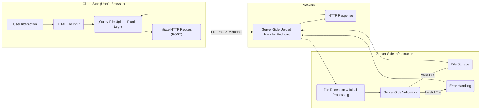
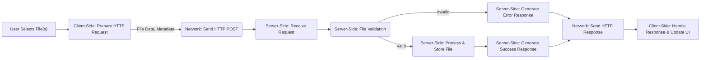

# Project Design Document: jQuery File Upload Plugin

**Project URL:** https://github.com/blueimp/jquery-file-upload

**Document Version:** 1.1
**Date:** October 26, 2023
**Author:** AI Software Architect

## 1. Introduction

This document provides a detailed design overview of the jQuery File Upload plugin. This design document is intended to be used as a basis for subsequent threat modeling activities. It outlines the key components, data flow, and architectural considerations of the plugin.

**Purpose of this Document:**

* To provide a comprehensive understanding of the plugin's architecture and functionality.
* To identify key components and their interactions relevant for security analysis.
* To serve as a foundation for identifying potential security vulnerabilities during threat modeling exercises.

**Target Audience:**

* Security engineers
* Developers
* Architects

## 2. Project Overview

The jQuery File Upload plugin is a client-side JavaScript widget designed to enhance the standard HTML file input element. It offers features such as multiple file selection, drag & drop functionality, progress indicators, image previews, and support for chunked uploads. Crucially, it's important to understand that this plugin handles the client-side aspects of file uploading. The actual processing, validation, and storage of uploaded files are the responsibility of the server-side implementation, which is separate from this plugin.

**Key Responsibilities of the Plugin:**

* Providing a user-friendly interface for selecting files.
* Initiating the file upload process via asynchronous HTTP requests.
* Displaying upload progress to the user.
* Optionally performing client-side pre-processing (e.g., image resizing).

## 3. Architectural Design

The jQuery File Upload plugin operates within a client-server model. The plugin itself is a client-side component, primarily written in JavaScript and leveraging the jQuery library. It interacts with a server-side endpoint that must be implemented independently by the developer.

**Key Components:**

* **Client-Side (Browser Environment):**
    * **`jquery.fileupload.js`:** The core JavaScript file containing the primary logic for handling file selection, initiating uploads, managing progress, and updating the user interface.
    * **`jquery.fileupload-process.js`:** An extension to the core plugin that enables client-side processing of files, such as image resizing or cropping, before upload.
    * **`jquery.fileupload-image.js`:** Provides functionality for displaying image previews before upload.
    * **`jquery.fileupload-audio.js` and `jquery.fileupload-video.js`:** Offer preview capabilities for audio and video files, subject to browser support.
    * **`jquery.fileupload-validate.js`:** Adds client-side file validation features, allowing checks for file size, type, and other criteria *before* the upload is initiated. **Note:** This validation is not a security measure and can be bypassed.
    * **HTML `<input type="file">` Element:** The standard HTML element that the plugin enhances to enable file selection.
    * **User Interface Elements (HTML & CSS):**  The plugin relies on HTML elements and CSS for rendering progress bars, file lists, and other visual components. Developers can customize these elements.

* **Server-Side (Developer Implemented):**
    * **Upload Handler Endpoint:** A server-side script or application endpoint (e.g., a PHP script, a Node.js route, a Java servlet) responsible for receiving the incoming HTTP request containing the file data.
    * **File Processing Logic:** Code within the upload handler that performs actions on the uploaded file, such as saving it to disk, storing it in a database, or processing its contents.
    * **Validation Logic:** Server-side code to validate the uploaded file based on security requirements (e.g., file type, size limits, content checks).
    * **Storage Infrastructure:** The system used to persist the uploaded files (e.g., local file system, cloud storage services like AWS S3 or Azure Blob Storage).

**Architectural Diagram (Mermaid):**

## 4. Data Flow

The process of uploading a file using the jQuery File Upload plugin involves the following steps:

1. **User Interaction:** The user interacts with the HTML file input element (or a drag-and-drop area managed by the plugin) to select one or more files for upload.
2. **Client-Side Processing (Optional):** If configured, the plugin may perform client-side processing on the selected files (e.g., resizing images using `jquery.fileupload-process.js`).
3. **HTTP Request Preparation:** The plugin prepares an HTTP POST request to the configured server-side upload handler endpoint. This request includes:
    * **File Data:** The actual binary content of the selected file(s). For large files, the plugin may use chunked uploads, sending the file in smaller parts.
    * **File Metadata:** Information about the file(s), such as the filename, size, and MIME type (as determined by the browser).
    * **Additional Parameters:** Any other data configured by the developer to be sent with the upload request.
4. **Network Transmission:** The browser sends the HTTP POST request to the server.
5. **Server-Side Reception:** The server-side upload handler receives the incoming HTTP request and extracts the file data and associated metadata.
6. **Server-Side Processing and Validation:**
    * The server-side application performs crucial validation checks on the uploaded file. This should include verifying the file type, size, and potentially the file content to prevent malicious uploads.
    * The file is processed according to the application's logic (e.g., saving it to the file system, storing it in a database, performing virus scanning).
7. **Response Generation:** The server-side application generates an HTTP response to send back to the client. This response typically includes:
    * **Status Code:** An HTTP status code indicating the success or failure of the upload (e.g., 200 OK, 400 Bad Request, 500 Internal Server Error).
    * **Response Body:**  Data providing feedback to the client, such as the URL of the uploaded file, error messages, or other relevant information.
8. **Client-Side Response Handling:** The jQuery File Upload plugin receives the server's response and updates the user interface accordingly. This may involve displaying success messages, error messages, or updating the list of uploaded files.

**Data Elements in Transit:**

* **From Client to Server:**
    * **File Content (Binary Data):** The raw bytes of the uploaded file.
    * **Filename (String):** The original name of the file on the user's system.
    * **File Size (Integer):** The size of the file in bytes.
    * **MIME Type (String):** The MIME type of the file as reported by the browser.
    * **Other Form Data (String/Other Types):** Any additional parameters included in the upload request.

* **From Server to Client:**
    * **HTTP Status Code (Integer):**  Indicates the outcome of the upload request.
    * **Response Body (JSON/XML/Plain Text):**  Provides details about the upload status, potential errors, or information about the uploaded file.

**Data Flow Diagram (Mermaid):**

## 5. Security Considerations

Security when using the jQuery File Upload plugin is primarily the responsibility of the **server-side implementation**. The client-side plugin facilitates the upload process but cannot enforce security policies. A robust and secure server-side implementation is critical to prevent various attacks.

**Threat Landscape:**

* **Client-Side Vulnerabilities (Less Critical but Still Relevant):**
    * **Bypassing Client-Side Validation:** Attackers can easily bypass client-side validation checks (e.g., file size, type) by manipulating the HTTP request directly. **Mitigation:** Never rely on client-side validation for security. Always perform thorough server-side validation.
    * **Cross-Site Scripting (XSS) via Filenames:** If the server-side application displays the uploaded filename without proper encoding, it could lead to XSS vulnerabilities. **Mitigation:** Properly sanitize and encode all user-provided data before displaying it.

* **Server-Side Vulnerabilities (Critical):**
    * **Unrestricted File Upload (Arbitrary File Upload):**  Failure to properly validate file types and content on the server-side allows attackers to upload malicious files (e.g., executable scripts, web shells). **Mitigation:** Implement strict server-side validation based on file type (using magic numbers/content inspection, not just the MIME type), size limits, and potentially virus scanning.
    * **Path Traversal:** If the server-side code uses the filename provided by the client directly to save the file without proper sanitization, attackers can overwrite or access arbitrary files on the server. **Mitigation:** Never use the client-provided filename directly. Generate unique, server-controlled filenames and store files in a secure location.
    * **Denial of Service (DoS):** Attackers can upload very large files to consume server resources (disk space, bandwidth, processing power), leading to a denial of service. **Mitigation:** Implement file size limits, rate limiting on the upload endpoint, and potentially use asynchronous processing for uploads.
    * **Insecure File Storage:** Storing uploaded files in publicly accessible locations without proper access controls can expose sensitive information. **Mitigation:** Store uploaded files in secure locations with restricted access. Implement proper authentication and authorization mechanisms to control access to uploaded files.
    * **Cross-Site Request Forgery (CSRF):** If the upload endpoint lacks CSRF protection, attackers can trick authenticated users into unknowingly uploading files. **Mitigation:** Implement CSRF protection mechanisms (e.g., synchronizer tokens, double-submit cookies).
    * **Injection Attacks:** If file metadata or content is not properly handled, it could lead to injection attacks (e.g., if filename is used in database queries without sanitization). **Mitigation:** Sanitize and validate all input data. Use parameterized queries or prepared statements when interacting with databases.
    * **Information Disclosure:** Verbose error messages or exposing internal server paths in responses can provide valuable information to attackers. **Mitigation:** Implement generic error messages and avoid revealing sensitive information in responses.
    * **Man-in-the-Middle (MitM) Attacks:** If the communication between the client and server is not encrypted, attackers can intercept the file data during transmission. **Mitigation:** Enforce HTTPS for all communication.

**Security Recommendations (Server-Side - Key Focus Area):**

* **Mandatory Server-Side Validation:**  Implement comprehensive validation of file type, size, and content on the server.
* **Input Sanitization:** Sanitize all user-provided input, including filenames and metadata, before using it in any server-side operations.
* **CSRF Protection:** Implement robust CSRF protection for the upload endpoint.
* **Secure File Storage:** Store uploaded files in secure locations with appropriate access controls.
* **Unique Filenames:** Generate unique, server-controlled filenames for stored files.
* **Content Security Policy (CSP):** Implement a strong CSP to mitigate XSS risks.
* **Regular Security Audits:** Conduct regular security assessments of the server-side upload implementation.
* **HTTPS Enforcement:** Ensure all communication is over HTTPS.
* **Rate Limiting:** Implement rate limiting to prevent DoS attacks.
* **Consider Anti-Virus Scanning:** Integrate anti-virus scanning of uploaded files.
* **Principle of Least Privilege:** Ensure the server-side process handling uploads has only the necessary permissions.

## 6. Dependencies

* **Client-Side:**
    * **jQuery:** The core dependency for the plugin.

* **Server-Side:**
    * **Server-Side Programming Language:**  Any language capable of handling HTTP requests and file uploads (e.g., Python, PHP, Node.js, Java, Ruby, .NET).
    * **Web Server:** A web server to host the application and handle HTTP requests (e.g., Apache, Nginx, IIS).
    * **File Handling Libraries/Modules:** Libraries or built-in functionalities for handling file uploads in the chosen server-side language.

## 7. Deployment

Deployment involves integrating the client-side plugin into the front-end of a web application and implementing the corresponding server-side upload handler.

**Deployment Steps:**

1. **Include Client-Side Assets:** Include the necessary JavaScript and CSS files of the jQuery File Upload plugin in the HTML of the web page where file uploads are needed. Ensure jQuery is also included.
2. **HTML Form Setup:** Create an HTML `<input type="file">` element or a designated drag-and-drop area.
3. **Plugin Initialization:** Use jQuery to initialize the fileupload plugin on the selected HTML element, configuring any desired options (e.g., upload URL, allowed file types).
4. **Server-Side Endpoint Implementation:** Develop the server-side upload handler endpoint using a suitable server-side language and framework. This endpoint will receive the uploaded files, perform validation, processing, and storage.
5. **Configure Upload URL:** Configure the `url` option of the jQuery File Upload plugin to point to the implemented server-side upload handler endpoint.
6. **Deploy Server-Side Application:** Deploy the server-side application to a web server.
7. **Testing:** Thoroughly test the file upload functionality, including various file types, sizes, and error conditions.

## 8. Assumptions and Limitations

* **Modern Browser Compatibility:** The plugin assumes the use of modern web browsers that support necessary features like XMLHttpRequest Level 2 for advanced upload capabilities.
* **Server-Side Implementation is Mandatory:** The jQuery File Upload plugin is solely a client-side component. A separate, robust server-side implementation is absolutely required for handling file processing, validation, and storage.
* **Security is Primarily Server-Side Responsibility:** The plugin itself offers limited security features (primarily client-side validation, which is not a security control). The security of the file upload process hinges on the server-side implementation.
* **No Built-in Authentication/Authorization:** The plugin does not handle user authentication or authorization. These aspects must be implemented and enforced on the server-side.
* **Potential for Client-Side Bypass:**  Any client-side logic or validation can be bypassed by a determined attacker. Server-side validation is the only reliable security measure.