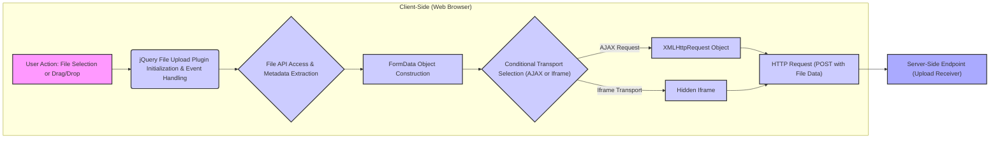

# Project Design Document: jQuery File Upload Library

**Version:** 1.1
**Date:** October 26, 2023
**Author:** AI Software Architect

## 1. Project Overview

The jQuery File Upload library is a client-side JavaScript library designed to enhance the standard HTML file input element with advanced features. It provides a more interactive and user-friendly file upload experience in web applications. This document details the library's architecture and functionality, focusing on aspects relevant to security threat modeling. The library simplifies the process of uploading files by offering features like multiple file selection, drag-and-drop support, progress indicators, and client-side image manipulation. Understanding its design is crucial for identifying potential security vulnerabilities.

## 2. Goals and Objectives

The primary goals of the jQuery File Upload library are:

*   To offer a superior user experience for file uploads in web browsers.
*   To abstract the complexities of cross-browser file upload implementations.
*   To provide a customizable and extensible solution for developers.

The objectives of this design document are:

*   To clearly articulate the client-side architecture of the jQuery File Upload library.
*   To illustrate the flow of data during the file upload process, highlighting key interaction points.
*   To serve as a foundation for identifying potential security threats and vulnerabilities associated with the library's use.

## 3. Target Audience

This document is intended for:

*   Security engineers responsible for threat modeling web applications utilizing the jQuery File Upload library.
*   Software developers integrating and maintaining applications that include this library.
*   System architects needing to understand the client-side file upload mechanism and its interactions with the server.

## 4. Scope

This design document focuses on the client-side aspects of the jQuery File Upload library and its interaction with the server during the upload initiation phase. Specifically, it covers:

*   The JavaScript components within the library and their interactions.
*   The sequence of actions and data transformations from user interaction to the initiation of the HTTP request.
*   The communication protocols and data formats used between the client-side library and the server-side endpoint.

This document does not cover:

*   The implementation details of specific server-side file handling logic. However, it acknowledges the server's role and potential server-side vulnerabilities that are relevant to the client-side interactions.
*   The detailed internal code structure of the JavaScript library.
*   The visual styling and customization options provided by the library.

## 5. System Architecture

The jQuery File Upload library operates within the client's web browser, orchestrating the file upload process and communicating with a server-side endpoint.

**Components:**

*   **User Action: File Selection or Drag/Drop:** The user initiates the upload process by selecting files through a standard HTML input element or by dragging files onto a designated drop zone.
*   **jQuery File Upload Plugin Initialization & Event Handling:** The core JavaScript library is initialized, attaching event listeners to the file input element or drop zone to capture user interactions.
*   **File API Access & Metadata Extraction:** The library utilizes the browser's File API to access the selected files, extracting metadata such as filename, size, and MIME type.
*   **FormData Object Construction:** The library constructs a `FormData` object. This object is used to package the file data along with other form parameters for transmission to the server.
*   **Conditional Transport Selection (AJAX or Iframe):** The library determines the appropriate transport mechanism based on browser capabilities. Modern browsers typically use AJAX, while older browsers may fall back to using a hidden iframe.
    *   **XMLHttpRequest Object:** When AJAX is used, an `XMLHttpRequest` object is created to handle the asynchronous HTTP request.
    *   **Hidden Iframe:** For iframe transport, a hidden iframe is dynamically created and used as the target for a form submission.
*   **HTTP Request (POST with File Data):** An HTTP POST request is constructed and sent to the configured server-side endpoint. The `FormData` object containing the file data is included in the request body.
*   **Server-Side Endpoint (Upload Receiver):** This is the server-side component responsible for receiving and processing the uploaded file.

## 6. Data Flow

The data flow during a file upload using the jQuery File Upload library can be broken down into the following steps:

1. **User Interaction:** The user selects files or drags them onto the designated area within the web page.
2. **Event Trigger:** This user action triggers an event (e.g., `change` event on the file input, `drop` event on the drop zone).
3. **Plugin Handling:** The jQuery File Upload plugin's event handlers intercept this event.
4. **File API Access:** The plugin uses the browser's File API to access the `File` objects representing the selected files.
5. **Metadata Extraction:** The plugin extracts relevant metadata from the `File` objects, such as `name`, `size`, and `type`.
6. **FormData Creation:** A `FormData` object is created.
7. **File Data Appended:** The `File` object(s) are appended to the `FormData` object, typically under a specified name (e.g., "files[]").
8. **Additional Parameters:**  Other parameters, if configured, are also appended to the `FormData` object.
9. **Transport Selection:** The plugin determines whether to use AJAX or iframe transport.
10. **Request Initiation (AJAX):** If AJAX is used:
    *   An `XMLHttpRequest` object is created.
    *   The request is configured as a POST request to the specified upload URL.
    *   The `FormData` object is sent as the request body.
    *   Event listeners for progress updates and completion are set up.
11. **Request Initiation (Iframe):** If iframe transport is used:
    *   A hidden iframe is created dynamically.
    *   A form is created within the iframe.
    *   The `FormData` is submitted via this form to the server.
12. **HTTP Request Sent:** The HTTP request containing the file data is sent to the server-side endpoint.

## 7. Key Components

The jQuery File Upload library comprises several key client-side components, each with a specific role:

*   **`jquery.fileupload.js` (Main Plugin):** This is the core component responsible for handling file selection, data preparation, and initiating the upload process. It manages event listeners and orchestrates the interaction with other components.
*   **`jquery.fileupload-ui.js` (UI Widget):** This component provides the user interface elements for displaying upload progress, previews, and managing the upload queue. It relies on the main plugin for the underlying upload logic.
*   **`jquery.iframe-transport.js` (Iframe Transport Handler):** This component handles file uploads in older browsers that do not fully support AJAX file uploads. It uses a hidden iframe as a transport mechanism.
*   **`jquery.fileupload-process.js` (Processing Queue):** This component allows for defining a queue of client-side processing steps to be performed on the files before upload, such as image resizing or validation.
*   **`jquery.fileupload-image.js` (Image Processing):** Provides functionality for client-side image resizing, cropping, and preview generation.
*   **`jquery.fileupload-audio.js` & `jquery.fileupload-video.js` (Audio/Video Processing):** Offer basic client-side processing and preview generation for audio and video files.
*   **`jquery.fileupload-validate.js` (Validation):** Enables client-side validation of uploaded files based on criteria like file size, type, and name. **Note:** Client-side validation is not a substitute for server-side validation.

## 8. Security Considerations

Understanding the client-side architecture and data flow is crucial for identifying potential security vulnerabilities. Here are key security considerations relevant to the jQuery File Upload library:

*   **Client-Side Validation Bypass:** Relying solely on `jquery.fileupload-validate.js` for validation is insecure. Attackers can easily bypass client-side checks. **Example:** Modifying JavaScript code or crafting malicious requests. **Mitigation:** Always perform robust server-side validation.
*   **Cross-Site Scripting (XSS) via Filenames:** If the server-side application does not properly sanitize filenames received from the client before displaying them, it can lead to XSS vulnerabilities. **Example:** A user uploads a file named `.txt`. If the server displays this filename without sanitization, the script will execute in the user's browser. **Mitigation:** Implement strict output encoding and sanitization on the server-side.
*   **Cross-Site Request Forgery (CSRF):** If the file upload endpoint lacks CSRF protection, attackers can potentially trick authenticated users into uploading files without their knowledge. **Example:** An attacker crafts a malicious website that submits a file upload request to the vulnerable endpoint while the user is logged in. **Mitigation:** Implement CSRF tokens or other anti-CSRF measures on the server-side.
*   **Insecure Direct Object References (IDOR) related to Temporary Files:** If the client-side library or server-side implementation exposes predictable or sequential identifiers for temporary upload locations, attackers might be able to access or manipulate files they are not authorized to. **Example:** Temporary files are stored with names like `upload_1.tmp`, `upload_2.tmp`, etc. **Mitigation:** Use unpredictable and unique identifiers for temporary files and restrict access.
*   **Path Traversal Vulnerabilities (Server-Side):** While primarily a server-side issue, the client-side can influence this. If the server blindly trusts the filename provided by the client, an attacker could craft a filename to overwrite arbitrary files on the server. **Example:** A malicious filename like `../../../../evil.php`. **Mitigation:** Implement robust server-side filename sanitization and validation.
*   **Denial of Service (DoS) via Large File Uploads:**  While the client-side can provide progress indicators, the server-side must implement measures to prevent DoS attacks by limiting file sizes and upload rates. **Example:** An attacker repeatedly uploads extremely large files to exhaust server resources. **Mitigation:** Implement file size limits, rate limiting, and resource quotas on the server.
*   **Man-in-the-Middle (MITM) Attacks:** If the communication between the client and the server is not encrypted using HTTPS, attackers can intercept the uploaded files and potentially sensitive data. **Mitigation:** Enforce HTTPS for all communication.
*   **Information Disclosure via Error Messages:**  Carelessly crafted server-side error messages can reveal sensitive information about the server's configuration or internal workings. **Mitigation:** Ensure error messages are generic and do not expose sensitive details.
*   **Content Security Policy (CSP) Bypasses:**  If the library is used in a way that violates the application's CSP, it could introduce vulnerabilities. **Example:** Inline scripts or unsafe-eval usage. **Mitigation:** Ensure the library's usage is compatible with the application's CSP.

## 9. Deployment Considerations

When deploying applications using the jQuery File Upload library, consider the following:

*   **Server-Side Integration:**  The library requires a compatible server-side component to handle the uploaded files. The server-side implementation is critical for security.
*   **Configuration:**  Properly configure the library's options, such as the upload URL, allowed file types, and maximum file size, to align with security requirements.
*   **HTTPS Enforcement:** Ensure that the application is served over HTTPS to protect the confidentiality and integrity of uploaded files.
*   **Content Security Policy (CSP):** Implement a strong CSP to mitigate the risk of XSS attacks. Ensure the library's usage is compatible with the CSP.
*   **Regular Updates:** Keep the jQuery File Upload library and its dependencies updated to patch any known security vulnerabilities.

## 10. Future Considerations

Potential future enhancements or considerations for this design include:

*   **Integration with Modern JavaScript Frameworks:**  Exploring tighter integration with modern frameworks like React, Angular, or Vue.js.
*   **Enhanced Client-Side Security Features:** Investigating opportunities for incorporating more robust client-side security measures, while acknowledging their inherent limitations.
*   **Improved Error Handling and Reporting:** Providing more detailed and user-friendly error messages.
*   **Accessibility Improvements:** Ensuring the library is accessible to users with disabilities.

This document provides a detailed design overview of the jQuery File Upload library, emphasizing aspects relevant to security threat modeling. It serves as a valuable resource for security engineers, developers, and architects involved in building and securing web applications that utilize this library.