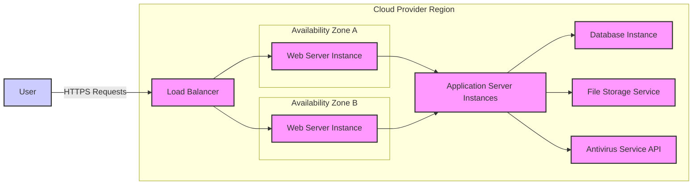

# BUSINESS POSTURE

This project, jQuery File Upload, addresses the business need for web applications to allow users to upload files. This functionality is crucial for various business processes, including:

- User profile updates: Allowing users to upload profile pictures.
- Content management systems: Enabling content creators to upload images, documents, and videos.
- Document sharing platforms: Facilitating the exchange of files between users.
- Data collection: Allowing users to submit data in file formats.

Business priorities for implementing file upload functionality typically include:

- User experience: Providing a smooth and intuitive file upload process.
- Functionality: Ensuring reliable and efficient file uploads, including features like progress bars, drag-and-drop, and file type validation.
- Scalability: Handling a large number of concurrent uploads and large file sizes.
- Security: Protecting the application and users from malicious file uploads and unauthorized access.

Most important business risks associated with file upload functionality:

- Data loss: Risk of losing uploaded files due to system failures or errors.
- Data breaches: Risk of unauthorized access to uploaded files, potentially containing sensitive information.
- Malware uploads: Risk of users uploading malicious files (viruses, malware) that could compromise the server or other users' systems.
- Denial of service: Risk of overloading the server with excessive file uploads, leading to service disruption.
- Legal and compliance risks: Risk of violating data privacy regulations (e.g., GDPR, CCPA) if uploaded files contain personal data and are not handled securely.

# SECURITY POSTURE

Existing security controls:

- security control: Client-side validation of file types and sizes (implemented in JavaScript within the jQuery File Upload plugin).
- security control: Server-side validation of file types and sizes (implementation depends on the server-side technology used with jQuery File Upload, e.g., PHP, Node.js, Python).
- security control: Protection against common web vulnerabilities (e.g., XSS, CSRF) in the web application that integrates jQuery File Upload (implementation depends on the web application framework and development practices).

Accepted risks:

- accepted risk: Reliance on client-side validation as a primary security measure, which can be bypassed by malicious users.
- accepted risk: Potential vulnerabilities in the server-side upload handling logic if not implemented securely.
- accepted risk: Risk of misconfiguration of the server environment leading to security weaknesses.

Recommended security controls:

- security control: Implement robust server-side input validation and sanitization for file names, types, and content.
- security control: Implement malware scanning of uploaded files before they are stored or processed.
- security control: Implement access control mechanisms to restrict access to uploaded files based on user roles and permissions.
- security control: Implement secure storage for uploaded files, including encryption at rest and in transit.
- security control: Regularly update jQuery File Upload library and server-side components to patch known vulnerabilities.
- security control: Implement Content Security Policy (CSP) to mitigate XSS risks.
- security control: Implement rate limiting to prevent denial-of-service attacks through excessive file uploads.
- security control: Conduct regular security testing, including penetration testing and vulnerability scanning, of the file upload functionality and related infrastructure.

Security requirements:

- Authentication:
    - security requirement: The web application using jQuery File Upload must implement a secure authentication mechanism to verify user identities.
    - security requirement: File uploads should be associated with authenticated users to enable access control and auditing.
- Authorization:
    - security requirement: Access to uploaded files must be controlled based on user roles and permissions.
    - security requirement: Users should only be able to access files they are authorized to view or manage.
- Input validation:
    - security requirement: All file upload requests, including file names, types, sizes, and content, must be thoroughly validated on the server-side.
    - security requirement: File type validation should be based on file content (magic numbers) and not just file extensions.
    - security requirement: File names should be sanitized to prevent path traversal and other injection attacks.
    - security requirement: File size limits should be enforced to prevent denial-of-service attacks.
- Cryptography:
    - security requirement: Sensitive data within uploaded files should be encrypted at rest.
    - security requirement: Communication between the client and server during file uploads should be encrypted using HTTPS.
    - security requirement: If temporary storage is used during the upload process, it should be secured and potentially encrypted.

# DESIGN

## C4 CONTEXT

```mermaid
flowchart LR
    subgraph "Organization System"
        A["Web Application"]
    end
    B["User"]
    C["File Storage"]
    D["Antivirus Service"]

    B -->|Uploads Files via| A
    A -->|Stores Files in| C
    A -->|Scans Files with| D
    A --o|Uses| "jQuery File Upload Library"

    style A fill:#f9f,stroke:#333,stroke-width:2px
    style B fill:#ccf,stroke:#333,stroke-width:2px
    style C fill:#ccf,stroke:#333,stroke-width:2px
    style D fill:#ccf,stroke:#333,stroke-width:2px
```

Context Diagram Elements:

- Element:
    - Name: User
    - Type: Person
    - Description: End-user of the web application who interacts with the file upload functionality.
    - Responsibilities: Uploading files to the web application.
    - Security controls: User authentication to access the web application.

- Element:
    - Name: Web Application
    - Type: Software System
    - Description: The web application that integrates the jQuery File Upload library to provide file upload functionality. This is the system being designed in the context of file uploads.
    - Responsibilities:
        - Presenting the file upload interface to the user.
        - Handling file upload requests from users.
        - Validating uploaded files.
        - Storing uploaded files in File Storage.
        - Integrating with Antivirus Service for malware scanning.
        - Providing access to uploaded files to authorized users.
    - Security controls:
        - security control: User authentication and authorization.
        - security control: Input validation and sanitization.
        - security control: Malware scanning.
        - security control: Secure file storage.
        - security control: HTTPS for communication.

- Element:
    - Name: File Storage
    - Type: Software System
    - Description: System responsible for storing uploaded files. This could be cloud storage (e.g., AWS S3, Azure Blob Storage), a network file system, or local storage on the application server.
    - Responsibilities:
        - Securely storing uploaded files.
        - Providing access to files for the Web Application.
        - Ensuring data durability and availability.
    - Security controls:
        - security control: Access control lists (ACLs) or Identity and Access Management (IAM) to restrict access.
        - security control: Encryption at rest.
        - security control: Regular backups.

- Element:
    - Name: Antivirus Service
    - Type: Software System
    - Description: External service used to scan uploaded files for malware. This could be a cloud-based antivirus API or an on-premise antivirus solution.
    - Responsibilities:
        - Scanning files for viruses and malware.
        - Providing scan results to the Web Application.
    - Security controls:
        - security control: API authentication and authorization (if cloud-based).
        - security control: Secure communication channel (HTTPS).

- Element:
    - Name: jQuery File Upload Library
    - Type: Software Library
    - Description: Client-side JavaScript library that provides the user interface and client-side logic for file uploads.
    - Responsibilities:
        - Providing a user-friendly file upload interface.
        - Handling client-side file processing and upload initiation.
    - Security controls:
        - security control: Regularly updated to patch vulnerabilities.
        - security control: Client-side input validation (as a first line of defense, not primary security).

## C4 CONTAINER

```mermaid
flowchart LR
    subgraph "Web Application Container"
        A["Web Server"]
        B["Application Logic"]
        C["File Upload Handler"]
        D["File Storage Client"]
        E["Antivirus Client"]
        F["jQuery File Upload Library"]
    end
    G["User Browser"]
    H["File Storage"]
    I["Antivirus Service"]

    G -->|HTTP Requests (File Uploads)| A
    A --> B
    B --> C
    C --> D
    C --> E
    C --o|Uses| F
    D -->|Storage Operations| H
    E -->|Scan Requests| I

    style A fill:#f9f,stroke:#333,stroke-width:2px
    style B fill:#f9f,stroke:#333,stroke-width:2px
    style C fill:#f9f,stroke:#333,stroke-width:2px
    style D fill:#f9f,stroke:#333,stroke-width:2px
    style E fill:#f9f,stroke:#333,stroke-width:2px
    style F fill:#f9f,stroke:#333,stroke-width:2px
    style G fill:#ccf,stroke:#333,stroke-width:2px
    style H fill:#ccf,stroke:#333,stroke-width:2px
    style I fill:#ccf,stroke:#333,stroke-width:2px
```

Container Diagram Elements:

- Element:
    - Name: User Browser
    - Type: Client-side Container
    - Description: User's web browser running the client-side application, including the jQuery File Upload library.
    - Responsibilities:
        - Rendering the file upload UI.
        - Handling user interactions with the file upload form.
        - Initiating file upload requests to the Web Server.
    - Security controls:
        - security control: Browser security features (e.g., same-origin policy, Content Security Policy).

- Element:
    - Name: Web Server
    - Type: Server-side Container
    - Description: Handles HTTP requests from user browsers, including file upload requests. Could be Apache, Nginx, IIS, etc.
    - Responsibilities:
        - Receiving and routing HTTP requests.
        - Serving static content.
        - Forwarding requests to the Application Logic.
        - Handling HTTPS termination.
    - Security controls:
        - security control: HTTPS configuration.
        - security control: Web server hardening (e.g., disabling unnecessary modules, access controls).
        - security control: Rate limiting.

- Element:
    - Name: Application Logic
    - Type: Server-side Container
    - Description: Contains the core application logic, including business rules and workflows. This component orchestrates the file upload process.
    - Responsibilities:
        - Handling user authentication and authorization.
        - Coordinating file upload operations.
        - Integrating with other application components.
    - Security controls:
        - security control: Authentication and authorization logic.
        - security control: Secure coding practices.

- Element:
    - Name: File Upload Handler
    - Type: Server-side Container
    - Description: Specific component within the Application Logic responsible for handling file upload requests.
    - Responsibilities:
        - Receiving uploaded files from the Web Server.
        - Performing server-side input validation on file metadata and content.
        - Calling the Antivirus Client to scan files.
        - Using the File Storage Client to store files.
        - Managing temporary file storage during upload processing.
    - Security controls:
        - security control: Server-side input validation and sanitization.
        - security control: Malware scanning integration.
        - security control: Secure temporary file handling.

- Element:
    - Name: File Storage Client
    - Type: Server-side Container
    - Description:  A library or module that provides an interface to interact with the File Storage system.
    - Responsibilities:
        - Communicating with the File Storage system.
        - Performing file storage operations (upload, download, delete).
    - Security controls:
        - security control: Secure connection to File Storage (e.g., using access keys, IAM roles).
        - security control: Encryption in transit to File Storage.

- Element:
    - Name: Antivirus Client
    - Type: Server-side Container
    - Description: A library or module that provides an interface to interact with the Antivirus Service.
    - Responsibilities:
        - Communicating with the Antivirus Service.
        - Sending files for scanning.
        - Receiving scan results.
    - Security controls:
        - security control: Secure connection to Antivirus Service (e.g., API keys).
        - security control: Secure communication channel (HTTPS).

- Element:
    - Name: jQuery File Upload Library
    - Type: Client-side Library
    - Description:  JavaScript library embedded in the User Browser, providing client-side file upload functionality.
    - Responsibilities:
        - Client-side file handling and UI.
        - Initiating upload requests.
    - Security controls:
        - security control: Client-side validation (limited security value).

- Element:
    - Name: File Storage
    - Type: Infrastructure Container
    - Description:  The underlying file storage infrastructure.
    - Responsibilities:
        - Persistent storage of files.
        - Data redundancy and availability.
    - Security controls:
        - security control: Access control mechanisms (ACLs, IAM).
        - security control: Encryption at rest.
        - security control: Physical security of storage infrastructure.

- Element:
    - Name: Antivirus Service
    - Type: External System Container
    - Description:  External antivirus scanning service.
    - Responsibilities:
        - Malware scanning.
    - Security controls:
        - security control: Service provider's security controls.

## DEPLOYMENT

Deployment Solution: Cloud-based Web Application Deployment



Deployment Diagram Elements:

- Element:
    - Name: User
    - Type: User
    - Description: End-user accessing the web application.
    - Responsibilities: Accessing the application and uploading files.
    - Security controls: User device security, user awareness.

- Element:
    - Name: Load Balancer
    - Type: Infrastructure
    - Description: Distributes incoming HTTPS traffic across multiple Web Server Instances for high availability and scalability.
    - Responsibilities:
        - Traffic distribution.
        - SSL/TLS termination.
        - Health checks for Web Server Instances.
    - Security controls:
        - security control: DDoS protection.
        - security control: SSL/TLS configuration.

- Element:
    - Name: Web Server Instance
    - Type: Compute Instance (VM/Container)
    - Description: Instances running the Web Server software (e.g., Nginx, Apache) to handle HTTP requests. Deployed across multiple Availability Zones for redundancy.
    - Responsibilities:
        - Serving web application content.
        - Handling file upload requests.
        - Forwarding requests to Application Server Instances.
    - Security controls:
        - security control: Instance hardening.
        - security control: Security groups/firewalls.
        - security control: Regular patching.

- Element:
    - Name: Application Server Instances
    - Type: Compute Instance (VM/Container)
    - Description: Instances running the Application Logic and File Upload Handler.
    - Responsibilities:
        - Application logic execution.
        - File upload processing and validation.
        - Interaction with Database, File Storage, and Antivirus Service.
    - Security controls:
        - security control: Instance hardening.
        - security control: Security groups/firewalls.
        - security control: Regular patching.
        - security control: Secure application configuration.

- Element:
    - Name: Database Instance
    - Type: Managed Database Service
    - Description: Managed database service for storing application data (e.g., user information, file metadata).
    - Responsibilities:
        - Persistent data storage.
        - Data integrity and availability.
    - Security controls:
        - security control: Database access controls.
        - security control: Encryption at rest and in transit.
        - security control: Regular backups.

- Element:
    - Name: File Storage Service
    - Type: Managed Storage Service
    - Description: Managed cloud storage service (e.g., AWS S3, Azure Blob Storage) for storing uploaded files.
    - Responsibilities:
        - Secure and scalable file storage.
        - Data durability and availability.
    - Security controls:
        - security control: Storage access policies (IAM).
        - security control: Encryption at rest.
        - security control: Data replication.

- Element:
    - Name: Antivirus Service API
    - Type: External API Service
    - Description: Cloud-based antivirus API service for scanning uploaded files.
    - Responsibilities:
        - Malware scanning.
    - Security controls:
        - security control: API authentication and authorization.
        - security control: Service provider's security controls.

## BUILD

```mermaid
flowchart LR
    A["Developer"] --> B["Code Repository (GitHub)"]
    B --> C["CI/CD Pipeline (GitHub Actions)"]
    C --> D["Build Environment"]
    D -->|SAST, Linter, Security Scanners| E["Security Checks"]
    E --> F["Build Artifacts (e.g., Docker Image, Deployable Package)"]
    F --> G["Artifact Repository"]

    style A fill:#ccf,stroke:#333,stroke-width:2px
    style B fill:#f9f,stroke:#333,stroke-width:2px
    style C fill:#f9f,stroke:#333,stroke-width:2px
    style D fill:#f9f,stroke:#333,stroke-width:2px
    style E fill:#f9f,stroke:#333,stroke-width:2px
    style F fill:#f9f,stroke:#333,stroke-width:2px
    style G fill:#f9f,stroke:#333,stroke-width:2px
```



Build Process Description:

1. Developer: Developers write and commit code changes to the Code Repository.
2. Code Repository (GitHub): Source code is stored and version controlled in a Git repository hosted on GitHub.
3. CI/CD Pipeline (GitHub Actions):  A CI/CD pipeline is triggered automatically on code commits or pull requests. GitHub Actions is used as the CI/CD platform.
4. Build Environment: A dedicated build environment is set up within the CI/CD pipeline. This environment includes necessary tools and dependencies for building the application.
5. Security Checks: Automated security checks are performed in the build environment:
    - SAST (Static Application Security Testing): Scans source code for potential vulnerabilities.
    - Linter: Checks code for style and potential errors.
    - Security Scanners: May include dependency vulnerability scanning (e.g., checking for vulnerable libraries).
6. Build Artifacts: If security checks pass, the build process produces deployable artifacts, such as Docker images, zip files, or other package formats.
7. Artifact Repository: Build artifacts are stored in a secure Artifact Repository (e.g., Docker Registry, package repository) for deployment.

Security Controls in Build Process:

- security control: Secure Code Repository: Access control to the code repository, branch protection, code review process.
- security control: Automated CI/CD Pipeline: Ensures consistent and repeatable builds, reduces manual errors.
- security control: Secure Build Environment: Hardened build environment, minimal necessary tools, isolated from production.
- security control: Static Application Security Testing (SAST): Identifies potential vulnerabilities in the source code early in the development lifecycle.
- security control: Dependency Scanning: Detects known vulnerabilities in third-party libraries and dependencies.
- security control: Code Linting: Enforces code quality and style, reducing potential errors and security issues.
- security control: Artifact Repository Access Control: Restricts access to build artifacts to authorized personnel and deployment pipelines.
- security control: Immutable Artifacts: Build artifacts should be immutable to ensure integrity and prevent tampering.
- security control: Supply Chain Security:  Regularly audit and update build tools and dependencies to mitigate supply chain risks.

# RISK ASSESSMENT

Critical business process we are trying to protect:

- Secure file upload and storage: Ensuring users can reliably and securely upload files, and that these files are stored safely and are accessible only to authorized users. Disruption or compromise of this process can lead to data loss, data breaches, and reputational damage.

Data we are trying to protect and their sensitivity:

- Uploaded files: Sensitivity depends on the application and user data. Files can contain:
    - Personally Identifiable Information (PII): User documents, profile pictures, etc. (High sensitivity - requires compliance with data privacy regulations).
    - Business-critical documents: Financial reports, contracts, intellectual property (High to Medium sensitivity - potential financial and competitive impact).
    - General user-generated content: Images, videos, documents (Low to Medium sensitivity - depending on context and content).

Data sensitivity classification should be performed based on the specific application and data being handled.  Appropriate security controls should be applied based on the sensitivity level.

# QUESTIONS & ASSUMPTIONS

Questions:

- What server-side technology will be used to handle file uploads (e.g., PHP, Node.js, Python)?
- What type of file storage will be used (e.g., AWS S3, Azure Blob Storage, local storage)?
- Is there a specific antivirus service that needs to be integrated?
- What are the specific user roles and permissions required for accessing uploaded files?
- What are the data retention policies for uploaded files?
- Are there any specific compliance requirements (e.g., GDPR, HIPAA, PCI DSS) that need to be considered?
- What is the expected volume of file uploads and file sizes?
- What is the organization's risk appetite regarding file upload security?

Assumptions:

- BUSINESS POSTURE:
    - The primary business goal is to enable users to upload files securely and reliably for various application functionalities.
    - Security of uploaded files is a significant business concern due to potential data breaches and malware risks.
- SECURITY POSTURE:
    - The web application will implement basic security controls like HTTPS and server-side validation.
    - There is a need to enhance security posture by implementing additional controls like malware scanning and secure file storage.
    - Secure Software Development Lifecycle (SSDLC) practices are desired but may not be fully implemented yet.
- DESIGN:
    - A cloud-based deployment model is preferred for scalability and availability.
    - A separate File Storage service will be used for storing uploaded files.
    - An Antivirus Service will be integrated for malware scanning.
    - The build process will be automated using CI/CD pipelines.