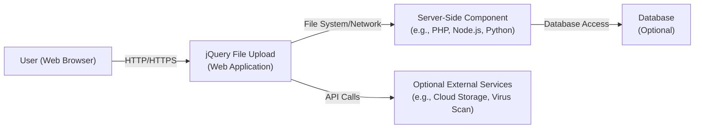
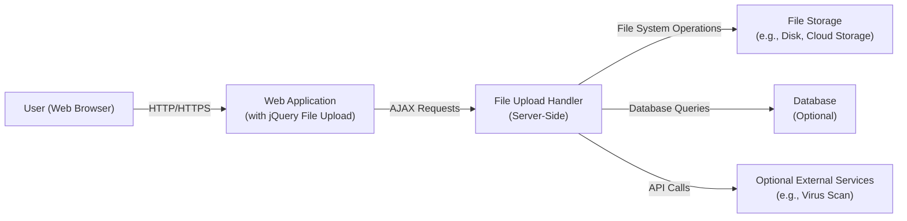
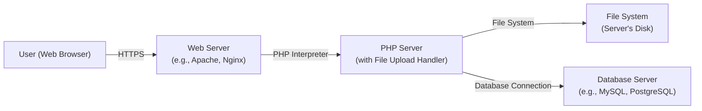

Okay, let's create a design document for the `blueimp/jquery-file-upload` project.

# BUSINESS POSTURE

Business Priorities and Goals:

*   Provide a user-friendly and reliable file upload functionality for web applications.
*   Enable developers to easily integrate file upload capabilities into their projects.
*   Support a wide range of browsers and platforms.
*   Offer customization options for appearance and behavior.
*   Maintain a lightweight and performant solution.
*   Provide features like drag & drop, progress bars, and preview images.

Most Important Business Risks:

*   Security vulnerabilities that could allow attackers to upload malicious files, potentially leading to server compromise, data breaches, or cross-site scripting (XSS) attacks.
*   Lack of proper input validation, leading to unexpected application behavior or denial-of-service vulnerabilities.
*   Compatibility issues with different browsers or server-side environments, hindering adoption and usability.
*   Performance bottlenecks that could impact user experience, especially with large files or numerous concurrent uploads.
*   Lack of maintainability and extensibility, making it difficult to address future needs or security concerns.
*   Inability to handle various file types and sizes, limiting the project's applicability.

# SECURITY POSTURE

Existing Security Controls:

*   security control: Basic file type validation (client-side and potentially server-side, based on configuration). Described in documentation and example server-side implementations.
*   security control: File size limits (client-side and potentially server-side). Described in documentation and example server-side implementations.
*   security control: Chunked uploads to handle large files. Described in documentation.
*   security control: Cross-Origin Resource Sharing (CORS) support. Described in documentation.
*   security control: The project is open-source, allowing for community review and contributions to identify and address security issues.

Accepted Risks:

*   accepted risk: The project relies heavily on server-side implementations for robust security. Client-side checks can be bypassed.
*   accepted risk: The example server-side implementations provided are not production-ready and require further hardening.
*   accepted risk: The project's flexibility and wide range of configuration options introduce a larger attack surface if not properly configured.
*   accepted risk: The project depends on external libraries (jQuery, etc.), which may have their own vulnerabilities.

Recommended Security Controls:

*   Implement robust server-side file type validation using magic numbers/file signatures, not just file extensions.
*   Enforce strict file size limits on the server-side.
*   Implement image processing/resizing on the server-side to prevent image-based attacks (e.g., ImageTragick).
*   Use a secure random number generator for generating unique file names.
*   Store uploaded files outside the web root or use a dedicated file storage service (e.g., AWS S3, Azure Blob Storage).
*   Implement proper access controls to prevent unauthorized access to uploaded files.
*   Scan uploaded files for malware using a reputable anti-malware solution.
*   Implement Content Security Policy (CSP) to mitigate XSS attacks.
*   Implement Subresource Integrity (SRI) to ensure that fetched files haven't been tampered with.
*   Regularly update dependencies to address known vulnerabilities.

Security Requirements:

*   Authentication:
    *   If uploads are restricted to authenticated users, the server-side implementation must enforce authentication before processing any upload requests.
    *   Session management should be handled securely, using strong session identifiers and appropriate timeouts.
*   Authorization:
    *   The server-side implementation must enforce authorization rules to control which users can upload files and access uploaded content.
    *   Access control lists (ACLs) or role-based access control (RBAC) should be used to manage permissions.
*   Input Validation:
    *   Server-side validation of all input parameters, including file names, file types, and file sizes, is crucial.
    *   File names should be sanitized to prevent directory traversal attacks.
    *   File types should be validated using magic numbers/file signatures, not just extensions.
    *   File sizes should be strictly enforced on the server-side.
*   Cryptography:
    *   If sensitive files are being uploaded, they should be encrypted at rest and in transit.
    *   Use strong encryption algorithms and key management practices.
    *   HTTPS should be enforced for all communication between the client and server.

# DESIGN

## C4 CONTEXT

C4 Context Element Descriptions:

*   User (Web Browser):
    *   Name: User
    *   Type: Person
    *   Description: A person interacting with the jQuery File Upload component through a web browser.
    *   Responsibilities: Initiates file uploads, views progress, interacts with the UI.
    *   Security controls: Browser-based security controls (e.g., same-origin policy), HTTPS.

*   jQuery File Upload (Web Application):
    *   Name: jQuery File Upload
    *   Type: Web Application
    *   Description: The client-side component of the file upload system, integrated into a web application.
    *   Responsibilities: Handles user interaction, manages the upload process, communicates with the server-side component.
    *   Security controls: Client-side file type and size validation (limited), CORS support, XSRF protection (if implemented in the web application).

*   Server-Side Component (e.g., PHP, Node.js, Python):
    *   Name: Server-Side Component
    *   Type: Web Application
    *   Description: The server-side component that receives and processes file uploads.
    *   Responsibilities: Receives uploaded files, performs validation, stores files, interacts with other services.
    *   Security controls: Server-side file type and size validation, authentication, authorization, input sanitization, secure file storage, malware scanning.

*   Optional External Services (e.g., Cloud Storage, Virus Scan):
    *   Name: Optional External Services
    *   Type: External Systems
    *   Description: External services that the server-side component might interact with.
    *   Responsibilities: Provide services like cloud storage, virus scanning, image processing.
    *   Security controls: Dependent on the specific service (e.g., AWS S3 security features, API keys, authentication).

*   Database (Optional):
    *   Name: Database
    *   Type: Database
    *   Description: A database that the server-side component might use to store metadata about uploaded files.
    *   Responsibilities: Stores file metadata.
    *   Security controls: Database access controls, input sanitization, encryption of sensitive data.

## C4 CONTAINER

C4 Container Element Descriptions:

*   User (Web Browser):
    *   Name: User
    *   Type: Person
    *   Description: A person interacting with the jQuery File Upload component through a web browser.
    *   Responsibilities: Initiates file uploads, views progress, interacts with the UI.
    *   Security controls: Browser-based security controls (e.g., same-origin policy), HTTPS.

*   Web Application (with jQuery File Upload):
    *   Name: Web Application
    *   Type: Web Application
    *   Description: The web application that integrates the jQuery File Upload plugin.
    *   Responsibilities: Renders the UI, handles user interactions, sends AJAX requests to the server.
    *   Security controls: Client-side validation (limited), CORS support, XSRF protection.

*   File Upload Handler (Server-Side):
    *   Name: File Upload Handler
    *   Type: Web Application
    *   Description: The server-side component that handles file upload requests.
    *   Responsibilities: Receives and processes file uploads, performs validation, interacts with file storage and other services.
    *   Security controls: Server-side file type and size validation, authentication, authorization, input sanitization, secure file storage, malware scanning.

*   File Storage (e.g., Disk, Cloud Storage):
    *   Name: File Storage
    *   Type: System
    *   Description: The location where uploaded files are stored.
    *   Responsibilities: Stores uploaded files securely.
    *   Security controls: Access controls, encryption at rest, regular backups.

*   Database (Optional):
    *   Name: Database
    *   Type: Database
    *   Description: A database that stores metadata about uploaded files.
    *   Responsibilities: Stores file metadata.
    *   Security controls: Database access controls, input sanitization, encryption of sensitive data.

*   Optional External Services (e.g., Virus Scan):
    *   Name: Optional External Services
    *   Type: External Systems
    *   Description: External services that the server-side component might interact with.
    *   Responsibilities: Provide services like cloud storage, virus scanning, image processing.
    *   Security controls: Dependent on the specific service (e.g., AWS S3 security features, API keys, authentication).

## DEPLOYMENT

Possible Deployment Solutions:

1.  Traditional Web Server (e.g., Apache, Nginx) with a server-side scripting language (e.g., PHP, Python, Node.js).
2.  Cloud-based Platform-as-a-Service (PaaS) (e.g., Heroku, AWS Elastic Beanstalk, Google App Engine).
3.  Serverless Functions (e.g., AWS Lambda, Azure Functions, Google Cloud Functions) with cloud storage (e.g., AWS S3, Azure Blob Storage).
4.  Containerized deployment (e.g., Docker, Kubernetes).

Chosen Deployment Solution (Example: Traditional Web Server with PHP):

Deployment Element Descriptions:

*   User (Web Browser):
    *   Name: User
    *   Type: Person
    *   Description: A person interacting with the jQuery File Upload component through a web browser.
    *   Responsibilities: Initiates file uploads, views progress, interacts with the UI.
    *   Security controls: Browser-based security controls (e.g., same-origin policy), HTTPS.

*   Web Server (e.g., Apache, Nginx):
    *   Name: Web Server
    *   Type: Software
    *   Description: The web server that hosts the web application and handles incoming requests.
    *   Responsibilities: Serves static content, routes requests to the appropriate server-side component.
    *   Security controls: Web server configuration (e.g., disabling directory listing, configuring SSL/TLS), firewall rules.

*   PHP Server (with File Upload Handler):
    *   Name: PHP Server
    *   Type: Software
    *   Description: The PHP interpreter that executes the server-side file upload handler code.
    *   Responsibilities: Executes PHP code, processes file uploads, interacts with the file system and database.
    *   Security controls: PHP configuration (e.g., disabling dangerous functions, setting upload limits), secure coding practices.

*   File System (Server's Disk):
    *   Name: File System
    *   Type: System
    *   Description: The server's file system where uploaded files are stored.
    *   Responsibilities: Stores uploaded files.
    *   Security controls: File system permissions, access controls, encryption at rest.

*   Database Server (e.g., MySQL, PostgreSQL):
    *   Name: Database Server
    *   Type: Software
    *   Description: The database server that stores metadata about uploaded files.
    *   Responsibilities: Stores file metadata.
    *   Security controls: Database access controls, input sanitization, encryption of sensitive data.

## BUILD

The build process for `jquery-file-upload` primarily involves assembling the necessary JavaScript, CSS, and HTML files.  Since it's a client-side library, the "build" is more about preparing the distribution files than compiling code in the traditional sense.  However, a robust build process should include security checks.

Build Process Steps:

1.  Developer commits code changes to the GitHub repository.
2.  A Continuous Integration (CI) system (e.g., GitHub Actions, Travis CI, Jenkins) is triggered.
3.  The CI system checks out the code.
4.  Dependency Management: Dependencies (like jQuery) are managed, ideally with a package manager (though the project's age might mean this isn't strictly adhered to).  A modern approach would use npm or yarn.
5.  Linting: JavaScript and CSS linters (e.g., ESLint, Stylelint) are run to check for code style and potential errors.
6.  Security Audits:
    *   Dependency Vulnerability Scanning: Tools like `npm audit` or `yarn audit` (if npm/yarn are used) or OWASP Dependency-Check can be used to scan for known vulnerabilities in dependencies.
    *   Static Analysis Security Testing (SAST):  A SAST tool (e.g., SonarQube, FindSecBugs) could be integrated to analyze the JavaScript code for potential security vulnerabilities.  This is less critical for a client-side library than for server-side code, but still beneficial.
7.  Minification/Bundling: JavaScript and CSS files are minified and potentially bundled to reduce file sizes and improve loading performance. Tools like UglifyJS or Terser can be used.
8.  Testing: Automated tests (if they exist) are run.  This project might have limited automated tests, given its age and nature.
9.  Artifact Creation: The final distribution files (JavaScript, CSS, HTML examples) are packaged.
10. Release: The artifacts are published (e.g., to a CDN, npm registry, or GitHub releases).

```mermaid
graph LR
    Developer["Developer"] -- "Commits Code" --> GitHubRepository["GitHub Repository"]
    GitHubRepository -- "Triggers CI" --> CISystem["CI System\n(e.g., GitHub Actions)"]
    CISystem -- "Checks Out Code" --> CodeCheckout["Code Checkout"]
    CodeCheckout -- "Dependency Management" --> DependencyManagement["Dependency Management\n(npm/yarn)"]
    DependencyManagement -- "Linting" --> Linting["Linting\n(ESLint, Stylelint)"]
    Linting -- "Security Audits" --> SecurityAudits["Security Audits\n(Dependency Check, SAST)"]
    SecurityAudits -- "Minification/Bundling" --> Minification["Minification/Bundling\n(UglifyJS, Terser)"]
    Minification -- "Testing" --> Testing["Testing\n(Unit Tests)"]
    Testing -- "Artifact Creation" --> ArtifactCreation["Artifact Creation\n(Distribution Files)"]
    ArtifactCreation -- "Release" --> Release["Release\n(CDN, npm, GitHub)"]

```

# RISK ASSESSMENT

Critical Business Processes to Protect:

*   File upload functionality: Ensuring users can reliably and securely upload files.
*   Data integrity: Preventing data corruption or loss during the upload process.
*   Application availability: Preventing denial-of-service attacks that could disrupt the file upload service.
*   Reputation: Avoiding security breaches that could damage the reputation of the application or organization using the library.

Data to Protect and Sensitivity:

*   Uploaded files: The sensitivity of the uploaded files depends entirely on the context of the application using the library.  Files could range from publicly shareable images to highly confidential documents.  The design must assume that highly sensitive data *could* be uploaded and provide appropriate safeguards.
*   File metadata (e.g., file names, upload timestamps, user IDs): This data may have some sensitivity, especially if it can be linked to specific users or reveals information about the application's internal workings.
*   Server configuration and code:  This is highly sensitive, as it could be exploited by attackers to gain control of the server.

# QUESTIONS & ASSUMPTIONS

Questions:

*   What specific server-side environments are most commonly used with this library? (This will help prioritize security recommendations for those environments.)
*   Are there any existing security audits or penetration test reports for this project?
*   What is the expected level of security expertise of developers who will be integrating this library? (This will influence the level of detail and guidance needed in the documentation.)
*   What are the most common types of files expected to be uploaded using this library?
*   Are there any specific compliance requirements (e.g., GDPR, HIPAA) that need to be considered?

Assumptions:

*   BUSINESS POSTURE: The primary business goal is to provide a reliable and easy-to-use file upload component. Security is a high priority, but usability and ease of integration are also important.
*   SECURITY POSTURE: Developers integrating this library will have *some* security knowledge, but may not be security experts.  Server-side security is the responsibility of the integrating developer. The library itself provides basic client-side validation, but this is easily bypassed.
*   DESIGN: The library is primarily used in web applications, and the server-side implementation is separate from the library itself. The most common deployment scenario is likely a traditional web server with a server-side scripting language.