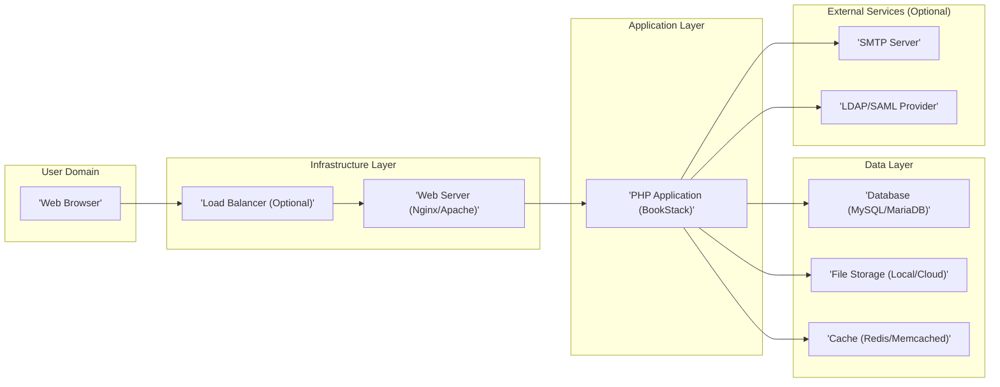
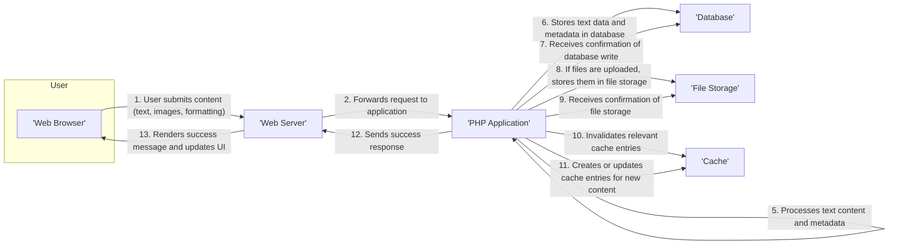
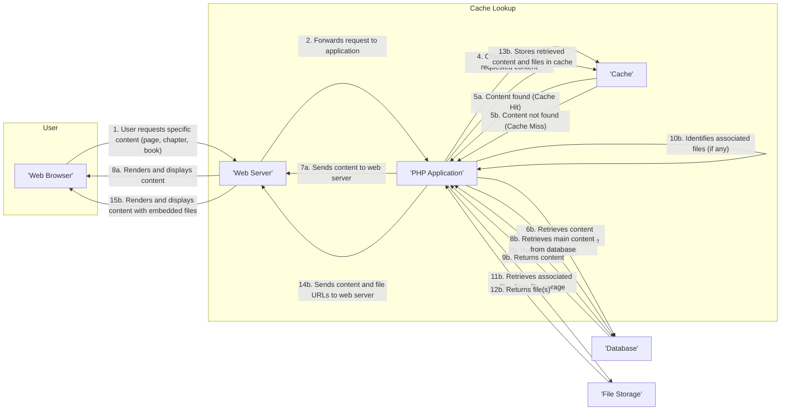

## Project Design Document: BookStack Application - Enhanced

**1. Introduction**

This document provides an enhanced architectural design for the BookStack application, an open-source knowledge management platform. This detailed design is intended to serve as a robust foundation for subsequent threat modeling activities and provides a comprehensive understanding of the system's structure and operation. It meticulously outlines the key components, their interactions, data flows, and crucial security considerations.

**2. Goals and Objectives**

*   Provide a comprehensive and in-depth overview of the BookStack application's architecture.
*   Clearly identify all key components and delineate their specific responsibilities within the system.
*   Accurately map the complete flow of data within the application for various user interactions.
*   Thoroughly highlight potential security considerations, vulnerabilities, and areas of concern.
*   Serve as a definitive and reliable reference point for future development, security assessments, and operational understanding.

**3. High-Level Architecture Diagram**

**4. Component Descriptions**

*   **Web Browser:** The primary user interface through which individuals interact with the BookStack application, sending requests and receiving responses.
*   **Load Balancer (Optional):** An infrastructure component that distributes incoming network traffic across multiple instances of the Web Server. This enhances scalability, availability, and fault tolerance.
*   **Web Server (Nginx/Apache):**  Responsible for receiving and processing incoming HTTP requests from users. It serves static content (HTML, CSS, JavaScript) and acts as a reverse proxy, forwarding dynamic requests to the PHP Application.
*   **PHP Application (BookStack):** The core of the application, containing the business logic, controllers, models, and views. Built using the Laravel framework, it handles user authentication, authorization, data manipulation, and rendering of web pages.
*   **Database (MySQL/MariaDB):** A relational database management system used for persistent storage of structured application data. This includes user accounts, book content (shelves, books, chapters, pages), settings, and access control information.
*   **File Storage (Local/Cloud):**  A system for storing uploaded files, such as images, documents, and other attachments. This can be a local file system on the server or a scalable cloud storage service like AWS S3, Google Cloud Storage, or Azure Blob Storage.
*   **Cache (Redis/Memcached):** An in-memory data store used to cache frequently accessed data. This significantly reduces database load and improves application response times by serving data directly from memory.
*   **SMTP Server (Optional):** An external service responsible for sending outgoing emails from the application. This is used for features like password resets, notifications, and user invitations.
*   **LDAP/SAML Provider (Optional):** External identity providers that enable integration with existing authentication systems. This allows users to log in to BookStack using their existing organizational credentials.

**5. Data Flow Diagram - Content Creation (Detailed)**

**6. Data Flow Diagram - Content Retrieval (Detailed)**

**7. Security Considerations (Expanded)**

*   **Authentication and Authorization:**
    *   **Password Hashing:** Utilizes strong, modern hashing algorithms (e.g., bcrypt, Argon2) with unique salts for each password to protect against rainbow table attacks.
    *   **Session Management:** Employs secure session IDs, regeneration of session IDs upon login, and setting `HttpOnly` and `Secure` flags on session cookies to mitigate session hijacking. Consider implementing `SameSite` attribute for CSRF protection.
    *   **Role-Based Access Control (RBAC):** Enforces granular permissions based on user roles, ensuring users only have access to the resources they need. Regularly review and update role permissions.
    *   **Multi-Factor Authentication (MFA):** Strongly recommended to implement MFA options (e.g., TOTP, WebAuthn) to add an extra layer of security against unauthorized access.
    *   **LDAP/SAML Integration Security:** Securely configure integration with external identity providers, ensuring proper certificate validation and secure communication protocols.
*   **Input Validation and Output Encoding:**
    *   **Strict Input Validation:** Implement server-side validation for all user inputs, including data type, format, and length, to prevent injection attacks (SQL injection, command injection, etc.). Use parameterized queries or prepared statements for database interactions.
    *   **Contextual Output Encoding:** Employ appropriate encoding techniques based on the output context (HTML escaping, JavaScript escaping, URL encoding) to prevent Cross-Site Scripting (XSS) vulnerabilities.
*   **Data Protection:**
    *   **Encryption at Rest:** Implement encryption for sensitive data stored in the database (e.g., using database encryption features) and on the file system.
    *   **Encryption in Transit:** Enforce HTTPS (TLS/SSL) for all communication between the user's browser and the server to protect data confidentiality and integrity. Ensure proper TLS configuration (e.g., strong ciphers, HSTS).
    *   **Regular Backups:** Implement a robust backup strategy with secure storage of backups, including encryption and access controls.
*   **Session Management:**
    *   **Secure Cookies:** Utilize `Secure` and `HttpOnly` flags for session cookies. Consider the `SameSite` attribute to mitigate CSRF attacks.
    *   **Session Timeout:** Configure appropriate session timeout values to limit the window of opportunity for session hijacking. Implement mechanisms for automatic logout after inactivity.
    *   **CSRF Protection:** Implement CSRF tokens for all state-changing requests to prevent Cross-Site Request Forgery attacks.
*   **File Upload Security:**
    *   **File Type Validation:** Validate file types based on content rather than just the extension. Utilize libraries for magic number checking.
    *   **File Size Limits:** Enforce reasonable file size limits to prevent denial-of-service attacks.
    *   **Executable File Prevention:**  Strictly prevent the upload of executable files.
    *   **Secure Storage and Serving:** Store uploaded files in a location that is not directly accessible by the web server. Serve files through a controller that enforces access controls and proper content-type headers to prevent MIME sniffing vulnerabilities.
*   **Dependency Management:**
    *   **Regular Updates:** Implement a process for regularly updating dependencies (libraries, frameworks) to patch known security vulnerabilities.
    *   **Vulnerability Scanning:** Utilize dependency scanning tools to identify and address vulnerable dependencies.
*   **Logging and Monitoring:**
    *   **Comprehensive Logging:** Log security-related events (authentication attempts, authorization failures, access to sensitive data, errors) with sufficient detail for auditing and incident response.
    *   **Security Monitoring:** Implement monitoring systems to detect suspicious activity and security incidents. Set up alerts for critical events.
*   **Infrastructure Security:**
    *   **Secure Configuration:** Harden web servers and databases by following security best practices (e.g., disabling unnecessary services, setting strong passwords, applying security patches).
    *   **Network Segmentation:** Implement network segmentation and firewall rules to restrict access to internal components.
    *   **Regular Security Audits and Penetration Testing:** Conduct periodic security assessments to identify vulnerabilities and weaknesses in the application and infrastructure.
*   **Rate Limiting:** Implement rate limiting on authentication endpoints and other critical areas to prevent brute-force attacks and denial-of-service attempts.

**8. Deployment Considerations (Detailed)**

*   **Environment Options:**
    *   **On-Premises:** Deployment on physical servers within an organization's own data center, providing maximum control but requiring significant infrastructure management.
    *   **Virtual Machines (VMs):** Deployment on virtualized infrastructure (e.g., VMware, Hyper-V), offering more flexibility than on-premises but still requiring OS and application management.
    *   **Cloud Platforms (IaaS, PaaS):** Deployment on cloud infrastructure providers like AWS, Azure, or GCP, leveraging their scalable resources and managed services.
        *   **IaaS (Infrastructure as a Service):**  Provides virtual machines and networking, requiring management of the operating system and application stack.
        *   **PaaS (Platform as a Service):** Offers a managed environment for deploying and running applications, reducing the operational burden.
    *   **Containerization (Docker):** Packaging the application and its dependencies into containers for consistent deployment across different environments.
    *   **Orchestration (Kubernetes):**  Managing and scaling containerized deployments using platforms like Kubernetes, providing automated deployment, scaling, and management.
*   **Scalability Strategies:**
    *   **Horizontal Scaling:** Adding more web server instances behind a load balancer to handle increased traffic.
    *   **Database Scaling:** Implementing database replication (read replicas) for read-heavy workloads or sharding for write-heavy workloads. Consider managed database services for easier scaling.
    *   **Caching:** Utilizing caching mechanisms (Redis/Memcached) to reduce database load and improve performance.
*   **High Availability (HA) Design:**
    *   **Redundant Components:** Implementing redundancy for all critical components, including load balancers, web servers, databases, and file storage.
    *   **Automatic Failover:** Configuring systems for automatic failover in case of component failures.
    *   **Disaster Recovery (DR):**  Developing a disaster recovery plan to ensure business continuity in the event of a major outage.
*   **Deployment Automation:**
    *   **Infrastructure as Code (IaC):** Using tools like Terraform or CloudFormation to automate the provisioning and management of infrastructure.
    *   **Continuous Integration/Continuous Deployment (CI/CD):** Implementing CI/CD pipelines for automated building, testing, and deployment of application updates.

**9. Technology Stack**

*   **Programming Language:** PHP
*   **Web Server:** Nginx or Apache
*   **Database:** MySQL or MariaDB
*   **Caching:** Redis or Memcached
*   **Frontend:** HTML, CSS, JavaScript (utilizing libraries like jQuery)
*   **Framework:** Laravel (PHP framework)
*   **Operating System (Typical):** Linux (e.g., Ubuntu, CentOS)

**10. Future Considerations**

*   **Enhanced Security Features:**
    *   Implementation of Content Security Policy (CSP) to mitigate XSS attacks.
    *   Implementation of Subresource Integrity (SRI) to ensure that files fetched from CDNs haven't been tampered with.
    *   Consideration of Web Application Firewall (WAF) for enhanced protection against web attacks.
*   **Improved API:** Development of a more comprehensive and well-documented RESTful API for seamless integrations with other applications and services.
*   **More Granular Permissions:** Expanding the Role-Based Access Control (RBAC) system to allow for more fine-grained control over access to specific content and features.
*   **Integration with other services:**  Adding native support for integrations with popular productivity and collaboration tools (e.g., Slack, Microsoft Teams, document management systems).
*   **Enhanced Search Functionality:** Implementing more advanced search capabilities, potentially leveraging dedicated search engines like Elasticsearch.

This enhanced design document provides a more detailed and comprehensive understanding of the BookStack application's architecture, crucial for conducting thorough and effective threat modeling. By having a deep understanding of the components, data flows, and potential security vulnerabilities, security professionals can more accurately identify and mitigate risks associated with the application, leading to a more secure and resilient system.
