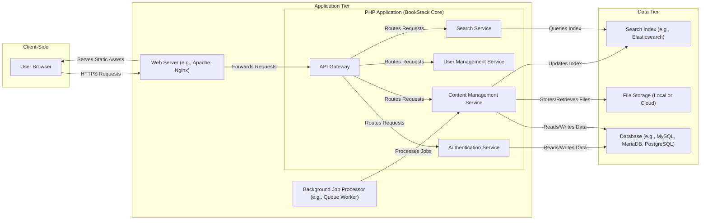
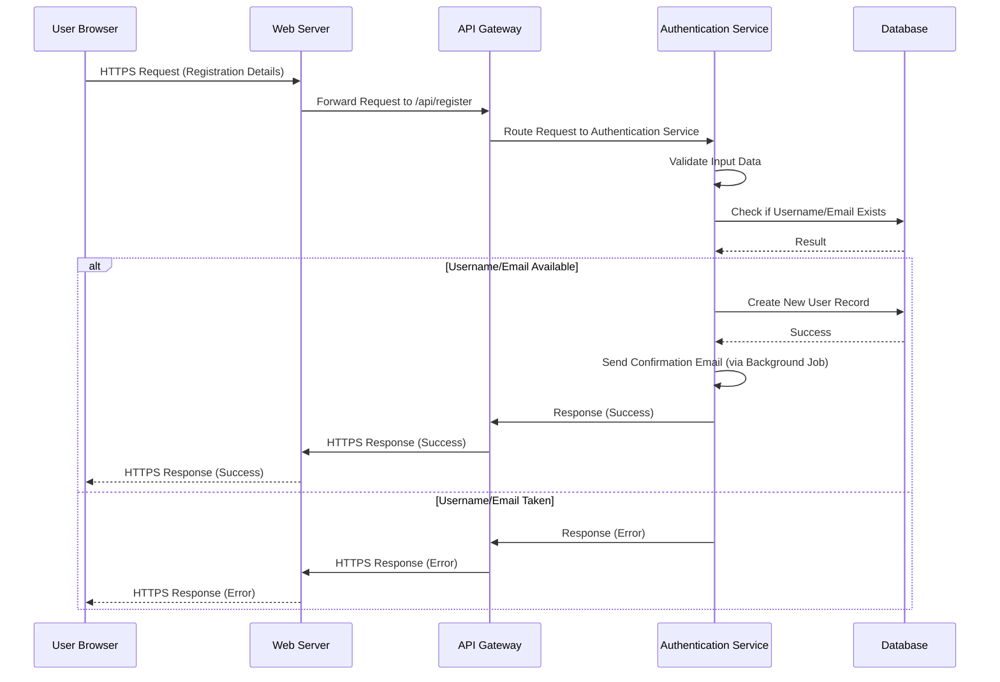
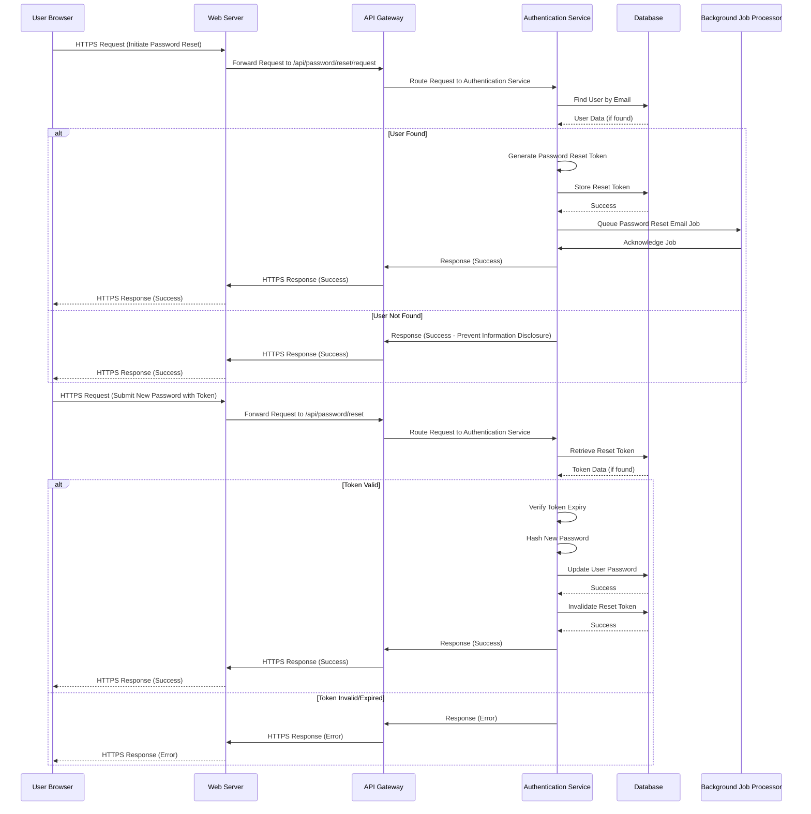
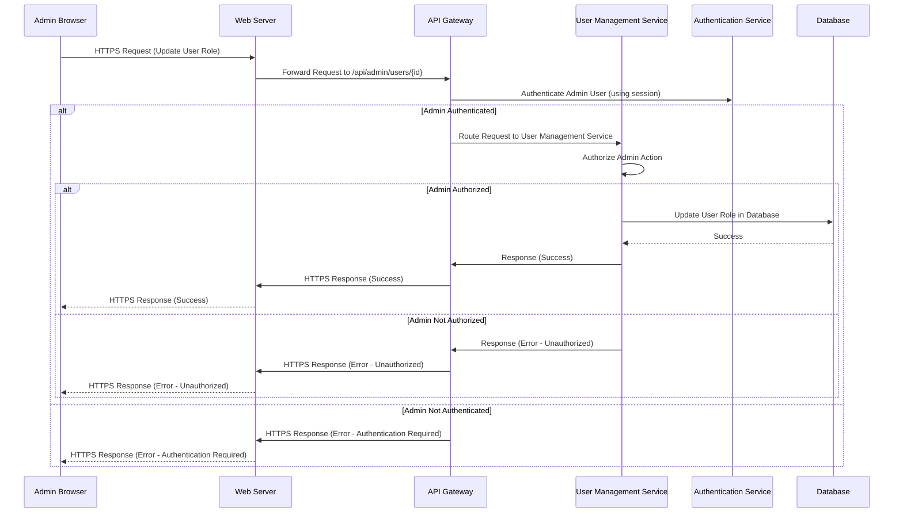

# Project Design Document: BookStack Application - Improved

**Version:** 2.0
**Date:** October 26, 2023
**Author:** AI Software Architect

## 1. Introduction

This document provides an enhanced architectural design of the BookStack application, an open-source platform for organizing and sharing knowledge. Building upon the previous version, this iteration offers more granular detail and clarity, specifically tailored for comprehensive threat modeling. The design emphasizes key components, their interactions, data flows, and inherent security considerations, providing a robust foundation for identifying potential threats and formulating mitigation strategies.

## 2. Goals and Objectives

*   Provide a more detailed and refined architectural design of the BookStack application.
*   Elaborate on the responsibilities and internal workings of key components.
*   Offer more comprehensive data flow diagrams covering a wider range of user interactions.
*   Present a more structured and actionable breakdown of security considerations.
*   Serve as an improved and more effective basis for subsequent threat modeling activities.

## 3. High-Level Architecture

The BookStack application maintains a traditional three-tier architecture, with a clearer delineation of responsibilities within the Application Tier:

*   **Presentation Tier (Client-Side):** The user interface accessed through web browsers.
*   **Application Tier (Server-Side):** The core application logic, now further divided into logical services.
*   **Data Tier:** The persistent storage for application data.

## 4. Component Details

This section provides a more detailed breakdown of the key components and their functionalities.

### 4.1. Presentation Tier (Client-Side)

*   **User Browser:**
    *   Renders the user interface using HTML, CSS, and JavaScript.
    *   Initiates HTTP requests to the Web Server based on user interactions.
    *   Receives and interprets HTTP responses from the Web Server.
    *   Executes client-side JavaScript for dynamic and interactive features, including form handling and AJAX requests.

### 4.2. Application Tier (Server-Side)

*   **Web Server (e.g., Apache, Nginx):**
    *   Acts as the entry point for all incoming HTTP requests.
    *   Handles TLS/SSL termination, ensuring secure communication over HTTPS.
    *   Serves static assets like images, stylesheets, and JavaScript files directly.
    *   Forwards dynamic requests to the PHP Application via a mechanism like PHP-FPM.
    *   May implement security measures such as rate limiting, request filtering, and header manipulation.

*   **PHP Application (BookStack Core):**
    *   Contains the core business logic, now organized into distinct services:
        *   **Authentication Service:**
            *   Handles user login, logout, and session management.
            *   Verifies user credentials against the database.
            *   Manages password resets and account recovery.
            *   May integrate with external authentication providers (e.g., LDAP, social logins).
        *   **Content Management Service:**
            *   Manages the creation, reading, updating, and deletion (CRUD) of books, shelves, chapters, and pages.
            *   Handles content formatting and rendering.
            *   Manages revisions and version history.
            *   Enforces content access controls based on user permissions.
        *   **User Management Service:**
            *   Manages user accounts, roles, and permissions.
            *   Handles user registration and profile updates.
            *   Provides administrative interfaces for user management.
        *   **Search Service:**
            *   Provides functionality for searching content within BookStack.
            *   Interacts with the Search Index to perform full-text searches.
            *   Handles indexing of new and updated content.
        *   **API Gateway:**
            *   Acts as a single entry point for all API requests.
            *   Handles request routing to the appropriate internal services.
            *   May implement authentication and authorization checks for API endpoints.
            *   Can provide rate limiting and other API management functionalities.

*   **Background Job Processor (e.g., Queue Worker):**
    *   Executes asynchronous tasks that do not require immediate user feedback.
    *   Examples include sending email notifications, processing large data imports or exports, and generating backups.
    *   Communicates with the PHP Application, typically through a message queue system, to receive and process jobs.

### 4.3. Data Tier

*   **Database (e.g., MySQL, MariaDB, PostgreSQL):**
    *   Provides persistent storage for structured data.
    *   Stores user accounts, roles, permissions, the structure of books, shelves, chapters, and pages, as well as the content itself.
    *   Accessed by the PHP Application for all data retrieval and manipulation operations.

*   **File Storage (Local or Cloud):**
    *   Stores uploaded files, such as images, attachments, and other media.
    *   Can be a local file system on the server or a cloud-based object storage service like AWS S3 or Azure Blob Storage.
    *   Accessed by the PHP Application for storing and retrieving file data.

*   **Search Index (e.g., Elasticsearch):**
    *   Provides a highly efficient and scalable full-text search capability.
    *   Contains an indexed representation of the textual content within BookStack, allowing for fast and relevant search results.
    *   Updated by the PHP Application whenever content is created or modified.

## 5. Data Flow Diagrams

This section provides more detailed data flow diagrams for various user interactions.

### 5.1. User Registration

### 5.2. Password Reset

### 5.3. Administrative Action (e.g., User Role Update)

## 6. Security Considerations

This section provides a more structured and detailed breakdown of security considerations.

*   **Authentication and Authorization:**
    *   **Threats:** Brute-force attacks, credential stuffing, session hijacking, privilege escalation, insecure password storage.
    *   **Mitigations:** Strong password policies, rate limiting on login attempts, secure session management (HTTP-only and secure cookies, session timeouts), multi-factor authentication (MFA), role-based access control (RBAC), principle of least privilege, use of bcrypt or Argon2 for password hashing.

*   **Input Validation and Output Encoding:**
    *   **Threats:** Cross-site scripting (XSS), SQL injection, command injection, path traversal, header injection.
    *   **Mitigations:** Server-side input validation on all user-provided data, parameterized queries or prepared statements for database interactions, output encoding of user-generated content before rendering, using a templating engine with automatic escaping, implementing a Content Security Policy (CSP).

*   **Data Protection:**
    *   **Threats:** Data breaches, unauthorized access to sensitive data, insecure storage of files, exposure of sensitive information in logs.
    *   **Mitigations:** Encryption of sensitive data at rest (e.g., using database encryption features), encryption of data in transit (HTTPS), secure storage configurations for file uploads, avoiding logging sensitive information, regular security audits and penetration testing.

*   **Session Management:**
    *   **Threats:** Session fixation, session hijacking, cross-site request forgery (CSRF).
    *   **Mitigations:** Using secure and HTTP-only cookies, generating cryptographically secure session IDs, implementing session timeouts, regenerating session IDs after login, using anti-CSRF tokens for state-changing requests.

*   **File Upload Security:**
    *   **Threats:** Upload of malicious files (e.g., malware, web shells), path traversal vulnerabilities, information disclosure through file metadata.
    *   **Mitigations:** Validating file types and extensions, performing virus scanning on uploaded files, storing uploaded files outside the web root, using unique and non-guessable filenames, setting appropriate access controls on uploaded files.

*   **API Security:**
    *   **Threats:** Unauthorized access to API endpoints, injection attacks through API parameters, data breaches through API responses.
    *   **Mitigations:** Implementing authentication and authorization for API endpoints (e.g., API keys, OAuth 2.0), input validation and output encoding for API requests and responses, rate limiting to prevent abuse, secure API documentation.

*   **Dependency Management:**
    *   **Threats:** Exploiting known vulnerabilities in third-party libraries and frameworks.
    *   **Mitigations:** Regularly updating dependencies to the latest stable versions, using dependency scanning tools to identify vulnerabilities, following security best practices for dependency management.

*   **Error Handling and Logging:**
    *   **Threats:** Information disclosure through verbose error messages, insufficient logging for security monitoring.
    *   **Mitigations:** Implementing generic error messages for production environments, logging security-relevant events (e.g., login attempts, failed authorization), secure storage and access control for log files.

*   **Background Job Security:**
    *   **Threats:** Unauthorized job execution, injection attacks through job parameters.
    *   **Mitigations:** Securely queueing and processing background jobs, validating job parameters, restricting access to job management interfaces.

*   **Search Index Security:**
    *   **Threats:** Information leakage through search results, unauthorized access to the search index.
    *   **Mitigations:** Ensuring that the search index respects access controls, securing communication with the search index, potentially using separate indices for different levels of access.

## 7. Deployment Considerations

Security considerations extend to the deployment environment.

*   **Infrastructure Security:** Secure the underlying operating system, web server, and database server. Implement firewalls, intrusion detection/prevention systems, and regular security patching.
*   **Network Segmentation:** Isolate different tiers of the application (presentation, application, data) on separate network segments.
*   **Database Security:** Harden the database server, restrict network access, use strong database credentials, and regularly back up the database.
*   **Secrets Management:** Securely manage sensitive credentials (e.g., database passwords, API keys) using dedicated secrets management tools or environment variables.
*   **Regular Security Assessments:** Conduct regular vulnerability scans and penetration testing to identify and address potential weaknesses in the deployment environment.

## 8. Future Considerations

*   **Enhanced Monitoring and Alerting:** Implement robust monitoring and alerting systems to detect and respond to security incidents.
*   **Web Application Firewall (WAF):** Deploy a WAF to provide an additional layer of protection against common web attacks.
*   **Security Headers:** Implement security-related HTTP headers (e.g., Strict-Transport-Security, X-Content-Type-Options, Referrer-Policy) to enhance browser security.
*   **Regular Security Training:** Ensure that development and operations teams are trained on secure coding practices and security principles.

This improved design document provides a more detailed and comprehensive understanding of the BookStack application's architecture, specifically focusing on security considerations. This enhanced information will be invaluable for conducting thorough threat modeling and implementing effective security measures.