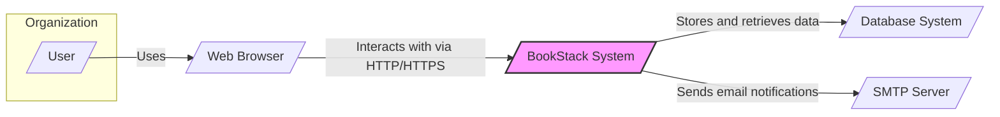
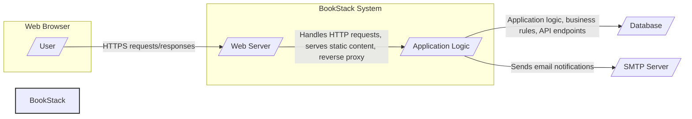
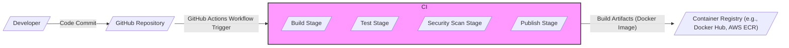

# BUSINESS POSTURE

The BookStack project aims to provide a simple, self-hosted, easy-to-use platform for organizing and storing knowledge. It is designed to be a central repository for documentation, notes, and information, facilitating knowledge sharing and collaboration within teams or organizations.

Business priorities for BookStack include:

- Centralized Knowledge Management: Providing a single source of truth for organizational knowledge, reducing information silos and improving accessibility.
- Enhanced Collaboration: Enabling teams to collaboratively create, edit, and organize documentation, fostering better teamwork and knowledge sharing.
- Improved Productivity: Streamlining access to information, reducing time spent searching for documentation, and improving overall efficiency.
- Cost-Effective Solution: Offering a self-hosted, open-source alternative to commercial knowledge management platforms, reducing licensing costs.
- Customization and Control: Providing users with control over their data and the platform's configuration, allowing for customization to specific needs.

Key business risks associated with BookStack include:

- Data Loss: Risk of losing critical knowledge due to system failures, data corruption, or inadequate backup procedures.
- Unauthorized Access: Risk of unauthorized individuals gaining access to sensitive organizational knowledge, leading to data breaches or intellectual property theft.
- Service Unavailability: Risk of the platform becoming unavailable, disrupting access to essential information and hindering business operations.
- Data Integrity Compromise: Risk of data modification or corruption by unauthorized users or malicious actors, leading to inaccurate or unreliable information.
- Reputational Damage: Risk of negative publicity and loss of trust due to security incidents, data breaches, or service disruptions.

# SECURITY POSTURE

Existing security controls for the BookStack project:

- security control: Authentication - BookStack provides user authentication to control access to the platform. Implemented within the BookStack application code.
- security control: Authorization - BookStack implements role-based access control to manage permissions for different users and groups. Implemented within the BookStack application code.
- security control: Input Validation - BookStack likely implements input validation to prevent common web application vulnerabilities such as Cross-Site Scripting (XSS) and SQL Injection. Implemented within the BookStack application code.
- security control: HTTPS Encryption - BookStack supports and recommends HTTPS to encrypt communication between users and the server. Configured at the web server level (e.g., Apache, Nginx).
- security control: Database Security - Security of the underlying database (e.g., MySQL, PostgreSQL) is assumed to be managed separately, including access controls and encryption at rest. Managed at the database server level.
- security control: Regular Updates - As an open-source project, BookStack benefits from community contributions and regular updates, including security patches. Managed by the BookStack development team and system administrators responsible for updates.

Accepted risks for the BookStack project:

- accepted risk: Vulnerabilities in Open-Source Components - Reliance on open-source libraries and frameworks introduces the risk of undiscovered vulnerabilities. Mitigation relies on timely updates and community security efforts.
- accepted risk: Configuration Errors - Misconfigurations of the application, web server, or database can introduce security vulnerabilities. Mitigation relies on secure configuration practices and documentation.
- accepted risk: User Account Compromise - Weak passwords or phishing attacks can lead to user account compromise, granting unauthorized access. Mitigation relies on strong password policies and user security awareness.

Recommended security controls for the BookStack project:

- security control: Web Application Firewall (WAF) - Implement a WAF to protect against common web attacks such as SQL injection, cross-site scripting, and DDoS attacks.
- security control: Security Scanning (SAST/DAST) - Integrate Static Application Security Testing (SAST) and Dynamic Application Security Testing (DAST) tools into the development and deployment pipeline to identify vulnerabilities early.
- security control: Vulnerability Management - Establish a vulnerability management process to track, prioritize, and remediate identified vulnerabilities in BookStack and its dependencies.
- security control: Security Awareness Training - Provide security awareness training to users to educate them about phishing, strong passwords, and other security best practices.
- security control: Incident Response Plan - Develop and implement an incident response plan to effectively handle security incidents and data breaches.

Security requirements for the BookStack project:

- Authentication:
    - Requirement: Securely authenticate users before granting access to the platform.
    - Requirement: Support strong password policies and consider multi-factor authentication (MFA).
    - Requirement: Implement session management to maintain user sessions securely.
- Authorization:
    - Requirement: Implement role-based access control to restrict access to features and data based on user roles (e.g., admin, editor, viewer).
    - Requirement: Ensure proper authorization checks are performed before granting access to resources or performing actions.
    - Requirement: Regularly review and update user roles and permissions.
- Input Validation:
    - Requirement: Validate all user inputs to prevent injection attacks (e.g., SQL injection, XSS, command injection).
    - Requirement: Sanitize user inputs before displaying them to prevent XSS vulnerabilities.
    - Requirement: Implement input validation on both client-side and server-side.
- Cryptography:
    - Requirement: Use HTTPS to encrypt all communication between users and the server to protect data in transit.
    - Requirement: Consider encrypting sensitive data at rest in the database (e.g., using database encryption features or application-level encryption).
    - Requirement: Securely store and manage cryptographic keys.

# DESIGN

## C4 CONTEXT



Context Diagram Elements:

- Name: User
    - Type: Person
    - Description: Represents individuals within the organization who interact with the BookStack system. Users can have different roles such as readers, editors, and administrators.
    - Responsibilities: Access and utilize the BookStack system to consume and contribute to organizational knowledge. Authenticate to the system. Manage their user profile.
    - Security controls: User authentication (passwords, potentially MFA), access control based on roles.

- Name: BookStack System
    - Type: Software System
    - Description: The BookStack application itself, responsible for managing and serving knowledge content. This is the central system being designed.
    - Responsibilities: Provide a web interface for users to access and manage knowledge. Store and retrieve knowledge content from the database. Handle user authentication and authorization. Send email notifications.
    - Security controls: Authentication, authorization, input validation, session management, HTTPS encryption, application-level logging and monitoring.

- Name: Database System
    - Type: Software System
    - Description: The database system used by BookStack to store all application data, including user accounts, knowledge content, and settings. Examples include MySQL or PostgreSQL.
    - Responsibilities: Persistently store and retrieve data for the BookStack application. Ensure data integrity and availability. Manage database access and security.
    - Security controls: Database access controls, database user authentication, encryption at rest (optional, depending on database configuration), regular backups.

- Name: SMTP Server
    - Type: Software System
    - Description: An SMTP (Simple Mail Transfer Protocol) server used by BookStack to send email notifications to users, such as password reset emails or notifications about content changes.
    - Responsibilities: Send email messages on behalf of the BookStack system. Ensure reliable email delivery.
    - Security controls: SMTP server authentication (if required by SMTP provider), secure configuration of SMTP connection details within BookStack (e.g., using environment variables or secure configuration files).

- Name: Web Browser
    - Type: Software System
    - Description: The web browser used by users to access the BookStack web interface. Examples include Chrome, Firefox, Safari, or Edge.
    - Responsibilities: Render the BookStack web interface. Send HTTP/HTTPS requests to the BookStack system. Display content received from the BookStack system.
    - Security controls: Browser security features (e.g., Content Security Policy enforcement, XSS protection), user awareness of phishing and malicious websites.

## C4 CONTAINER



Container Diagram Elements:

- Name: Web Browser
    - Type: Client Application
    - Description: The user's web browser, responsible for rendering the BookStack user interface.
    - Responsibilities: Display the user interface, interact with the user, send requests to the Web Server, receive and display responses.
    - Security controls: Browser security features, user security practices.

- Name: Web Server
    - Type: Web Server
    - Description:  A web server (e.g., Apache or Nginx) that handles HTTP/HTTPS requests, serves static content, and acts as a reverse proxy to the Application Logic container.
    - Responsibilities: Receive and route HTTP requests, serve static files (HTML, CSS, JavaScript, images), handle TLS/SSL termination, provide basic security features (e.g., rate limiting, basic authentication).
    - Security controls: HTTPS configuration, web server access logs, rate limiting, potentially WAF integration.

- Name: Application Logic
    - Type: Application
    - Description: The core BookStack application code, written in PHP, responsible for implementing the business logic, handling user requests, interacting with the database, and managing application state.
    - Responsibilities: User authentication and authorization, input validation, data processing, business rule enforcement, API endpoint handling, interaction with the Database container, sending email notifications.
    - Security controls: Application-level authentication and authorization, input validation, secure coding practices, session management, logging, potentially SAST/DAST integration in development pipeline.

- Name: Database
    - Type: Database
    - Description: The database system (e.g., MySQL or PostgreSQL) used to persistently store application data.
    - Responsibilities: Data storage and retrieval, data integrity, data backup and recovery, database access control.
    - Security controls: Database access controls, database user authentication, encryption at rest (optional), regular backups, database activity logging.

- Name: SMTP Server
    - Type: External System
    - Description: An external SMTP server used to send email notifications.
    - Responsibilities: Email delivery.
    - Security controls: Secure SMTP connection configuration, potentially SMTP server authentication.

## DEPLOYMENT

Deployment Architecture: Cloud-Based Containerized Deployment (using Docker and Kubernetes on AWS EKS)

```mermaid
flowchart LR
    subgraph "AWS EKS Cluster"
        subgraph "Nodes"
            Node1[/"Worker Node 1"/]
            Node2[/"Worker Node 2"/]
        end
        subgraph "Pods"
            PodWeb[/"Web Server Pod"/]
            PodApp[/"Application Pod"/]
            PodDB[/"Database Pod"/]
        end
    end
    LoadBalancer[/"AWS Load Balancer"/]
    Internet[/"Internet"/]
    UserBrowser[/"User's Browser"/]

    Internet --"HTTPS"--> LoadBalancer
    LoadBalancer --"HTTP"--> PodWeb
    PodWeb --"FastCGI/ProxyPass"--> PodApp
    PodApp --"Database Connection"--> PodDB

    Node1 --> PodWeb
    Node1 --> PodApp
    Node2 --> PodDB

    style "AWS EKS Cluster" fill:#f9f,stroke:#333,stroke-width:2px
```

Deployment Diagram Elements:

- Name: Internet
    - Type: Network
    - Description: The public internet, representing the external network from which users access the BookStack system.
    - Responsibilities: Provide network connectivity for users to access the system.
    - Security controls: General internet security measures, DDoS protection at the network perimeter (potentially provided by cloud provider).

- Name: AWS Load Balancer
    - Type: Infrastructure Component (Cloud Service)
    - Description: An AWS Elastic Load Balancer (ELB) that distributes incoming HTTPS traffic across the Web Server pods. Handles TLS termination and provides high availability and scalability.
    - Responsibilities: Load balancing, TLS termination, traffic routing, health checks.
    - Security controls: HTTPS configuration, security groups to restrict access, AWS WAF integration (optional).

- Name: Worker Node 1, Worker Node 2
    - Type: Infrastructure Component (Virtual Machine)
    - Description: Worker nodes in the AWS EKS cluster, virtual machines that run the application pods.
    - Responsibilities: Provide compute resources for running containers, execute containerized applications.
    - Security controls: Operating system security hardening, security patching, network security groups, access control to nodes.

- Name: Web Server Pod
    - Type: Container
    - Description: A Kubernetes pod running a containerized web server (e.g., Nginx) instance. Multiple replicas may exist for scalability and high availability.
    - Responsibilities: Serve static content, reverse proxy requests to Application Pods, handle HTTP traffic from the Load Balancer.
    - Security controls: Container image security scanning, minimal container image, network policies to restrict pod-to-pod communication, resource limits.

- Name: Application Pod
    - Type: Container
    - Description: A Kubernetes pod running a containerized BookStack application instance (PHP application). Multiple replicas may exist for scalability and high availability.
    - Responsibilities: Run the BookStack application logic, handle user requests, interact with the Database Pod, send email notifications.
    - Security controls: Container image security scanning, minimal container image, network policies to restrict pod-to-pod communication, resource limits, application-level security controls.

- Name: Database Pod
    - Type: Container
    - Description: A Kubernetes pod running a containerized database instance (e.g., MySQL or PostgreSQL).  Potentially using persistent volumes for data storage.
    - Responsibilities: Store and manage application data.
    - Security controls: Database access controls, database user authentication, persistent volume encryption (optional), network policies to restrict access, database backups.

- Name: User's Browser
    - Type: Client Application
    - Description: The user's web browser accessing the BookStack application.
    - Responsibilities: Render the user interface, interact with the system.
    - Security controls: Browser security features, user security practices.

## BUILD

Build Process: GitHub Actions CI/CD Pipeline



Build Process Description:

1. Developer commits code changes to the GitHub repository.
2. A GitHub Actions workflow is triggered automatically upon code commit (e.g., push to main branch, pull request).
3. CI/CD Pipeline (GitHub Actions) executes the following stages:
    - Build Stage:
        - Compiles the BookStack application code (if necessary).
        - Builds a Docker image containing the application and web server.
        - Performs unit tests.
    - Test Stage:
        - Runs integration tests and end-to-end tests to verify application functionality.
    - Security Scan Stage:
        - Performs Static Application Security Testing (SAST) on the code to identify potential vulnerabilities.
        - Scans the Docker image for known vulnerabilities in base images and dependencies.
        - Runs linters and code quality checks.
    - Publish Stage:
        - Pushes the built Docker image to a Container Registry (e.g., Docker Hub, AWS ECR).
4. The Docker image in the Container Registry is then used for deployment to the target environment (e.g., Kubernetes cluster).

Security Controls in Build Process:

- security control: Automated Build Pipeline - Using GitHub Actions ensures a consistent and repeatable build process, reducing manual errors and improving security.
- security control: Source Code Management - GitHub provides version control and access control for the source code, ensuring code integrity and traceability.
- security control: Static Application Security Testing (SAST) - SAST tools integrated into the pipeline identify potential vulnerabilities in the code before deployment.
- security control: Container Image Scanning - Scanning Docker images for vulnerabilities ensures that deployed containers are based on secure images and dependencies.
- security control: Code Linting and Quality Checks - Linters and code quality tools enforce coding standards and help identify potential code defects and security issues.
- security control: Access Control to CI/CD Pipeline - Restricting access to the CI/CD pipeline configuration and secrets ensures that only authorized personnel can modify the build and deployment process.
- security control: Secure Secret Management - Securely storing and managing secrets (e.g., API keys, database credentials) used in the build and deployment process, using GitHub Secrets or dedicated secret management solutions.

# RISK ASSESSMENT

Critical business processes we are trying to protect:

- Access to Knowledge Base: Ensuring authorized users can access and utilize the knowledge base for their work.
- Knowledge Creation and Editing: Maintaining the ability for authorized users to create and update documentation and knowledge content.
- Data Integrity of Knowledge Base: Protecting the accuracy and reliability of the information stored in the knowledge base.
- Availability of Knowledge Base: Ensuring the knowledge base is accessible when needed by authorized users.

Data we are trying to protect and their sensitivity:

- Knowledge Content (Documents, Notes, Pages): Sensitivity depends on the nature of the organization and the content stored. Could range from low (publicly available information) to high (confidential internal procedures, intellectual property, sensitive project details). Assume medium to high sensitivity for internal organizational knowledge.
- User Account Information (Usernames, Passwords, Roles): High sensitivity. Compromise can lead to unauthorized access and data breaches.
- Application Configuration Data: Medium sensitivity. May contain configuration details that could be exploited if exposed.
- Database Backups: High sensitivity. Contains all application data, including sensitive knowledge content and user information.

# QUESTIONS & ASSUMPTIONS

Questions:

- What is the specific deployment environment for BookStack (cloud provider, on-premise, hybrid)?
- Are there any specific compliance requirements (e.g., GDPR, HIPAA, SOC 2) that BookStack needs to adhere to?
- What is the organization's risk appetite regarding data loss, unauthorized access, and service disruptions?
- What is the sensitivity level of the data that will be stored in BookStack?
- Are there any existing security policies or standards within the organization that BookStack needs to align with?
- Is multi-factor authentication (MFA) required for user accounts?
- Are there specific requirements for data encryption at rest?
- What is the expected user base and usage patterns for BookStack?

Assumptions:

- BUSINESS POSTURE: BookStack is being implemented to improve internal knowledge management and collaboration within a medium-sized organization. The organization values efficiency and cost-effectiveness but also recognizes the importance of data security and availability.
- SECURITY POSTURE: The organization has a moderate risk appetite and is willing to invest in reasonable security controls to protect sensitive data. Standard web application security practices are expected to be implemented. The organization is concerned about data breaches and service disruptions.
- DESIGN: BookStack will be deployed in a cloud environment using containers (Docker and Kubernetes) for scalability and resilience. The deployment architecture will leverage cloud-managed services for load balancing and database management. The build process will be automated using a CI/CD pipeline with security checks integrated.