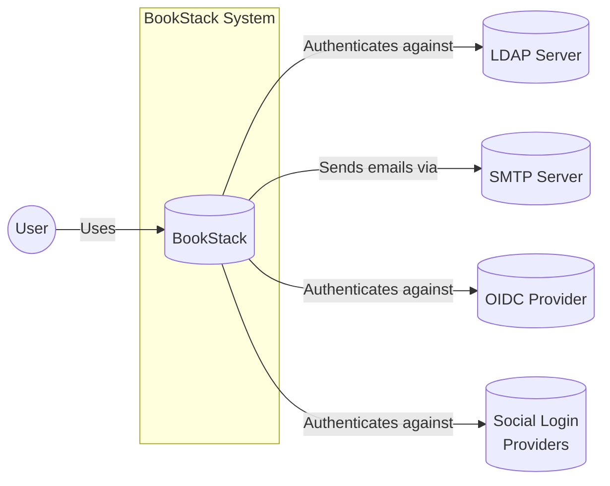
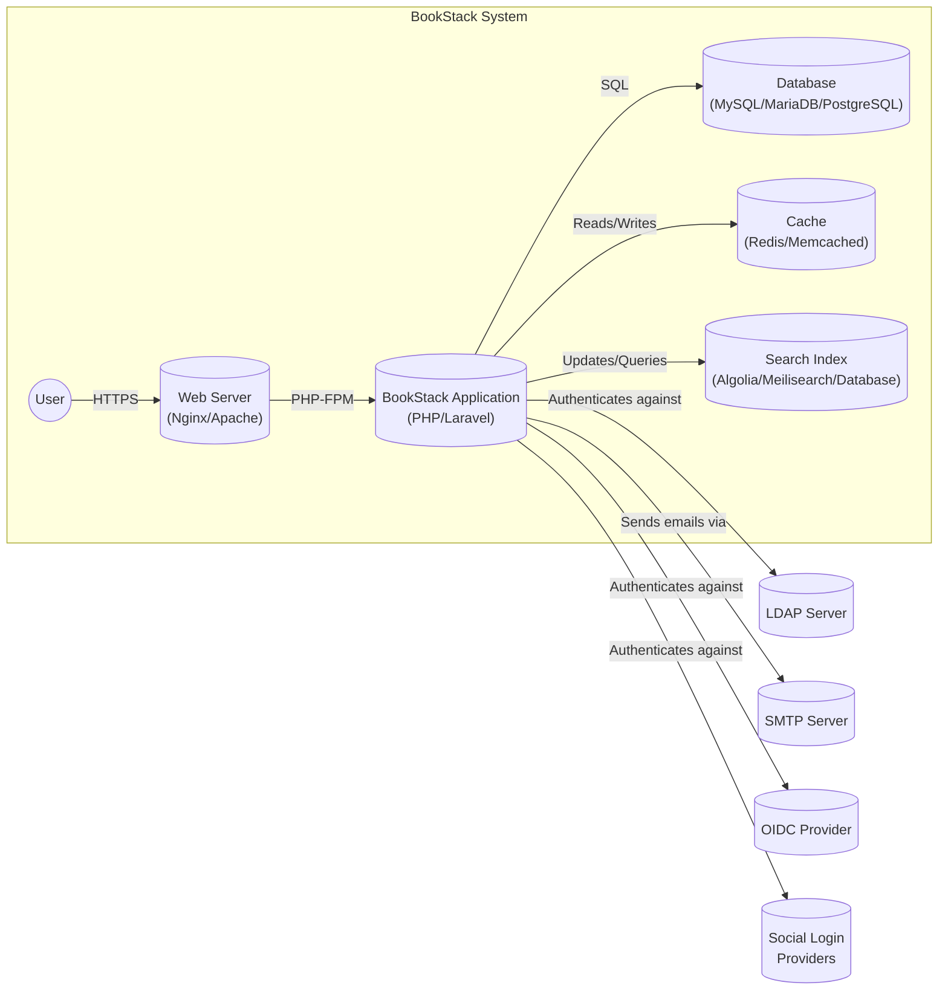
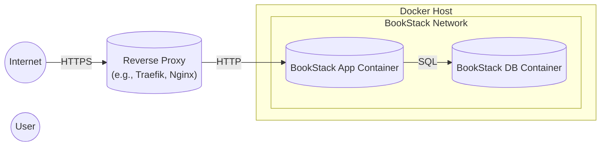
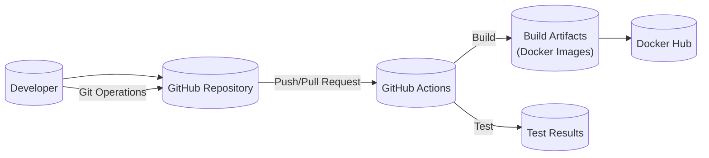

Okay, let's create a design document for the BookStack project, focusing on aspects relevant for threat modeling.

# BUSINESS POSTURE

BookStack is an open-source, self-hosted platform for storing and organizing information and documentation.  It aims to provide a simple, user-friendly experience, similar to commercial wiki software.  Given its open-source nature and self-hosted deployment model, several key business priorities and risks emerge:

Priorities:

*   Ease of Use:  The primary goal is to provide a simple and intuitive user interface and experience.  This drives adoption and user satisfaction.
*   Data Control and Ownership:  Users choose BookStack because they want full control over their data, where it's stored, and how it's accessed.
*   Community Support and Growth:  As an open-source project, BookStack relies on a vibrant community for contributions, testing, and support.
*   Flexibility and Extensibility:  The platform should be adaptable to various use cases and allow for customization and integration with other tools.
*   Reliability and Stability:  Users expect the platform to be stable and reliable, ensuring data is not lost or corrupted.

Business Risks:

*   Data Breach/Loss:  Since users are responsible for their own deployments, inadequate security configurations or vulnerabilities in the software could lead to data breaches or loss. This is the most significant risk.
*   Reputation Damage:  Security incidents or major bugs could damage the project's reputation, hindering adoption and community growth.
*   Lack of Resources:  As a community-driven project, resource constraints (development time, infrastructure, etc.) can impact the ability to address security issues promptly.
*   Compliance Issues:  Users may store sensitive or regulated data within BookStack, making them responsible for compliance with relevant regulations (e.g., GDPR, HIPAA).  BookStack itself needs to provide the *capability* for users to be compliant.
*   Supply Chain Attacks:  Compromise of dependencies or the build process could introduce malicious code into the BookStack application.

# SECURITY POSTURE

Existing Security Controls:

*   security control: Authentication: Supports multiple authentication methods, including local accounts, LDAP, and social login providers (GitHub, Google, etc.). Described in the documentation and implemented in the codebase.
*   security control: Authorization: Role-based access control (RBAC) system allows granular control over user permissions (view, create, edit, delete) at different levels (system, shelf, book, chapter, page). Described in the documentation and implemented in the codebase.
*   security control: Input Validation: Uses Laravel's validation features to sanitize user input and prevent common web vulnerabilities like cross-site scripting (XSS) and SQL injection. Implemented in the controllers and models.
*   security control: CSRF Protection: Laravel's built-in CSRF protection is used to prevent cross-site request forgery attacks. Implemented via middleware.
*   security control: HTTPS Support: Encourages the use of HTTPS to encrypt communication between the client and server. Described in the documentation.
*   security control: Regular Updates: The project maintainers release regular updates to address security vulnerabilities and bug fixes.
*   security control: Security Headers: The application sets some security-related HTTP headers (e.g., X-Content-Type-Options, X-Frame-Options). Implemented in middleware.
*   security control: Password Hashing: Uses secure password hashing algorithms (bcrypt) to store user passwords. Implemented in the authentication logic.
*   security control: Session Management: Uses secure session management practices, including session expiration and secure cookies. Implemented via Laravel's session handling.

Accepted Risks:

*   accepted risk: Self-Hosted Deployment Security: Users are responsible for securing their own deployment environments (servers, databases, etc.). This is inherent to the self-hosted model.
*   accepted risk: Third-Party Dependency Vulnerabilities: The project relies on third-party libraries (e.g., Laravel framework, PHP packages), which may contain vulnerabilities.  Mitigation relies on timely updates.
*   accepted risk: Limited Security Auditing: While the codebase is open source, formal, comprehensive security audits may be infrequent due to resource constraints.

Recommended Security Controls (High Priority):

*   security control: Implement Content Security Policy (CSP): A strong CSP can significantly mitigate the impact of XSS vulnerabilities.
*   security control: Implement Subresource Integrity (SRI): SRI can help prevent the loading of compromised JavaScript files from CDNs.
*   security control: Provide Two-Factor Authentication (2FA): 2FA adds an extra layer of security to user accounts.
*   security control: Implement Audit Logging: Detailed audit logs can help track user activity and detect suspicious behavior.
*   security control: Offer Security Hardening Guide: A comprehensive guide specifically focused on securing BookStack deployments would be beneficial.
*   security control: Regular Penetration Testing: Conduct regular penetration tests to identify vulnerabilities that automated tools might miss.
*   security control: Implement a Vulnerability Disclosure Program: Encourage responsible disclosure of security vulnerabilities by researchers.

Security Requirements:

*   Authentication:
    *   Support strong password policies (minimum length, complexity requirements).
    *   Provide options for multi-factor authentication (MFA/2FA).
    *   Securely store and manage user credentials.
    *   Protect against brute-force attacks.
    *   Implement secure session management.

*   Authorization:
    *   Enforce granular, role-based access control.
    *   Follow the principle of least privilege.
    *   Prevent privilege escalation vulnerabilities.

*   Input Validation:
    *   Sanitize all user input to prevent XSS, SQL injection, and other injection attacks.
    *   Validate data types and formats.
    *   Use a whitelist approach whenever possible.

*   Cryptography:
    *   Use strong, industry-standard encryption algorithms.
    *   Protect sensitive data at rest and in transit.
    *   Securely manage cryptographic keys.
    *   Use HTTPS for all communication.

# DESIGN

## C4 CONTEXT

Element Descriptions:

*   Element:
    *   Name: User
    *   Type: Person
    *   Description: A person who interacts with BookStack to create, read, update, and delete documentation.
    *   Responsibilities: Accessing and managing documentation content.
    *   Security controls: Authentication, Authorization.

*   Element:
    *   Name: BookStack
    *   Type: Software System
    *   Description: The BookStack application itself.
    *   Responsibilities: Storing, organizing, and presenting documentation; managing users and permissions; handling authentication and authorization.
    *   Security controls: Input validation, CSRF protection, HTTPS support, password hashing, session management, RBAC.

*   Element:
    *   Name: LDAP Server
    *   Type: External System
    *   Description: An optional external LDAP server for user authentication.
    *   Responsibilities: Providing user authentication services.
    *   Security controls: Authentication, secure communication (LDAPS).

*   Element:
    *   Name: SMTP Server
    *   Type: External System
    *   Description: An external SMTP server for sending email notifications.
    *   Responsibilities: Delivering emails.
    *   Security controls: Secure communication (TLS), authentication.

*   Element:
    *   Name: OIDC Provider
    *   Type: External System
    *   Description: An optional external OpenID Connect provider for user authentication.
    *   Responsibilities: Providing user authentication services.
    *   Security controls: Authentication, secure communication.

*   Element:
    *   Name: Social Login Providers
    *   Type: External System
    *   Description: Optional external social login providers (e.g., Google, GitHub) for user authentication.
    *   Responsibilities: Providing user authentication services.
    *   Security controls: Authentication, secure communication.

## C4 CONTAINER

Element Descriptions:

*   Element:
    *   Name: Web Server
    *   Type: Container (Web Server)
    *   Description: Serves the BookStack application to users (e.g., Nginx, Apache).
    *   Responsibilities: Handling HTTP requests, serving static assets, proxying requests to the application server.
    *   Security controls: HTTPS configuration, TLS termination, request filtering.

*   Element:
    *   Name: Application
    *   Type: Container (Application Server)
    *   Description: The core BookStack application code (PHP/Laravel).
    *   Responsibilities: Handling application logic, user authentication, authorization, data access.
    *   Security controls: Input validation, CSRF protection, password hashing, session management, RBAC, authentication logic.

*   Element:
    *   Name: Database
    *   Type: Container (Database)
    *   Description: Stores the BookStack data (MySQL, MariaDB, or PostgreSQL).
    *   Responsibilities: Persistently storing data.
    *   Security controls: Access control, encryption at rest (if configured), secure communication.

*   Element:
    *   Name: Cache
    *   Type: Container (Cache)
    *   Description: Optional caching layer to improve performance (Redis or Memcached).
    *   Responsibilities: Caching frequently accessed data.
    *   Security controls: Access control (if configured).

*   Element:
    *   Name: Search
    *   Type: Container (Search Index)
    *   Description: Optional search index for full-text search (Algolia, Meilisearch, or Database).
    *   Responsibilities: Providing search functionality.
    *   Security controls: Access control (if configured), secure communication.

*   Element:
    *   Name: User
    *   Type: Person
    *   Description: A person who interacts with BookStack to create, read, update, and delete documentation.
    *   Responsibilities: Accessing and managing documentation content.
    *   Security controls: Authentication, Authorization.

*   Element:
    *   Name: LDAP Server
    *   Type: External System
    *   Description: An optional external LDAP server for user authentication.
    *   Responsibilities: Providing user authentication services.
    *   Security controls: Authentication, secure communication (LDAPS).

*   Element:
    *   Name: SMTP Server
    *   Type: External System
    *   Description: An external SMTP server for sending email notifications.
    *   Responsibilities: Delivering emails.
    *   Security controls: Secure communication (TLS), authentication.

*   Element:
    *   Name: OIDC Provider
    *   Type: External System
    *   Description: An optional external OpenID Connect provider for user authentication.
    *   Responsibilities: Providing user authentication services.
    *   Security controls: Authentication, secure communication.

*   Element:
    *   Name: Social Login Providers
    *   Type: External System
    *   Description: Optional external social login providers (e.g., Google, GitHub) for user authentication.
    *   Responsibilities: Providing user authentication services.
    *   Security controls: Authentication, secure communication.

## DEPLOYMENT

BookStack offers several deployment options:

1.  Standard LAMP/LEMP Stack:  Traditional deployment on a Linux server with Apache/Nginx, MySQL/MariaDB, and PHP.
2.  Docker:  Official Docker images are provided for simplified deployment.
3.  Cloud Platforms:  Can be deployed on various cloud platforms (AWS, Azure, Google Cloud) using virtual machines or container services.
4.  Using pre-build VM images.

We'll describe the Docker deployment in detail, as it's the recommended and most convenient method.

Element Descriptions:

*   Element:
    *   Name: Docker Host
    *   Type: Infrastructure Node (Server)
    *   Description: The physical or virtual server running Docker Engine.
    *   Responsibilities: Hosting the Docker containers.
    *   Security controls: Operating system security, firewall, SSH access control.

*   Element:
    *   Name: BookStack Network
    *   Type: Network
    *   Description: A private Docker network for the BookStack containers.
    *   Responsibilities: Isolating the containers from the host network.
    *   Security controls: Network isolation.

*   Element:
    *   Name: BookStack App Container
    *   Type: Container
    *   Description: The Docker container running the BookStack application (PHP/Laravel).
    *   Responsibilities: Running the application code.
    *   Security controls: Container security best practices (e.g., running as non-root user, limiting capabilities).

*   Element:
    *   Name: BookStack DB Container
    *   Type: Container
    *   Description: The Docker container running the database (MySQL/MariaDB).
    *   Responsibilities: Running the database server.
    *   Security controls: Container security best practices, database access control.

*   Element:
    *   Name: Reverse Proxy
    *   Type: Container
    *   Description: A reverse proxy (e.g., Traefik, Nginx) to handle HTTPS termination and routing.
    *   Responsibilities: Handling incoming requests, SSL/TLS termination, load balancing (if applicable).
    *   Security controls: HTTPS configuration, TLS certificates, request filtering.

*   Element:
    *   Name: Internet
    *   Type: External
    *   Description: Public network.
    *   Responsibilities: N/A
    *   Security controls: N/A

*   Element:
    *   Name: User
    *   Type: Person
    *   Description: A person who interacts with BookStack to create, read, update, and delete documentation.
    *   Responsibilities: Accessing and managing documentation content.
    *   Security controls: Authentication, Authorization.

## BUILD

BookStack uses GitHub Actions for its build and release process.

*   Developer pushes code to the GitHub repository.
*   GitHub Actions triggers a workflow on push or pull request.
*   The workflow performs the following steps:
    *   Checks out the code.
    *   Sets up the build environment (PHP, Node.js, etc.).
    *   Installs dependencies (Composer, npm).
    *   Runs linters (PHP_CodeSniffer, ESLint) to enforce code style and identify potential issues.
    *   Runs unit and integration tests.
    *   Builds the application.
    *   Builds Docker images.
    *   Pushes the Docker images to Docker Hub.

Security Controls in Build Process:

*   security control: Code Review: All code changes are reviewed by other developers before being merged.
*   security control: Automated Testing: Unit and integration tests are run automatically to catch bugs and regressions.
*   security control: Dependency Management: Dependencies are managed using Composer and npm, and their versions are locked to prevent unexpected changes.
*   security control: Static Analysis: Linters (PHP_CodeSniffer, ESLint) are used to identify potential code quality and security issues.
*   security control: GitHub Actions: Using a trusted CI/CD platform (GitHub Actions) ensures a consistent and reproducible build process.
*   security control: Docker Images: Building and distributing the application as Docker images simplifies deployment and improves consistency.

# RISK ASSESSMENT

Critical Business Processes:

*   Storing and retrieving documentation: This is the core function of BookStack.  Failure here renders the system useless.
*   User authentication and authorization:  Ensuring only authorized users can access and modify content.
*   Data backup and recovery:  Protecting against data loss due to hardware failure, human error, or malicious attacks.

Data Sensitivity:

The data stored in BookStack can range from publicly available information to highly sensitive internal documents.  The sensitivity depends entirely on the user and their use case.  Examples include:

*   Public documentation: Low sensitivity.
*   Internal company policies: Medium sensitivity.
*   Technical specifications, source code, credentials: High sensitivity.
*   Personal data (if stored): High sensitivity, subject to regulations like GDPR.

# QUESTIONS & ASSUMPTIONS

Questions:

*   Are there any specific compliance requirements (e.g., GDPR, HIPAA) that users typically need to meet when using BookStack?
*   What is the frequency of security audits or penetration tests performed on the BookStack codebase?
*   What is the process for reporting and handling security vulnerabilities discovered in BookStack?
*   Are there plans to implement any of the recommended security controls (2FA, CSP, SRI, audit logging) in the near future?
*   What level of support is provided for users who need help securing their BookStack deployments?
*   Is there a mechanism for tracking and managing known vulnerabilities in third-party dependencies?

Assumptions:

*   BUSINESS POSTURE: Users prioritize data control and ownership, and are willing to take on the responsibility of managing their own deployments.
*   SECURITY POSTURE: Users will follow security best practices when deploying and configuring BookStack (e.g., using strong passwords, enabling HTTPS, keeping the software updated).
*   DESIGN: The Docker deployment model is the primary focus, as it's the recommended approach. The build process is secure and reliable, thanks to GitHub Actions and automated testing.
*   DESIGN: Users will use reverse proxy to handle HTTPS.