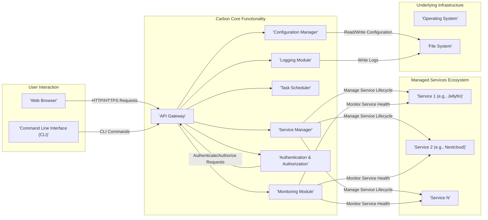
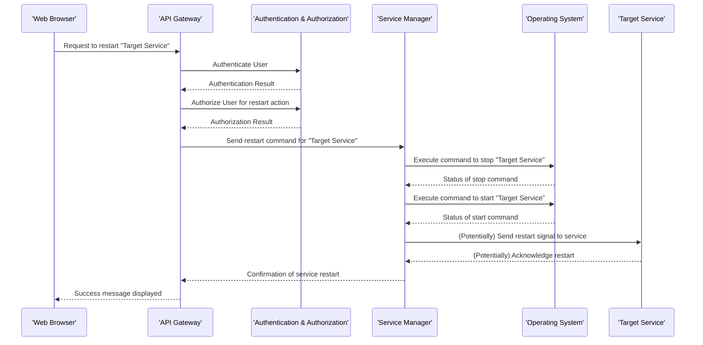
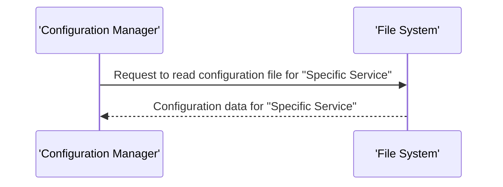
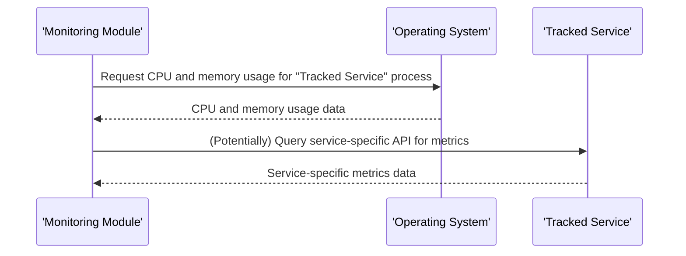

# Project Design Document: Carbon - Home Server Orchestration

**Version:** 1.1
**Date:** October 26, 2023
**Author:** AI Software Architect

## 1. Introduction

This document provides a comprehensive design specification for the Carbon project, a Python-based application designed to simplify the management and orchestration of various services on a home server. This document serves as the primary blueprint for the development effort and will be instrumental in subsequent threat modeling activities. It details the system's architecture, the responsibilities of its key components, the flow of data within the system, and crucial security considerations.

## 2. Goals and Objectives

*   **Primary Goal:** To empower users with a user-friendly and efficient platform for managing and orchestrating diverse services (e.g., media servers like Jellyfin, file storage solutions like Nextcloud, and home automation tools) on a single home server.
*   **Objectives:**
    *   **Simplified Deployment:** To streamline the process of deploying and configuring self-hosted applications, reducing the technical barrier for entry.
    *   **Centralized Management:** To offer a unified web interface for monitoring the status and controlling the operations of all managed services.
    *   **Effortless Configuration:** To enable users to easily configure and customize the settings of managed services through a consistent and intuitive interface.
    *   **Robust and Reliable Platform:** To provide a stable and dependable foundation for home server management, minimizing downtime and ensuring consistent performance.
    *   **Extensibility and Adaptability:** To design the system to be easily extensible, allowing for the integration of new services and customization options in the future.

## 3. System Architecture

Carbon employs a modular architecture, promoting separation of concerns, enhancing maintainability, and facilitating future development.

### 3.1. High-Level Architecture

### 3.2. Detailed Component Description

*   **Web Browser:** The primary graphical user interface (GUI) through which users interact with Carbon, providing a visual means to manage and monitor services.
*   **Command Line Interface (CLI):**  A text-based interface enabling users to interact with Carbon via terminal commands, facilitating automation, scripting, and advanced administrative tasks.
*   **API Gateway:**  The central entry point for all requests directed to the Carbon Core. It handles request routing, authentication of users, authorization of actions, and potentially implements rate limiting to protect the system.
*   **Service Manager:**  Responsible for the complete lifecycle management of the services managed by Carbon. This includes initiating (starting), terminating (stopping), restarting, and querying the operational status of individual services.
*   **Configuration Manager:**  Handles the reading, writing, validation, and management of configuration settings for both Carbon itself and the managed services. Configuration data is likely persisted in structured files such as YAML or JSON.
*   **Task Scheduler:**  Allows users to define and schedule recurring tasks related to service management, such as automated backups, periodic updates, and routine health checks.
*   **Monitoring Module:**  Collects, aggregates, and presents real-time and historical metrics concerning the managed services, including resource utilization (CPU, memory), uptime, and potentially service-specific performance indicators.
*   **Authentication & Authorization:**  Manages user accounts, securely authenticates users attempting to access Carbon, and enforces authorization policies to control access to specific functionalities based on user roles and permissions.
*   **Logging Module:**  Responsible for recording system events, errors, and informational messages generated by Carbon and potentially the managed services, aiding in debugging, auditing, and monitoring system behavior.
*   **Managed Services:** The individual applications (e.g., Jellyfin, Nextcloud) whose lifecycle and configuration are managed by Carbon.
*   **Operating System:** The underlying operating system (likely a Linux distribution) on which Carbon and the managed services are deployed and executed.
*   **File System:**  Used for persistent storage of Carbon's configuration, logs, and potentially data related to the managed services, depending on their configuration.

## 4. Data Flow

This section illustrates the flow of data within the system for several key operational scenarios.

### 4.1. User Initiating Service Restart via Web UI

### 4.2. Carbon Reading Configuration for a Managed Service

### 4.3. Monitoring Module Collecting Service Metrics

## 5. Key Components and Technologies

*   **Core Programming Language:** Python (as indicated by the project's GitHub repository).
*   **Web Framework (API Gateway & UI Backend):** Likely a Python web framework such as Flask or FastAPI for building the API and handling backend logic for the web interface.
*   **Frontend Framework (Web UI):**  Likely a JavaScript framework or library such as React, Vue.js, or Svelte for creating the interactive user interface in the web browser.
*   **Configuration Management Library:**  A Python library for parsing and managing configuration files, such as `PyYAML` for YAML or the built-in `json` module for JSON.
*   **Process Management Library:**  Python libraries for interacting with the operating system to manage the lifecycle of service processes, such as the `subprocess` module or libraries like `psutil` for more advanced process monitoring.
*   **Task Scheduling Library:**  A library for implementing scheduled tasks, such as `APScheduler` or potentially leveraging the operating system's task scheduler (e.g., `cron` through Python wrappers).
*   **Monitoring Libraries/Techniques:**  Could involve direct system calls for resource monitoring, integration with service-specific APIs for metrics, or the use of dedicated monitoring libraries.
*   **Authentication and Authorization Mechanisms:**  Potentially using libraries like `Flask-Login` or `Authlib` for session management and authentication, and role-based access control (RBAC) for authorization.
*   **Logging Library:**  The standard Python `logging` module for structured logging of events and errors.
*   **CLI Framework:**  A library for building command-line interfaces, such as Python's `argparse` or `Click`.

## 6. Security Considerations (Pre-Threat Modeling)

This section outlines potential security vulnerabilities and threats that will be thoroughly analyzed during the subsequent threat modeling process.

*   **Authentication and Authorization Weaknesses:**
    *   Use of weak or default credentials for user accounts.
    *   Insufficient authorization checks, potentially allowing unauthorized users to perform sensitive actions.
    *   Vulnerabilities in the authentication mechanism itself, such as susceptibility to brute-force attacks or session hijacking.
*   **API Security Vulnerabilities:**
    *   Lack of proper input validation on API endpoints, leading to injection attacks (e.g., command injection, SQL injection if a database is used later).
    *   Exposure of sensitive information through API responses without proper filtering or sanitization.
    *   Cross-Site Scripting (XSS) vulnerabilities in the web interface, allowing malicious scripts to be injected and executed in users' browsers.
    *   Cross-Site Request Forgery (CSRF) vulnerabilities, enabling attackers to perform actions on behalf of authenticated users without their knowledge.
*   **Configuration Management Risks:**
    *   Storing sensitive information (e.g., passwords, API keys for managed services) in plaintext within configuration files.
    *   Insecure file permissions on configuration files, allowing unauthorized access or modification.
*   **Service Management Security Concerns:**
    *   Vulnerabilities in the way Carbon interacts with the operating system to manage services, potentially leading to privilege escalation if not handled carefully.
    *   Insecure communication channels with managed services, potentially exposing sensitive data exchanged between Carbon and the managed applications.
*   **Monitoring Data Exposure:**
    *   Exposure of sensitive monitoring data (e.g., application logs, performance metrics) to unauthorized users.
*   **Dependency Vulnerabilities:**
    *   Use of third-party libraries and dependencies with known security vulnerabilities that could be exploited.
*   **Deployment Security Misconfigurations:**
    *   Deploying Carbon with excessive privileges, increasing the impact of potential security breaches.
    *   Exposing the Carbon web interface to the public internet without implementing appropriate security measures (e.g., HTTPS, firewalls).
*   **Data Storage Security:**
    *   Insecure storage of Carbon's internal data, such as user credentials or session tokens, if a database or persistent storage is used.
*   **Logging Security:**
    *   Logging sensitive information that could be exploited if logs are compromised.
    *   Insufficient logging, making it difficult to detect and investigate security incidents.

## 7. Deployment Considerations

*   **Target Environment:** Primarily designed for deployment on a personal home server, typically running a Linux-based operating system (e.g., Ubuntu, Debian, Fedora).
*   **Installation Method:**  Likely to be installable via `pip` (the Python package installer) from the Python Package Index (PyPI) or potentially through containerization technologies like Docker.
*   **Configuration Process:**  Initial configuration will likely involve editing configuration files (e.g., `config.yaml`, `config.json`) to define managed services and other settings.
*   **Dependency Management:**  Users will need to ensure that all necessary Python dependencies are installed, potentially managed through a `requirements.txt` file.
*   **Resource Requirements:**  The system's resource requirements (CPU, memory, disk space) will vary depending on the number and resource intensity of the managed services.
*   **Security Best Practices for Deployment:**
    *   Running Carbon under a non-privileged user account to minimize the impact of potential security breaches.
    *   Securing access to the Carbon web interface using HTTPS and strong passwords.
    *   Configuring a firewall to restrict access to the Carbon server and managed services.
    *   Keeping the operating system and all software dependencies up to date with the latest security patches.

## 8. Future Considerations

*   **Expanded Service Support:**  Adding support for a wider range of service types and configuration options through a plugin or modular architecture.
*   **Advanced Monitoring and Alerting:**  Implementing more sophisticated monitoring capabilities with customizable alerts for service failures or performance issues.
*   **Integration with Home Automation Platforms:**  Exploring integration with popular home automation platforms to enable more complex automation scenarios.
*   **Backup and Restore Functionality:**  Developing built-in backup and restore capabilities for managed services and Carbon's configuration.
*   **Enhanced User Interface:**  Continuously improving the user interface with a focus on usability, accessibility, and visual appeal.
*   **Plugin Architecture for Extensibility:**  Developing a robust plugin architecture to allow users and developers to easily extend Carbon's functionality.
*   **Support for Containerized Deployments:**  Improving support for managing services deployed within containers (e.g., Docker containers).

This revised design document provides a more detailed and comprehensive overview of the Carbon project. It will serve as a valuable resource for the development team and provide a solid foundation for conducting a thorough threat model to identify and mitigate potential security risks effectively.
