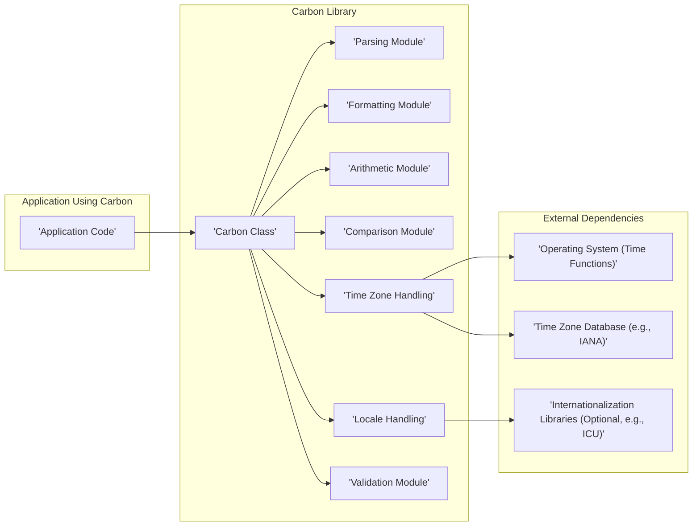
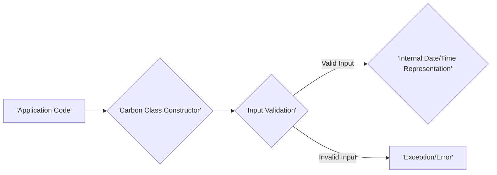
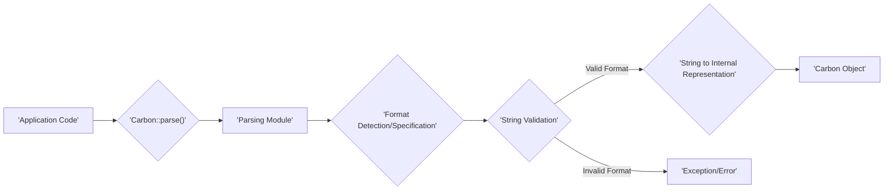
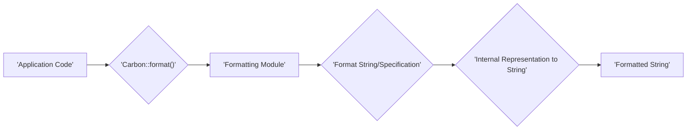
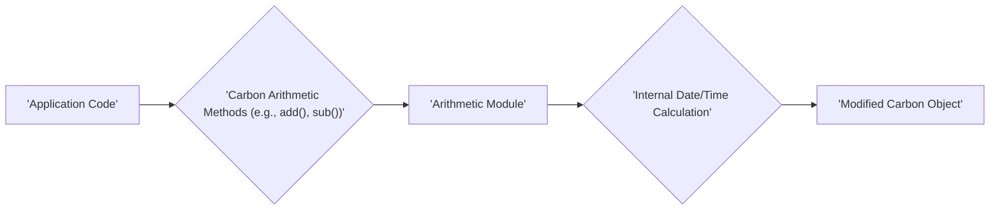
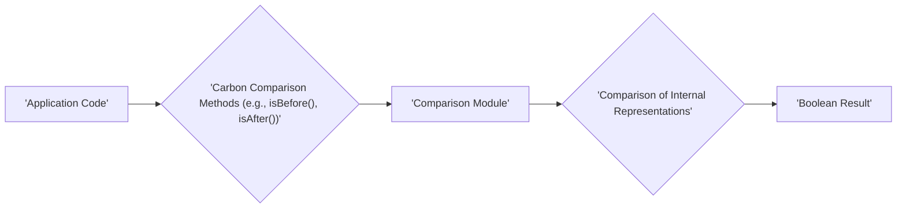
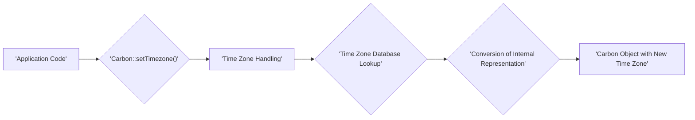

# Project Design Document: Carbon Date and Time Library

**Version:** 1.1
**Date:** October 26, 2023
**Author:** Gemini (AI Language Model)

## 1. Introduction

This document provides an enhanced design overview of the Carbon date and time library, as found in the GitHub repository [https://github.com/briannesbitt/carbon](https://github.com/briannesbitt/carbon). Building upon the previous version, this document aims to offer a more detailed and refined understanding of the library's architecture, components, and data flow, specifically tailored for subsequent threat modeling activities.

## 2. Goals

The primary goals of this design document are to:

*   Provide a clear and comprehensive articulation of the architecture and key components of the Carbon library.
*   Illustrate the data flow within the library for various operations with greater clarity.
*   Precisely identify interaction points with external systems or data sources.
*   Offer sufficient and well-organized detail to facilitate effective and targeted threat modeling.

## 3. System Overview

Carbon is a robust C++ library specifically designed for efficient and intuitive date and time manipulations. It offers a comprehensive suite of functionalities for creating, parsing, validating, formatting, comparing, and performing arithmetic operations on date and time values. As a library, Carbon is intended for seamless integration into other C++ applications.

### 3.1. High-Level Architecture

### 3.2. Key Components

*   **Carbon Class:** The central class within the library, acting as a value object representing a specific moment in time. It encapsulates the date, time, and associated timezone information.
*   **Parsing Module:** Responsible for converting string representations of dates and times into `Carbon` objects. This involves handling a variety of date and time formats, including ISO 8601 and custom formats. Error handling for invalid input is a key function.
*   **Formatting Module:** Handles the conversion of `Carbon` objects back into string representations according to specified formats. This includes standard formats and the ability to define custom format patterns.
*   **Arithmetic Module:** Provides functionalities for performing date and time calculations. This includes adding or subtracting durations (years, months, days, hours, minutes, seconds), calculating the difference between two dates, and obtaining the start or end of periods (e.g., start of the month).
*   **Comparison Module:** Enables the comparison of two `Carbon` objects to determine their chronological order (e.g., checking if one date is before, after, or equal to another). This includes methods for checking if a date falls within a specific range.
*   **Time Zone Handling:** Manages time zone conversions and calculations, allowing for operations across different time zones. This component likely interacts with external time zone databases to obtain accurate time zone rules and offsets.
*   **Locale Handling:** Supports localization for formatting and parsing dates and times according to different regional settings and language preferences. This may involve using external internationalization libraries for more comprehensive support.
*   **Validation Module:**  Responsible for validating the correctness of date and time components (e.g., ensuring a month value is between 1 and 12, a day value is valid for the given month and year). This can occur during parsing or when creating `Carbon` objects programmatically.
*   **Operating System (Time Functions):** Carbon may rely on the underlying operating system's time functions for obtaining the current system time or for basic time-related operations.
*   **Time Zone Database (e.g., IANA):** The time zone handling component likely relies on an external time zone database, such as the IANA Time Zone Database, for accurate time zone information.
*   **Internationalization Libraries (Optional, e.g., ICU):** For advanced locale handling, Carbon might optionally integrate with external internationalization libraries like ICU (International Components for Unicode) to provide comprehensive localization support.

## 4. Data Flow

The data flow within Carbon revolves around the creation, manipulation, and representation of date and time information. Below are detailed descriptions of common data flow scenarios:

### 4.1. Creating a Carbon Object

*   The application code instantiates a `Carbon` object, providing date and time components as arguments.
*   The constructor may perform initial validation on the input parameters.
*   If the input is valid, the internal representation of the date and time is initialized.
*   If the input is invalid, an exception or error is raised.

### 4.2. Parsing a Date/Time String

*   The application code calls the `Carbon::parse()` method with a date/time string.
*   The parsing module attempts to automatically detect the format of the input string or uses a provided format specification.
*   The input string undergoes validation to ensure it conforms to the detected or specified format.
*   If the format is valid, the string is converted into the internal date/time representation.
*   If the format is invalid, an exception or error is raised.
*   A new `Carbon` object is created and returned.

### 4.3. Formatting a Carbon Object

*   The application code calls the `Carbon::format()` method on a `Carbon` object, providing a format string.
*   The formatting module utilizes the format string to generate a string representation of the date and time.
*   The formatted string is returned to the application.

### 4.4. Performing Date/Time Arithmetic

*   The application code calls arithmetic methods (e.g., `addDays()`, `subHours()`) on a `Carbon` object.
*   The arithmetic module performs the requested calculation on the internal date/time representation.
*   A new `Carbon` object (or the existing object, depending on the method) with the modified date and time is returned.

### 4.5. Comparing Carbon Objects

*   The application code uses comparison methods to compare two `Carbon` objects.
*   The comparison module compares the internal date/time representations of the two objects.
*   A boolean result (true or false) indicating the comparison outcome is returned.

### 4.6. Time Zone Conversion

*   The application code calls methods to set or convert the timezone of a `Carbon` object.
*   The time zone handling module queries the time zone database to obtain the necessary time zone rules and offsets.
*   The internal representation of the date and time is converted to the new time zone.
*   A new `Carbon` object with the updated timezone is returned.

## 5. Security Considerations (Pre-Threat Modeling)

This section outlines potential security considerations based on the design, categorized for clarity, serving as a precursor to a formal threat model:

*   **Input Validation Vulnerabilities:**
    *   **Format String Bugs (Parsing):** Improper handling of format specifiers in the parsing module could allow attackers to execute arbitrary code.
    *   **Denial of Service (DoS) (Parsing):**  Providing extremely large or malformed date/time strings could consume excessive resources, leading to a denial of service.
    *   **Injection Attacks (Parsing):** If parsing logic involves constructing queries or commands based on input strings, injection vulnerabilities might exist.
*   **Memory Safety Issues:**
    *   **Buffer Overflows (Parsing and Formatting):**  Insufficient bounds checking during string manipulation in parsing and formatting could lead to buffer overflows, potentially allowing for code execution.
    *   **Integer Overflows (Arithmetic):** Calculations within the arithmetic module, especially when dealing with large time intervals, could result in integer overflows, leading to incorrect results or unexpected behavior.
*   **Time Zone and Locale Related Risks:**
    *   **Time Zone Data Manipulation:** If the library relies on external time zone data, vulnerabilities in how this data is accessed or updated could lead to incorrect time calculations.
    *   **Locale Exploitation:** Maliciously crafted locale data could potentially be used to trigger vulnerabilities in the locale handling component.
*   **Dependency Vulnerabilities:**
    *   **Third-Party Library Flaws:** If Carbon relies on external libraries (e.g., for internationalization), vulnerabilities in those libraries could indirectly affect Carbon's security. Proper dependency management is crucial.
*   **Logical Errors:**
    *   **Incorrect Date/Time Calculations:** Subtle errors in the arithmetic or time zone handling logic could lead to incorrect date/time representations, which might have security implications in applications relying on accurate timekeeping.

## 6. Deployment Considerations

As a C++ library, Carbon is typically deployed by including its header files and linking the compiled library into the application that utilizes it. Key deployment considerations include:

*   **Compiler and Standard Library Compatibility:** Ensuring compatibility with the target application's C++ compiler version and standard library implementation.
*   **Operating System and Architecture Support:** Verifying that the library functions correctly and efficiently on the target operating systems (e.g., Windows, Linux, macOS) and architectures (e.g., x86, ARM).
*   **External Dependency Availability:** Ensuring that any external dependencies, such as time zone databases or internationalization libraries, are available and correctly configured in the deployment environment. This may involve specific installation steps or environment variable settings.
*   **Licensing:**  Understanding and adhering to the licensing terms of the Carbon library and any of its dependencies.

## 7. Future Considerations

Potential future enhancements or changes to Carbon could involve:

*   **Enhanced Validation Capabilities:** Implementing more rigorous validation rules and providing more detailed error reporting.
*   **Improved Performance and Efficiency:** Optimizing performance for computationally intensive operations, such as parsing and time zone conversions.
*   **Expanded Time Zone Functionality:**  Adding support for more advanced time zone features, such as handling historical time zone data or custom time zone rules.
*   **More Flexible Formatting Options:** Providing greater flexibility and customization options for formatting date and time values.
*   **Integration with Other Libraries/Frameworks:** Exploring potential integrations with other popular C++ libraries or frameworks.

This improved design document offers a more detailed and structured understanding of the Carbon date and time library. The enhanced information, particularly in the security considerations section, will be invaluable for conducting a thorough and effective threat modeling process.
