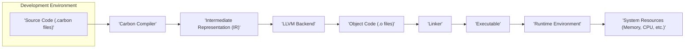

# Project Design Document: Carbon Programming Language

**Project Link:** https://github.com/briannesbitt/carbon

**Document Version:** 1.1
**Date:** October 26, 2023
**Author:** AI Software Architect

## 1. Introduction

This document provides an enhanced and more detailed design overview of the Carbon programming language project, as found on the provided GitHub repository. This document is intended to serve as a robust foundation for subsequent threat modeling activities. It elaborates on the key components, architecture, and data flow of the system, providing a deeper understanding for security analysis.

### 1.1. Project Overview

The Carbon project aims to develop a new general-purpose programming language. Based on the repository contents, it appears to be in an early stage of development, with a focus on establishing the fundamental language features, the core compiler implementation, and the necessary runtime environment. A significant aspect of the project is its utilization of LLVM as a powerful and mature backend for code generation, enabling cross-platform compatibility and optimization capabilities.

### 1.2. Goals of this Document

*   Provide a clear, concise, and more detailed description of the Carbon project's architecture.
*   Identify the key components and their interactions with greater specificity.
*   Outline the data flow within the system with more granular steps.
*   Serve as a comprehensive basis for identifying potential security vulnerabilities during threat modeling, offering more specific areas of focus.

### 1.3. Scope

This document focuses on the core technical aspects of the Carbon language implementation as observed in the GitHub repository. It provides a deeper dive into:

*   The compiler and its distinct stages, including potential sub-components.
*   The runtime environment, detailing its likely responsibilities.
*   Key dependencies and external libraries, emphasizing their role.
*   The build process, outlining the steps involved in creating the executable.

This document still does not cover:

*   Specific language syntax or semantics in exhaustive detail.
*   Future planned features that are not yet demonstrably implemented in the repository.
*   Community aspects, project management methodologies, or contribution guidelines.

## 2. System Architecture

The following diagram illustrates the high-level architecture of the Carbon project with more descriptive node names:

### 2.1. Component Descriptions

*   **Source Code (.carbon files):** These are the plain text files written by developers, containing the program logic expressed in the Carbon programming language. These files are the initial input to the compilation process.
*   **Carbon Compiler:** This is the central component responsible for the complex task of translating human-readable Carbon source code into machine-executable instructions. It likely comprises several distinct phases:
    *   **Lexer/Scanner:** This initial phase reads the source code character by character and groups them into meaningful units called tokens (e.g., keywords, identifiers, operators).
    *   **Parser:** The parser takes the stream of tokens from the lexer and constructs a hierarchical representation of the program's structure, typically an Abstract Syntax Tree (AST). This tree reflects the grammatical rules of the Carbon language.
    *   **Semantic Analyzer:** This phase traverses the AST to perform checks that go beyond syntax, ensuring the program is meaningful and adheres to the language's rules regarding types, variable declarations, and scope.
    *   **Intermediate Representation (IR) Generator:**  The semantic analyzer's output is then transformed into a lower-level, platform-independent representation known as Intermediate Representation (IR). This IR simplifies subsequent optimization and code generation.
    *   **Optimizer (Potentially):**  An optional but highly beneficial phase that analyzes the IR to identify and apply optimizations, aiming to improve the performance (speed and memory usage) of the generated code.
*   **Intermediate Representation (IR):** This is a crucial intermediate stage in the compilation process. It's a platform-agnostic representation of the code, designed to be easily processed by the LLVM backend. The specific format of the IR will depend on the choices made in the compiler's design.
*   **LLVM Backend:** The Low-Level Virtual Machine (LLVM) is a powerful and widely used compiler infrastructure project. The Carbon compiler leverages LLVM's capabilities to take the generated IR and perform target-specific code generation. This involves:
    *   **Machine Code Generation:** Translating the IR into the assembly language of the target architecture (e.g., x86, ARM).
    *   **Optimization:** LLVM performs further optimizations tailored to the target architecture.
*   **Object Code (.o files):** The output of the LLVM backend is object code. These files contain the machine code for individual compilation units (e.g., individual source files). They are not yet directly executable.
*   **Linker:** The linker is a system utility that combines multiple object code files, along with necessary libraries (both Carbon's standard library and system libraries), into a single executable file. It resolves references between different parts of the code.
*   **Executable:** This is the final output of the compilation and linking process. It's a file containing machine code that can be directly executed by the operating system.
*   **Runtime Environment:** This component provides essential services and libraries required for the execution of a compiled Carbon program. Its responsibilities may include:
    *   **Memory Management:** Allocating and deallocating memory for the program's data. This might involve manual memory management or automatic garbage collection.
    *   **Standard Library:** Providing implementations of common functions and data structures that Carbon programs can use.
    *   **Error Handling:** Mechanisms for dealing with runtime errors and exceptions.
    *   **Interaction with the Operating System:** Providing an interface for the program to interact with the underlying operating system (e.g., file I/O, networking).
*   **System Resources (Memory, CPU, etc.):** These are the fundamental resources of the computer system that the running executable utilizes, including memory for storing data, the CPU for executing instructions, and other hardware components.

### 2.2. Data Flow

The detailed data flow within the Carbon project encompasses the following steps:

1. **Source Code Input:** A developer creates and saves Carbon code in files with the `.carbon` extension.
2. **Lexing:** The Carbon compiler's lexer reads the source code and breaks it down into a stream of tokens.
3. **Parsing:** The parser consumes the tokens and constructs an Abstract Syntax Tree (AST), representing the program's grammatical structure.
4. **Semantic Analysis:** The semantic analyzer examines the AST, performing type checking, scope resolution, and other semantic validations to ensure the program is meaningful.
5. **IR Generation:** The compiler translates the semantically correct AST into an Intermediate Representation (IR).
6. **LLVM Processing and Optimization:** The generated IR is passed to the LLVM backend, where it undergoes target-independent and target-dependent optimizations.
7. **Machine Code Generation:** LLVM translates the optimized IR into machine code specific to the target architecture.
8. **Object Code Output:** The LLVM backend produces object code files (`.o` files).
9. **Linking:** The system's linker combines the generated object code files with necessary libraries (Carbon's runtime and system libraries) to resolve symbols and create a final executable.
10. **Execution:** The operating system loads and executes the generated executable.
11. **Runtime Interaction:** During execution, the program interacts with the Carbon runtime environment for services like memory management and access to standard library functions, and directly with system resources.

## 3. Key Technologies and Dependencies

The Carbon project's functionality relies heavily on the following key technologies and dependencies:

*   **LLVM:** This is a fundamental dependency, providing the infrastructure for code generation, optimization, and target architecture support. Its version and specific components used will be important for security considerations.
*   **C++ (Likely):**  It is highly probable that the Carbon compiler itself is implemented using C++, a common choice for compiler development due to its performance and control over system resources. The specific C++ standard used might be relevant.
*   **Build System (e.g., CMake, Make, Bazel):** A build system is essential for managing the compilation process of the compiler and runtime. The specific build system used will dictate how the project is built and could introduce its own set of security considerations.
*   **Standard Libraries (Potentially):** The Carbon runtime environment will likely depend on standard libraries provided by the operating system (e.g., glibc on Linux, system libraries on Windows) for basic functionalities.

## 4. Security Considerations (More Specific)

Building upon the initial thoughts, here are more specific security considerations for the Carbon project:

*   **Compiler Vulnerabilities:**
    *   **Buffer Overflows/Underflows:**  Bugs in the compiler's code that could allow writing beyond allocated memory, potentially leading to crashes or arbitrary code execution.
    *   **Integer Overflows:**  Errors in arithmetic operations within the compiler that could lead to unexpected behavior or vulnerabilities.
    *   **Incorrect Code Generation:**  Flaws in the compiler's logic that result in the generation of insecure machine code (e.g., missing bounds checks).
    *   **Type Confusion:**  Errors in the compiler's type system that could lead to incorrect assumptions about data types, potentially exploitable.
*   **Input Validation in Compiler:**
    *   **Denial of Service (DoS):**  Maliciously crafted source code designed to crash the compiler or consume excessive resources.
    *   **Exploitation of Parser Vulnerabilities:**  Input that exploits weaknesses in the parser to cause unexpected behavior or potentially execute arbitrary code during compilation.
*   **Dependency Management:**
    *   **Vulnerabilities in LLVM:**  Security flaws in the specific version of LLVM used by Carbon could directly impact the security of compiled Carbon programs.
    *   **Supply Chain Attacks:**  Compromised dependencies introduced through the build system could inject malicious code.
*   **Build Process Security:**
    *   **Compromised Build Environment:** If the environment used to build the compiler is compromised, malicious code could be injected into the compiler binary.
    *   **Insecure Build Scripts:**  Vulnerabilities in the build scripts themselves could be exploited.
*   **Runtime Environment Security:**
    *   **Memory Safety Issues:**  If the runtime environment doesn't enforce memory safety, Carbon programs could be vulnerable to buffer overflows, use-after-free errors, and other memory-related exploits.
    *   **Lack of Sandboxing:**  If the runtime environment doesn't provide adequate sandboxing, malicious Carbon programs could potentially access or damage system resources.
    *   **Vulnerabilities in Standard Library:**  Security flaws in the implementation of standard library functions could be exploited.
*   **Code Injection (Indirect):**
    *   **Exploiting Compiler Bugs:**  Crafting Carbon code that triggers a compiler bug, leading to the generation of code that allows for arbitrary code execution at runtime.
    *   **Exploiting Runtime Vulnerabilities:**  Finding vulnerabilities in the runtime environment that allow for the injection and execution of malicious code.

## 5. Build Process Overview (Detailed)

The build process for the Carbon project likely involves a more detailed sequence of steps:

1. **Prerequisites Check:** Verifying that necessary tools and libraries (e.g., C++ compiler, CMake, LLVM development headers) are installed on the build system.
2. **Configuration:** Using the chosen build system (e.g., `cmake`), the build environment is configured. This involves specifying the target platform, build type (debug or release), and paths to dependencies like LLVM.
3. **Compiler Source Code Compilation:** The C++ source code of the Carbon compiler is compiled using a C++ compiler (e.g., `g++`, `clang++`). This step may involve compiling multiple source files and creating object files for the compiler.
4. **Runtime Library Compilation (if separate):** If the runtime environment is implemented as a separate library, its source code is compiled.
5. **Linking of Compiler:** The object files of the Carbon compiler are linked together to create the final compiler executable.
6. **Linking of Runtime Library:** The object files of the runtime library are linked to create the runtime library (e.g., a shared library or static library).
7. **Testing:** Unit tests and integration tests are executed to verify the correctness of the newly built compiler and runtime. This is a crucial step for ensuring stability and identifying potential bugs.
8. **Packaging (Optional):** The compiled compiler and runtime, along with any necessary support files, might be packaged into an archive or installer for distribution.
9. **Installation (Optional):** The compiled binaries and libraries can be installed to standard system directories or a user-specified location.

## 6. Future Considerations

As the Carbon project progresses, the design will undoubtedly expand to incorporate:

*   **Comprehensive Standard Library:**  Development of a rich set of built-in functions and data structures to facilitate common programming tasks.
*   **Memory Management Strategy:**  Implementation of a specific memory management approach, which could involve garbage collection, manual memory management with ownership and borrowing, or a combination of techniques.
*   **Concurrency and Parallelism Features:**  Integration of language constructs and runtime support for concurrent and parallel programming, enabling efficient utilization of multi-core processors.
*   **Foreign Function Interface (FFI):**  Design and implementation of mechanisms that allow Carbon code to interact with code written in other programming languages (e.g., C, C++), enabling interoperability with existing libraries and systems.
*   **Module System:**  A robust module system for organizing code into reusable units and managing dependencies.

## 7. Conclusion

This enhanced design document provides a more detailed and nuanced understanding of the Carbon programming language project's architecture, components, and data flow. By elaborating on the various stages of compilation, the responsibilities of the runtime environment, and the key technologies involved, this document serves as a more robust foundation for conducting thorough threat modeling activities. The expanded security considerations offer specific areas of focus for identifying and mitigating potential vulnerabilities within the Carbon language and its associated ecosystem.