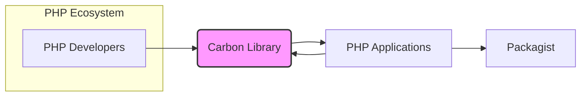
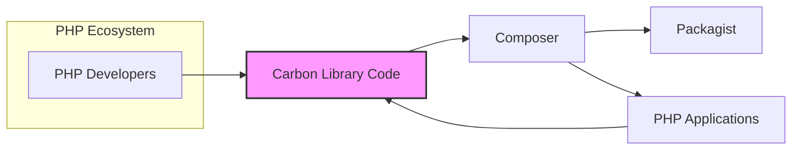
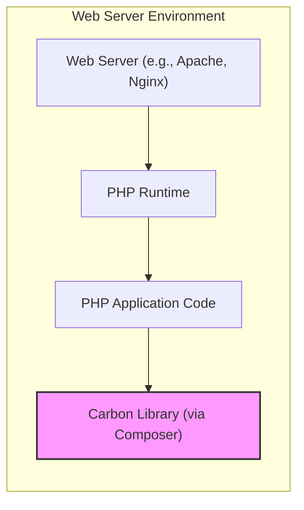
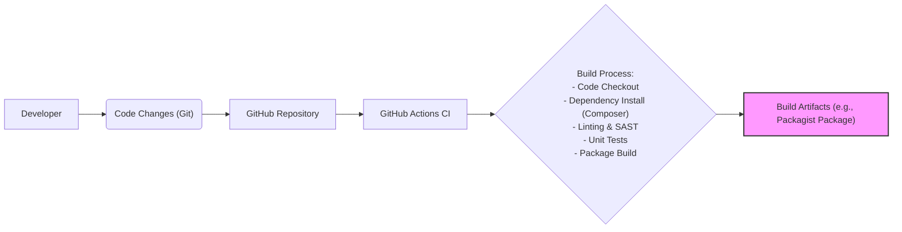

# BUSINESS POSTURE

This project, the 'carbon' PHP library, aims to provide a simple, extensible and fluent API for working with dates and times in PHP.

- Business Priorities:
  - Improve developer productivity by providing a more intuitive and feature-rich date and time manipulation library compared to PHP's built-in functions.
  - Enhance code readability and maintainability in PHP projects that require date and time operations.
  - Ensure the library is reliable, accurate, and performs well across different PHP environments.
  - Foster a community around the library to encourage contributions, bug fixes, and feature enhancements.

- Business Goals:
  - Become the de-facto standard date and time library for PHP development.
  - Increase adoption of the library within the PHP ecosystem.
  - Maintain a high level of code quality and stability.
  - Provide comprehensive documentation and examples to facilitate ease of use.

- Business Risks:
  - Bugs or inaccuracies in date and time calculations could lead to critical errors in applications using the library, impacting data integrity and business logic.
  - Performance issues could negatively affect the performance of applications relying on the library.
  - Security vulnerabilities in the library could be exploited by attackers if not addressed promptly.
  - Lack of community support or maintainability could lead to stagnation and eventual obsolescence of the library.

# SECURITY POSTURE

- Existing Security Controls:
  - security control: GitHub repository with issue tracking and pull request workflow (Implemented: GitHub).
  - security control: Open source project with community review and contributions (Implemented: GitHub).
  - security control: Unit tests to ensure code correctness (Implemented: Project codebase).
  - accepted risk: Reliance on community contributions for security vulnerability identification and patching.
  - accepted risk: Potential for vulnerabilities to be introduced during development.

- Recommended Security Controls:
  - security control: Implement automated Static Application Security Testing (SAST) in the CI/CD pipeline to identify potential vulnerabilities in the code.
  - security control: Integrate Dependency Check tools to identify known vulnerabilities in third-party dependencies.
  - security control: Establish a clear process for reporting and handling security vulnerabilities, including a security policy and contact information.
  - security control: Conduct regular security code reviews, especially for critical components and contributions from external developers.
  - security control: Implement automated security scanning of published releases (e.g., using platforms like Packagist).

- Security Requirements:
  - Authentication: Not applicable as this is a library and does not handle user authentication directly. Applications using this library will handle authentication.
  - Authorization: Not applicable as this is a library and does not handle user authorization directly. Applications using this library will handle authorization.
  - Input Validation:
    - The library must perform robust input validation on all date and time strings, formats, and parameters to prevent unexpected behavior or vulnerabilities due to malformed input.
    - Input validation should include checks for valid date ranges, time formats, and timezone identifiers.
    - Error handling for invalid input should be secure and prevent information leakage.
  - Cryptography:
    - Cryptography is not a primary requirement for a date and time library. However, if the library ever needs to handle sensitive time-related data (e.g., timestamps for security events), it should use secure and well-vetted cryptographic libraries and practices. Currently, cryptography is not explicitly used.

# DESIGN

## C4 CONTEXT

- Context Diagram Elements:
  - - Name: PHP Developers
    - Type: Person
    - Description: Developers who use the Carbon library in their PHP projects.
    - Responsibilities: Utilize the Carbon library to manage dates and times in their applications. Report issues and contribute to the library.
    - Security controls: Secure development practices when using the library in their applications.

  - - Name: Carbon Library
    - Type: Software System
    - Description: A PHP library providing a fluent and user-friendly API for date and time manipulation.
    - Responsibilities: Provide accurate and reliable date and time functionality. Be secure and free from vulnerabilities. Be easy to use and integrate into PHP projects.
    - Security controls: Input validation, secure coding practices, vulnerability scanning, dependency management.

  - - Name: PHP Applications
    - Type: Software System
    - Description: PHP applications that integrate and use the Carbon library for date and time operations.
    - Responsibilities: Utilize the Carbon library for date and time management within their application logic. Handle user authentication and authorization. Implement application-level security controls.
    - Security controls: Application-level security controls, secure usage of the Carbon library, input validation at the application level.

  - - Name: Packagist
    - Type: Software System
    - Description: The main package repository for PHP, used to distribute and install the Carbon library via Composer.
    - Responsibilities: Host and distribute the Carbon library packages. Ensure package integrity and availability.
    - Security controls: Package integrity checks, vulnerability scanning of hosted packages, access controls for package publishing.

## C4 CONTAINER

- Container Diagram Elements:
  - - Name: PHP Developers
    - Type: Person
    - Description: Developers who use the Carbon library in their PHP projects.
    - Responsibilities: Utilize the Carbon library to manage dates and times in their applications. Report issues and contribute to the library.
    - Security controls: Secure development practices when using the library in their applications.

  - - Name: Carbon Library Code
    - Type: Container (Code Repository)
    - Description: The source code of the Carbon library, hosted on GitHub. Includes PHP code, tests, documentation, and build scripts.
    - Responsibilities: Store the source code of the Carbon library. Manage code versions and releases. Facilitate collaboration and contributions.
    - Security controls: Access control to the repository, code review process, branch protection, vulnerability scanning of code.

  - - Name: PHP Applications
    - Type: Software System
    - Description: PHP applications that integrate and use the Carbon library for date and time operations.
    - Responsibilities: Utilize the Carbon library for date and time management within their application logic. Handle user authentication and authorization. Implement application-level security controls.
    - Security controls: Application-level security controls, secure usage of the Carbon library, input validation at the application level.

  - - Name: Packagist
    - Type: Software System
    - Description: The main package repository for PHP, used to distribute and install the Carbon library via Composer.
    - Responsibilities: Host and distribute the Carbon library packages. Ensure package integrity and availability.
    - Security controls: Package integrity checks, vulnerability scanning of hosted packages, access controls for package publishing.

  - - Name: Composer
    - Type: Tool/Package Manager
    - Description: PHP dependency manager used by developers to install and manage PHP libraries, including Carbon.
    - Responsibilities: Download and install the Carbon library and its dependencies into PHP projects. Manage project dependencies.
    - Security controls: Secure package download and installation, integrity checks of downloaded packages, dependency vulnerability scanning.

## DEPLOYMENT

For a PHP library, the deployment is within the context of the PHP applications that use it.  There isn't a separate deployment infrastructure for the library itself.  The library is distributed via Packagist and installed using Composer into PHP applications.

Deployment Diagram (Example - PHP Application using Carbon deployed on a Web Server):

- Deployment Diagram Elements:
  - - Name: Web Server (e.g., Apache, Nginx)
    - Type: Infrastructure - Web Server
    - Description: The web server that hosts the PHP application. Handles HTTP requests and serves the application.
    - Responsibilities: Serve the PHP application. Handle web traffic. Provide a runtime environment for PHP.
    - Security controls: Web server security configurations, access controls, DDoS protection, TLS/SSL encryption.

  - - Name: PHP Runtime
    - Type: Software - Runtime Environment
    - Description: The PHP interpreter that executes the PHP application code.
    - Responsibilities: Execute PHP code. Provide necessary PHP extensions and libraries.
    - Security controls: PHP runtime security configurations, security updates, enabled security extensions.

  - - Name: PHP Application Code
    - Type: Software - Application
    - Description: The custom PHP application code that utilizes the Carbon library.
    - Responsibilities: Implement application logic, including date and time operations using Carbon. Handle user requests. Manage data.
    - Security controls: Application-level security controls, secure coding practices, input validation, authorization, authentication.

  - - Name: Carbon Library (via Composer)
    - Type: Software - Library
    - Description: The Carbon library installed as a dependency of the PHP application using Composer.
    - Responsibilities: Provide date and time functionality to the PHP application.
    - Security controls: Inherited security from the library itself (input validation, secure coding). Dependency management via Composer.

## BUILD

- Build Process Elements:
  - - Name: Developer
    - Type: Person
    - Description: A developer contributing to the Carbon library.
    - Responsibilities: Write code, fix bugs, implement features, write tests, submit pull requests.
    - Security controls: Secure development environment, code review participation.

  - - Name: Code Changes (Git)
    - Type: Data - Version Control
    - Description: Code changes committed and pushed to the GitHub repository using Git.
    - Responsibilities: Track code changes, manage versions, facilitate collaboration.
    - Security controls: Git access controls, commit signing.

  - - Name: GitHub Repository
    - Type: Platform - Version Control Hosting
    - Description: GitHub repository hosting the Carbon library source code.
    - Responsibilities: Host the code repository, manage branches and pull requests, trigger CI/CD pipelines.
    - Security controls: Access controls, branch protection, audit logs, vulnerability scanning of repository.

  - - Name: GitHub Actions CI
    - Type: Platform - CI/CD
    - Description: GitHub Actions workflows configured for automated build, test, and deployment processes.
    - Responsibilities: Automate build process, run tests, perform security checks, publish releases.
    - Security controls: Secure workflow definitions, secret management, access controls to CI/CD pipelines.

  - - Name: Build Process
    - Type: Process - Automation
    - Description: Automated steps in the CI/CD pipeline to build, test, and package the Carbon library. Includes code checkout, dependency installation (Composer), linting, SAST, unit tests, and package building.
    - Responsibilities: Compile code, run tests, perform security checks, create release artifacts.
    - Security controls: SAST tools, dependency vulnerability scanning, secure build environment, code signing of artifacts.

  - - Name: Build Artifacts (e.g., Packagist Package)
    - Type: Data - Release Artifact
    - Description: The packaged and built version of the Carbon library, ready for distribution (e.g., a package for Packagist).
    - Responsibilities: Distributable package of the Carbon library.
    - Security controls: Code signing, integrity checks, secure storage and distribution.

# RISK ASSESSMENT

- Critical Business Processes:
  - Accurate date and time calculations in applications using the Carbon library. Incorrect calculations can lead to errors in scheduling, data processing, financial transactions, logging, and other critical application functionalities.
  - Availability and integrity of the Carbon library package on Packagist. If the package is unavailable or compromised, it can disrupt PHP development workflows and potentially introduce malicious code into applications.

- Data to Protect and Sensitivity:
  - Source code of the Carbon library: Confidentiality and integrity are important to prevent unauthorized modifications or exposure of potential vulnerabilities.
  - Packagist package: Integrity and availability are crucial to ensure developers can securely and reliably install the library.
  - Date and time data processed by applications using Carbon: Sensitivity depends on the application context. In some cases, date and time data can be personally identifiable information (PII) or related to sensitive business operations. The library itself should handle date and time data securely and prevent unintended information leakage.

# QUESTIONS & ASSUMPTIONS

- Questions:
  - What is the intended deployment environment for applications using the Carbon library? (Assumption: Broad range of PHP environments, including web servers, CLI applications, etc.)
  - Are there any specific compliance requirements for applications using the Carbon library? (Assumption: General best practices for software libraries apply, no specific compliance mentioned.)
  - Is there a dedicated security team or individual responsible for the security of the Carbon library project? (Assumption: Security is primarily handled by the maintainers and community contributors.)
  - What is the process for handling security vulnerability reports for the Carbon library? (Assumption: Standard GitHub issue reporting and pull request process, potentially needs a more formalized security policy.)

- Assumptions:
  - BUSINESS POSTURE: The primary business goal is to provide a high-quality, widely adopted date and time library for PHP developers. Reliability and ease of use are key priorities.
  - SECURITY POSTURE: Security is important but might not be the absolute top priority compared to functionality and usability for an open-source library. Security controls are primarily focused on secure development practices and vulnerability management within the open-source context.
  - DESIGN: The library is designed to be a standalone component integrated into PHP applications. It does not have its own deployment infrastructure. The build process is automated using GitHub Actions.