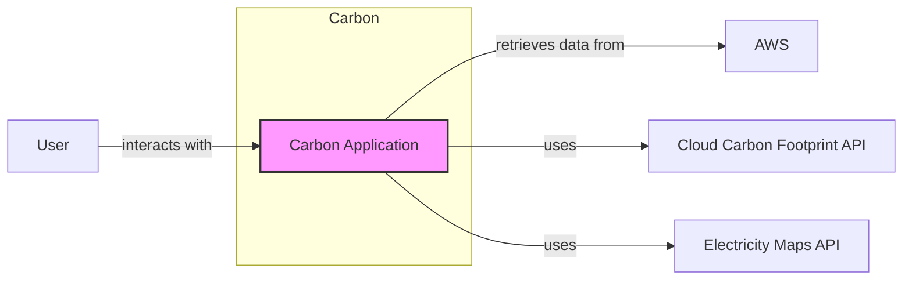
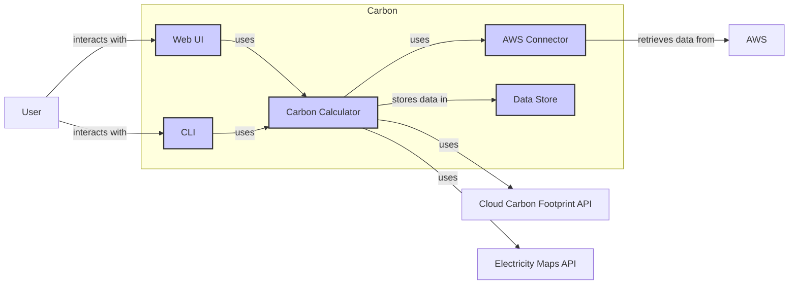
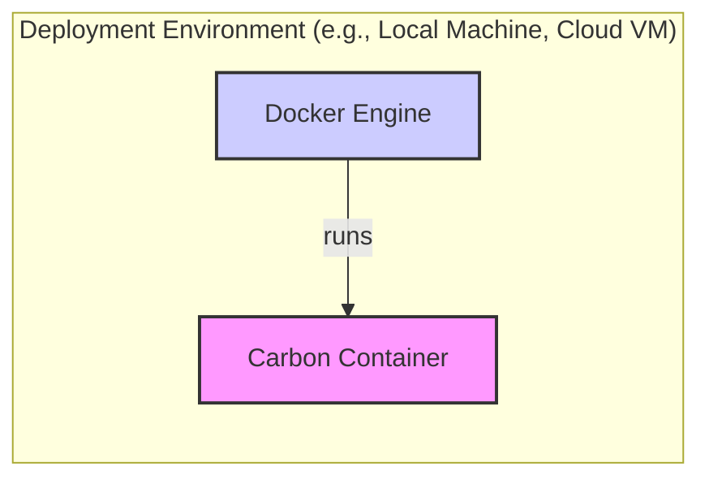

Okay, let's create a design document for the Carbon project based on the provided GitHub repository.

# BUSINESS POSTURE

Business Priorities and Goals:

*   Provide a simple, user-friendly interface for calculating the carbon footprint of cloud infrastructure.
*   Support multiple cloud providers (currently AWS, with potential for Azure and GCP).
*   Offer both a web-based UI and a command-line interface (CLI).
*   Enable users to understand and potentially reduce their cloud-related carbon emissions.
*   Open-source the project to encourage community contributions and transparency.

Most Important Business Risks:

*   Inaccurate calculations: Providing incorrect carbon footprint estimations could mislead users and damage the project's credibility.
*   Data privacy: Handling user-provided cloud credentials and usage data requires robust security measures to prevent breaches.
*   Lack of adoption: If the tool is too complex or doesn't provide valuable insights, it may not gain traction.
*   Maintenance overhead: As an open-source project, relying on community contributions can be unpredictable, potentially leading to maintenance challenges.
*   Cloud provider API changes: Changes to cloud provider APIs could break the tool's functionality, requiring frequent updates.

# SECURITY POSTURE

Existing Security Controls:

*   security control: Input validation: The project appears to perform some basic input validation, particularly in the CLI arguments parsing. (Located in `cmd/` and potentially in input handling for the web UI).
*   security control: Dependency management: The project uses Go modules (`go.mod` and `go.sum`), which helps manage dependencies and their versions, reducing the risk of using vulnerable libraries.
*   security control: Limited scope of permissions: The project's documentation should emphasize the principle of least privilege, advising users to provide cloud credentials with only the necessary read-only permissions for cost and usage data.
*   security control: Open-source nature: The project's open-source nature allows for community scrutiny and contributions, potentially leading to faster identification and resolution of security vulnerabilities.

Accepted Risks:

*   accepted risk: Reliance on third-party APIs: The project depends on external APIs (cloud providers and potentially carbon footprint data sources) that are outside its direct control.
*   accepted risk: Limited initial security features: As a relatively new project, it may not have all the desired security features implemented yet.
*   accepted risk: User-provided credentials: The project relies on users to securely manage and provide their cloud credentials.

Recommended Security Controls:

*   security control: Implement robust input sanitization and validation for all user inputs, including web form submissions and CLI arguments, to prevent injection attacks (e.g., command injection, cross-site scripting).
*   security control: Integrate with a secrets management solution (e.g., AWS Secrets Manager, HashiCorp Vault) to securely store and manage sensitive data, such as API keys and potentially user credentials if stored.  Avoid storing secrets directly in the code or configuration files.
*   security control: Implement logging and monitoring to track application activity, detect anomalies, and facilitate incident response.
*   security control: Conduct regular security audits and penetration testing to identify and address potential vulnerabilities.
*   security control: Establish a clear security vulnerability disclosure policy to encourage responsible reporting of security issues.
*   security control: Use static analysis security testing (SAST) tools during development to identify potential security vulnerabilities in the code.
*   security control: Use software composition analysis (SCA) tools to identify known vulnerabilities in third-party dependencies.

Security Requirements:

*   Authentication:
    *   The CLI currently relies on users providing cloud credentials directly. Consider supporting alternative authentication methods, such as using environment variables or configuration files, following cloud provider best practices.
    *   If user accounts are added to the web UI, implement secure password storage (using a strong hashing algorithm like bcrypt) and consider multi-factor authentication (MFA).

*   Authorization:
    *   The application should adhere to the principle of least privilege. Cloud credentials provided by users should only have the minimum necessary permissions to access cost and usage data.
    *   If user roles are introduced, implement role-based access control (RBAC) to restrict access to sensitive features or data.

*   Input Validation:
    *   All user inputs, from both the CLI and web UI, must be strictly validated and sanitized to prevent injection attacks.  Use a whitelist approach whenever possible, defining the allowed characters and formats for each input.

*   Cryptography:
    *   If sensitive data is stored (e.g., user credentials, API keys), it must be encrypted at rest using strong encryption algorithms (e.g., AES-256).
    *   All communication with external APIs (cloud providers, carbon footprint data sources) should use HTTPS to ensure data confidentiality and integrity in transit.

# DESIGN

## C4 CONTEXT



Element Descriptions:

*   Element:
    *   Name: User
    *   Type: Person
    *   Description: A person who wants to calculate the carbon footprint of their cloud infrastructure.
    *   Responsibilities: Provides cloud credentials, specifies calculation parameters, views results.
    *   Security controls: Strong password (if applicable), multi-factor authentication (if applicable), awareness of phishing attacks.

*   Element:
    *   Name: Carbon Application
    *   Type: Software System
    *   Description: The main application, providing both a CLI and a web UI.
    *   Responsibilities: Handles user input, retrieves data from cloud providers, calculates carbon footprint, displays results.
    *   Security controls: Input validation, secure credential handling, secure communication (HTTPS), logging and monitoring.

*   Element:
    *   Name: AWS
    *   Type: External System
    *   Description: Amazon Web Services, a cloud provider.
    *   Responsibilities: Provides cloud infrastructure and cost/usage data.
    *   Security controls: AWS security best practices, IAM roles and permissions.

*   Element:
    *   Name: Cloud Carbon Footprint API
    *   Type: External System
    *   Description: An API providing carbon footprint data for cloud services.
    *   Responsibilities: Provides emission factors and calculation methodologies.
    *   Security controls: API security best practices (authentication, authorization, rate limiting).

*   Element:
    *   Name: Electricity Maps API
    *   Type: External System
    *   Description: An API providing data on the carbon intensity of electricity grids.
    *   Responsibilities: Provides carbon intensity data for different regions.
    *   Security controls: API security best practices (authentication, authorization, rate limiting).

## C4 CONTAINER



Element Descriptions:

*   Element:
    *   Name: Web UI
    *   Type: Web Application
    *   Description: A web-based user interface for interacting with the application.
    *   Responsibilities: Presents forms for user input, displays calculation results.
    *   Security controls: Input validation, XSS prevention, CSRF protection, secure session management.

*   Element:
    *   Name: CLI
    *   Type: Command-Line Interface
    *   Description: A command-line interface for interacting with the application.
    *   Responsibilities: Parses command-line arguments, displays results.
    *   Security controls: Input validation, secure handling of command-line arguments.

*   Element:
    *   Name: Carbon Calculator
    *   Type: Component
    *   Description: The core logic for calculating the carbon footprint.
    *   Responsibilities: Processes cloud usage data, applies emission factors, calculates total carbon footprint.
    *   Security controls: Secure coding practices, regular code reviews.

*   Element:
    *   Name: AWS Connector
    *   Type: Component
    *   Description: Handles communication with the AWS API.
    *   Responsibilities: Retrieves cost and usage data from AWS.
    *   Security controls: Secure credential handling, secure communication (HTTPS), AWS SDK best practices.

*   Element:
    *   Name: Data Store
    *   Type: Database/File System
    *   Description: Stores application data, potentially including cached data or user settings.
    *   Responsibilities: Persists data.
    *   Security controls: Data encryption at rest (if sensitive data is stored), access control.

*   Element:
    *   Name: User
    *   Type: Person
    *   Description: A person who wants to calculate the carbon footprint of their cloud infrastructure.
    *   Responsibilities: Provides cloud credentials, specifies calculation parameters, views results.
    *   Security controls: Strong password (if applicable), multi-factor authentication (if applicable), awareness of phishing attacks.

*   Element:
    *   Name: AWS
    *   Type: External System
    *   Description: Amazon Web Services, a cloud provider.
    *   Responsibilities: Provides cloud infrastructure and cost/usage data.
    *   Security controls: AWS security best practices, IAM roles and permissions.

*   Element:
    *   Name: Cloud Carbon Footprint API
    *   Type: External System
    *   Description: An API providing carbon footprint data for cloud services.
    *   Responsibilities: Provides emission factors and calculation methodologies.
    *   Security controls: API security best practices (authentication, authorization, rate limiting).

*   Element:
    *   Name: Electricity Maps API
    *   Type: External System
    *   Description: An API providing data on the carbon intensity of electricity grids.
    *   Responsibilities: Provides carbon intensity data for different regions.
    *   Security controls: API security best practices (authentication, authorization, rate limiting).

## DEPLOYMENT

Possible Deployment Solutions:

1.  **Local Machine:** Users can run the application directly on their local machines, either by building from source or downloading pre-built binaries.
2.  **Docker Container:** The application can be packaged as a Docker container, making it easy to deploy and run in various environments.
3.  **Cloud-Based VM:** The application can be deployed on a cloud-based virtual machine (e.g., AWS EC2 instance).
4.  **Serverless Function:** The application's core logic could potentially be deployed as a serverless function (e.g., AWS Lambda). This is less likely given the current structure, but could be considered for specific components.
5.  **Kubernetes:** Deploy application to Kubernetes cluster.

Chosen Deployment Solution (Docker Container):



Element Descriptions:

*   Element:
    *   Name: Docker Engine
    *   Type: Container Runtime
    *   Description: The runtime environment for Docker containers.
    *   Responsibilities: Runs and manages Docker containers.
    *   Security controls: Docker security best practices (e.g., using non-root users inside containers, limiting container resources, regularly updating Docker Engine).

*   Element:
    *   Name: Carbon Container
    *   Type: Docker Container
    *   Description: The packaged Carbon application.
    *   Responsibilities: Runs the Carbon application.
    *   Security controls: All security controls listed for the application components within the container.

## BUILD

The build process for Carbon involves several steps, leveraging Go's build system and potentially incorporating additional security checks.

```mermaid
graph LR
    A[Developer] --> B[Source Code (GitHub)]
    B --> C[Build Server (e.g., GitHub Actions, Local Machine)]
    C --> D[Go Build]
    D --> E[SAST Scanner (e.g., gosec)]
    D --> F[SCA Scanner (e.g., Trivy)]
    E --> G[Build Artifacts (Binary, Docker Image)]
    F --> G
    style A fill:#ccf,stroke:#333,stroke-width:2px
    style B fill:#f9f,stroke:#333,stroke-width:2px
    style C fill:#ccf,stroke:#333,stroke-width:2px
    style D fill:#ccf,stroke:#333,stroke-width:2px
    style E fill:#ccf,stroke:#333,stroke-width:2px
    style F fill:#ccf,stroke:#333,stroke-width:2px
    style G fill:#f9f,stroke:#333,stroke-width:2px
```

Build Process Description:

1.  **Developer:** The developer writes and modifies the source code.
2.  **Source Code (GitHub):** The code is stored in a GitHub repository.
3.  **Build Server:** A build server (e.g., GitHub Actions, a local machine, or another CI/CD system) is triggered to start the build process. This could be triggered by a push to the repository, a pull request, or a manual trigger.
4.  **Go Build:** The Go compiler (`go build`) is used to compile the source code into an executable binary.
5.  **SAST Scanner (e.g., gosec):** A static analysis security testing (SAST) tool, such as `gosec`, is run to analyze the source code for potential security vulnerabilities.  The build should fail if high-severity vulnerabilities are detected.
6.  **SCA Scanner (e.g., Trivy):** A software composition analysis (SCA) tool, such as Trivy, is used to scan the project's dependencies for known vulnerabilities. The build should fail if high-severity vulnerabilities are detected in dependencies.
7.  **Build Artifacts:** If the build and security checks are successful, the build artifacts (the executable binary and potentially a Docker image) are created. The Docker image would be built using a Dockerfile.

Security Controls in Build Process:

*   security control: **Automated Build:** The build process is automated, ensuring consistency and reducing the risk of manual errors.
*   security control: **SAST Scanning:** Static analysis security testing helps identify vulnerabilities in the source code early in the development lifecycle.
*   security control: **SCA Scanning:** Software composition analysis helps identify known vulnerabilities in third-party dependencies.
*   security control: **Build Failure on Vulnerabilities:** The build process is configured to fail if high-severity vulnerabilities are detected by the SAST or SCA scanners.
*   security control: **Reproducible Builds:** Using Go modules and potentially a Dockerfile ensures that the build process is reproducible, meaning that the same source code will consistently produce the same build artifacts.

# RISK ASSESSMENT

Critical Business Processes to Protect:

*   Accurate carbon footprint calculation: The core functionality of the application must be reliable and provide accurate results.
*   User data privacy: Any user-provided data, especially cloud credentials, must be protected from unauthorized access and disclosure.
*   Application availability: The application should be available and responsive to users.

Data to Protect and Sensitivity:

*   Cloud credentials (HIGH sensitivity): These credentials provide access to users' cloud accounts and must be protected with the highest level of security.
*   Cloud usage data (MEDIUM sensitivity): This data reveals information about users' cloud infrastructure and spending, which could be considered sensitive business information.
*   Carbon footprint calculations (LOW sensitivity): The calculated results themselves are generally not sensitive, but they are derived from sensitive data.
*   User account information (if applicable) (MEDIUM sensitivity): If the application implements user accounts, this information (usernames, email addresses, hashed passwords) must be protected.

# QUESTIONS & ASSUMPTIONS

Questions:

*   What specific AWS services are currently supported, and what are the plans for expanding support to other services and cloud providers?
*   What are the specific data sources used for emission factors and carbon intensity calculations? How are these sources kept up-to-date?
*   What is the expected scale of usage (number of users, frequency of calculations)? This will influence the design of the infrastructure and scalability considerations.
*   Are there any plans to integrate with other sustainability tools or platforms?
*   What level of accuracy is required for the carbon footprint calculations?
*   Is there a plan to support different units of measurement for carbon emissions (e.g., metric tons, pounds)?
*   How will users be informed about updates and changes to the application?
*   What is the process for handling user feedback and bug reports?

Assumptions:

*   BUSINESS POSTURE: The primary goal is to provide a free and open-source tool for calculating cloud carbon footprints. Monetization is not a primary concern.
*   SECURITY POSTURE: Users are responsible for securely managing their own cloud credentials. The application will not store user credentials persistently unless a secure secrets management solution is implemented.
*   DESIGN: The application will primarily be used by individuals and small teams. Scalability to handle massive enterprise workloads is not a primary requirement initially. The initial focus is on AWS, with potential future expansion to other cloud providers. The application will rely on external APIs for emission factors and carbon intensity data.