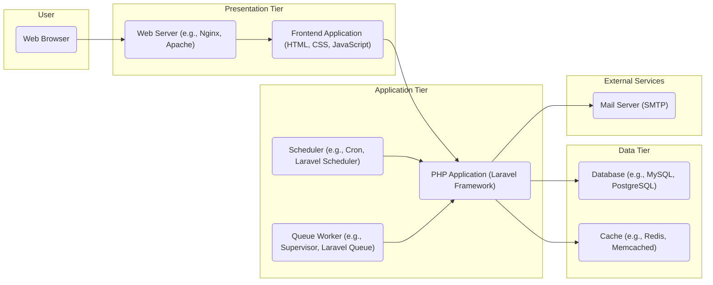
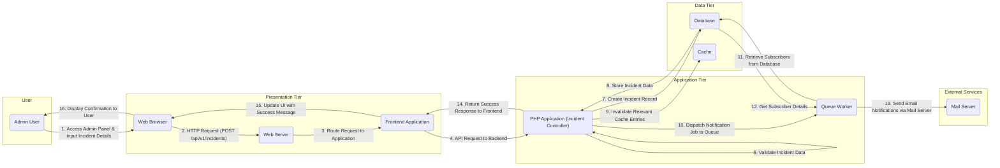

## Project Design Document: Cachet - Open Source Status Page System

**1. Introduction**

This document provides a detailed architectural design of the Cachet open-source status page system, focusing on aspects relevant to security analysis and threat modeling. It outlines the system's key components, their interactions, data flow, and crucial security considerations.

**1.1. Purpose**

The primary goal of this document is to provide a clear and comprehensive understanding of the Cachet system's architecture to facilitate effective threat modeling. It serves as a reference point for identifying potential security vulnerabilities and designing appropriate mitigation strategies.

**1.2. Scope**

This document covers the core components and functionalities of the Cachet application as represented in the provided GitHub repository (https://github.com/cachethq/cachet). The focus is on the logical architecture, key interactions, and data flows relevant to security. Implementation details within specific code modules are not the primary focus.

**1.3. Target Audience**

This document is intended for:

* Security engineers and architects responsible for threat modeling and security assessments.
* Software developers working on the Cachet project or integrating with its APIs.
* Operations teams involved in deploying, configuring, and maintaining Cachet instances.

**2. High-Level Architecture**

Cachet employs a standard three-tier web application architecture, separating concerns into distinct layers:

* **Presentation Tier (Frontend):**  Responsible for user interaction and rendering the user interface.
* **Application Tier (Backend):**  Contains the core business logic, handles requests, and manages data.
* **Data Tier (Persistence):**  Provides persistent storage for the system's data.

**3. Component Details**

This section provides a detailed description of each component, highlighting their responsibilities and interactions.

* **3.1. Presentation Tier**
    * **3.1.1. Web Browser:** The primary interface for users (administrators and visitors) to interact with the status page.
        * **Responsibilities:** Rendering the user interface based on HTML, CSS, and JavaScript; sending HTTP requests to the Web Server; handling user input.
        * **Interactions:** Sends requests to the Web Server, receives responses containing HTML, CSS, JavaScript, and data.
    * **3.1.2. Web Server (e.g., Nginx, Apache):** Acts as the entry point for all incoming HTTP requests to the Cachet application.
        * **Responsibilities:** Receiving and routing HTTP requests; serving static files (images, CSS, JavaScript); handling SSL/TLS termination; potentially acting as a reverse proxy.
        * **Interactions:** Receives requests from the Web Browser, forwards requests to the Frontend Application or PHP Application, sends responses back to the Web Browser.
    * **3.1.3. Frontend Application (HTML, CSS, JavaScript):**  Provides the dynamic user interface and handles client-side logic.
        * **Responsibilities:** Rendering the user interface components; handling user interactions and form submissions; making asynchronous API calls to the backend; managing the display of data received from the backend.
        * **Interactions:** Sends API requests to the PHP Application, receives data in formats like JSON, updates the user interface based on the received data.

* **3.2. Application Tier**
    * **3.2.1. PHP Application (Laravel Framework):** The core of the Cachet system, implementing the business logic and providing API endpoints.
        * **Responsibilities:**
            * Handling user authentication and authorization.
            * Managing incidents (creation, updates, deletion).
            * Managing components and component groups.
            * Collecting and displaying metrics.
            * Managing subscribers and sending notifications.
            * Processing API requests from the Frontend Application and potentially external systems.
            * Interacting with the Database and Cache.
        * **Interactions:** Receives requests from the Frontend Application and Scheduler, interacts with the Database, Cache, and Mail Server, dispatches jobs to the Queue Worker, sends responses to the Frontend Application.
    * **3.2.2. Scheduler (e.g., Cron, Laravel Scheduler):**  Responsible for executing tasks at predefined intervals.
        * **Responsibilities:** Triggering scheduled tasks such as sending recurring reports, checking component status automatically, and performing maintenance tasks.
        * **Interactions:** Triggers specific actions within the PHP Application by invoking commands or methods.
    * **3.2.3. Queue Worker (e.g., Supervisor, Laravel Queue):**  Handles asynchronous tasks, improving the responsiveness of the main application.
        * **Responsibilities:** Processing tasks that do not require immediate execution, such as sending email notifications to subscribers, processing large datasets, or performing background updates.
        * **Interactions:** Receives tasks from the PHP Application (pushed onto the queue) and executes them independently.

* **3.3. Data Tier**
    * **3.3.1. Database (e.g., MySQL, PostgreSQL):**  Provides persistent storage for the Cachet system's data.
        * **Responsibilities:** Storing structured data including information about incidents, components, metrics, users, subscribers, settings, and audit logs.
        * **Interactions:** Receives read and write requests from the PHP Application.
    * **3.3.2. Cache (e.g., Redis, Memcached):**  Provides a fast, in-memory data store for frequently accessed data to improve performance.
        * **Responsibilities:** Caching frequently accessed data to reduce database load and improve response times. This might include configuration settings, component status, and recent incident data.
        * **Interactions:** Receives read and write requests from the PHP Application.

* **3.4. External Services**
    * **3.4.1. Mail Server (SMTP):**  Used for sending email notifications to subscribers.
        * **Responsibilities:** Sending emails to subscribers about incident updates, component status changes, and other relevant events.
        * **Interactions:** Receives email sending requests from the PHP Application (often via the Queue Worker).

**4. Data Flow: Creating a New Incident**

This section details the data flow involved when an administrator creates a new incident.

**Detailed Data Flow for Creating an Incident:**

1. **Admin User Accesses Admin Panel & Input Incident Details:** The administrator accesses the administrative interface through their web browser and fills in the details for the new incident.
2. **HTTP Request (POST /api/v1/incidents):** Upon submission, the browser sends an HTTP POST request to the Web Server, targeting the `/api/v1/incidents` endpoint.
3. **Route Request to Application:** The Web Server routes the incoming request to the PHP Application.
4. **API Request to Backend:** The Laravel framework handles the routing and directs the request to the appropriate controller (Incident Controller).
5. **Authenticate & Authorize User:** The Incident Controller first authenticates the user making the request and then verifies if they have the necessary permissions to create incidents.
6. **Validate Incident Data:** The controller validates the input data to ensure it meets the required criteria (e.g., required fields, data types, length constraints).
7. **Create Incident Record:** If the data is valid, the controller interacts with the Database to create a new incident record.
8. **Store Incident Data:** The Database stores the new incident information persistently.
9. **Invalidate Relevant Cache Entries:** The PHP Application invalidates any cached data related to incidents to ensure that subsequent requests fetch the latest information.
10. **Dispatch Notification Job to Queue:** The application dispatches a job to the Queue Worker to handle the asynchronous task of sending notifications.
11. **Retrieve Subscribers from Database:** The Queue Worker retrieves a list of subscribers who should be notified about new incidents from the Database.
12. **Get Subscriber Details:** The Queue Worker fetches the necessary details for each subscriber, such as their email address.
13. **Send Email Notifications via Mail Server:** The Queue Worker uses the configured Mail Server (SMTP) to send email notifications to the retrieved subscribers.
14. **Return Success Response to Frontend:** The Incident Controller sends a success response back to the Frontend Application.
15. **Update UI with Success Message:** The Frontend Application updates the user interface to indicate that the incident was created successfully.
16. **Display Confirmation to User:** The administrator sees a confirmation message in their web browser.

**5. Security Considerations**

This section outlines key security considerations for the Cachet system, categorized for clarity.

* **Authentication and Authorization:**
    * **Consideration:** Securely managing user credentials (passwords) using hashing algorithms.
    * **Consideration:** Implementing strong password policies to encourage complex passwords.
    * **Consideration:** Protecting administrative access with robust authentication mechanisms.
    * **Consideration:** Enforcing proper authorization checks at the application level to prevent unauthorized access to resources and functionalities.
    * **Consideration:** Potential vulnerabilities related to session management (e.g., session fixation, session hijacking).
* **Input Validation and Output Encoding:**
    * **Consideration:** Validating all user inputs on the server-side to prevent injection attacks (e.g., SQL injection, cross-site scripting (XSS), command injection).
    * **Consideration:** Sanitizing and encoding user-provided data before storing it in the database or displaying it to prevent XSS vulnerabilities.
    * **Consideration:** Potential vulnerabilities arising from insufficient input validation in API endpoints.
* **Data Protection:**
    * **Consideration:** Protecting sensitive data at rest through encryption.
    * **Consideration:** Ensuring secure transmission of data in transit using HTTPS (TLS).
    * **Consideration:** Securely storing API keys and other sensitive configuration data.
    * **Consideration:** Implementing appropriate access controls to the database and other data stores.
* **Cross-Site Request Forgery (CSRF):**
    * **Consideration:** Implementing CSRF protection mechanisms (e.g., synchronizer tokens) to prevent unauthorized actions performed on behalf of authenticated users.
* **Dependency Management:**
    * **Consideration:** Regularly updating dependencies (libraries and frameworks) to patch known security vulnerabilities.
    * **Consideration:** Utilizing dependency scanning tools to identify potential vulnerabilities in project dependencies.
* **Rate Limiting and Abuse Prevention:**
    * **Consideration:** Implementing rate limiting on API endpoints to prevent brute-force attacks and denial-of-service attempts.
    * **Consideration:** Mechanisms to prevent abuse of notification features (e.g., email bombing).
* **Error Handling and Logging:**
    * **Consideration:** Avoiding the exposure of sensitive information in error messages.
    * **Consideration:** Implementing comprehensive logging and monitoring to detect and respond to security incidents.
    * **Consideration:** Securely storing and managing log data.
* **Infrastructure Security:**
    * **Consideration:** Securely configuring the web server, database server, and other infrastructure components.
    * **Consideration:** Implementing firewalls and intrusion detection/prevention systems.
    * **Consideration:** Regularly patching and updating operating systems and server software.

**6. Deployment Considerations**

* **Environment:** Cachet can be deployed on various environments, including cloud platforms (AWS, Azure, GCP), virtual machines, and on-premises servers.
* **Security Best Practices:** Implementing security hardening measures for the deployment environment, including secure network configurations, access controls, and regular security audits.
* **Scalability:** The system can be scaled horizontally by adding more web server and application server instances behind a load balancer. Database scaling might require more advanced techniques like read replicas or sharding.
* **High Availability:** Implementing load balancing, database replication, and potentially container orchestration (e.g., Kubernetes) can ensure high availability and fault tolerance.
* **Configuration Management:** Using configuration management tools (e.g., Ansible, Chef, Puppet) to automate the deployment and configuration process, ensuring consistency and security.
* **Monitoring and Alerting:** Implementing robust monitoring and alerting systems to track system performance, security events, and potential issues.

**7. Technologies Used**

* **Programming Language:** PHP
* **Framework:** Laravel
* **Frontend Technologies:** HTML, CSS, JavaScript (likely utilizing frameworks/libraries like Bootstrap, Tailwind CSS, Vue.js, or React)
* **Database:** Supports various relational databases (e.g., MySQL, PostgreSQL, SQLite)
* **Cache:** Supports various caching systems (e.g., Redis, Memcached)
* **Web Server:** Commonly deployed with web servers like Nginx or Apache
* **Queue System:** Laravel Queue with drivers such as Redis, Database, or Beanstalkd
* **Scheduler:** Laravel Scheduler or system-level cron jobs
* **Mail Transport:** Typically utilizes SMTP for sending emails

**8. Future Considerations**

* **Enhanced Authentication Methods:** Implementing multi-factor authentication (MFA) for increased security.
* **Integration with Security Information and Event Management (SIEM) Systems:**  Enabling centralized security monitoring and analysis.
* **Web Application Firewall (WAF) Integration:**  Adding a layer of protection against common web attacks.
* **Regular Security Audits and Penetration Testing:**  Proactively identifying and addressing potential vulnerabilities.
* **Improved API Security:** Implementing stricter authentication and authorization mechanisms for the API, potentially including API keys or OAuth 2.0.

This document provides a detailed architectural overview of the Cachet system, emphasizing aspects crucial for security analysis and threat modeling. By understanding the components, data flows, and potential security considerations, security professionals can effectively identify and mitigate potential risks, ensuring the security and reliability of the Cachet status page.