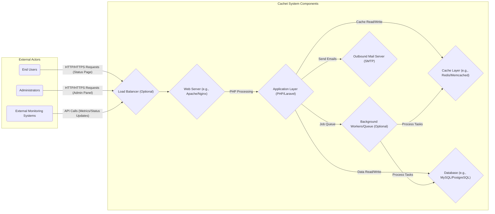

## Project Design Document: Cachet Status Page System - Improved

**Document Version:** 1.1
**Date:** October 26, 2023
**Author:** AI Software Architecture Expert

### 1. Introduction

This document provides an enhanced architectural design of the Cachet status page system (as represented by the GitHub repository: https://github.com/cachethq/cachet). This improved document aims to provide a more detailed and nuanced understanding of the system's architecture to facilitate comprehensive threat modeling activities. It clearly outlines the system's key components, their interactions, the flow of data, and the underlying technologies.

### 2. System Overview

Cachet is an open-source web application designed to provide a clear and informative status page for services and infrastructure. It allows administrators to communicate incidents, scheduled maintenance, and overall system health to end-users through a centralized dashboard. This transparency helps manage user expectations and reduces support inquiries during outages or maintenance periods.

### 3. Architectural Diagram

### 4. Component Breakdown

*   **External Actors:**
    *   **End Users:** Individuals accessing the public-facing status page to view the current health of services. Their interactions are primarily read-only.
    *   **Administrators:** Authenticated users with privileges to manage the Cachet system, including creating/updating incidents, managing components, and configuring settings. They interact with the administrative interface.
    *   **External Monitoring Systems:** Automated systems that monitor the health and performance of various services and send data to Cachet to update component statuses and metrics via API calls.

*   **Cachet System Components:**
    *   **Load Balancer (Optional):** Distributes incoming traffic across multiple web server instances for improved availability and performance.
    *   **Web Server (e.g., Apache/Nginx):**  Serves as the entry point for all HTTP/HTTPS requests. It handles request routing, SSL/TLS termination, and serving static assets.
    *   **Application Layer (PHP/Laravel):** The core of the Cachet application, built using the PHP Laravel framework. It encompasses:
        *   **Request Handling:** Processing incoming HTTP requests and routing them to the appropriate controllers.
        *   **Business Logic:** Implementing the core functionality of Cachet, such as managing incidents, components, metrics, and user accounts.
        *   **Authentication and Authorization:** Verifying the identity of administrators and controlling access to administrative functions.
        *   **View Rendering:** Generating the HTML for both the public status page and the administrative interface.
        *   **Data Access Layer:** Interacting with the database and cache to retrieve and store data.
        *   **API Endpoints:** Providing programmatic access for external monitoring systems and potentially other integrations.
        *   **Event Handling:**  Responding to system events, such as status changes, and triggering actions like sending notifications.
    *   **Background Workers/Queue (Optional):**  Handles asynchronous tasks that don't need immediate processing, such as sending email notifications or processing large datasets. This improves the responsiveness of the main application.
    *   **Cache Layer (e.g., Redis/Memcached):**  An in-memory data store used to cache frequently accessed data, such as rendered views, component statuses, and configuration settings, to improve performance and reduce database load.
    *   **Database (e.g., MySQL/PostgreSQL):**  The persistent data store for the Cachet application, containing:
        *   User accounts (administrators and potentially subscribers).
        *   Component definitions (name, description, status).
        *   Incident records (status, message, timestamps).
        *   Metric definitions and data points.
        *   System settings and configurations.
        *   Subscription information for email notifications.
    *   **Outbound Mail Server (SMTP):**  Responsible for sending email notifications to subscribers when incidents are created, updated, or resolved.

### 5. Data Flow

The following describes the typical flow of data within the Cachet system for different scenarios:

*   **End User Viewing Status Page:**
    *   The End User's browser sends an HTTP/HTTPS request to the Load Balancer (if present) or directly to the Web Server.
    *   The Web Server forwards the request to the Application Layer.
    *   The Application Layer retrieves the current component statuses, incident information, and potentially cached data from the Cache Layer and the Database.
    *   The Application Layer renders the status page HTML.
    *   The rendered HTML is sent back through the Web Server and Load Balancer to the End User's browser.

*   **Administrator Managing Incidents:**
    *   The Administrator's browser sends an authenticated HTTP/HTTPS request to the Load Balancer (if present) or directly to the Web Server.
    *   The Web Server forwards the request to the Application Layer.
    *   The Application Layer authenticates and authorizes the Administrator.
    *   The Application Layer processes the request (e.g., creating a new incident). This may involve writing data to the Database and potentially updating the Cache Layer.
    *   If configured, the Application Layer may enqueue a job for the Background Workers to send email notifications via the Outbound Mail Server.
    *   The Application Layer renders the updated administrative interface and sends the response back through the Web Server and Load Balancer to the Administrator's browser.

*   **Monitoring System Updating Component Status:**
    *   The External Monitoring System sends an API request (typically HTTP/HTTPS) to the Load Balancer (if present) or directly to the Web Server.
    *   The Web Server forwards the request to the Application Layer.
    *   The Application Layer authenticates and authorizes the request based on API keys or other configured mechanisms.
    *   The Application Layer validates the incoming data and updates the component status in the Database and potentially the Cache Layer.
    *   If a status change triggers notifications, the Application Layer may enqueue a job for the Background Workers to send email notifications via the Outbound Mail Server.

### 6. Technology Stack

*   **Core Language:** PHP
*   **Web Application Framework:** Laravel
*   **Web Server Options:** Apache HTTP Server, Nginx
*   **Database Options:** MySQL, PostgreSQL, SQLite
*   **Caching Options:** Redis, Memcached
*   **Background Processing (Optional):** Laravel Queue (using database, Redis, or other drivers)
*   **Mail Transfer Agent:** Any SMTP compliant server
*   **Operating System (Typical):** Linux distributions
*   **Frontend Technologies:** HTML, CSS, JavaScript (likely leveraging frameworks/libraries like Bootstrap, jQuery, etc.)

### 7. Key Security Considerations

This section outlines crucial security considerations for the Cachet system, providing a basis for subsequent threat modeling:

*   **Authentication and Authorization:**
    *   **Administrator Authentication:** Mechanisms used to verify the identity of administrators (e.g., username/password, multi-factor authentication).
    *   **Authorization Controls:** How access to administrative functions and resources is controlled based on user roles and permissions.
    *   **API Authentication:** Methods for authenticating requests from external monitoring systems (e.g., API keys, tokens).

*   **Input Validation and Output Encoding:**
    *   **Protection against Injection Attacks:** Measures to prevent SQL injection, cross-site scripting (XSS), and other injection vulnerabilities by validating user inputs and encoding outputs.
    *   **Data Sanitization:**  Ensuring data received from external sources (e.g., monitoring systems) is sanitized before being processed and stored.

*   **Data Security:**
    *   **Sensitive Data Storage:** How sensitive data like user credentials and API keys are stored securely (e.g., using strong hashing algorithms, encryption at rest).
    *   **Data Transmission Security:** Ensuring data in transit is protected using HTTPS/TLS encryption.
    *   **Database Security:** Implementing appropriate database access controls and security configurations.

*   **Session Management:**
    *   **Secure Session Handling:**  Mechanisms to protect administrator sessions from hijacking and unauthorized access (e.g., using secure cookies, session timeouts).

*   **Dependency Management:**
    *   **Vulnerability Management:** Processes for keeping dependencies up-to-date and addressing known vulnerabilities in third-party libraries.

*   **API Security:**
    *   **Rate Limiting:** Implementing rate limits to prevent abuse of API endpoints.
    *   **Input Validation for API Requests:** Ensuring data sent via API calls is validated.
    *   **Secure API Key Management:**  Properly generating, storing, and revoking API keys.

*   **Email Security:**
    *   **Preventing Email Spoofing:**  Implementing measures like SPF, DKIM, and DMARC to prevent attackers from sending spoofed emails.
    *   **Secure Handling of Subscriber Data:** Protecting the privacy of email subscribers.

*   **Error Handling and Logging:**
    *   **Secure Error Handling:** Preventing error messages from revealing sensitive information.
    *   **Security Logging:**  Logging relevant security events for auditing and incident response.

*   **Rate Limiting and Abuse Prevention:**
    *   **Login Attempt Limiting:** Preventing brute-force attacks on login forms.
    *   **Request Rate Limiting:** Protecting against denial-of-service attacks.

*   **Backup and Recovery:**
    *   **Data Backup Procedures:**  Regularly backing up the database and application configurations.
    *   **Disaster Recovery Plan:**  Having a plan in place to recover from data loss or system failures.

### 8. Assumptions

The following assumptions underpin this design document:

*   The system is deployed within a secure network environment.
*   Standard security best practices are followed during the development and deployment processes.
*   External services (like the SMTP server) are assumed to be configured securely.
*   The underlying infrastructure (operating system, server hardware) is appropriately secured.

### 9. Out of Scope

This design document explicitly excludes the following:

*   Detailed deployment architectures (e.g., specific cloud provider configurations, container orchestration).
*   In-depth database schema design and optimization.
*   Specific implementation details within the Laravel application codebase.
*   Detailed configuration of individual components like the web server or database.
*   Specific configurations and security measures of the external monitoring systems.

This improved design document provides a more granular and comprehensive view of the Cachet system's architecture, highlighting key areas relevant to security. This detailed understanding will be invaluable for conducting thorough and effective threat modeling exercises.
