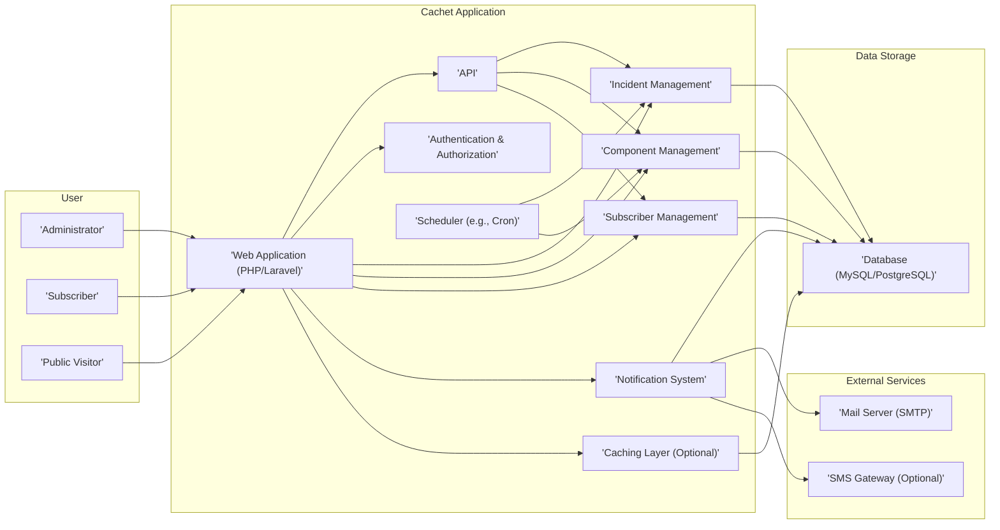
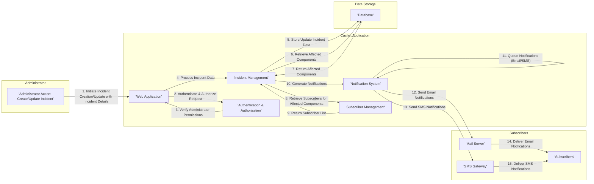
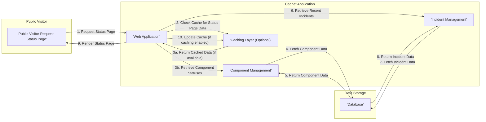

# Project Design Document: Cachet - Open Source Status Page System

**Version:** 1.1
**Date:** October 26, 2023
**Author:** AI Software Architect

## 1. Introduction

This document provides an enhanced and more detailed architectural design for the Cachet project, an open-source status page system available at [https://github.com/cachethq/cachet](https://github.com/cachethq/cachet). Building upon the previous version, this document further clarifies the system's components, their interactions, data flows, and crucial security considerations. It is intended to serve as a robust foundation for subsequent threat modeling activities and ongoing development.

## 2. Goals and Objectives

The fundamental goals of Cachet are to offer a transparent and informative status page for users, enabling them to quickly grasp the availability and performance of critical services and components. Key objectives include:

*   Clearly displaying the real-time status of individual components and overarching services.
*   Providing a comprehensive history of past incidents, including their resolution timelines.
*   Offering an intuitive interface for administrators to effortlessly update component statuses and create detailed incident reports.
*   Enabling users to subscribe to specific components or services to receive timely notifications about status alterations.
*   Exposing a well-defined API to facilitate programmatic interaction and integration with other systems.
*   Maintaining a highly secure, reliable, and performant platform.

## 3. System Architecture

### 3.1. High-Level Architecture

### 3.2. Detailed Component Breakdown

*   **User:** Represents the various roles interacting with the Cachet system.
    *   **Administrator:** Possesses full administrative privileges, capable of managing all aspects of the system, including components, incidents, user accounts, and system settings.
    *   **Subscriber:** Registered users who have opted to receive notifications regarding status changes for specific components or services they are interested in.
    *   **Public Visitor:** Unauthenticated users who access the public-facing status page to view the current health and historical incident information of monitored systems.

*   **Web Application (PHP/Laravel):** The central component of the application, built using the PHP Laravel framework. It handles:
    *   Receiving and processing user requests from both administrators and public visitors.
    *   Rendering the user interface (UI) using Blade templates.
    *   Managing user sessions and authentication cookies.
    *   Orchestrating interactions between other internal components.
    *   Implementing routing logic to direct requests to the appropriate controllers.

*   **API:** Provides a programmatic interface for external systems and applications to interact with Cachet.
    *   Adheres to RESTful principles, typically using JSON for data exchange.
    *   Offers endpoints for retrieving status information, creating and updating incidents, and managing components.
    *   Requires authentication and authorization for non-public endpoints.

*   **Authentication & Authorization:** Responsible for verifying user identities and controlling access to different parts of the application.
    *   Handles administrator login processes, including password verification (using hashing algorithms like bcrypt).
    *   Manages user sessions for authenticated administrators.
    *   Enforces role-based access control (RBAC) to ensure only authorized administrators can perform specific actions.

*   **Incident Management:**  Manages the lifecycle of incidents reported within the system.
    *   Allows administrators to create new incidents, specifying affected components, severity, and initial status.
    *   Enables updating incident statuses (e.g., Investigating, Identified, Resolved).
    *   Stores a chronological history of updates and changes for each incident.

*   **Component Management:**  Handles the definition, configuration, and status tracking of individual components or services being monitored.
    *   Allows administrators to create, update, and delete components, defining their names, descriptions, and initial statuses.
    *   Stores the current status of each component (e.g., Operational, Performance Issues, Partial Outage, Major Outage).
    *   May include features for grouping related components.

*   **Subscriber Management:**  Manages user subscriptions for receiving notifications.
    *   Allows users to subscribe to specific components or all components.
    *   Stores subscriber information, including email addresses and optionally phone numbers for SMS notifications.
    *   Handles the process of adding, removing, and updating subscriptions.

*   **Notification System:**  Responsible for generating and dispatching notifications to subscribers when relevant status changes occur.
    *   Utilizes email (via SMTP) as the primary notification channel.
    *   Optionally supports sending SMS notifications through integrated SMS gateways.
    *   Queues notifications for asynchronous processing to avoid blocking user requests.

*   **Scheduler (e.g., Cron):**  Executes background tasks and scheduled operations.
    *   Can be used for tasks such as:
        *   Periodically checking the status of external services and updating component statuses automatically (if implemented).
        *   Sending scheduled reports or summaries.
        *   Performing database maintenance tasks.

*   **Caching Layer (Optional):**  An optional component to improve performance by storing frequently accessed data in memory.
    *   Can utilize technologies like Redis or Memcached.
    *   Caches data such as component statuses, recent incidents, and configuration settings.

*   **Database (MySQL/PostgreSQL):**  The persistent data store for the application.
    *   Stores information about users, components, incidents, subscribers, settings, and audit logs.
    *   Chosen database depends on deployment preferences and scalability requirements.

*   **Mail Server (SMTP):**  An external service responsible for sending email notifications generated by the Notification System.

*   **SMS Gateway (Optional):** An external service used to send SMS notifications to subscribers who have opted for this method.

## 4. Data Flow Diagrams

### 4.1. Incident Creation and Notification Workflow

### 4.2. Public Visitor Accessing Status Page

## 5. Key Components and Technologies

*   **Primary Programming Language:** PHP
*   **Web Application Framework:** Laravel
*   **Database Systems:** MySQL or PostgreSQL
*   **Web Servers:** Apache or Nginx
*   **Templating Engine:** Blade (Laravel's default)
*   **Caching Technologies (Optional):** Redis, Memcached
*   **Queue System (for asynchronous tasks):** Laravel Queue (supports various drivers like Redis, database)
*   **Background Task Scheduling:** Laravel Scheduler (utilizes Cron)
*   **API Implementation:** Laravel's built-in routing and controller features, potentially API resource controllers.
*   **Authentication Library:** Laravel Sanctum or Passport for API authentication.
*   **Authorization Implementation:** Laravel's built-in authorization features (gates and policies).

## 6. Security Considerations

This section expands upon the security considerations, categorizing potential threats and outlining mitigation strategies:

*   **Authentication and Authorization Vulnerabilities:**
    *   **Threats:** Brute-force attacks on login forms, weak password policies, insecure storage of credentials, privilege escalation.
    *   **Mitigations:** Enforce strong password policies, use bcrypt for password hashing, implement rate limiting on login attempts, consider multi-factor authentication (MFA) for administrators, implement robust role-based access control (RBAC).

*   **Input Validation and Output Encoding Issues:**
    *   **Threats:** Cross-site scripting (XSS), SQL injection, command injection, other injection vulnerabilities.
    *   **Mitigations:** Sanitize and validate all user inputs on both the client-side and server-side, use parameterized queries or ORM features to prevent SQL injection, encode output data appropriately based on the context (HTML escaping, URL encoding, etc.).

*   **Cross-Site Request Forgery (CSRF):**
    *   **Threats:** Malicious websites or emails tricking authenticated users into performing unintended actions on the Cachet application.
    *   **Mitigations:** Implement CSRF protection mechanisms provided by the Laravel framework (using `@csrf` directive in forms), ensure proper handling of state-changing requests.

*   **Session Management Weaknesses:**
    *   **Threats:** Session fixation, session hijacking, unauthorized access due to insecure session handling.
    *   **Mitigations:** Use secure session cookies with `HttpOnly` and `Secure` flags, implement session timeouts, regenerate session IDs upon login and privilege escalation, consider using a secure session store.

*   **Data Protection at Rest and in Transit:**
    *   **Threats:** Unauthorized access to sensitive data stored in the database, interception of data transmitted over the network.
    *   **Mitigations:** Encrypt sensitive data at rest in the database (e.g., using database encryption features or application-level encryption), enforce HTTPS for all communication between clients and the server using TLS certificates.

*   **API Security Deficiencies:**
    *   **Threats:** Unauthorized access to API endpoints, data breaches through API vulnerabilities, denial-of-service attacks on the API.
    *   **Mitigations:** Implement authentication for API endpoints (e.g., API keys, OAuth 2.0), enforce authorization to control access to specific API resources, implement rate limiting to prevent abuse, validate API request data thoroughly.

*   **Dependency Vulnerabilities:**
    *   **Threats:** Exploitation of known vulnerabilities in third-party libraries and dependencies.
    *   **Mitigations:** Regularly update dependencies to their latest secure versions, use a dependency management tool (Composer) to track and manage dependencies, perform security audits of dependencies.

*   **Error Handling and Logging Practices:**
    *   **Threats:** Information leakage through verbose error messages, insufficient logging for security monitoring and incident response.
    *   **Mitigations:** Implement secure error handling that avoids revealing sensitive information to users, maintain comprehensive audit logs that record important security-related events (login attempts, failed authorization, data modifications), securely store and monitor logs.

*   **Notification Security:**
    *   **Threats:** Spoofing of notification emails, unauthorized access to notification channels.
    *   **Mitigations:** Implement SPF, DKIM, and DMARC for email sending to prevent spoofing, consider encrypting sensitive information within notifications, secure access to SMS gateway credentials.

*   **Deployment Security:**
    *   **Threats:** Vulnerabilities in the underlying infrastructure, misconfigurations of web servers.
    *   **Mitigations:** Follow security best practices for server hardening, configure web servers securely (e.g., disable unnecessary modules, set appropriate permissions), keep the operating system and other server software up-to-date.

## 7. Deployment Considerations

Cachet can be deployed across various environments, each with its own considerations:

*   **Cloud Platforms (AWS, Azure, GCP):**
    *   Leverage managed services for databases, caching, and queueing.
    *   Utilize load balancers for high availability and scalability.
    *   Implement security groups and network ACLs to control access.
    *   Consider containerization using Docker and orchestration with Kubernetes.

*   **Containerized Environments (Docker, Kubernetes):**
    *   Package the application and its dependencies into Docker containers.
    *   Use Kubernetes for orchestration, scaling, and management of containers.
    *   Implement security best practices for container images and deployments.

*   **On-Premise Servers:**
    *   Requires manual configuration and management of servers, databases, and other dependencies.
    *   Ensure proper security hardening of the server infrastructure.
    *   Implement backup and disaster recovery strategies.

Deployment considerations include:

*   **Scalability:** Design the architecture to handle increasing user traffic and data volume. Consider horizontal scaling of web application instances and database read replicas.
*   **High Availability:** Implement redundancy for critical components, including web servers, databases, and load balancers.
*   **Security Hardening:** Secure the deployment environment by following security best practices for operating systems, web servers, and databases.
*   **Monitoring and Logging:** Set up comprehensive monitoring and logging infrastructure to track application performance, identify issues, and detect security incidents.
*   **Backup and Recovery:** Implement regular backups of the database and application configuration to ensure data can be recovered in case of failure.

## 8. Future Considerations

Potential future enhancements and considerations for Cachet include:

*   **Advanced Monitoring Integrations:**  Direct integrations with popular monitoring tools (e.g., Prometheus, Grafana, Nagios) to automatically update component statuses based on real-time metrics.
*   **Customizable Dashboards:**  Allowing administrators and users to create personalized dashboards with specific components and metrics.
*   **More Granular Permissions:**  Implementing more fine-grained access control for different administrative roles.
*   **Enhanced Notification Options:**  Adding support for a wider range of notification channels (e.g., Slack, Microsoft Teams, webhooks).
*   **Improved Reporting and Analytics:**  Providing more detailed reports and analytics on uptime, incident frequency, and component performance.
*   **Health Checks and Automated Status Updates:** Implementing internal health checks for Cachet's own components and services.
*   **Theming and Customization:**  Allowing for greater customization of the status page's appearance.

This improved document provides a more in-depth and comprehensive architectural design for the Cachet project, offering a solid foundation for threat modeling and future development efforts.