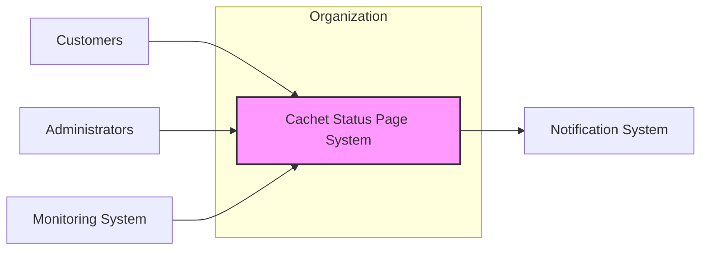
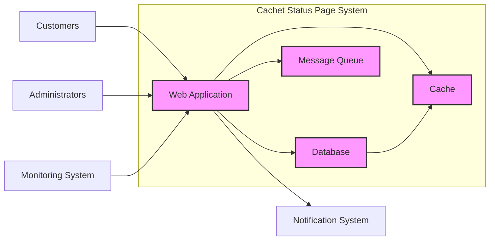
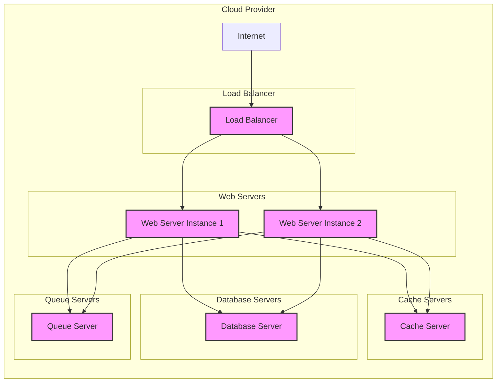

# BUSINESS POSTURE

- Business Priorities and Goals:
  - Provide a public facing status page to communicate system uptime, incidents, and maintenance.
  - Improve customer trust and transparency by proactively reporting service status.
  - Reduce support tickets related to service outages by providing self-service status information.
  - Enhance brand reputation by demonstrating reliability and open communication.
  - Enable internal teams to quickly understand service health and respond to incidents effectively.

- Business Risks:
  - Misinformation or delayed updates on the status page can erode customer trust and increase support load.
  - Status page downtime can negate its purpose and further damage customer trust during incidents.
  - Security breaches of the status page could lead to misinformation, defacement, or access to sensitive internal information.
  - Inaccurate or incomplete status information can lead to poor decision-making by internal teams and customers.
  - Lack of automation in status updates can lead to delays and inaccuracies, especially during critical incidents.

# SECURITY POSTURE

- Existing Security Controls:
  - security control: HTTPS enforced for web traffic (assumed based on common web application practices).
  - security control: Regular software updates and patching of dependencies (assumed best practice).
  - security control: Input validation on web forms to prevent basic injection attacks (assumed best practice).
  - security control: Authentication and authorization for administrative access to manage the status page (described in application documentation).
  - accepted risk: Reliance on community contributions for security vulnerability discovery and patching.
  - accepted risk: Potential for outdated dependencies if not actively maintained.
  - accepted risk: Basic input validation might not cover all types of injection attacks.

- Recommended Security Controls:
  - security control: Implement a Web Application Firewall (WAF) to protect against common web attacks (e.g., OWASP Top 10).
  - security control: Integrate with a vulnerability scanning tool (SAST/DAST) into the CI/CD pipeline.
  - security control: Implement rate limiting to protect against brute-force and denial-of-service attacks.
  - security control: Regularly perform security audits and penetration testing.
  - security control: Implement strong password policies and multi-factor authentication (MFA) for administrative access.
  - security control: Implement Content Security Policy (CSP) to mitigate cross-site scripting (XSS) attacks.
  - security control: Implement robust logging and monitoring for security events.

- Security Requirements:
  - Authentication:
    - requirement: Secure authentication mechanism for administrative users.
    - requirement: Option for multi-factor authentication for administrators.
    - requirement: Protection against brute-force attacks on login endpoints.
  - Authorization:
    - requirement: Role-based access control (RBAC) to manage different administrative privileges.
    - requirement: Principle of least privilege applied to user roles and permissions.
    - requirement: Clear separation of roles for viewing status and managing status page settings.
  - Input Validation:
    - requirement: Comprehensive input validation on all user inputs to prevent injection attacks (SQL injection, XSS, command injection, etc.).
    - requirement: Input sanitization and encoding to neutralize potentially malicious input.
    - requirement: Use of parameterized queries or ORM to prevent SQL injection.
  - Cryptography:
    - requirement: Secure storage of sensitive data (e.g., API keys, database credentials) using encryption at rest.
    - requirement: Secure transmission of sensitive data using HTTPS/TLS.
    - requirement: Use of strong cryptographic algorithms and libraries.
    - requirement: Proper key management practices for encryption keys.

# DESIGN

## C4 CONTEXT

- Context Diagram Elements:
  - - Name: Customers
    - Type: Person
    - Description: External users who rely on the organization's services and need to be informed about service status.
    - Responsibilities: View the status page to check the availability and performance of services.
    - Security controls: None directly, but their experience depends on the security and availability of the Cachet system.
  - - Name: Administrators
    - Type: Person
    - Description: Internal users responsible for managing and updating the status page.
    - Responsibilities: Update service status, create incidents, schedule maintenance, configure the status page.
    - Security controls: Authentication, authorization, audit logging of administrative actions.
  - - Name: Monitoring System
    - Type: Software System
    - Description: Internal system that monitors the health and performance of the organization's services.
    - Responsibilities: Automatically detect service outages and performance degradation, send alerts to administrators and potentially update Cachet via API.
    - Security controls: Authentication and authorization for API access to Cachet, secure transmission of monitoring data.
  - - Name: Notification System
    - Type: Software System
    - Description: System responsible for sending notifications to users about service status updates.
    - Responsibilities: Send email, SMS, or other notifications to subscribed users based on status updates from Cachet.
    - Security controls: Secure API access from Cachet, protection of user notification preferences and contact information.
  - - Name: Cachet Status Page System
    - Type: Software System
    - Description: The Cachet application itself, providing a public status page and administrative interface.
    - Responsibilities: Display current service status, allow administrators to update status, integrate with monitoring and notification systems.
    - Security controls: Authentication, authorization, input validation, secure data storage, secure communication, rate limiting, WAF, vulnerability scanning.

## C4 CONTAINER

- Container Diagram Elements:
  - - Name: Web Application
    - Type: Container
    - Description: PHP application (likely Laravel framework based on repository) serving the status page and administrative interface. Handles user requests, business logic, and interacts with other containers.
    - Responsibilities:
      - Present status page to users.
      - Provide administrative interface for managing status page.
      - Authenticate and authorize users.
      - Process user input and interact with the database, queue, and cache.
      - Integrate with monitoring and notification systems via APIs.
    - Security controls: Input validation, output encoding, authentication, authorization, session management, rate limiting, WAF, security headers, vulnerability scanning.
  - - Name: Database
    - Type: Container
    - Description: Relational database (e.g., MySQL, PostgreSQL) storing application data such as components, incidents, users, settings.
    - Responsibilities:
      - Persist application data.
      - Provide data access to the Web Application.
      - Ensure data integrity and availability.
    - Security controls: Database access control, encryption at rest, regular backups, database hardening, SQL injection prevention (via ORM and parameterized queries in Web Application).
  - - Name: Message Queue
    - Type: Container
    - Description: Asynchronous message queue (e.g., Redis Queue, Beanstalkd) for handling background tasks such as sending notifications.
    - Responsibilities:
      - Decouple notification sending from web request processing.
      - Ensure reliable delivery of notifications.
      - Manage background jobs.
    - Security controls: Access control to the queue, secure communication if queue is accessed over network.
  - - Name: Cache
    - Type: Container
    - Description: In-memory cache (e.g., Redis, Memcached) to improve performance by caching frequently accessed data.
    - Responsibilities:
      - Reduce database load.
      - Improve response times for status page and administrative interface.
      - Store cached data such as status information, configuration settings.
    - Security controls: Access control to the cache, secure communication if cache is accessed over network.

## DEPLOYMENT

Deployment Solution: Cloud Deployment (e.g., AWS, GCP, Azure)

- Deployment Diagram Elements:
  - - Name: Internet
    - Type: Environment
    - Description: Public internet, representing external user access.
    - Responsibilities: Provide network connectivity for users to access the status page.
    - Security controls: None directly, but relies on the security of the cloud provider and deployed infrastructure.
  - - Name: Load Balancer
    - Type: Infrastructure
    - Description: Distributes incoming traffic across multiple Web Server instances for high availability and scalability.
    - Responsibilities:
      - Load balancing web traffic.
      - SSL/TLS termination.
      - Basic DDoS protection.
    - Security controls: HTTPS enforcement, DDoS protection, access control lists, security monitoring.
  - - Name: Web Server Instance 1 & 2
    - Type: Infrastructure (Virtual Machine/Container)
    - Description: Instances running the Web Application container.
    - Responsibilities:
      - Host and run the Web Application.
      - Serve status page and administrative interface.
      - Process user requests.
    - Security controls: Operating system hardening, web server configuration, application security controls (as described in Container section), intrusion detection system (IDS), security monitoring.
  - - Name: Database Server
    - Type: Infrastructure (Managed Database Service or Virtual Machine)
    - Description: Server hosting the Database container. Could be a managed database service (e.g., AWS RDS, GCP Cloud SQL) or a database server running on a virtual machine.
    - Responsibilities:
      - Host and run the Database.
      - Persist application data.
      - Ensure database availability and performance.
    - Security controls: Database security hardening, access control lists, encryption at rest, regular backups, security monitoring, vulnerability scanning.
  - - Name: Cache Server
    - Type: Infrastructure (Managed Cache Service or Virtual Machine)
    - Description: Server hosting the Cache container. Could be a managed cache service (e.g., AWS ElastiCache, GCP Memorystore) or a cache server running on a virtual machine.
    - Responsibilities:
      - Host and run the Cache.
      - Provide caching services to Web Servers.
      - Improve application performance.
    - Security controls: Access control lists, secure communication (if applicable), security monitoring.
  - - Name: Queue Server
    - Type: Infrastructure (Managed Queue Service or Virtual Machine)
    - Description: Server hosting the Message Queue container. Could be a managed queue service (e.g., AWS SQS, GCP Cloud Pub/Sub) or a queue server running on a virtual machine.
    - Responsibilities:
      - Host and run the Message Queue.
      - Provide message queuing services to Web Servers.
      - Ensure reliable message delivery.
    - Security controls: Access control lists, secure communication (if applicable), security monitoring.

## BUILD

```mermaid
flowchart LR
    Developer["Developer"] --> CodeRepository["Code Repository (GitHub)"]
    CodeRepository --> CI["CI/CD Pipeline (GitHub Actions)"]
    CI --> BuildArtifacts["Build Artifacts (Docker Image, Packages)"]
    BuildArtifacts --> ArtifactRepository["Artifact Repository (Container Registry, Package Registry)"]
    ArtifactRepository --> Deployment["Deployment Environment"]

    subgraph "CI/CD Pipeline (GitHub Actions)"
        Build["Build Stage"]
        Test["Test Stage"]
        SecurityScan["Security Scan Stage (SAST, DAST, Dependency Check)"]
    end
    CI --> Build
    Build --> Test
    Test --> SecurityScan
    SecurityScan --> BuildArtifacts

    style Developer fill:#f9f,stroke:#333,stroke-width:2px
    style CodeRepository fill:#f9f,stroke:#333,stroke-width:2px
    style CI fill:#f9f,stroke:#333,stroke-width:2px
    style BuildArtifacts fill:#f9f,stroke:#333,stroke-width:2px
    style ArtifactRepository fill:#f9f,stroke:#333,stroke-width:2px
    style Deployment fill:#f9f,stroke:#333,stroke-width:2px
    style Build fill:#f9f,stroke:#333,stroke-width:2px
    style Test fill:#f9f,stroke:#333,stroke-width:2px
    style SecurityScan fill:#f9f,stroke:#333,stroke-width:2px
```

- Build Process:
  - Developer: Writes code, commits changes to the Code Repository.
    - Security controls: Secure development environment, code review process.
  - Code Repository (GitHub): Stores source code, tracks changes, manages versions.
    - Security controls: Access control, branch protection, audit logging.
  - CI/CD Pipeline (GitHub Actions): Automates the build, test, and security scanning process.
    - Security controls: Secure pipeline configuration, access control, secret management, audit logging.
    - Build Stage: Compiles code, builds application artifacts (e.g., Docker image, packages).
      - Security controls: Dependency management, build environment security.
    - Test Stage: Runs automated tests (unit, integration, etc.) to ensure code quality and functionality.
      - Security controls: Test environment isolation, secure test data management.
    - Security Scan Stage: Performs security checks on code and dependencies.
      - Security controls: SAST (Static Application Security Testing), DAST (Dynamic Application Security Testing), dependency vulnerability scanning, license compliance checks.
  - Build Artifacts (Docker Image, Packages): Packaged application ready for deployment.
    - Security controls: Artifact signing, vulnerability scanning of base images.
  - Artifact Repository (Container Registry, Package Registry): Stores and manages build artifacts.
    - Security controls: Access control, vulnerability scanning, immutable storage, audit logging.
  - Deployment Environment: Target environment where the application is deployed (as described in Deployment section).
    - Security controls: Deployment process security, infrastructure security.

# RISK ASSESSMENT

- Critical Business Processes:
  - Communicating service status to customers and stakeholders during incidents and maintenance.
  - Maintaining customer trust and transparency regarding service reliability.
  - Reducing support load by providing self-service status information.
  - Enabling internal teams to monitor service health and respond to incidents effectively.

- Data Sensitivity:
  - Low to Medium Sensitivity:
    - Status information (component status, incident descriptions, maintenance schedules) - Publicly accessible information, but integrity is important to maintain trust.
    - User subscriptions (email addresses for notifications) - Should be protected to prevent spam and maintain user privacy.
    - Administrative credentials - High sensitivity, requires strong protection to prevent unauthorized access and control of the status page.
    - Application configuration and database credentials - High sensitivity, requires strong protection to prevent system compromise.
    - Audit logs - Medium sensitivity, important for security monitoring and incident investigation.

# QUESTIONS & ASSUMPTIONS

- Questions:
  - What is the expected scale and performance requirements for the status page?
  - What are the specific notification channels required (email, SMS, etc.)?
  - What level of customization and branding is required for the status page?
  - Are there any specific compliance requirements (e.g., GDPR, HIPAA) that need to be considered?
  - What is the organization's incident response process and how does the status page integrate with it?

- Assumptions:
  - BUSINESS POSTURE: The primary goal is to improve customer communication and trust through a public status page. The organization values transparency and proactive communication.
  - SECURITY POSTURE: Basic security practices are in place, but there is room for improvement in areas like WAF, vulnerability scanning, and MFA. The organization is willing to invest in security to protect the status page and maintain customer trust.
  - DESIGN: The application is a typical web application with a database, cache, and message queue. Deployment will be in a cloud environment for scalability and availability. A standard CI/CD pipeline will be used for building and deploying the application.