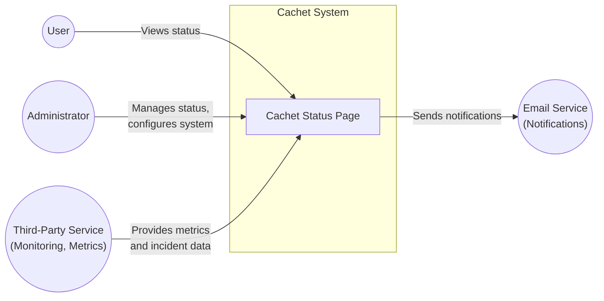
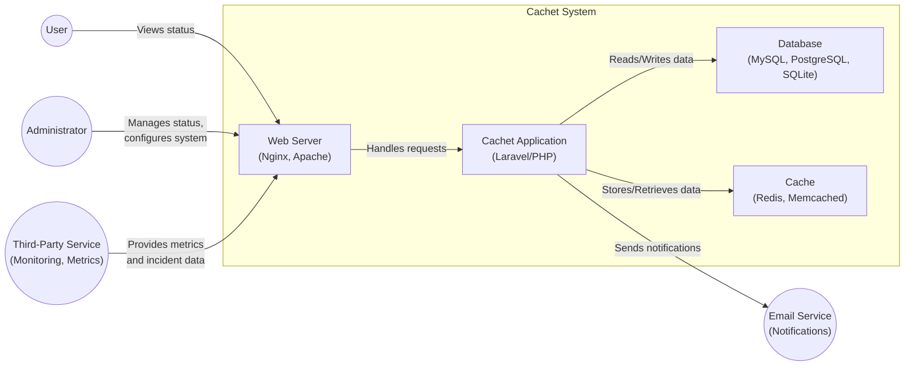
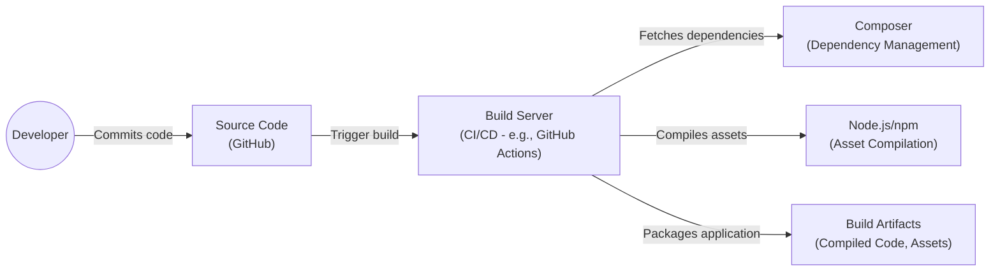

Okay, let's create a design document for the Cachet project, focusing on aspects relevant for threat modeling.

# BUSINESS POSTURE

Cachet is an open-source status page system.  It allows organizations to communicate service status to their users, reducing support load and improving transparency during incidents.

Priorities and Goals:

*   Provide a clear and reliable communication channel for service status.
*   Reduce the volume of support requests during incidents.
*   Improve user trust and transparency.
*   Offer a customizable and extensible platform.
*   Maintain a simple and easy-to-use interface.
*   Ensure high availability and performance of the status page.

Business Risks:

*   Availability: The status page itself becoming unavailable would be highly detrimental, potentially exacerbating user frustration during an actual service outage.
*   Integrity:  Unauthorized modification of the status page (e.g., displaying false information) could damage the organization's reputation and mislead users.
*   Confidentiality: While most status information is public, sensitive data (e.g., internal server names, detailed error messages) could be leaked through misconfiguration or vulnerabilities.
*   Reputation:  A poorly maintained or insecure status page reflects badly on the organization, undermining the very trust it's meant to build.
*   Compliance: Depending on the organization and the services it provides, there might be compliance requirements related to incident reporting and communication.

# SECURITY POSTURE

Existing Security Controls (based on reviewing the repository and documentation):

*   security control: Authentication: Cachet uses user accounts and passwords for administrative access.  Implementation: Laravel's built-in authentication features.
*   security control: Authorization:  Cachet has role-based access control (RBAC) to manage permissions for different user roles (e.g., administrator, manager, viewer). Implementation: Laravel's authorization features, likely using policies or gates.
*   security control: Input Validation: Cachet uses Laravel's validation rules to validate user input and prevent common vulnerabilities like cross-site scripting (XSS) and SQL injection. Implementation: Laravel's validation framework.
*   security control: CSRF Protection:  Cachet utilizes CSRF tokens to protect against cross-site request forgery attacks. Implementation: Laravel's built-in CSRF protection middleware.
*   security control: Rate Limiting:  Cachet likely implements rate limiting to prevent abuse and brute-force attacks. Implementation: Laravel's rate limiting features.
*   security control: Configuration Management:  Cachet uses environment variables (.env file) for sensitive configuration settings, keeping them out of the codebase.
*   security control: Dependency Management: Cachet uses Composer for dependency management, allowing for tracking and updating of third-party libraries.
*   security control: Database Security: Cachet supports multiple database systems (MySQL, PostgreSQL, SQLite) and encourages using secure database configurations.
*   security control: Session Management: Cachet uses secure session management practices. Implementation: Laravel's session handling.

Accepted Risks:

*   accepted risk: The project relies heavily on the security of the underlying Laravel framework and its dependencies. Vulnerabilities in these components could impact Cachet's security.
*   accepted risk: The security of the deployment environment (server, network, etc.) is outside the direct control of the Cachet application itself.
*   accepted risk: The effectiveness of security controls depends heavily on proper configuration by the administrator. Misconfiguration could lead to vulnerabilities.
*   accepted risk: While Cachet provides basic user roles, more granular permission control might be needed for larger organizations.

Recommended Security Controls:

*   Implement Content Security Policy (CSP) to mitigate XSS and data injection attacks.
*   Enable HTTP Strict Transport Security (HSTS) to enforce HTTPS connections.
*   Implement Subresource Integrity (SRI) for included scripts and stylesheets to prevent tampering.
*   Regularly audit dependencies for known vulnerabilities using tools like Composer audit or Snyk.
*   Consider implementing a Web Application Firewall (WAF) to provide an additional layer of protection against common web attacks.
*   Implement robust logging and monitoring to detect and respond to security incidents.
*   Provide security hardening guidelines in the documentation, covering topics like server configuration, database security, and network security.
*   Implement two-factor authentication (2FA) for administrative accounts.

Security Requirements:

*   Authentication:
    *   All administrative actions must require authentication.
    *   Strong password policies must be enforced.
    *   Support for 2FA should be considered.
*   Authorization:
    *   Access to resources and actions must be controlled based on user roles.
    *   The principle of least privilege should be applied.
*   Input Validation:
    *   All user-supplied input must be validated before being processed or stored.
    *   Validation rules should be strict and specific to the expected data type.
    *   Output encoding should be used to prevent XSS.
*   Cryptography:
    *   Sensitive data (e.g., passwords) must be stored securely using strong hashing algorithms.
    *   HTTPS must be enforced for all communication.
    *   API keys and other secrets must be managed securely.

# DESIGN

## C4 CONTEXT



Context Diagram Element List:

*   Element:
    *   Name: User
    *   Type: Person
    *   Description: A person who views the status page to check the status of services.
    *   Responsibilities: View service status, subscribe to updates.
    *   Security controls: None (from the perspective of the Cachet system).

*   Element:
    *   Name: Administrator
    *   Type: Person
    *   Description: A person who manages the Cachet instance, configures settings, and updates status information.
    *   Responsibilities: Manage incidents, components, metrics, users, and system settings.
    *   Security controls: Authentication, Authorization, Rate Limiting, CSRF Protection.

*   Element:
    *   Name: Third-Party Service
    *   Type: External System
    *   Description: An external service that provides monitoring data or metrics to Cachet, often via an API.
    *   Responsibilities: Provide real-time or historical data about service status.
    *   Security controls: API Authentication (e.g., API keys, OAuth), Input Validation.

*   Element:
    *   Name: Email Service
    *   Type: External System
    *   Description: An external service used by Cachet to send email notifications to subscribers.
    *   Responsibilities: Deliver email messages.
    *   Security controls: Secure communication (TLS), API Authentication (if applicable).

*   Element:
    *   Name: Cachet Status Page
    *   Type: Software System
    *   Description: The Cachet application itself, providing the status page functionality.
    *   Responsibilities: Display service status, manage incidents, handle subscriptions, provide an API.
    *   Security controls: Authentication, Authorization, Input Validation, CSRF Protection, Rate Limiting, Session Management.

## C4 CONTAINER



Container Diagram Element List:

*   Element:
    *   Name: Web Server
    *   Type: Web Server
    *   Description: Handles incoming HTTP requests and serves the Cachet application.
    *   Responsibilities: Serve static content, proxy requests to the Cachet application, handle SSL/TLS termination.
    *   Security controls: HTTPS configuration, WAF (if applicable), access controls.

*   Element:
    *   Name: Cachet Application
    *   Type: Web Application
    *   Description: The core Cachet application logic, built with Laravel/PHP.
    *   Responsibilities: Handle user requests, manage data, interact with the database and cache, provide the API.
    *   Security controls: Authentication, Authorization, Input Validation, CSRF Protection, Rate Limiting, Session Management.

*   Element:
    *   Name: Database
    *   Type: Database
    *   Description: Stores persistent data for Cachet, such as incidents, components, metrics, and users.
    *   Responsibilities: Store and retrieve data.
    *   Security controls: Database user authentication, access controls, encryption (if applicable).

*   Element:
    *   Name: Cache
    *   Type: Cache
    *   Description: Stores frequently accessed data to improve performance.
    *   Responsibilities: Store and retrieve cached data.
    *   Security controls: Access controls, authentication (if applicable).

*   Element:
    *   Name: User
    *   Type: Person
    *   Description: A person who views the status page to check the status of services.
    *   Responsibilities: View service status, subscribe to updates.
    *   Security controls: None (from the perspective of the Cachet system).

*   Element:
    *   Name: Administrator
    *   Type: Person
    *   Description: A person who manages the Cachet instance, configures settings, and updates status information.
    *   Responsibilities: Manage incidents, components, metrics, users, and system settings.
    *   Security controls: Authentication, Authorization, Rate Limiting, CSRF Protection.

*   Element:
    *   Name: Third-Party Service
    *   Type: External System
    *   Description: An external service that provides monitoring data or metrics to Cachet, often via an API.
    *   Responsibilities: Provide real-time or historical data about service status.
    *   Security controls: API Authentication (e.g., API keys, OAuth), Input Validation.

*   Element:
    *   Name: Email Service
    *   Type: External System
    *   Description: An external service used by Cachet to send email notifications to subscribers.
    *   Responsibilities: Deliver email messages.
    *   Security controls: Secure communication (TLS), API Authentication (if applicable).

## DEPLOYMENT

Possible Deployment Solutions:

1.  Traditional LAMP/LEMP stack on a single server.
2.  Docker-based deployment using Docker Compose.
3.  Cloud-based deployment using services like AWS, Google Cloud, or Azure.
4.  Kubernetes-based deployment.

Chosen Solution (for detailed description): Docker-based deployment using Docker Compose. This is a common and relatively straightforward approach for deploying Cachet.

```mermaid
graph LR
    subgraph Docker Host
        subgraph cachet_network
            cachet_app["Cachet App Container"]
            cachet_db["Database Container\n(MySQL/Postgres)"]
            cachet_cache["Cache Container\n(Redis)"]
        end
    end
    Internet(("Internet"))
    ReverseProxy["Reverse Proxy\n(Nginx, Traefik)"]

    Internet -- "HTTPS" --> ReverseProxy
    ReverseProxy -- "HTTP" --> cachet_app
    cachet_app -- "" --> cachet_db
    cachet_app -- "" --> cachet_cache

```

Deployment Diagram Element List:

*   Element:
    *   Name: Docker Host
    *   Type: Server
    *   Description: The physical or virtual server that runs the Docker engine.
    *   Responsibilities: Host and run the Docker containers.
    *   Security controls: Server hardening, firewall, intrusion detection/prevention system.

*   Element:
    *   Name: cachet_network
    *   Type: Network
    *   Description: Docker network.
    *   Responsibilities: Connect containers.
    *   Security controls: Network isolation.

*   Element:
    *   Name: Cachet App Container
    *   Type: Docker Container
    *   Description: The container running the Cachet application code.
    *   Responsibilities: Execute the application logic.
    *   Security controls: Minimal base image, non-root user, read-only filesystem (where possible).

*   Element:
    *   Name: Database Container
    *   Type: Docker Container
    *   Description: The container running the database server (MySQL or PostgreSQL).
    *   Responsibilities: Store and manage persistent data.
    *   Security controls: Secure configuration, strong passwords, limited network access.

*   Element:
    *   Name: Cache Container
    *   Type: Docker Container
    *   Description: The container running the caching server (Redis).
    *   Responsibilities: Store and manage cached data.
    *   Security controls: Secure configuration, strong passwords (if applicable), limited network access.

*   Element:
    *   Name: Internet
    *   Type: External
    *   Description: External network.
    *   Responsibilities: Provide access to application.
    *   Security controls: N/A.

*   Element:
    *   Name: Reverse Proxy
    *   Type: Software
    *   Description: Software that provide access to application from external network.
    *   Responsibilities: Provide access to application.
    *   Security controls: Firewall, WAF.

## BUILD

Cachet's build process involves several steps, leveraging Composer for dependency management and Laravel's asset compilation tools. While the repository doesn't include a dedicated CI/CD pipeline configuration (like GitHub Actions), a typical build process would look like this:



Build Process Description:

1.  Development: Developers write code and commit changes to the GitHub repository.
2.  Trigger: A commit or pull request triggers the build process (ideally on a CI/CD server).
3.  Dependency Management: Composer is used to install PHP dependencies.
    *   Security Control: Composer.lock file ensures consistent dependency versions.
    *   Security Control: Regular auditing of dependencies for known vulnerabilities (e.g., using Composer audit or Snyk).
4.  Asset Compilation: Node.js and npm (or Yarn) are used to compile frontend assets (JavaScript, CSS).
    *   Security Control: Using pinned versions of npm packages.
    *   Security Control: Auditing npm dependencies for vulnerabilities.
5.  Testing: Automated tests (unit tests, integration tests) are executed.
    *   Security Control: Test coverage helps identify potential security flaws.
6.  Packaging: The application code, dependencies, and compiled assets are packaged into a deployable artifact.
7.  Artifact Storage: The build artifacts are stored in a repository (e.g., Docker Hub, a private registry).
    * Security Control: SAST tools.
    * Security Control: SCA tools.
    * Security Control: Linters.

# RISK ASSESSMENT

Critical Business Processes:

*   Incident Communication: The primary business process is communicating service status to users during incidents.  Failure of this process leads to user frustration and potential reputational damage.
*   Service Monitoring Integration:  The ability to integrate with monitoring tools to automatically update status is crucial for timely and accurate information.
*   System Administration:  Maintaining and updating the Cachet system itself is a critical process to ensure its continued availability and security.

Data Sensitivity:

*   Incident Data:  Information about service outages, including descriptions, timelines, and updates.  Sensitivity: Generally low, but could contain sensitive details if not carefully managed.
*   Component Data:  Information about the services being monitored. Sensitivity: Generally low.
*   Metric Data:  Performance metrics and graphs. Sensitivity: Generally low, but could reveal internal infrastructure details.
*   User Data:  Information about Cachet users (administrators, subscribers). Sensitivity:  Potentially high, especially for subscriber email addresses.  Requires protection under privacy regulations (e.g., GDPR).
*   Configuration Data:  System settings, API keys, database credentials. Sensitivity:  High.  Must be protected from unauthorized access.

# QUESTIONS & ASSUMPTIONS

Questions:

*   Are there any specific compliance requirements (e.g., GDPR, HIPAA) that apply to the organization using Cachet?
*   What is the expected scale of the deployment (number of users, number of services monitored)?
*   What are the existing monitoring and alerting systems in place?
*   What is the organization's tolerance for downtime of the status page?
*   Are there any specific security policies or guidelines that need to be followed?
*   What level of support is available for the underlying infrastructure (server, network)?

Assumptions:

*   BUSINESS POSTURE: The organization values transparency and communication with its users.
*   BUSINESS POSTURE: The organization has a basic understanding of IT operations and security.
*   SECURITY POSTURE: The deployment environment will be reasonably secure (e.g., firewall, basic server hardening).
*   SECURITY POSTURE: The administrators will follow best practices for securing the Cachet installation.
*   DESIGN: The Docker-based deployment model is suitable for the organization's needs.
*   DESIGN: The default security settings in Cachet and Laravel provide a reasonable baseline level of security.
*   DESIGN: Third-party integrations will use secure API communication (HTTPS).