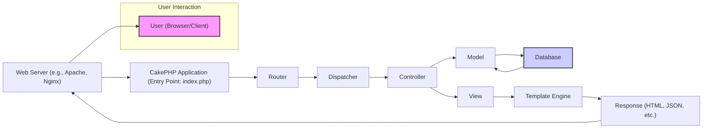
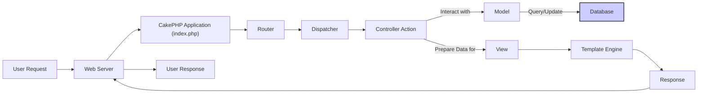
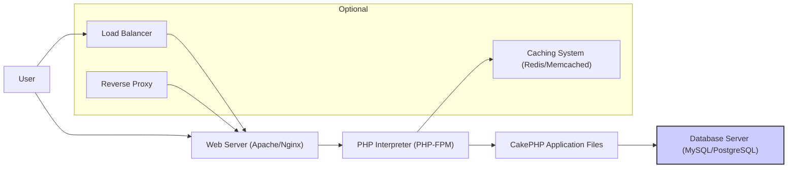

# Project Design Document: CakePHP Framework

**Version:** 1.1
**Date:** October 26, 2023
**Author:** AI Software Architect

## 1. Introduction

This document provides an enhanced architectural overview of the CakePHP framework, building upon the previous version. It aims to serve as a more robust foundation for subsequent threat modeling activities by offering greater detail on the key components, their interactions, and the overall system design. This document continues to focus on the core framework structure and common usage patterns.

## 2. Goals and Objectives

*   Provide a more detailed and refined architectural description of the CakePHP framework.
*   Elaborate on the responsibilities and interactions of key components.
*   Offer a clearer illustration of the typical request lifecycle within the framework.
*   Highlight potential areas of interest for security analysis and threat modeling with more specific examples.
*   Serve as an improved and more comprehensive reference point for understanding the system's structure and behavior.

## 3. High-Level Architecture

CakePHP adheres to the Model-View-Controller (MVC) architectural pattern, a fundamental design principle that promotes separation of concerns. This pattern divides the application logic into three interconnected parts:

*   **Model:** Encapsulates the data structure, business logic, and rules for accessing and manipulating data. It typically interacts with the database.
*   **View:**  Focuses on presenting data to the user. It's responsible for rendering the user interface, which can be in various formats like HTML, JSON, or XML.
*   **Controller:** Acts as an intermediary, handling user requests, invoking the appropriate Model to retrieve or modify data, and then selecting the relevant View to render the response.

Beyond the core MVC pattern, CakePHP incorporates several other essential components that streamline development and provide common functionalities.

**Description of Components:**

*   **User (Browser/Client):** The entity that initiates requests to interact with the application.
*   **Web Server:**  Receives incoming HTTP requests from users and directs them to the CakePHP application for processing.
*   **CakePHP Application (Entry Point: index.php):** The central part of the framework, responsible for handling all incoming requests and orchestrating the application's logic.
*   **Router:**  Examines the incoming request URI and determines the specific Controller and Action that should handle the request based on defined routes.
*   **Dispatcher:**  Manages the request handling process, invoking the designated Controller and Action and ensuring the proper flow of execution.
*   **Controller:**  Receives the request from the Dispatcher, interacts with the Model to fetch or manipulate data as needed, and prepares the data to be passed to the View for rendering.
*   **Model:**  Represents the application's data structures and business logic. It handles interactions with the database, including data retrieval, creation, updates, and deletion.
*   **Database:**  The persistent storage system where the application's data is stored and managed.
*   **View:**  Responsible for presenting information to the user. It takes data from the Controller and uses a template engine to generate the final output format.
*   **Template Engine:**  Processes view templates (typically `.php` files with embedded PHP code) to dynamically generate the final response content.
*   **Response:** The output generated by the application, which is sent back to the user's browser or client via the web server.

## 4. Component Breakdown

This section provides a more detailed breakdown of the key components within the CakePHP framework and their respective functionalities:

*   **Core Libraries:**
    *   Provide fundamental classes and functionalities essential for the framework's operation, such as request and response handling, session management, and utility functions.
    *   Include `Component` classes, which offer reusable logic that can be incorporated into Controllers, and `Helper` classes, which provide reusable view logic.
    *   Offer Console tools for executing command-line interface (CLI) tasks, such as code generation and database migrations.
*   **ORM (Object-Relational Mapper):**
    *   Acts as an abstraction layer, allowing developers to interact with databases using object-oriented syntax instead of writing raw SQL queries.
    *   Supports various database systems, including MySQL, PostgreSQL, and SQLite.
    *   Provides features like associations (defining relationships between database tables), data validation rules, and a query builder for constructing database queries programmatically.
*   **Routing:**
    *   Responsible for mapping incoming request URLs to specific Controller actions, enabling clean and user-friendly URLs.
    *   Allows for the definition of custom routes and URL patterns to tailor the application's URL structure.
    *   Handles reverse routing, which is the process of generating URLs based on route definitions and parameters.
*   **Request and Response Objects:**
    *   The `Request` object encapsulates all the information about an incoming HTTP request, including headers, query parameters, request body data, and more.
    *   The `Response` object represents the HTTP response that will be sent back to the client, allowing control over headers, body content, status codes, and other response attributes.
*   **View Layer:**
    *   Dedicated to rendering the user interface and presenting data to the user.
    *   Utilizes template files (typically `.php` files) that combine HTML markup with PHP code for dynamic content generation.
    *   Offers Helpers that provide convenient functions for common view tasks, such as form generation, URL creation, and asset management.
    *   Supports layouts, which define the overall structure of a page, and elements, which are reusable snippets of view code.
*   **Controller Layer:**
    *   Serves as the intermediary between the Model and the View, handling application logic and user interactions.
    *   Receives requests from the Dispatcher and determines the appropriate course of action.
    *   Interacts with Models to retrieve, create, update, or delete data based on the request.
    *   Prepares data to be passed to the View for rendering.
    *   Can implement logic for authentication, authorization, input validation, and other request processing tasks.
*   **Model Layer:**
    *   Represents the application's data and the business rules that govern that data.
    *   Interacts with the database through the ORM to perform data operations.
    *   Defines data structures (database tables) and the relationships between them.
    *   Implements business logic related to data manipulation and validation.
    *   Enforces data integrity through validation rules.
*   **Authentication and Authorization:**
    *   Provides built-in mechanisms for verifying user identities (authentication), ensuring that users are who they claim to be.
    *   Offers tools for controlling access to resources based on user roles and permissions (authorization), ensuring that users can only access what they are allowed to.
    *   Includes flexible authentication adapters and allows for custom implementations to integrate with various authentication systems.
*   **Middleware:**
    *   Enables the interception and modification of requests and responses as they flow through the application.
    *   Used for a wide range of tasks, including request logging, authentication checks, content encoding, and adding security headers.
    *   Executed in a specific order, forming a pipeline through which requests and responses pass.
*   **Event System:**
    *   Facilitates communication between different parts of the application by allowing components to subscribe to and emit events.
    *   Promotes loose coupling, making the application more modular and easier to maintain.
    *   Provides a powerful mechanism for extending and customizing the framework's behavior without modifying its core code.
*   **Console (CLI):**
    *   Offers a command-line interface for performing various administrative and development tasks.
    *   Includes commands for code generation (using the "bake" command), running database migrations, clearing caches, and other utilities.
*   **Testing Framework:**
    *   Provides integrated support for writing and running unit tests, integration tests, and other types of automated tests.
    *   Includes tools and assertions to help developers ensure the quality and reliability of their code.

## 5. Data Flow

The typical request lifecycle within a CakePHP application involves the following steps:

1. **User Initiates Request:** A user interacts with the application, typically by clicking a link or submitting a form in their web browser, sending an HTTP request.
2. **Web Server Receives Request:** The web server (e.g., Apache or Nginx) receives the incoming HTTP request.
3. **Request Handover to CakePHP:** The web server directs the request to the CakePHP application's entry point, which is usually the `index.php` file.
4. **Router Analyzes Request:** The Router component examines the request URI and matches it against the defined routes to determine the appropriate Controller and Action to handle the request.
5. **Dispatcher Invokes Controller:** The Dispatcher takes the information from the Router and instantiates the specified Controller and calls the designated Action method.
6. **Controller Executes Logic:** The Controller Action executes the necessary application logic, which may involve:
    *   Interacting with one or more Models to retrieve or manipulate data from the database.
    *   Performing calculations or other business logic.
    *   Validating user input.
7. **Model Interaction (If Necessary):** The Controller interacts with the Model layer to perform data-related operations, such as querying the database for information or saving new data.
8. **View Preparation:** The Controller prepares the data that needs to be displayed to the user and passes it to the View.
9. **View Renders Response:** The View component uses a template engine to process the view template, combining the provided data with HTML markup to generate the final response content (e.g., HTML, JSON).
10. **Response Generation:** The CakePHP application creates an HTTP response object containing the rendered content, along with appropriate headers and status codes.
11. **Response Sent to Web Server:** The generated response is sent back to the web server.
12. **Response Delivered to User:** The web server forwards the response back to the user's browser or client, which then renders the content.

## 6. Security Considerations (Pre-Threat Modeling)

CakePHP incorporates several built-in security features and best practices that are crucial for building secure web applications. These should be carefully considered during threat modeling:

*   **Input Validation:** CakePHP provides a robust validation system that allows developers to define rules for validating user input, helping to prevent injection attacks (like SQL injection and cross-site scripting) and ensure data integrity. For example, using validation rules like `notEmpty`, `email`, `lengthBetween`.
*   **Output Encoding/Escaping:** The framework encourages and provides mechanisms for encoding output data before it's rendered in views. This helps prevent cross-site scripting (XSS) attacks by ensuring that user-supplied data is treated as text and not executable code. Functions like `h()` are commonly used for this.
*   **CSRF Protection:** CakePHP includes built-in protection against Cross-Site Request Forgery (CSRF) attacks. This typically involves generating and validating unique tokens for each user session to ensure that requests originate from the application itself.
*   **Authentication and Authorization:** The framework offers comprehensive components for managing user authentication (verifying user identities) and authorization (controlling access to resources). This includes features for handling logins, sessions, and defining access control lists (ACLs) or using role-based access control (RBAC).
*   **ORM Security:** By using the ORM, developers can avoid writing raw SQL queries, which significantly reduces the risk of SQL injection vulnerabilities. The ORM handles the sanitization and escaping of data when interacting with the database.
*   **Security Headers:** CakePHP allows for easy configuration of security-related HTTP headers, such as `Content-Security-Policy`, `X-Frame-Options`, and `X-XSS-Protection`, which can help mitigate various types of attacks.
*   **Session Management:** Secure session management is crucial. CakePHP provides features for configuring session security, such as using HTTP-only and secure flags for cookies.
*   **Mass Assignment Protection:** CakePHP helps protect against mass assignment vulnerabilities by allowing developers to explicitly define which model fields can be populated from request data.
*   **Dependency Management:** While not a direct feature of CakePHP, the use of Composer for managing dependencies is crucial for security. Regularly updating dependencies helps patch known vulnerabilities in third-party libraries.

## 7. Deployment Architecture (Typical)

A standard deployment architecture for a CakePHP application typically involves the following components:

*   **Web Server:**  Handles incoming HTTP requests and serves static files. Common choices include Apache HTTP Server or Nginx. The web server acts as the entry point for user requests.
*   **PHP Interpreter:**  Executes the CakePHP application code. This is usually PHP-FPM (FastCGI Process Manager) for better performance and security.
*   **Application Files:**  The directory containing the CakePHP application code, including controllers, models, views, configuration files, and vendor libraries.
*   **Database Server:**  Stores the application's persistent data. Popular options include MySQL, PostgreSQL, or MariaDB.
*   **Operating System:**  The underlying operating system for the servers. Linux distributions are commonly used for production environments.
*   **Optional Components:**
    *   **Caching System:**  Tools like Redis or Memcached can be used to cache frequently accessed data, improving performance.
    *   **Load Balancer:**  Distributes traffic across multiple web servers for high availability and scalability.
    *   **Reverse Proxy:** Can provide additional security and performance benefits by sitting in front of the web server.

The CakePHP application files are usually deployed within the web server's document root or a designated virtual host directory. The web server is configured to route PHP requests to the PHP interpreter.

## 8. Assumptions and Constraints

*   This document provides a general architectural overview of the CakePHP framework and may not cover all possible configurations, customizations, or specific application implementations.
*   The focus is primarily on the core framework components and their standard interactions.
*   Specific implementation details within individual applications built using CakePHP can vary significantly based on project requirements.
*   The described deployment architecture represents a common scenario but can be adapted based on factors like scale, security requirements, and infrastructure choices.

## 9. Future Considerations

*   In-depth analysis of specific security features and their configurations within each component to identify potential weaknesses.
*   Detailed examination of common third-party libraries and plugins used with CakePHP and their potential security vulnerabilities.
*   Evaluation of different deployment scenarios, including containerization (Docker) and cloud-based deployments, and their associated security implications.
*   A more granular breakdown of the authentication and authorization workflows, including different authentication strategies and permission models.
*   Analysis of potential performance bottlenecks and security implications related to caching mechanisms.
*   Exploration of security best practices for handling file uploads and other user-provided content.