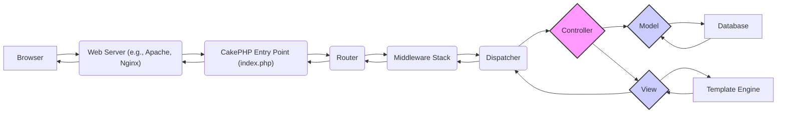

# Project Design Document: CakePHP Web Framework

**Version:** 1.1
**Date:** October 26, 2023
**Author:** AI Software Architect

## 1. Introduction

This document provides a detailed architectural design of the CakePHP web framework. It elaborates on the key components, their interactions, and the overall structure of the framework. This refined document aims to provide an even stronger foundation for subsequent threat modeling activities, offering a more granular understanding of potential security vulnerabilities and attack surfaces.

## 2. Goals and Objectives

The primary goal of CakePHP is to expedite the development of robust and scalable web applications using PHP. Key objectives include:

*   Strict adherence to the Model-View-Controller (MVC) architectural pattern for code organization and maintainability.
*   Emphasis on "Convention over Configuration" to minimize boilerplate code and accelerate development workflows.
*   Provision of built-in tools and libraries for common web development tasks, such as database interaction, form handling, and templating.
*   Prioritization of security best practices to mitigate common web application vulnerabilities.
*   Facilitation of extensibility and customization through a plugin system and helper classes.

## 3. System Architecture

CakePHP employs the Model-View-Controller (MVC) pattern to structure applications. The following diagram illustrates the detailed architecture and the flow of an HTTP request:

## 4. Components and Interactions

The core components of CakePHP and their detailed interactions are as follows:

*   **Web Server (e.g., Apache, Nginx):**
    *   Receives incoming HTTP requests from clients (browsers, APIs, etc.).
    *   Handles basic request processing and forwards requests intended for the CakePHP application to the entry point.
    *   Manages static file serving.

*   **CakePHP Entry Point (index.php):**
    *   The initial script executed for all CakePHP requests.
    *   Bootstraps the CakePHP application environment.
    *   Loads core components and configurations.

*   **Router:**
    *   Examines the incoming request URL.
    *   Matches the URL against a defined set of routes (rules mapping URLs to specific controller actions).
    *   Extracts parameters from the URL based on the matched route.
    *   Determines the target controller, action, and any passed arguments.

*   **Middleware Stack:**
    *   A series of callable components that intercept and process requests and responses.
    *   Executed in a defined order, allowing for pre-processing of requests (e.g., authentication, request modification) and post-processing of responses (e.g., adding headers, logging).
    *   Individual middleware components can perform tasks like:
        *   Authentication and authorization checks.
        *   Request and response logging.
        *   Content encoding and compression.
        *   Security header manipulation.
        *   Request data modification.

*   **Dispatcher:**
    *   Receives the routing information from the Router (controller, action, parameters).
    *   Locates and instantiates the appropriate controller class.
    *   Invokes the specified action method on the controller instance.
    *   Handles the creation of request and response objects.
    *   Orchestrates the rendering process.

*   **Controller:**
    *   Serves as the intermediary between the Model and the View.
    *   Contains application-specific logic to handle user requests.
    *   Interacts with the Model to retrieve, create, update, or delete data.
    *   Prepares data to be displayed by the View.
    *   May perform authentication and authorization checks specific to the action.
    *   Can redirect the user to different URLs or actions.

*   **Model:**
    *   Represents the data structures of the application (typically database tables).
    *   Provides an interface for interacting with the database through the CakePHP ORM (Object-Relational Mapper).
    *   Encapsulates data access logic.
    *   Defines validation rules to ensure data integrity.
    *   Manages relationships between different data entities (e.g., hasMany, belongsTo).

*   **Database:**
    *   The persistent data storage for the application.
    *   Supported databases include MySQL, PostgreSQL, SQLite, SQL Server, and others.

*   **View:**
    *   Responsible for generating the user interface or other output formats.
    *   Receives data passed from the Controller.
    *   Uses a template engine (by default, CakePHP's own template engine) to render the output.
    *   Utilizes helpers to perform common view-related tasks (e.g., form generation, URL creation, asset management).

*   **Template Engine:**
    *   Parses template files containing HTML and special syntax for embedding dynamic data and logic.
    *   Merges the data provided by the View with the template to produce the final output (e.g., HTML, JSON, XML).

## 5. Data Flow

A typical HTTP request lifecycle within a CakePHP application proceeds as follows:

1. A client (e.g., a web browser) sends an HTTP request to the **Web Server**.
2. The **Web Server** identifies the request as belonging to the CakePHP application and forwards it to the **CakePHP Entry Point (index.php)**.
3. The **Router** examines the request URL and matches it against defined routes to determine the target **Controller** and action.
4. The **Middleware Stack** processes the request. Each middleware component in the stack has the opportunity to inspect and modify the request before it reaches the Dispatcher.
5. The **Dispatcher** receives the routing information and instantiates the identified **Controller**.
6. The specified action method within the **Controller** is executed.
7. The **Controller** interacts with the **Model** to retrieve or manipulate data from the **Database**.
8. The **Controller** prepares the necessary data and passes it to the **View**.
9. The **View**, using the **Template Engine**, renders the output based on the provided data and template files.
10. The rendered output is passed back through the **Dispatcher**.
11. The **Middleware Stack** processes the response. Middleware components can modify the response before it's sent back to the client.
12. The **Web Server** sends the generated response back to the client's browser.

## 6. Security Considerations

CakePHP incorporates numerous security features and encourages secure development practices:

*   **Cross-Site Request Forgery (CSRF) Protection:**
    *   Built-in middleware and form helpers automatically generate and validate CSRF tokens to prevent unauthorized requests.

*   **Input Validation and Sanitization:**
    *   The Model layer allows defining strict validation rules for data before it's processed or stored, preventing invalid or malicious data from entering the application.
    *   Input sanitization techniques can be applied to clean user input.

*   **Output Encoding (Escaping):**
    *   View helpers provide functions to escape output data before rendering it in templates, mitigating Cross-Site Scripting (XSS) vulnerabilities. Different escaping strategies are available depending on the context (HTML, JavaScript, URL).

*   **SQL Injection Prevention:**
    *   The CakePHP ORM uses parameterized queries, ensuring that user-provided data is treated as data and not executable code, effectively preventing SQL injection attacks.

*   **Authentication and Authorization:**
    *   Provides components and libraries for implementing robust user authentication (verifying user identity) and authorization (controlling access to resources).
    *   Flexible authentication adapters support various methods (e.g., database, LDAP, OAuth).

*   **Security Headers:**
    *   Configuration options and middleware can be used to set security-related HTTP headers, such as:
        *   `Strict-Transport-Security` (HSTS) to enforce HTTPS.
        *   `X-Frame-Options` to prevent clickjacking.
        *   `X-Content-Type-Options` to prevent MIME sniffing.
        *   `Content-Security-Policy` (CSP) to control resources the browser is allowed to load.

*   **Session Management:**
    *   Secure session handling with options for configuring cookie security attributes (e.g., `HttpOnly`, `Secure`, `SameSite`).

*   **Error and Exception Handling:**
    *   Mechanisms to handle errors and exceptions gracefully, preventing sensitive information from being exposed in error messages.

*   **Middleware for Security Enforcement:**
    *   Middleware can be custom-built or used from third-party packages to enforce specific security policies and checks at the request/response level.

*   **Protection Against Common Web Vulnerabilities:**
    *   CakePHP's architecture and features help developers avoid common vulnerabilities like mass assignment, insecure direct object references, and others when used correctly.

## 7. Deployment Considerations

Deploying a CakePHP application involves several key considerations:

*   **Web Server Configuration:**
    *   Properly configure the web server (Apache or Nginx) to route requests to the CakePHP application's `webroot` directory.
    *   Set up virtual hosts or server blocks to handle domain names.
    *   Ensure proper handling of `.htaccess` files (for Apache) or equivalent configurations for Nginx.

*   **PHP Version and Extensions:**
    *   The server must run a supported and secure version of PHP.
    *   Required PHP extensions (e.g., `mbstring`, `intl`, database drivers) must be installed and enabled.

*   **Database Configuration:**
    *   Securely configure the database connection details (hostname, username, password) in CakePHP's configuration files.
    *   Ensure the database server is properly secured.

*   **File Permissions:**
    *   Set appropriate file and directory permissions to prevent unauthorized access and modification. The `tmp` and `logs` directories typically require write permissions for the web server user.

*   **HTTPS Configuration:**
    *   Enforce HTTPS by obtaining and installing an SSL/TLS certificate.
    *   Configure the web server to redirect HTTP traffic to HTTPS.

*   **Environment Variables:**
    *   Use environment variables to store sensitive configuration settings (e.g., database credentials, API keys) instead of hardcoding them in configuration files.

*   **Security Updates:**
    *   Regularly update CakePHP and its dependencies (including PHP and the web server) to patch security vulnerabilities. Use Composer for managing dependencies.

*   **Deployment Tools:**
    *   Consider using deployment tools and strategies (e.g., Capistrano, Deployer, Git-based deployments) for automated and reliable deployments.

## 8. Technologies Used

*   **Programming Language:** PHP
*   **Architectural Pattern:** Model-View-Controller (MVC)
*   **Templating Engine:**  CakePHP's built-in template engine (supports layouts, elements, and helpers)
*   **Database Abstraction:** CakePHP ORM (built on top of PDO)
*   **Web Servers (Typical):** Apache, Nginx
*   **Front-end Technologies (Optional):** HTML, CSS, JavaScript, and integration with various JavaScript frameworks/libraries
*   **Dependency Management:** Composer
