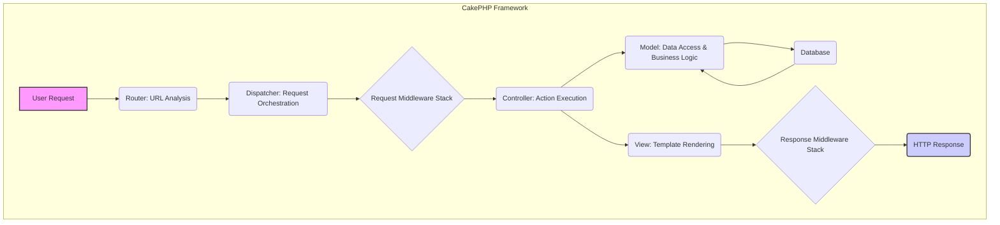
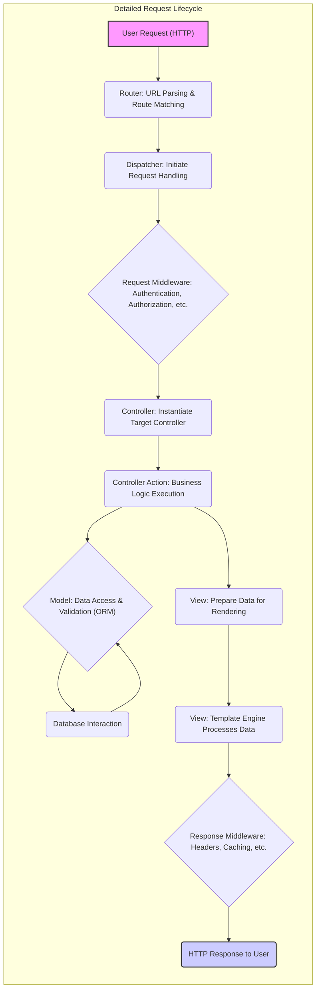

# Project Design Document: CakePHP Framework

**Version:** 1.1
**Date:** October 26, 2023
**Author:** AI Software Architect

## 1. Introduction

This document provides an enhanced architectural overview of the CakePHP framework, focusing on aspects relevant to security threat modeling. It details the framework's core components, their interactions, and the flow of data, providing a solid foundation for identifying potential vulnerabilities and attack surfaces. This revised version aims for greater clarity and detail to facilitate a more comprehensive threat analysis.

## 2. Goals

*   Deliver a precise and detailed architectural description of the CakePHP framework, optimized for security analysis.
*   Clearly identify the responsibilities and interactions of key framework components.
*   Illustrate the complete lifecycle of a request within the framework, highlighting potential interception points.
*   Serve as a definitive resource for security professionals conducting threat modeling exercises.
*   Enable informed decisions regarding security controls, mitigation strategies, and secure development practices.

## 3. Scope

This document focuses on the fundamental architectural elements of the CakePHP framework that are pertinent to security considerations. This includes:

*   Detailed request handling and routing mechanisms.
*   The implementation of the Model-View-Controller (MVC) pattern and its security implications.
*   Database interaction processes and the role of the ORM in security.
*   The templating engine and potential vulnerabilities in view rendering.
*   The functionality of Components and Helpers and their security context.
*   The middleware pipeline and its significance for request/response manipulation and security enforcement.
*   The event system and its potential impact on security.
*   Core security features provided directly by the framework.

This document explicitly excludes:

*   Specific application-level code built on top of CakePHP.
*   In-depth analysis of individual third-party plugins or extensions.
*   Detailed infrastructure and deployment environment configurations.
*   Line-by-line code examination of CakePHP's internal implementation.

## 4. Architectural Overview

CakePHP adheres to the Model-View-Controller (MVC) architectural pattern, promoting separation of concerns. This structure is crucial for understanding potential attack vectors at different layers. Key architectural elements orchestrate the processing of user requests:

*   **Presentation Layer (View):** Responsible for rendering the user interface.
*   **Application Layer (Controller):** Handles user requests and orchestrates interactions between the Model and View.
*   **Data Layer (Model):** Manages data and interacts with the database.

Beyond MVC, the framework incorporates:

*   **Router:** Directs incoming requests to the appropriate controller action.
*   **Dispatcher:**  The central engine that manages the request lifecycle.
*   **Middleware Stack:** A series of interceptors for requests and responses.
*   **Components:** Reusable logic modules within controllers.
*   **Helpers:** Reusable presentation logic for views.
*   **Event System:** Facilitates decoupled communication between components.

## 5. Key Components

*   **Router:**
    *   Parses incoming HTTP requests to determine the target controller and action.
    *   Matches URLs against defined routes, including parameterized routes.
    *   Responsible for generating URLs based on defined routes.
    *   Misconfigurations in routing can lead to unintended access or information disclosure.

*   **Dispatcher:**
    *   The core engine responsible for processing requests.
    *   Invokes the request middleware pipeline.
    *   Instantiates the appropriate controller based on routing.
    *   Executes the requested action on the controller.
    *   Handles exceptions and errors, potentially revealing sensitive information if not configured correctly.
    *   Invokes the response middleware pipeline.

*   **Controllers:**
    *   Receive requests from the Dispatcher after middleware processing.
    *   Interact with Models to retrieve, create, update, or delete data.
    *   Prepare data for rendering by the View.
    *   Select the appropriate View to generate the response.
    *   Utilize Components for shared logic, which can introduce vulnerabilities if not properly secured.

*   **Models:**
    *   Represent data structures and business logic.
    *   Interact with the database using CakePHP's ORM.
    *   Enforce data validation rules, crucial for preventing data integrity issues and injection attacks.
    *   Provide methods for data manipulation, which must be secured against unauthorized access.

*   **Views:**
    *   Responsible for rendering the user interface, typically using HTML templates.
    *   Receive data from the Controller to be displayed.
    *   Utilize Helpers for presentation logic, which can introduce XSS vulnerabilities if not handled carefully.
    *   Can generate various output formats (e.g., JSON, XML), each with its own security considerations.

*   **Components:**
    *   Reusable logic modules that can be shared across multiple controllers.
    *   Handle tasks such as authentication, authorization, session management, and request manipulation.
    *   Security vulnerabilities in components can have widespread impact.

*   **Helpers:**
    *   Reusable presentation logic for use within View templates.
    *   Generate HTML elements, format data, and create links.
    *   Improper use of Helpers can lead to XSS vulnerabilities.

*   **Middleware:**
    *   Functions that intercept HTTP requests and responses, forming a pipeline.
    *   Executed in a defined order, allowing for request modification, authentication, logging, and response manipulation.
    *   Crucial for implementing security policies and controls.
    *   Misconfigured middleware can create security gaps.

*   **Event System:**
    *   Enables decoupled communication between different parts of the application.
    *   Components can subscribe to and emit events.
    *   While powerful, improper event handling could potentially be exploited.

*   **ORM (Object-Relational Mapper):**
    *   Provides an abstraction layer for database interaction.
    *   Uses parameterized queries to prevent SQL injection vulnerabilities.
    *   Manages database connections and data mapping.
    *   Configuration vulnerabilities in the ORM can compromise database security.

## 6. Data Flow

The flow of data through a CakePHP application is critical for understanding potential interception and manipulation points:

1. **User Request:** A user initiates an HTTP request (e.g., GET, POST).
2. **Router Processing:** The Router analyzes the request URL and matches it to a defined route.
3. **Route Dispatch:** The Router identifies the target controller and action.
4. **Request Middleware Execution:** The Dispatcher executes the request middleware stack in order. Each middleware can inspect or modify the request.
5. **Controller Instantiation:** The Dispatcher instantiates the determined controller.
6. **Action Invocation:** The specified action within the controller is executed.
7. **Model Interaction:** The controller interacts with Models to retrieve or manipulate data.
8. **Database Query (if applicable):** The Model uses the ORM to construct and execute database queries.
9. **Data Retrieval/Manipulation:** The database processes the query and returns data or performs modifications.
10. **View Preparation:** The controller prepares data to be passed to the View.
11. **View Rendering:** The View uses the provided data and template files to generate the HTTP response body.
12. **Response Middleware Execution:** The Dispatcher executes the response middleware stack in order. Each middleware can inspect or modify the response.
13. **HTTP Response:** The Dispatcher sends the generated HTTP response back to the user's browser.

## 7. Security Considerations (Framework Level)

CakePHP provides several built-in security features and encourages secure development practices:

*   **Cross-Site Scripting (XSS) Prevention:**
    *   Output escaping is the default behavior in View templates, mitigating XSS risks.
    *   Context-aware escaping functions (`h()`, `e()`) allow for precise control over output encoding.
    *   The `SecurityHelper` provides additional tools for sanitizing user input.

*   **Cross-Site Request Forgery (CSRF) Protection:**
    *   CSRF middleware can be enabled to protect against CSRF attacks.
    *   The `FormHelper` automatically generates CSRF tokens for forms.
    *   Requires careful handling of AJAX requests to include CSRF tokens.

*   **SQL Injection Prevention:**
    *   The ORM utilizes parameterized queries, significantly reducing the risk of SQL injection.
    *   Manual query building should always use parameterized queries or prepared statements.
    *   Input validation and sanitization are crucial complements to ORM protection.

*   **Session Management Security:**
    *   Provides secure session handling with options for cookie security flags (HttpOnly, Secure, SameSite).
    *   Built-in protection against session fixation attacks.
    *   Configuration options for session timeout and regeneration.

*   **Authentication and Authorization Mechanisms:**
    *   Provides flexible authentication components for handling user login and identity verification.
    *   Authorization middleware allows for controlling access to specific resources and actions.
    *   Integration with various authentication providers is possible.

*   **Input Validation and Sanitization:**
    *   Robust validation rules can be defined in Models to ensure data integrity.
    *   Sanitization functions can be used to clean user input before processing.

*   **Security Headers:**
    *   Middleware can be used to set security-related HTTP headers such as Content-Security-Policy (CSP), X-Frame-Options, and HTTP Strict Transport Security (HSTS).

*   **Protection Against Common Web Vulnerabilities:**
    *   Framework features and best practices help mitigate risks associated with common OWASP Top Ten vulnerabilities.

## 8. Deployment Considerations

Secure deployment practices are essential for the overall security of CakePHP applications:

*   **Web Server Security:** Properly configure the web server (e.g., Apache, Nginx) with security best practices.
*   **PHP Configuration:** Secure PHP settings, including disabling dangerous functions and setting appropriate error reporting levels.
*   **File System Permissions:** Implement strict file and directory permissions to prevent unauthorized access.
*   **HTTPS Enforcement:** Always enforce HTTPS to encrypt communication between the client and server.
*   **Database Security:** Secure the database server, including strong passwords and restricted access.
*   **Regular Updates:** Keep CakePHP, PHP, and all dependencies updated to patch security vulnerabilities.

## 9. Future Considerations

*   Detailed threat modeling exercises focusing on specific components and data flows.
*   Analysis of potential vulnerabilities in custom code built on top of the framework.
*   Evaluation of the security implications of integrating with external services and APIs.
*   Continuous monitoring and security auditing of deployed applications.

This enhanced design document provides a more detailed and security-focused overview of the CakePHP framework. It serves as a valuable resource for security professionals to understand the framework's architecture and identify potential areas of risk. The detailed component descriptions, data flow diagrams, and security considerations offer a solid foundation for conducting comprehensive threat modeling activities.