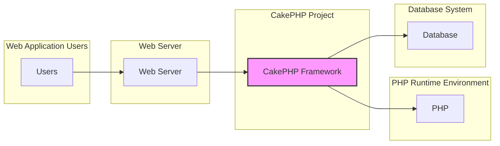
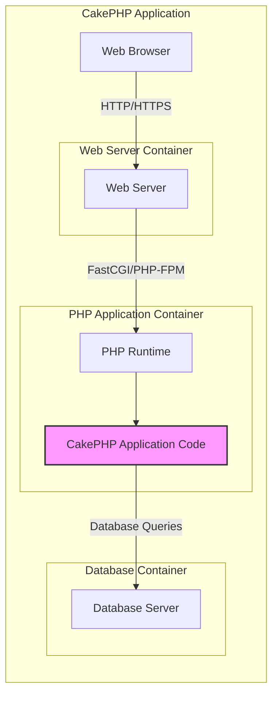
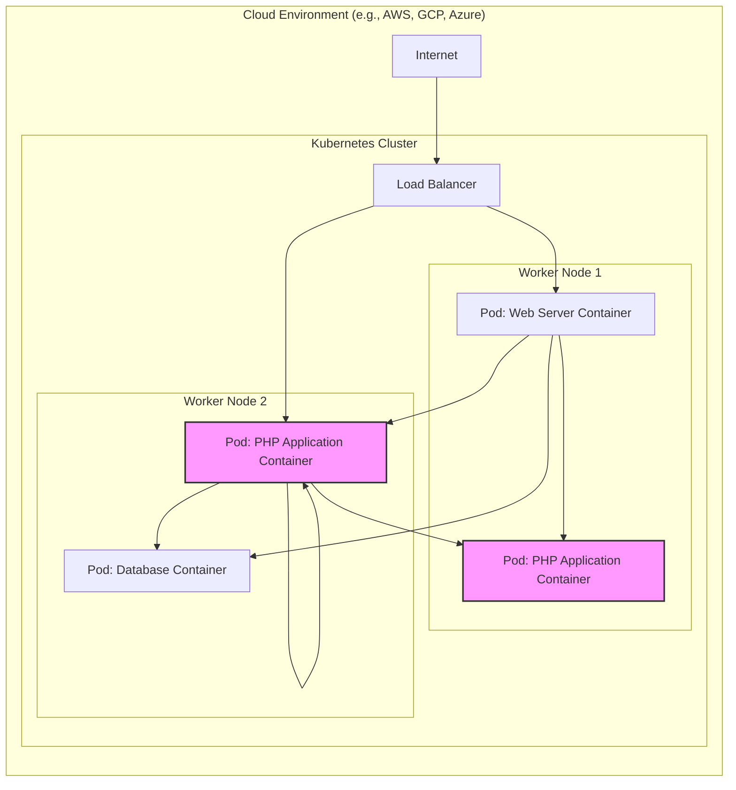
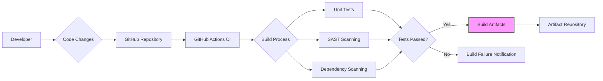

# BUSINESS POSTURE

CakePHP is an open-source rapid development framework for PHP. Its primary business priority is to provide a robust, secure, and easy-to-use framework that enables developers to build web applications efficiently. The goal is to empower developers to create high-quality web applications quickly, reducing development time and complexity.

Most important business risks that need to be addressed:
- Risk of security vulnerabilities in the framework itself, which could be exploited in applications built with CakePHP.
- Risk of poor documentation or lack of community support, hindering adoption and developer productivity.
- Risk of the framework becoming outdated or incompatible with newer PHP versions or technologies.
- Risk of performance issues in applications built with CakePHP due to framework inefficiencies.
- Risk of legal issues related to licensing or intellectual property if not properly managed.

# SECURITY POSTURE

security control: Code reviews are conducted by core team members for contributions to the framework. (Implemented in: GitHub pull request process)
security control: Automated testing including unit and integration tests are part of the development process. (Implemented in: GitHub Actions CI)
security control: Security advisories are published for known vulnerabilities. (Implemented in: CakePHP Security Advisories page and GitHub Security Advisories)
accepted risk: Reliance on community contributions for identifying and reporting security vulnerabilities.
accepted risk: Potential delay in patching vulnerabilities due to the open-source nature and volunteer-driven maintenance.

recommended security control: Implement static application security testing (SAST) tools in the CI/CD pipeline to automatically detect potential vulnerabilities in code changes.
recommended security control: Regularly perform dependency vulnerability scanning to identify and update vulnerable dependencies.
recommended security control: Establish a clear security incident response plan for handling reported vulnerabilities.

Security Requirements:
- Authentication: While CakePHP itself doesn't enforce a specific authentication mechanism, applications built with CakePHP will require robust authentication to verify user identities. This is typically implemented within the application layer using CakePHP's authentication components or third-party libraries.
- Authorization: Applications built with CakePHP must implement authorization mechanisms to control user access to resources and functionalities. CakePHP provides tools for building authorization logic within applications.
- Input Validation: CakePHP applications must validate all user inputs to prevent injection attacks (e.g., SQL injection, XSS). CakePHP provides input validation features and encourages developers to use them.
- Cryptography: CakePHP applications should use cryptography to protect sensitive data in transit and at rest. CakePHP provides utilities for encryption and hashing, and applications should leverage these or secure cryptographic libraries.

# DESIGN

## C4 CONTEXT

Context Diagram Elements:

- Name: Users
  - Type: Person
  - Description: End-users who interact with web applications built using CakePHP.
  - Responsibilities: Access web applications to perform tasks and consume content.
  - Security controls: User devices security, strong passwords, multi-factor authentication (application specific).

- Name: CakePHP Framework
  - Type: Software System
  - Description: An open-source PHP framework for rapid web development, providing structure and tools for building web applications.
  - Responsibilities: Provides core functionalities for web application development, including routing, ORM, templating, and security components.
  - Security controls: Input validation, output encoding, CSRF protection, security headers, secure session management (framework level controls).

- Name: PHP
  - Type: Software System
  - Description: The PHP runtime environment that executes CakePHP applications.
  - Responsibilities: Interprets and executes PHP code, manages resources, and provides core functionalities for web applications.
  - Security controls: PHP configuration hardening (e.g., disable dangerous functions), regular PHP updates, security extensions (runtime environment level controls).

- Name: Database
  - Type: Software System
  - Description: A database system (e.g., MySQL, PostgreSQL, SQLite) used by CakePHP applications to store and retrieve data.
  - Responsibilities: Persists application data, manages data integrity, and provides data access functionalities.
  - Security controls: Database access control, encryption at rest, regular security patching, database firewall (infrastructure level controls).

- Name: Web Server
  - Type: Software System
  - Description: A web server (e.g., Apache, Nginx) that serves CakePHP applications to users.
  - Responsibilities: Handles HTTP requests, serves static files, and proxies requests to the PHP runtime environment.
  - Security controls: Web server configuration hardening, TLS/SSL configuration, access control, web application firewall (infrastructure level controls).

## C4 CONTAINER

Container Diagram Elements:

- Name: Web Browser
  - Type: Client Application
  - Description: User's web browser used to access the CakePHP application.
  - Responsibilities: Rendering the user interface, sending HTTP requests, and receiving HTTP responses.
  - Security controls: Browser security features, user awareness of phishing and malicious websites (client-side controls).

- Name: Web Server
  - Type: Web Server
  - Description: Web server (e.g., Apache, Nginx) responsible for handling HTTP requests and serving static content.
  - Responsibilities: Handling incoming HTTP requests, serving static files, reverse proxying requests to the PHP application container.
  - Security controls: TLS/SSL termination, web application firewall (WAF), rate limiting, access control lists (server-side controls).

- Name: CakePHP Application Code
  - Type: Application
  - Description: The PHP code of the CakePHP application, including controllers, models, views, and configuration.
  - Responsibilities: Implementing application logic, handling user requests, interacting with the database, and rendering views.
  - Security controls: Input validation, output encoding, authorization logic, secure coding practices, vulnerability scanning (application code level controls).

- Name: PHP Runtime
  - Type: Runtime Environment
  - Description: PHP runtime environment (e.g., PHP-FPM) that executes the CakePHP application code.
  - Responsibilities: Interpreting and executing PHP code, managing resources, and providing PHP functionalities.
  - Security controls: PHP configuration hardening, security extensions, regular PHP updates (runtime environment level controls).

- Name: Database Server
  - Type: Database
  - Description: Database server (e.g., MySQL, PostgreSQL) used to store and retrieve application data.
  - Responsibilities: Persisting application data, managing data integrity, and handling database queries.
  - Security controls: Database access control, encryption at rest, regular security patching, database auditing (database level controls).

## DEPLOYMENT

Deployment Solution: Cloud-based deployment using containers (e.g., Docker) and orchestration (e.g., Kubernetes).

Deployment Diagram Elements:

- Name: Internet
  - Type: Network
  - Description: Public internet network.
  - Responsibilities: Provides connectivity for users to access the application.
  - Security controls: DDoS protection, network monitoring (external network controls).

- Name: Load Balancer
  - Type: Infrastructure Component
  - Description: Cloud load balancer distributing traffic across application pods.
  - Responsibilities: Distributing incoming traffic, health checks, TLS termination.
  - Security controls: TLS/SSL configuration, rate limiting, WAF (load balancer level controls).

- Name: Pod: Web Server Container
  - Type: Container
  - Description: Container running a web server (e.g., Nginx) instance.
  - Responsibilities: Serving static content, reverse proxying to PHP application containers.
  - Security controls: Container image scanning, least privilege container configuration, network policies (container level controls).

- Name: Pod: PHP Application Container
  - Type: Container
  - Description: Container running the CakePHP application and PHP runtime.
  - Responsibilities: Executing CakePHP application code, handling business logic, interacting with the database.
  - Security controls: Container image scanning, least privilege container configuration, application-level security controls (container level controls).

- Name: Pod: Database Container
  - Type: Container
  - Description: Container running a database server instance.
  - Responsibilities: Storing and managing application data.
  - Security controls: Container image scanning, database access control, data encryption at rest, network policies (container level controls).

- Name: Kubernetes Cluster
  - Type: Orchestration Platform
  - Description: Kubernetes cluster managing container deployment and orchestration.
  - Responsibilities: Container orchestration, scaling, health monitoring, resource management.
  - Security controls: Kubernetes RBAC, network policies, security audits, regular updates (orchestration platform level controls).

- Name: Worker Node 1 & Worker Node 2
  - Type: Compute Instance
  - Description: Virtual machines or physical servers running Kubernetes worker nodes.
  - Responsibilities: Providing compute resources for running containers.
  - Security controls: OS hardening, security monitoring, regular patching (infrastructure level controls).

- Name: Cloud Environment
  - Type: Cloud Provider Infrastructure
  - Description: Cloud provider infrastructure (e.g., AWS, GCP, Azure).
  - Responsibilities: Providing underlying infrastructure, networking, and managed services.
  - Security controls: Cloud provider security controls, infrastructure security best practices (cloud provider level controls).

## BUILD

Build Process Description:

1. Developer: Developers write and commit code changes.
2. Code Changes: Code changes are pushed to the GitHub repository.
3. GitHub Repository: The central repository hosting the CakePHP codebase.
4. GitHub Actions CI: GitHub Actions is used for continuous integration and continuous delivery.
5. Build Process: Automated build process triggered by code changes.
6. Unit Tests: Automated unit tests are executed to verify code functionality.
7. SAST Scanning: Static Application Security Testing tools scan the code for potential vulnerabilities.
8. Dependency Scanning: Dependency scanning tools check for known vulnerabilities in project dependencies.
9. Tests Passed?: Checks if all tests and security scans passed.
10. Build Artifacts: If tests and scans pass, build artifacts are created (e.g., distribution packages).
11. Build Failure Notification: If tests or scans fail, developers are notified.
12. Artifact Repository: Build artifacts are stored in an artifact repository (e.g., GitHub Releases, package registry).

Build Security Controls:

- security control: Automated build process using GitHub Actions CI. (Implemented in: GitHub Actions workflows)
- security control: Unit tests to ensure code quality and prevent regressions. (Implemented in: PHPUnit tests in the repository)
- security control: Static Application Security Testing (SAST) during build process. (Recommended: Integrate SAST tools into GitHub Actions workflow)
- security control: Dependency vulnerability scanning during build process. (Recommended: Integrate dependency scanning tools into GitHub Actions workflow)
- security control: Code review process before merging code changes. (Implemented in: GitHub pull request process)
- security control: Artifact signing to ensure integrity and authenticity of build artifacts. (Recommended: Implement artifact signing for releases)

# RISK ASSESSMENT

Critical Business Processes:
- Providing a secure and reliable framework for web application development.
- Maintaining the framework's functionality and compatibility.
- Supporting the CakePHP developer community.

Data Sensitivity:
- Source code of the CakePHP framework (Medium sensitivity - public repository, but integrity is important).
- Security vulnerability information (High sensitivity - needs to be handled confidentially until a patch is available).
- User data on the CakePHP website (Low to Medium sensitivity - depends on the type of data collected, e.g., forum posts, user accounts).
- Build artifacts (Medium sensitivity - integrity and availability are important).

# QUESTIONS & ASSUMPTIONS

Questions:
- What are the specific security tools currently used in the CakePHP CI/CD pipeline (SAST, dependency scanning)?
- Is there a formal security incident response plan in place for CakePHP?
- Are build artifacts signed to ensure integrity?
- What is the process for managing and disclosing security vulnerabilities?

Assumptions:
- CakePHP project prioritizes security and aims to provide a secure framework.
- The development team follows secure coding practices.
- The community plays a role in identifying and reporting security issues.
- The project uses GitHub Actions for CI/CD.
- Deployment is assumed to be cloud-based using containers and orchestration for scalability and resilience.