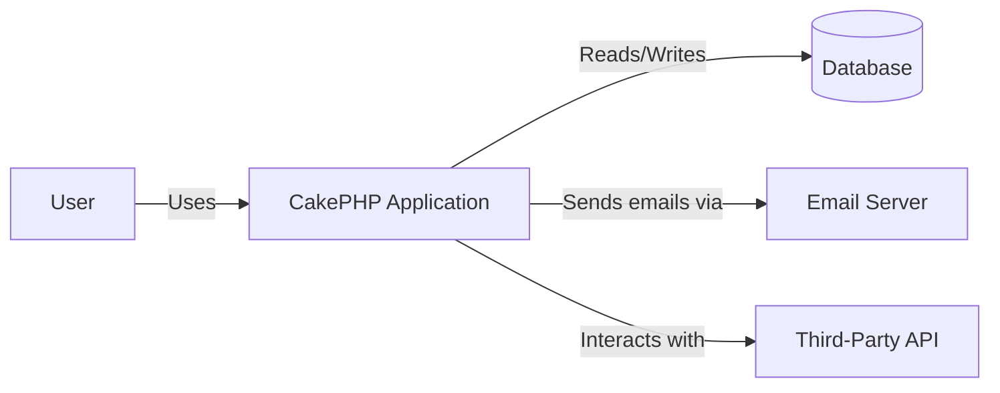
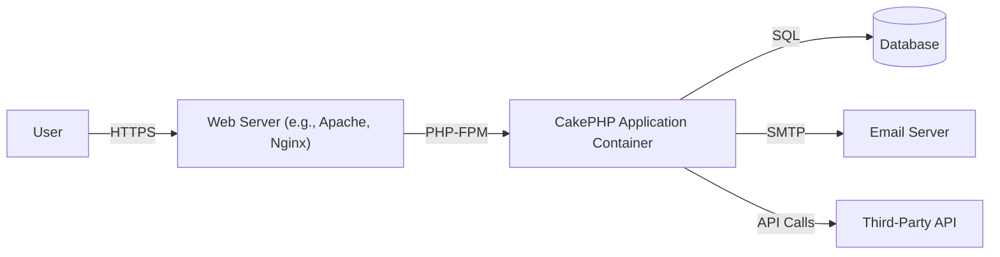
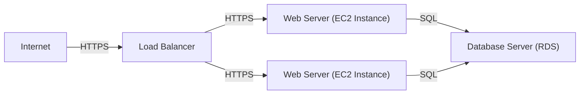
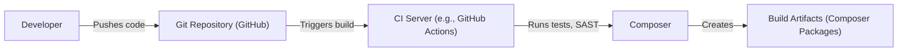

# BUSINESS POSTURE

Business Priorities and Goals:

*   Provide a robust and flexible framework for PHP web application development.
*   Enable rapid development of secure and maintainable web applications.
*   Foster a large and active community of users and contributors.
*   Maintain a high level of code quality and stability.
*   Offer comprehensive documentation and support resources.
*   Stay current with the latest PHP versions and best practices.

Most Important Business Risks:

*   Security vulnerabilities in the framework could lead to widespread exploitation of applications built with CakePHP.
*   Lack of maintenance or updates could lead to the framework becoming obsolete or incompatible with newer PHP versions.
*   A decline in community participation could hinder the framework's development and support.
*   Poor documentation or support could make it difficult for developers to use the framework effectively.
*   Competition from other PHP frameworks could reduce CakePHP's market share.

# SECURITY POSTURE

Existing Security Controls:

*   security control: Built-in security components for handling common web application vulnerabilities (e.g., CSRF, XSS, SQL injection). Described in CakePHP documentation and implemented in the framework's core components.
*   security control: ORM (Object-Relational Mapper) to prevent SQL injection. Described in CakePHP documentation and implemented in the framework's database interaction layer.
*   security control: Input validation helpers and rules. Described in CakePHP documentation and implemented in the framework's form handling and data validation components.
*   security control: Authentication and authorization components. Described in CakePHP documentation and implemented in the framework's security and access control components.
*   security control: Security utilities for tasks like password hashing and encryption. Described in CakePHP documentation and implemented in the framework's security utilities.
*   security control: Regular security audits and updates. Implemented through the CakePHP core team's development process.

Accepted Risks:

*   accepted risk: Reliance on third-party libraries and plugins, which may have their own security vulnerabilities.
*   accepted risk: Potential for misconfiguration or improper use of security features by developers using the framework.
*   accepted risk: Zero-day vulnerabilities that may not be immediately addressed.

Recommended Security Controls:

*   security control: Implement a robust Content Security Policy (CSP) to mitigate XSS attacks.
*   security control: Integrate with static application security testing (SAST) tools for continuous code analysis.
*   security control: Provide more detailed guidance and tooling for secure deployment and configuration.
*   security control: Establish a bug bounty program to incentivize security researchers to report vulnerabilities.

Security Requirements:

*   Authentication:
    *   Support for various authentication methods (e.g., username/password, OAuth, API keys).
    *   Secure password storage using strong hashing algorithms (e.g., bcrypt, Argon2).
    *   Protection against brute-force attacks.
    *   Session management with secure cookies (HTTP-only, secure flag).
*   Authorization:
    *   Role-based access control (RBAC) or attribute-based access control (ABAC).
    *   Fine-grained control over access to resources and actions.
    *   Protection against privilege escalation attacks.
*   Input Validation:
    *   Strict validation of all user input to prevent injection attacks (XSS, SQLi, etc.).
    *   Whitelist-based validation whenever possible.
    *   Proper encoding and escaping of output to prevent XSS.
*   Cryptography:
    *   Use of strong, industry-standard cryptographic algorithms for encryption and hashing.
    *   Secure key management practices.
    *   Protection of sensitive data in transit and at rest.

# DESIGN

## C4 CONTEXT

Element Descriptions:

*   Element:
    *   Name: User
    *   Type: Person
    *   Description: A user of the CakePHP application.
    *   Responsibilities: Interacts with the application through a web browser or other client.
    *   Security controls: Authentication, Authorization.

*   Element:
    *   Name: CakePHP Application
    *   Type: Software System
    *   Description: The web application built using the CakePHP framework.
    *   Responsibilities: Handles user requests, processes data, interacts with other systems.
    *   Security controls: Input validation, output encoding, CSRF protection, XSS protection, SQL injection prevention, authentication, authorization.

*   Element:
    *   Name: Database
    *   Type: Database
    *   Description: The database used by the CakePHP application to store data.
    *   Responsibilities: Stores and retrieves data for the application.
    *   Security controls: Access control, encryption at rest, database firewall.

*   Element:
    *   Name: Email Server
    *   Type: Software System
    *   Description: An external email server used by the CakePHP application to send emails.
    *   Responsibilities: Sends emails on behalf of the application.
    *   Security controls: TLS encryption, sender authentication (SPF, DKIM, DMARC).

*   Element:
    *   Name: Third-Party API
    *   Type: Software System
    *   Description: An external API that the CakePHP application interacts with.
    *   Responsibilities: Provides specific functionality or data to the application.
    *   Security controls: API keys, OAuth, rate limiting, input validation.

## C4 CONTAINER

Element Descriptions:

*   Element:
    *   Name: User
    *   Type: Person
    *   Description: A user of the CakePHP application.
    *   Responsibilities: Interacts with the application through a web browser or other client.
    *   Security controls: Authentication, Authorization.

*   Element:
    *   Name: Web Server (e.g., Apache, Nginx)
    *   Type: Web Server
    *   Description: The web server that hosts the CakePHP application.
    *   Responsibilities: Receives HTTP requests from users and forwards them to the CakePHP application.
    *   Security controls: TLS encryption, access control, web application firewall (WAF).

*   Element:
    *   Name: CakePHP Application Container
    *   Type: Application Container
    *   Description: The container that runs the CakePHP application code.
    *   Responsibilities: Executes the application logic, handles requests, interacts with other containers.
    *   Security controls: Input validation, output encoding, CSRF protection, XSS protection, SQL injection prevention, authentication, authorization.

*   Element:
    *   Name: Database
    *   Type: Database
    *   Description: The database used by the CakePHP application to store data.
    *   Responsibilities: Stores and retrieves data for the application.
    *   Security controls: Access control, encryption at rest, database firewall.

*   Element:
    *   Name: Email Server
    *   Type: Software System
    *   Description: An external email server used by the CakePHP application to send emails.
    *   Responsibilities: Sends emails on behalf of the application.
    *   Security controls: TLS encryption, sender authentication (SPF, DKIM, DMARC).

*   Element:
    *   Name: Third-Party API
    *   Type: Software System
    *   Description: An external API that the CakePHP application interacts with.
    *   Responsibilities: Provides specific functionality or data to the application.
    *   Security controls: API keys, OAuth, rate limiting, input validation.

## DEPLOYMENT

Possible Deployment Solutions:

1.  Traditional LAMP/LEMP stack on a single server.
2.  Cloud-based deployment using virtual machines (e.g., AWS EC2, Google Compute Engine, Azure VMs).
3.  Containerized deployment using Docker and an orchestration platform (e.g., Kubernetes, Docker Swarm).
4.  Serverless deployment using platforms like AWS Lambda or Google Cloud Functions (less common for full CakePHP applications, but possible for specific components).

Chosen Solution (for detailed description): Cloud-based deployment using virtual machines (e.g., AWS EC2).

Element Descriptions:

*   Element:
    *   Name: Internet
    *   Type: Network
    *   Description: The public internet.
    *   Responsibilities: Connects users to the application.
    *   Security controls: None (relies on downstream security controls).

*   Element:
    *   Name: Load Balancer
    *   Type: Load Balancer
    *   Description: Distributes incoming traffic across multiple web servers.
    *   Responsibilities: Distributes traffic, handles SSL termination.
    *   Security controls: TLS encryption, DDoS protection.

*   Element:
    *   Name: Web Server (EC2 Instance)
    *   Type: Virtual Machine
    *   Description: An EC2 instance running a web server (e.g., Apache, Nginx) and the CakePHP application.
    *   Responsibilities: Hosts the application, handles HTTP requests.
    *   Security controls: Firewall, intrusion detection system (IDS), regular security updates.

*   Element:
    *   Name: Database Server (RDS)
    *   Type: Managed Database Service
    *   Description: A managed database service (e.g., AWS RDS) hosting the application's database.
    *   Responsibilities: Stores and manages application data.
    *   Security controls: Access control, encryption at rest, automated backups, database firewall.

## BUILD

Build Process Description:

1.  Developer: Developers write code and push changes to a Git repository (e.g., GitHub).
2.  Git Repository: The Git repository stores the application's source code and triggers the build process upon code changes.
3.  CI Server: A continuous integration (CI) server (e.g., GitHub Actions, Jenkins) is triggered by changes in the Git repository.
4.  Build Steps:
    *   Checkout Code: The CI server checks out the latest code from the repository.
    *   Dependency Management: Composer is used to install project dependencies.
    *   Static Analysis: Static application security testing (SAST) tools (e.g., PHPStan, Psalm) are run to identify potential security vulnerabilities and code quality issues.
    *   Unit Tests: Unit tests are executed to verify the functionality of individual components.
    *   Integration Tests: Integration tests are run to ensure that different parts of the application work together correctly.
    *   Build Artifacts: If all tests and checks pass, build artifacts (e.g., Composer packages) are created.
5.  Artifact Storage: The build artifacts are stored in a package repository or artifact storage.

Security Controls:

*   security control: SAST tools are integrated into the build process to identify security vulnerabilities early.
*   security control: Dependency scanning tools are used to detect known vulnerabilities in third-party libraries.
*   security control: Automated tests (unit, integration) are run to ensure code quality and prevent regressions.
*   security control: Code reviews are performed to identify potential security issues and ensure adherence to coding standards.
*   security control: The CI/CD pipeline is secured to prevent unauthorized access and modification.
*   security control: Supply chain security measures are implemented to verify the integrity of dependencies.

# RISK ASSESSMENT

Critical Business Processes:

*   User registration and authentication.
*   Data management (CRUD operations).
*   Application-specific business logic (e.g., e-commerce transactions, content management).
*   Communication with external services (e.g., email, third-party APIs).

Data Sensitivity:

*   User data (e.g., usernames, passwords, email addresses, personal information): High sensitivity.
*   Application data (e.g., content, transactions, financial data): Varies depending on the specific application, but potentially high sensitivity.
*   Configuration data (e.g., database credentials, API keys): High sensitivity.
*   Logs: Medium sensitivity (may contain sensitive information).

# QUESTIONS & ASSUMPTIONS

Questions:

*   What specific third-party libraries and plugins are commonly used with CakePHP applications in this context?
*   What are the specific regulatory compliance requirements (e.g., GDPR, HIPAA, PCI DSS) that apply to CakePHP applications?
*   What is the expected traffic volume and scalability requirements for CakePHP applications?
*   What is the existing infrastructure and deployment environment for CakePHP applications?
*   What level of security expertise is available within the development team?

Assumptions:

*   BUSINESS POSTURE: The organization prioritizes security and is willing to invest in necessary security controls.
*   SECURITY POSTURE: Developers using CakePHP have a basic understanding of web application security principles.
*   DESIGN: The CakePHP application will be deployed in a cloud-based environment.
*   DESIGN: The application will use a relational database.
*   DESIGN: The application will require integration with external services (e.g., email).
*   DESIGN: Composer will be used for dependency management.
*   DESIGN: A CI/CD pipeline will be used for building and deploying the application.