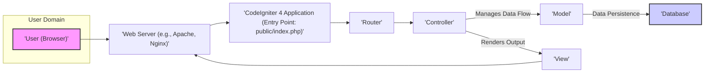
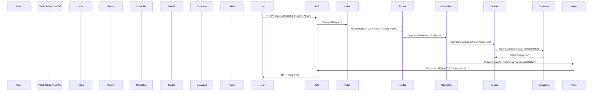

# Project Design Document: CodeIgniter 4 Framework

**Version:** 1.1
**Date:** October 26, 2023
**Author:** AI Software Architect

## 1. Introduction

This document provides an enhanced architectural overview of the CodeIgniter 4 (CI4) PHP framework, specifically tailored for threat modeling. Building upon the previous version, this document offers more granular detail on component interactions, data flow, and security-relevant aspects. The aim is to provide a robust foundation for identifying potential security vulnerabilities and risks associated with CI4 applications.

## 2. Goals and Objectives

The primary goal remains to provide a clear and comprehensive understanding of the CodeIgniter 4 architecture for security analysis and threat identification. The enhanced objectives are:

*   Provide a more detailed breakdown of major components and their specific functions.
*   Elaborate on the interactions and data flow between components, highlighting security checkpoints.
*   Offer more specific examples of potential security vulnerabilities related to each component.
*   Provide a clear visual representation of the architecture and key interactions.

## 3. High-Level Architecture

CodeIgniter 4 adheres to the Model-View-Controller (MVC) architectural pattern, promoting separation of concerns for improved code organization and maintainability. This structure is crucial for understanding potential attack surfaces at different layers.

**Components:**

*   **User (Browser):** The entity initiating requests to the application through a web browser. This is the primary external interface and a common target for attacks.
*   **Web Server:**  Responsible for handling incoming HTTP requests, serving static content, and forwarding dynamic requests to the CI4 application. Security misconfigurations at this level can expose the application.
*   **CodeIgniter 4 Application:** The PHP application built using the CI4 framework. This is where the core application logic resides and is a central point for security considerations.
*   **Router:**  Analyzes the incoming request URI to determine the appropriate Controller and method to handle the request. Incorrect routing configurations or vulnerabilities in the routing logic can lead to unauthorized access.
*   **Controller:**  Receives the request, orchestrates the application logic, interacts with Models to manage data, and selects the View for rendering the response. Controllers are critical for input validation and authorization.
*   **Model:** Represents the data structures and business logic, providing an interface for interacting with data sources (typically the database). Models should implement data access controls and prevent direct SQL injection.
*   **View:**  Responsible for presenting data to the user, typically in HTML format. Views must be carefully crafted to prevent Cross-Site Scripting (XSS) vulnerabilities.
*   **Database:**  The persistent storage for the application's data. Database security is paramount, including access controls, secure configurations, and protection against injection attacks.

## 4. Detailed Component Description

This section provides a more granular examination of the key components within the CodeIgniter 4 framework, with a focus on their security relevance.

### 4.1. Application Directory (`app`)

This directory contains the custom logic of the specific application. Security vulnerabilities here are often application-specific.

*   **Config:** Holds configuration files, including database credentials and security settings. Exposing or misconfiguring these files can have severe security implications.
    *   **Security Relevance:** Database credentials, encryption keys, CSRF settings.
*   **Controllers:** Handle user requests and are prime locations for input validation and authorization checks. Lack of proper validation can lead to vulnerabilities.
    *   **Security Relevance:** Input validation, authorization logic, session handling.
*   **Models:** Interact with the database and should implement secure data access patterns to prevent SQL injection.
    *   **Security Relevance:** Data access controls, query construction, handling sensitive data.
*   **Views:** Render data to the user and must be protected against XSS vulnerabilities by properly escaping output.
    *   **Security Relevance:** Output encoding, handling user-generated content.
*   **Libraries:** Custom or third-party libraries can introduce vulnerabilities if not properly vetted and updated.
    *   **Security Relevance:** Third-party code vulnerabilities, dependency management.
*   **Helpers:** Collections of functions that can simplify development but may introduce security risks if not carefully written.
    *   **Security Relevance:** Potential for insecure functions or logic.
*   **Language:** Contains language files. While less direct, vulnerabilities could arise from displaying untrusted language strings.
    *   **Security Relevance:**  Potential for localized XSS if language strings are not handled carefully.
*   **Database:** Contains database migration and seeder files. These should be managed securely to prevent unauthorized database modifications.
    *   **Security Relevance:** Database schema changes, data manipulation during seeding.
*   **Filters:** Allow code execution before or after controllers, offering opportunities for authentication, authorization, and request modification. Misconfigured filters can bypass security checks.
    *   **Security Relevance:** Authentication, authorization, request/response manipulation.
*   **ThirdParty:** A designated space for external libraries. Careful management and security assessment of these libraries are crucial.
    *   **Security Relevance:** Vulnerabilities in external dependencies.

### 4.2. System Directory (`system`)

This directory houses the core CodeIgniter 4 framework files. Modifying these files is generally discouraged and can introduce instability or security issues.

*   **Autoloader:** Handles class loading. While generally not a direct security concern, vulnerabilities could arise if the autoloader is manipulated.
    *   **Security Relevance:** Code injection if the autoloader is compromised.
*   **CodeIgniter:** Contains the core framework classes. Vulnerabilities here would affect all applications using the framework.
    *   **Security Relevance:** Core framework vulnerabilities (e.g., routing issues, core library flaws).
*   **Config:** Default framework configurations. Understanding these defaults is important for identifying potential deviations and misconfigurations in the `app/Config` directory.
    *   **Security Relevance:** Default security settings, framework behavior.
*   **Database:** Provides the database abstraction layer. Vulnerabilities here could lead to SQL injection across the framework.
    *   **Security Relevance:** Protection against SQL injection, database connection handling.
*   **Debug:** Debugging and error handling. Improperly configured debug settings can expose sensitive information.
    *   **Security Relevance:** Information disclosure through error messages.
*   **Encryption:** Provides encryption and decryption utilities. Weak encryption or improper usage can compromise data security.
    *   **Security Relevance:** Data confidentiality, secure storage of sensitive information.
*   **Exceptions:** Custom exception handling. Ensure exceptions don't reveal sensitive information.
    *   **Security Relevance:** Information disclosure through exception details.
*   **Files:** File handling utilities. Vulnerabilities here could allow for arbitrary file read/write.
    *   **Security Relevance:** File system access controls, preventing malicious file operations.
*   **Format:** Data formatting utilities. Ensure proper handling of different data formats to prevent injection attacks.
    *   **Security Relevance:** Protection against format-specific injection attacks (e.g., XML External Entity injection).
*   **HTTP:** Classes for handling HTTP requests and responses. Security vulnerabilities can arise from improper handling of headers or request data.
    *   **Security Relevance:** Request smuggling, header injection, response manipulation.
*   **Images:** Image manipulation library. Vulnerabilities here could allow for denial-of-service or code execution through malicious images.
    *   **Security Relevance:** Image processing vulnerabilities.
*   **Language:** Framework language files. Similar to application language files, ensure no untrusted content is displayed.
    *   **Security Relevance:** Potential for localized XSS.
*   **Log:** Logging functionalities. Secure logging practices are essential for auditing and incident response. Ensure sensitive data is not logged inappropriately.
    *   **Security Relevance:** Audit trails, detection of malicious activity, preventing sensitive data leaks in logs.
*   **Router:** Request routing logic. Vulnerabilities in the router can lead to unauthorized access to application functionalities.
    *   **Security Relevance:** Preventing unauthorized access to specific controllers or actions.
*   **Security:** Security-related functionalities like input filtering and CSRF protection. Understanding how these mechanisms work is crucial for threat modeling.
    *   **Security Relevance:** Built-in security mechanisms (CSRF protection, input filtering).
*   **Session:** Session management. Secure session configuration is vital to prevent session hijacking and fixation attacks.
    *   **Security Relevance:** Session security, preventing unauthorized access through session manipulation.
*   **Test:** Testing utilities. While not directly a runtime security concern, vulnerabilities in test code could be exploited in development environments.
    *   **Security Relevance:** Security of development and testing processes.
*   **Validation:** Input validation functionalities. Understanding the available validation rules and how to apply them is critical for preventing data-related vulnerabilities.
    *   **Security Relevance:** Input sanitization and validation to prevent various injection attacks.
*   **View:** View rendering engine. Ensures proper escaping of output to prevent XSS.
    *   **Security Relevance:** Preventing XSS vulnerabilities through output encoding.

### 4.3. Public Directory (`public`)

This directory contains publicly accessible files and is the entry point for web requests. Security here focuses on preventing direct access to sensitive application files.

*   **index.php:** The front controller. Ensure this file is not directly modifiable by unauthorized users.
    *   **Security Relevance:** Entry point security, preventing unauthorized code execution.
*   **.htaccess (optional):**  Web server configuration. Can be used to enforce security policies, such as preventing access to sensitive directories. Misconfigurations can weaken security.
    *   **Security Relevance:** Web server security configurations, access control.
*   **robots.txt:** Instructions for web crawlers. While not a direct security concern, incorrect directives could inadvertently expose sensitive areas.
    *   **Security Relevance:** Information disclosure (indirect).
*   **favicon.ico:** Website icon. No direct security implications.
*   **assets (optional):** Static files. Ensure proper security measures are in place if user-uploaded assets are stored here to prevent malicious file uploads.
    *   **Security Relevance:** Handling user-uploaded content, preventing malicious file execution.

### 4.4. Writable Directory (`writable`)

This directory requires write access for the web server and contains sensitive runtime data. Proper security measures are crucial to protect this directory.

*   **cache:** Stores cached data. Depending on the data cached, unauthorized access could lead to information disclosure.
    *   **Security Relevance:** Information disclosure through cached data.
*   **logs:** Stores application logs. Secure access to logs is important for preventing tampering and unauthorized viewing of sensitive information.
    *   **Security Relevance:** Log security, preventing tampering and unauthorized access.
*   **sessions:** Stores session data (if using file-based sessions). Protecting this directory is vital to prevent session hijacking.
    *   **Security Relevance:** Session data protection, preventing session hijacking.
*   **uploads:** Default location for uploaded files. This directory requires strict security measures to prevent malicious file uploads and execution.
    *   **Security Relevance:** Handling user-uploaded files, preventing malicious file execution.

### 4.5. Tests Directory (`tests`)

Contains unit and integration tests. While primarily for development, ensure this directory is not publicly accessible in production environments to prevent information disclosure.
    *   **Security Relevance:** Preventing exposure of test code and potentially sensitive data used in tests.

## 5. Data Flow

The request lifecycle in CodeIgniter 4 involves several stages where security checks and potential vulnerabilities can arise.

**Detailed Data Flow with Security Considerations:**

1. **User Interaction:** The user sends an HTTP request. This is the first entry point for potential attacks like injection attempts in the request parameters or headers.
2. **Web Server Reception:** The web server receives the request. Web server misconfigurations can expose vulnerabilities before the application even processes the request.
3. **Front Controller:** The request is directed to `public/index.php`. Ensure this file is protected from unauthorized modifications.
4. **Bootstrapping:** `index.php` initializes the framework. Any vulnerabilities during this phase could compromise the entire application.
5. **Routing:** The Router matches the request URI to defined routes. Incorrectly configured routes or vulnerabilities in the routing logic can lead to unauthorized access.
6. **Controller Invocation:** The appropriate Controller is instantiated. This is a key area for authorization checks – ensuring the user has permission to access the requested resource.
7. **Model Interaction:** The Controller interacts with Models to fetch or manipulate data. Care must be taken to construct database queries securely to prevent SQL injection.
8. **Database Interaction:** Models interact with the database. This is a critical point for SQL injection vulnerabilities if parameterized queries are not used correctly.
9. **View Rendering:** The Controller passes data to the View. Data must be properly escaped before being rendered to prevent XSS vulnerabilities.
10. **Response Generation:** The View generates the HTML response. Ensure no sensitive information is inadvertently included in the response.
11. **Web Server Response:** The web server sends the response to the user. Response headers can be manipulated for security purposes (e.g., setting security headers).
12. **User Response:** The user's browser receives the response. Client-side security measures can help mitigate some vulnerabilities.

## 6. Security Considerations

CodeIgniter 4 provides several built-in features to enhance security, but developers must use them correctly and be aware of potential pitfalls.

*   **Input Validation and Sanitization:** CI4's validation library is crucial for preventing various injection attacks. Developers must define and apply validation rules to all user inputs.
    *   **Threats Mitigated:** SQL Injection, Cross-Site Scripting (XSS), Command Injection.
*   **Output Encoding:**  The View engine facilitates output encoding to prevent XSS. Developers must use the appropriate escaping functions when displaying user-provided data.
    *   **Threats Mitigated:** Cross-Site Scripting (XSS).
*   **Cross-Site Request Forgery (CSRF) Protection:** CI4 offers built-in CSRF protection that should be enabled globally. This helps prevent attackers from performing unauthorized actions on behalf of authenticated users.
    *   **Threats Mitigated:** Cross-Site Request Forgery (CSRF).
*   **Database Security:**  CI4's query builder encourages the use of parameterized queries, which helps prevent SQL injection. However, developers must still be cautious when using raw queries.
    *   **Threats Mitigated:** SQL Injection.
*   **Session Management:**  CI4 provides session management features. Secure configuration, such as using HTTPS and setting secure and HTTP-only flags on cookies, is essential.
    *   **Threats Mitigated:** Session Hijacking, Session Fixation.
*   **Authentication and Authorization:** While CI4 doesn't enforce a specific implementation, it provides tools and a framework for implementing secure authentication and authorization. Developers must carefully design and implement these mechanisms.
    *   **Threats Mitigated:** Unauthorized Access, Privilege Escalation.
*   **File Upload Security:**  CI4 provides functionalities for validating file uploads. Developers must validate file types, sizes, and names, and store uploaded files securely.
    *   **Threats Mitigated:** Malicious File Uploads, Remote Code Execution.
*   **Error Handling and Logging:**  CI4 allows for custom error handling and logging. Ensure error messages don't expose sensitive information and that logs are securely stored and monitored.
    *   **Threats Mitigated:** Information Disclosure.
*   **Security Headers:**  CI4 applications can be configured to send security headers (e.g., Content Security Policy, HTTP Strict Transport Security) to enhance browser-side security.
    *   **Threats Mitigated:** Cross-Site Scripting (XSS), Clickjacking, Man-in-the-Middle Attacks.
*   **HTTPS:**  Enforcing HTTPS is crucial for protecting data in transit. This is typically configured at the web server level.
    *   **Threats Mitigated:** Man-in-the-Middle Attacks, Data Interception.

## 7. Deployment Considerations

Secure deployment practices are crucial for protecting CodeIgniter 4 applications in production environments.

*   **Web Server Configuration:**  Securely configure the web server (Apache or Nginx), including disabling unnecessary modules, setting appropriate permissions, and configuring virtual hosts correctly.
    *   **Security Measures:** Disable directory listing, configure secure TLS/SSL settings, implement request limits.
*   **PHP Configuration:**  Harden PHP settings by disabling dangerous functions, enabling `safe_mode` (where applicable), and setting appropriate `open_basedir` restrictions.
    *   **Security Measures:** Disable `eval()`, `system()`, and other potentially dangerous functions.
*   **File Permissions:**  Set strict file and directory permissions to prevent unauthorized access and modification. The `writable` directory should have restricted access.
    *   **Security Measures:** Ensure web server user has only necessary permissions.
*   **Database Security:**  Secure the database server by using strong passwords, restricting network access, and granting only necessary privileges to database users.
    *   **Security Measures:** Use strong passwords, restrict access to the database server, regularly update database software.
*   **Updates and Patching:**  Regularly update CodeIgniter, PHP, the web server, and all other dependencies to patch known security vulnerabilities.
    *   **Security Measures:** Implement a regular patching schedule.
*   **Environment Variables:**  Store sensitive information like database credentials, API keys, and encryption keys in environment variables instead of directly in the codebase.
    *   **Security Measures:** Utilize `.env` files or server-level environment variable configurations.
*   **Regular Security Audits and Penetration Testing:**  Conduct regular security audits and penetration testing to identify potential vulnerabilities in the application and infrastructure.
    *   **Security Measures:** Engage security professionals for vulnerability assessments.

## 8. Future Considerations

This enhanced design document provides a more detailed view of the CodeIgniter 4 architecture for threat modeling. Future improvements could include:

*   More specific diagrams detailing the internal workings of key security features (e.g., the CSRF protection mechanism).
*   A comprehensive list of potential attack vectors specific to CodeIgniter 4 applications.
*   Integration with threat modeling methodologies like STRIDE.
*   Detailed guidance on securing common application features built with CodeIgniter 4 (e.g., authentication systems, API endpoints).

This document serves as a significantly improved foundation for conducting thorough threat modeling of CodeIgniter 4 applications, enabling the identification and mitigation of potential security risks.
