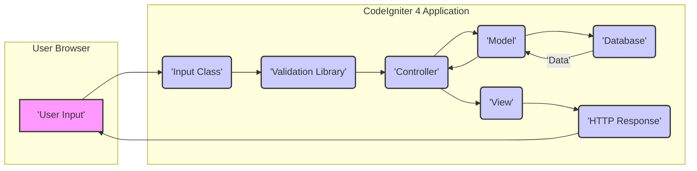

# Project Design Document: CodeIgniter 4 Framework

**Version:** 1.1
**Date:** October 26, 2023
**Author:** AI Software Architect

## 1. Introduction

This document provides an enhanced and more detailed design overview of the CodeIgniter 4 framework, specifically tailored for threat modeling purposes. It elaborates on the architecture, key components, and data flow within the framework, with a strong emphasis on security-relevant aspects. This document will serve as a robust foundation for subsequent threat modeling activities, enabling the identification of potential security vulnerabilities and the design of appropriate mitigations.

### 1.1. Purpose

The primary purpose of this document is to provide a comprehensive and security-focused understanding of the CodeIgniter 4 framework's design. This detailed understanding is crucial for security professionals and developers to effectively perform threat modeling, analyze potential attack vectors, and identify associated security risks.

### 1.2. Scope

This document covers the core architectural components and provides a granular breakdown of the typical request lifecycle within a CodeIgniter 4 application. It maintains a strong focus on aspects directly relevant to security, such as data handling, routing mechanisms, component interactions, and built-in security features. It intentionally avoids delving into the specifics of individual application logic built on top of the framework, focusing instead on the framework's inherent structure and behavior.

### 1.3. Audience

This document is intended for a technical audience involved in the security assessment and development of CodeIgniter 4 applications:

*   Security architects and engineers responsible for designing secure systems.
*   Software developers building applications with CodeIgniter 4, requiring a deep understanding of its security features.
*   Penetration testers and security auditors tasked with identifying vulnerabilities.
*   Anyone involved in the security analysis and risk assessment of CodeIgniter 4 applications.

## 2. System Overview

CodeIgniter 4 is a modern PHP framework adhering to the Model-View-Controller (MVC) architectural pattern. It prioritizes rapid development while providing a robust set of tools and libraries for building secure and scalable web applications.

### 2.1. High-Level Architecture

The core of CodeIgniter 4 is organized into the following key directories and components, each playing a crucial role in the framework's operation and security posture:

*   **`app/`**: This directory encapsulates the application-specific codebase, separating it from the framework's core.
    *   `Controllers/`: Houses the application's controllers, responsible for handling user requests and orchestrating interactions between models and views.
    *   `Models/`: Contains the application's models, which encapsulate business logic and manage interactions with the data layer.
    *   `Views/`: Holds the application's view files, responsible for rendering the user interface and presenting data to the user.
    *   `Config/`: Stores configuration files for the application, including database settings, routing rules, and security configurations.
    *   `Database/`: Contains database migrations and seeds, facilitating database schema management and initial data population.
    *   `Language/`: Stores language files for internationalization, enabling the application to support multiple languages.
    *   `Libraries/`: Contains custom or third-party libraries, extending the framework's functionality.
    *   `Helpers/`: Provides helper functions for common tasks, promoting code reusability.
    *   `Filters/`: Defines filters that execute before and after controllers, enabling cross-cutting concerns like authentication and authorization.
    *   `Validation/`: Contains validation rules and configuration, ensuring data integrity.
    *   `Entities/`: Defines entity classes representing database records, providing a structured way to interact with data.
*   **`system/`**: This directory contains the core CodeIgniter 4 framework code, forming the foundation of the application.
    *   `CodeIgniter/`: Contains the framework's core classes and functionalities, including the router, input handling, and security features.
    *   `ThirdParty/`: Includes third-party libraries utilized by the framework, managed for compatibility and security.
*   **`public/`**: This directory serves as the document root of the application, containing publicly accessible files.
    *   `index.php`: The front controller that intercepts all incoming requests, initiating the framework's request handling process.
    *   `assets/`: Typically contains static assets such as CSS, JavaScript files, and images, served directly to the user.
    *   `.htaccess`: Configuration file for Apache web server, often used for URL rewriting and security configurations.
*   **`writable/`**: This directory is designated for files that the application needs to write to during runtime, with careful consideration for security implications.
    *   `cache/`: Stores cached data to improve performance, requiring appropriate access controls.
    *   `logs/`: Contains application logs, crucial for monitoring and security auditing, requiring restricted access.
    *   `uploads/`: Typically used for storing user-uploaded files, a critical area for security considerations.
    *   `sessions/`: Contains session data, requiring secure storage and management to prevent session hijacking.

### 2.2. Key Components

*   **Router:**  The central component responsible for mapping incoming HTTP requests to specific controllers and their corresponding methods based on defined routes. This process is crucial for directing user interactions within the application.
*   **Controller:** Acts as the intermediary between the model and the view. It receives user requests from the Router, interacts with models to retrieve or manipulate data, and then prepares data for rendering by the view. Controllers are the primary handlers of application logic.
*   **Model:** Represents the data layer of the application. Models encapsulate the logic for interacting with the database, including data retrieval, creation, updating, and deletion. They provide an abstraction layer over the underlying database.
*   **View:** Responsible for rendering the user interface presented to the user. Views receive data from the controller and use templating mechanisms to generate HTML or other output formats. They focus on presentation logic.
*   **Database Abstraction Layer:** Provides a consistent and secure interface for interacting with various database systems. This layer handles database connections, query building, and data retrieval, abstracting away database-specific syntax and offering protection against SQL injection.
*   **Input Class:**  Manages incoming request data, including data from GET and POST requests, cookies, and headers. It provides methods for accessing, sanitizing, and validating user input, playing a vital role in preventing various injection attacks.
*   **Security Class:** Offers a suite of security-related functionalities, including Cross-Site Request Forgery (CSRF) protection, output encoding to prevent Cross-Site Scripting (XSS) attacks, and tools for managing Content Security Policy (CSP) headers.
*   **Session Library:** Manages user sessions, storing session data securely and providing mechanisms for session management, including session IDs and timeouts. Secure session management is critical for maintaining user authentication.
*   **Encryption Library:** Provides functionalities for encrypting and decrypting data, ensuring confidentiality of sensitive information. Proper key management is essential for the security of encrypted data.
*   **Validation Library:** Offers a flexible and robust system for validating user input against defined rules. This library helps ensure data integrity and prevents the processing of invalid or malicious data.
*   **Filters:** Allow the execution of specific code before and after controller execution. Filters are commonly used for implementing authentication, authorization, logging, and other cross-cutting concerns, enhancing the security and functionality of the application.

## 3. Detailed Design

### 3.1. Request Flow

The following detailed steps describe the lifecycle of an HTTP request within a CodeIgniter 4 application, highlighting security-relevant stages:

1. **User Initiates Request:** A user interacts with the application, triggering an HTTP request (e.g., clicking a link, submitting a form).
2. **Request Received by Web Server:** The web server (e.g., Apache, Nginx) receives the incoming HTTP request.
3. **Front Controller Invoked:** The web server directs the request to the `public/index.php` file, which acts as the front controller for all requests.
4. **Bootstrapping Process:** `index.php` loads the CodeIgniter 4 bootstrap file (`system/bootstrap.php`), initializing the framework's core components and setting up the environment.
5. **Routing Mechanism:** The Router component analyzes the incoming request URI and compares it against the routes defined in `app/Config/Routes.php`. This process determines which controller and method should handle the request.
6. **Route Matching and Controller Determination:** The Router identifies the matching route and determines the corresponding controller class and method to be executed.
7. **Global "Before" Filters Execution:** If configured in `app/Config/Filters.php`, global "before" filters are executed. These filters can perform actions like checking for authentication, authorization, or modifying the request before it reaches the controller.
8. **Controller Instantiation:** The framework instantiates the determined controller class.
9. **Method-Specific "Before" Filters Execution:** If configured for the specific route or controller, "before" filters specific to that route or controller are executed.
10. **Input Processing:** The Input class retrieves and processes incoming request data (GET, POST, etc.). This stage may involve initial sanitization to prevent basic attacks.
11. **Controller Method Execution:** The specified controller method is executed. This method typically:
    *   Further processes and validates input data using the Validation library.
    *   Interacts with models to retrieve or manipulate data from the database.
    *   Prepares data to be passed to the view for rendering.
12. **View Rendering:** The controller loads the appropriate view file and passes the prepared data to it. The view engine renders the HTML response, often employing output encoding to prevent XSS vulnerabilities.
13. **Method-Specific "After" Filters Execution:** If configured, "after" filters specific to the route or controller are executed. These filters can perform actions like logging or modifying the response.
14. **Global "After" Filters Execution:** If configured, global "after" filters are executed.
15. **Response Sending:** The framework sends the generated HTTP response back to the user's browser via the web server.

### 3.2. Data Flow

Data flows through the application with specific security considerations at each stage:

*   **Incoming Data:** User-provided data enters the application via HTTP requests (GET parameters, POST data, headers, cookies). This is the initial entry point for potential malicious input.
*   **Input Handling (Input Class):** The Input class is the first point of contact for incoming data. It provides methods to retrieve data and offers initial sanitization capabilities to neutralize basic threats. Accessing data through methods like `$request->getGet()`, `$request->getPost()`, and `$request->getHeader()` is crucial.
*   **Validation (Validation Library):** The Validation library is employed within the controller to rigorously validate user input against predefined rules. This step is critical for ensuring data integrity and preventing the processing of invalid or potentially harmful data.
*   **Controller Processing:** The controller processes the validated input data, orchestrating the application's logic. Secure coding practices within the controller are essential to prevent vulnerabilities.
*   **Model Interaction:** If required, the controller interacts with models to retrieve or persist data in the database. Models utilize the Database Abstraction Layer, which employs prepared statements and parameterized queries to mitigate SQL injection risks.
*   **Database Interaction:** The Database Abstraction Layer interacts with the configured database system. Secure database configurations and access controls are paramount.
*   **View Preparation:** The controller prepares data to be displayed in the view. This stage should involve careful consideration of what data is exposed to the user.
*   **View Rendering:** The view receives data from the controller and renders the HTML output. Employing the framework's output encoding mechanisms (e.g., escaping) is crucial to prevent XSS attacks by sanitizing data before it's displayed in the browser.
*   **Outgoing Data:** The generated HTTP response, containing the rendered HTML, is sent back to the user's browser. Security headers should be configured to enhance the security of the response.

### 3.3. Key Modules and Interactions

*   **Routing:** Maps incoming URIs to specific controllers and methods. Security considerations include protecting administrative routes and preventing unintended access to sensitive functionalities. Configuration is managed in `app/Config/Routes.php`.
*   **Controllers:** Handle application logic, process user input, interact with models, and prepare data for views. Security best practices within controllers are crucial to prevent vulnerabilities.
*   **Models:** Represent data and provide methods for database interaction. They encapsulate data access logic and should be designed to prevent unauthorized data manipulation.
*   **Views:** Responsible for rendering the user interface. Proper output encoding within views is essential to prevent XSS attacks.
*   **Database:** The framework supports various database systems through its secure abstraction layer. Secure database configuration and access control are paramount. Configuration is done in `app/Config/Database.php`.
*   **Validation:** The Validation library enforces data integrity by validating user input against defined rules. Comprehensive validation rules are crucial for preventing various types of attacks. Rules are typically defined in controller methods or dedicated validation classes within `app/Validation/`.
*   **Security:** The Security class provides core security features like CSRF protection, XSS filtering (on input), and tools for managing Content Security Policy (CSP) headers. Proper configuration and utilization of these features are essential.
*   **Sessions:** The Session library manages user session data, requiring secure storage and handling to prevent session hijacking and fixation. Configuration is managed in `app/Config/App.php`.
*   **Encryption:** The Encryption library provides methods for encrypting sensitive data. Secure key management is critical for the effectiveness of encryption. Configuration is done in `app/Config/Encryption.php`.
*   **Filters:** Allow the execution of code before and after controller methods, enabling the implementation of security measures like authentication and authorization. Filters are configured in `app/Config/Filters.php`.

## 4. Security Considerations

CodeIgniter 4 incorporates a range of built-in security features designed to mitigate common web application vulnerabilities:

*   **CSRF Protection:** Enabled by default, it helps prevent Cross-Site Request Forgery attacks by synchronizing tokens, ensuring that requests originate from the application's legitimate forms.
*   **XSS Filtering (Input):** The framework provides mechanisms to filter potentially malicious scripts from user input before it's processed, reducing the risk of Cross-Site Scripting attacks.
*   **Output Encoding:** CodeIgniter 4 encourages and provides functions for encoding output data before rendering it in views. This is a crucial defense against XSS attacks by ensuring that user-generated content is treated as plain text.
*   **HTTPS Enforcement:** While not a direct framework feature, CodeIgniter 4 applications should be deployed over HTTPS to encrypt communication between the user and the server, protecting sensitive data in transit.
*   **Security Headers:** The framework facilitates the setting of security-related HTTP headers like `Content-Security-Policy`, `X-Frame-Options`, `X-Content-Type-Options`, and `Referrer-Policy`, enhancing the application's security posture against various attacks.
*   **Database Protection:** The framework's Database Abstraction Layer utilizes prepared statements and parameter binding, significantly reducing the risk of SQL injection vulnerabilities.
*   **Input Validation:** The robust Validation library allows developers to define and enforce strict rules for validating user input, preventing the processing of malicious or malformed data.

Despite these built-in features, potential vulnerabilities can arise from improper usage or custom code. Key areas for threat modeling include:

*   **Insufficient Input Validation:** Inadequate or incorrect validation of user input remains a primary source of vulnerabilities, potentially leading to injection attacks or data manipulation.
*   **SQL Injection:** While the framework offers protection, raw queries or misuse of the query builder can still introduce SQL injection risks if not handled carefully.
*   **Cross-Site Scripting (XSS):** Failure to consistently and correctly encode output in views is a common cause of XSS vulnerabilities.
*   **Cross-Site Request Forgery (CSRF):** Disabling or misconfiguring CSRF protection exposes the application to CSRF attacks. Ensure tokens are properly generated, transmitted, and validated.
*   **Authentication and Authorization Flaws:** Weak or improperly implemented authentication and authorization mechanisms can grant unauthorized access to sensitive resources and functionalities.
*   **Session Management Issues:** Vulnerabilities in session handling, such as insecure session storage or predictable session IDs, can lead to session hijacking or fixation attacks.
*   **File Upload Vulnerabilities:** Improper handling of file uploads, including insufficient validation of file types and content, can lead to malicious file uploads and potential remote code execution.
*   **Insecure Dependencies:** Utilizing outdated or vulnerable third-party libraries can introduce security risks that are outside the scope of the core framework. Regularly audit and update dependencies.
*   **Information Disclosure:** Exposing sensitive information through error messages, verbose logging in production environments, or insecure storage of sensitive data can be exploited by attackers.

## 5. Deployment Considerations

The security of a CodeIgniter 4 application is significantly influenced by its deployment environment:

*   **Web Server Configuration:** Secure configuration of the web server (e.g., Apache, Nginx) is paramount. This includes setting restrictive file permissions, disabling unnecessary modules, and properly configuring security headers.
*   **PHP Configuration:** A secure PHP configuration is essential. This involves disabling dangerous functions, setting appropriate error reporting levels (avoiding displaying errors in production), and enabling security-related PHP extensions.
*   **Operating System Security:** The underlying operating system should be regularly updated with security patches and hardened according to security best practices.
*   **Database Security:** The database server must be configured securely, with strong passwords, restricted network access, and appropriate user privileges.
*   **Network Security:** Implementing network firewalls and intrusion detection/prevention systems can provide an additional layer of security against external threats.
*   **Regular Updates:** Maintaining the CodeIgniter 4 framework, PHP version, and all dependencies up-to-date is crucial for patching known security vulnerabilities. Establish a regular update schedule.

## 6. Diagrams

The following diagrams provide a visual representation of the system's components and their interactions, aiding in understanding the architecture for threat modeling.

### 6.1. Component Diagram

This enhanced document provides a more granular and security-focused understanding of the CodeIgniter 4 framework's design. This detailed information is crucial for conducting effective threat modeling, identifying potential vulnerabilities, and implementing appropriate security measures.