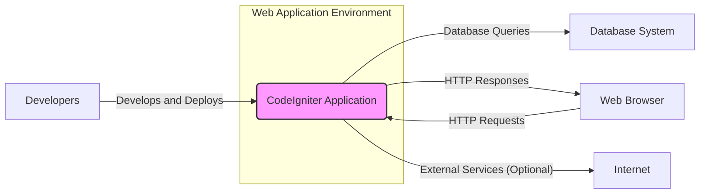
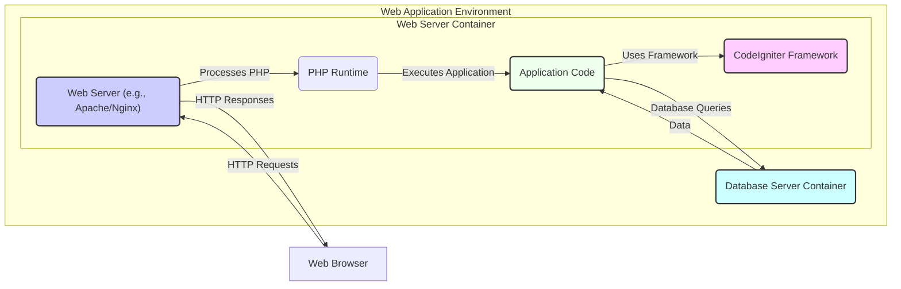
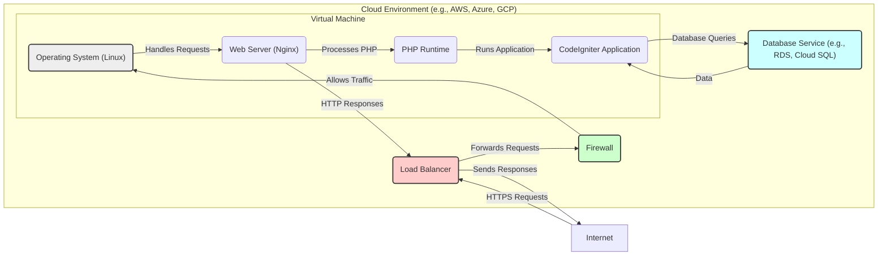
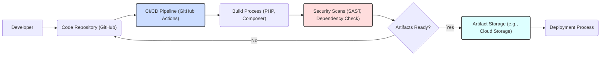

# BUSINESS POSTURE

CodeIgniter is a PHP framework designed to provide a simple, elegant toolkit for building full-featured web applications. It aims to be lightweight, fast, and developer-friendly, offering a robust set of libraries and helpers while minimizing complexity.

Business Priorities and Goals:
- Rapid web application development: CodeIgniter prioritizes ease of use and a straightforward structure to accelerate the development process.
- Performance: The framework is designed to be lightweight and fast, ensuring efficient application performance.
- Flexibility: CodeIgniter offers a flexible architecture that allows developers to adapt it to various project needs and coding styles.
- Community Support: A strong and active community provides support, resources, and contributions to the framework's development.
- Open Source: Being open source, CodeIgniter benefits from community contributions, transparency, and cost-effectiveness.

Most Important Business Risks:
- Security vulnerabilities in applications built using CodeIgniter: If developers do not follow secure coding practices or if vulnerabilities exist within the framework itself, applications built with CodeIgniter can be susceptible to attacks.
- Framework vulnerabilities: Undiscovered or unpatched vulnerabilities in the CodeIgniter framework could be exploited, affecting all applications built on it.
- Lack of security awareness among developers: Developers unfamiliar with secure coding practices might introduce vulnerabilities into their applications, regardless of the framework's security features.
- Dependency vulnerabilities: CodeIgniter and applications built on it may rely on third-party libraries that could contain vulnerabilities.

# SECURITY POSTURE

Existing Security Controls:
- security control: Input validation libraries and helpers are provided within the framework to assist developers in sanitizing user inputs. (Implemented in framework libraries and documented in user guide)
- security control: Cross-Site Scripting (XSS) protection helpers are available to mitigate XSS attacks. (Implemented in framework libraries and documented in user guide)
- security control: CSRF protection is offered as a feature that can be enabled to protect against Cross-Site Request Forgery attacks. (Implemented as a framework feature and documented in user guide)
- security control: Database abstraction layer helps prevent SQL injection vulnerabilities by encouraging parameterized queries. (Implemented in framework database library)
- security control: Password hashing utilities are provided to securely store user passwords. (Implemented in framework security library)
- security control: Security documentation is available in the user guide, providing guidance on secure development practices. (Documented in user guide)

Accepted Risks:
- accepted risk: Misconfiguration of security features by developers. Developers might not enable or correctly configure security features like CSRF protection or input validation.
- accepted risk: Vulnerabilities introduced by custom code. Security of applications heavily depends on the secure coding practices of individual developers, and custom code can introduce vulnerabilities.
- accepted risk: Outdated dependencies. Applications might use outdated versions of CodeIgniter or third-party libraries with known vulnerabilities if not properly managed.
- accepted risk: Server and infrastructure security. Security of the underlying server and infrastructure is outside the scope of the framework itself and relies on proper server hardening and maintenance.

Recommended Security Controls:
- security control: Implement Static Application Security Testing (SAST) tools in the development pipeline to automatically detect potential vulnerabilities in the codebase.
- security control: Implement Dynamic Application Security Testing (DAST) tools to test the running application for vulnerabilities.
- security control: Integrate Software Composition Analysis (SCA) tools to manage and monitor dependencies for known vulnerabilities.
- security control: Conduct regular security code reviews to identify and address potential security flaws in the code.
- security control: Provide security training for developers to enhance their awareness of secure coding practices and common web application vulnerabilities.
- security control: Implement a vulnerability disclosure program to allow security researchers to report potential vulnerabilities responsibly.

Security Requirements:
- Authentication:
    - Requirement: The framework should provide mechanisms for secure user authentication.
    - Requirement: Support for various authentication methods (e.g., username/password, multi-factor authentication) should be considered for applications built with the framework.
    - Requirement: Session management should be secure and protect against session hijacking and fixation attacks.
- Authorization:
    - Requirement: The framework should facilitate the implementation of role-based access control (RBAC) or other authorization mechanisms.
    - Requirement: Granular control over access to different parts of the application and data should be achievable.
- Input Validation:
    - Requirement: Robust input validation and sanitization mechanisms must be available to prevent injection attacks (SQL injection, XSS, etc.).
    - Requirement: Input validation should be applied to all user inputs, including request parameters, headers, and file uploads.
- Cryptography:
    - Requirement: Secure cryptographic functions should be used for sensitive operations like password hashing and data encryption.
    - Requirement: Support for secure communication protocols (HTTPS) should be enforced for applications built with the framework.
    - Requirement: Proper handling and storage of cryptographic keys should be ensured.

# DESIGN

## C4 CONTEXT

Context Diagram Elements:

- Element:
    - Name: CodeIgniter Application
    - Type: Software System
    - Description: The web application built using the CodeIgniter framework. It handles user requests, processes data, and interacts with other systems.
    - Responsibilities:
        - Handling HTTP requests from web browsers.
        - Processing user input and application logic.
        - Interacting with the database system to store and retrieve data.
        - Generating HTTP responses to be displayed in web browsers.
        - Optionally interacting with external services via the internet.
    - Security controls:
        - Input validation and sanitization.
        - Output encoding to prevent XSS.
        - CSRF protection.
        - Authentication and authorization mechanisms.
        - Secure session management.
        - Database interaction using parameterized queries.
        - HTTPS for secure communication.

- Element:
    - Name: Web Browser
    - Type: Person (User)
    - Description: Used by end-users to access and interact with the CodeIgniter application over the internet.
    - Responsibilities:
        - Sending HTTP requests to the CodeIgniter application.
        - Rendering HTTP responses received from the application.
        - Presenting the user interface to the end-user.
    - Security controls:
        - Browser security features (e.g., Content Security Policy, Same-Origin Policy).
        - User awareness of phishing and other web-based attacks.

- Element:
    - Name: Database System
    - Type: Software System
    - Description: A database system (e.g., MySQL, PostgreSQL) used by the CodeIgniter application to store and manage persistent data.
    - Responsibilities:
        - Storing application data.
        - Retrieving data based on queries from the CodeIgniter application.
        - Ensuring data integrity and availability.
    - Security controls:
        - Database access control (user permissions).
        - Database firewall.
        - Encryption at rest and in transit (if supported).
        - Regular database backups.
        - Security patching and updates.

- Element:
    - Name: Developers
    - Type: Person (Role)
    - Description: Software developers who build, maintain, and deploy the CodeIgniter application.
    - Responsibilities:
        - Writing and maintaining the application code.
        - Implementing security controls within the application.
        - Deploying the application to the web application environment.
        - Monitoring and updating the application.
    - Security controls:
        - Secure coding practices.
        - Code reviews.
        - Access control to code repositories and deployment environments.
        - Security training.

- Element:
    - Name: Internet
    - Type: Environment
    - Description: The public network over which web browsers and potentially external services communicate with the CodeIgniter application.
    - Responsibilities:
        - Providing connectivity between users, the application, and external services.
    - Security controls:
        - Network security controls (firewalls, intrusion detection/prevention systems) at the infrastructure level (not directly managed by the application itself).
        - HTTPS encryption to protect data in transit over the internet.

## C4 CONTAINER

Container Diagram Elements:

- Element:
    - Name: Web Server (e.g., Apache/Nginx)
    - Type: Container
    - Description: The web server software that receives HTTP requests from web browsers, serves static content, and forwards dynamic requests to the PHP runtime.
    - Responsibilities:
        - Receiving and routing HTTP requests.
        - Serving static files (HTML, CSS, JavaScript, images).
        - Handling SSL/TLS termination for HTTPS.
        - Managing web server configurations and security.
    - Security controls:
        - Web server hardening (disabling unnecessary modules, setting proper permissions).
        - Regular security updates and patching.
        - Web Application Firewall (WAF) integration (optional).
        - Access control to web server configuration files.
        - DDoS protection (at infrastructure level).

- Element:
    - Name: PHP Runtime
    - Type: Container
    - Description: The PHP runtime environment that executes the CodeIgniter framework and application code.
    - Responsibilities:
        - Interpreting and executing PHP code.
        - Providing necessary libraries and extensions for PHP applications.
        - Managing PHP configurations and security settings.
    - Security controls:
        - Keeping PHP runtime updated with security patches.
        - Disabling insecure PHP functions.
        - Configuring PHP security settings (e.g., `open_basedir`, `disable_functions`).
        - Using a hardened PHP installation.

- Element:
    - Name: CodeIgniter Framework
    - Type: Container
    - Description: The CodeIgniter PHP framework providing libraries, helpers, and structure for building web applications.
    - Responsibilities:
        - Providing core functionalities for web application development.
        - Offering security features and utilities (input validation, XSS protection, CSRF protection).
        - Handling routing, request processing, and response generation.
    - Security controls:
        - Framework security features (input validation, XSS/CSRF protection, etc.).
        - Regular framework updates and security patches.
        - Following secure development practices within the framework codebase.
        - Security audits of the framework codebase.

- Element:
    - Name: Application Code
    - Type: Container
    - Description: The custom PHP code developed by developers that implements the specific logic and features of the web application, built using the CodeIgniter framework.
    - Responsibilities:
        - Implementing business logic and application features.
        - Utilizing the CodeIgniter framework to build the application.
        - Interacting with the database and other services.
    - Security controls:
        - Secure coding practices by developers.
        - Input validation and output encoding in application code.
        - Proper authorization and access control implementation.
        - Regular security code reviews.
        - SAST/DAST analysis of application code.

- Element:
    - Name: Database Server Container
    - Type: Container
    - Description: The database server software (e.g., MySQL, PostgreSQL) running in a containerized environment or as a separate service.
    - Responsibilities:
        - Managing and storing application data.
        - Handling database queries from the application.
        - Ensuring database performance and availability.
    - Security controls:
        - Database server hardening and secure configuration.
        - Database access control and user permissions.
        - Regular security updates and patching of the database server.
        - Database firewall.
        - Encryption at rest and in transit for database connections.

## DEPLOYMENT

Deployment Solution: Cloud VM Deployment (Example)

Deployment Diagram Elements:

- Element:
    - Name: Operating System (Linux)
    - Type: Infrastructure (VM)
    - Description: The base operating system running on the virtual machine, providing the environment for the web server and PHP runtime.
    - Responsibilities:
        - Providing the foundation for the application stack.
        - Managing system resources and security.
    - Security controls:
        - OS hardening (removing unnecessary services, setting strong passwords).
        - Regular OS security updates and patching.
        - Host-based intrusion detection system (HIDS) (optional).
        - Access control to the VM.

- Element:
    - Name: Web Server (Nginx)
    - Type: Software (VM)
    - Description: The web server software installed on the VM, handling HTTP requests and serving the CodeIgniter application.
    - Responsibilities:
        - Serving web content and routing requests.
        - Handling SSL/TLS termination.
        - Web server security configurations.
    - Security controls:
        - Web server hardening and secure configuration.
        - Regular security updates and patching.
        - Web Application Firewall (WAF) integration (optional, often handled at Load Balancer level in cloud environments).

- Element:
    - Name: PHP Runtime
    - Type: Software (VM)
    - Description: The PHP runtime environment installed on the VM, executing the CodeIgniter application code.
    - Responsibilities:
        - Executing PHP code.
        - Providing PHP functionalities and extensions.
    - Security controls:
        - Secure PHP configuration.
        - Regular PHP security updates and patching.

- Element:
    - Name: CodeIgniter Application
    - Type: Software (VM)
    - Description: The deployed CodeIgniter application files residing on the virtual machine.
    - Responsibilities:
        - Running the web application logic.
        - Interacting with the database service.
    - Security controls:
        - Application-level security controls (input validation, authorization, etc.).
        - Regular application updates and security patches (framework and application code).

- Element:
    - Name: Database Service (e.g., RDS, Cloud SQL)
    - Type: Managed Service
    - Description: A managed database service provided by the cloud provider, offering a scalable and reliable database solution.
    - Responsibilities:
        - Storing and managing application data.
        - Providing database functionalities and performance.
        - Handling database backups and maintenance.
    - Security controls:
        - Cloud provider's security controls for managed services.
        - Database access control lists (ACLs).
        - Encryption at rest and in transit (provided by the cloud service).
        - Regular security updates and patching (managed by the cloud provider).

- Element:
    - Name: Load Balancer
    - Type: Network Device
    - Description: Distributes incoming traffic across multiple instances of the application (if scaled horizontally, not shown in this simple diagram). In this case, it primarily acts as an entry point and potentially for SSL termination.
    - Responsibilities:
        - Distributing traffic to backend servers.
        - SSL/TLS termination.
        - Health checks for backend instances.
    - Security controls:
        - SSL/TLS configuration.
        - DDoS protection (cloud provider's services).
        - Web Application Firewall (WAF) capabilities (cloud provider's services).

- Element:
    - Name: Firewall
    - Type: Network Device
    - Description: Network firewall controlling inbound and outbound traffic to the virtual machine, enhancing security by limiting network access.
    - Responsibilities:
        - Filtering network traffic based on defined rules.
        - Blocking unauthorized access to the VM.
    - Security controls:
        - Network access control lists (ACLs).
        - Rule-based traffic filtering.
        - Intrusion detection/prevention system (IDS/IPS) capabilities (optional, often part of cloud firewalls).

## BUILD

Build Process Elements:

- Element:
    - Name: Developer
    - Type: Person (Role)
    - Description: Software developers writing and committing code changes to the code repository.
    - Responsibilities:
        - Writing application code.
        - Committing code changes to the repository.
        - Performing local testing.
    - Security controls:
        - Secure coding practices.
        - Code reviews before committing.
        - Developer workstations security.
        - Access control to code repository.

- Element:
    - Name: Code Repository (GitHub)
    - Type: Software System
    - Description: A version control system (GitHub) used to store and manage the source code of the CodeIgniter application.
    - Responsibilities:
        - Storing and versioning source code.
        - Managing code branches and merges.
        - Triggering CI/CD pipelines on code changes.
    - Security controls:
        - Access control to the repository (authentication and authorization).
        - Branch protection rules.
        - Audit logging of repository activities.
        - Vulnerability scanning of repository dependencies (GitHub Dependabot).

- Element:
    - Name: CI/CD Pipeline (GitHub Actions)
    - Type: Software System
    - Description: An automated CI/CD pipeline (using GitHub Actions as an example) that builds, tests, and potentially deploys the application code.
    - Responsibilities:
        - Automating the build process.
        - Running tests (unit, integration, etc.).
        - Performing security scans.
        - Creating build artifacts.
        - Automating deployment to environments (optional, deployment process is shown as separate step for clarity).
    - Security controls:
        - Secure pipeline configuration.
        - Access control to pipeline configurations and secrets.
        - Use of secure build environments.
        - Security scanning tools integration (SAST, dependency check).
        - Audit logging of pipeline executions.

- Element:
    - Name: Build Process (PHP, Composer)
    - Type: Process
    - Description: The actual build process that compiles the application, installs dependencies using Composer, and prepares the application for deployment.
    - Responsibilities:
        - Compiling PHP code (if necessary, though PHP is interpreted).
        - Installing PHP dependencies using Composer.
        - Packaging the application into deployable artifacts.
    - Security controls:
        - Using trusted build tools and environments.
        - Verifying integrity of dependencies (Composer lock file).
        - Minimizing build dependencies.

- Element:
    - Name: Security Scans (SAST, Dependency Check)
    - Type: Process
    - Description: Automated security scans performed during the build process to identify potential vulnerabilities in the code and dependencies. Includes Static Application Security Testing (SAST) and dependency vulnerability scanning.
    - Responsibilities:
        - Identifying potential security vulnerabilities in the codebase.
        - Detecting vulnerable dependencies.
        - Reporting security findings to developers.
    - Security controls:
        - Configuration and use of SAST tools.
        - Configuration and use of dependency scanning tools.
        - Regular updates of security scanning tools and vulnerability databases.
        - Integration of scan results into the CI/CD pipeline to fail builds on critical findings.

- Element:
    - Name: Artifact Storage (e.g., Cloud Storage)
    - Type: Software System
    - Description: Secure storage for build artifacts (e.g., zip files, Docker images) ready for deployment. Could be cloud storage like AWS S3, Azure Blob Storage, or Google Cloud Storage.
    - Responsibilities:
        - Securely storing build artifacts.
        - Providing access to artifacts for deployment processes.
        - Versioning of artifacts.
    - Security controls:
        - Access control to artifact storage (authentication and authorization).
        - Encryption at rest and in transit for stored artifacts.
        - Audit logging of access to artifacts.
        - Integrity checks for artifacts.

- Element:
    - Name: Deployment Process
    - Type: Process
    - Description: The process of deploying the build artifacts to the target environment (e.g., cloud VM, Kubernetes cluster). This is a separate step from the build process itself in this diagram for clarity, although CI/CD can automate deployment as well.
    - Responsibilities:
        - Deploying application artifacts to target environments.
        - Configuring application settings in target environments.
        - Performing deployment validation and testing.
    - Security controls:
        - Secure deployment processes (e.g., using SSH, secure configuration management tools).
        - Access control to deployment environments.
        - Deployment automation and infrastructure-as-code to ensure consistent and secure deployments.
        - Rollback mechanisms in case of deployment failures.

# RISK ASSESSMENT

Critical Business Processes:
- Running web applications built using CodeIgniter: The primary business process is the operation of web applications developed with the framework, providing services and functionalities to end-users. Disruption or compromise of these applications can directly impact business operations, revenue, and reputation.

Data Sensitivity:
- Application Data: The sensitivity of data depends on the specific applications built using CodeIgniter. It can range from publicly accessible information to highly sensitive personal data, financial records, or proprietary business information. The sensitivity level is application-specific and needs to be assessed for each application built with the framework.
- User Data: Applications may collect and store user data, which can include personal information (PII), credentials, and usage data. The sensitivity of user data is generally high, especially with increasing privacy regulations (e.g., GDPR, CCPA). Protecting user data is crucial for compliance and maintaining user trust.
- Configuration Data: Application and framework configuration data, including database credentials, API keys, and other secrets, are highly sensitive. Exposure of configuration data can lead to unauthorized access and system compromise.

# QUESTIONS & ASSUMPTIONS

Questions:
- What type of applications are being built with CodeIgniter? (e.g., e-commerce, CMS, APIs, internal tools). The type of application will influence the specific security requirements and risks.
- What is the expected scale and performance requirements of the applications? This will impact deployment architecture and security considerations related to performance and availability.
- What are the specific compliance requirements (e.g., GDPR, PCI DSS, HIPAA) that applications built with CodeIgniter need to adhere to? Compliance requirements will dictate specific security controls and processes.
- What is the organization's risk appetite? A higher risk appetite might lead to accepting more security risks in favor of faster development or lower costs.
- What is the level of security expertise within the development team? The team's security knowledge will influence the effectiveness of security controls implementation.

Assumptions:
- CodeIgniter is used to build typical web applications that interact with users through web browsers and store data in databases.
- Applications are deployed in a cloud environment using virtual machines and managed services.
- Security is a relevant concern for applications built with CodeIgniter, and a reasonable level of security is desired.
- Developers using CodeIgniter have varying levels of security awareness and expertise.
- The organization deploying applications built with CodeIgniter has some existing security infrastructure and practices in place.