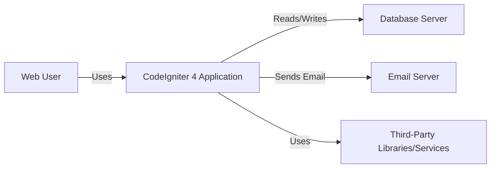
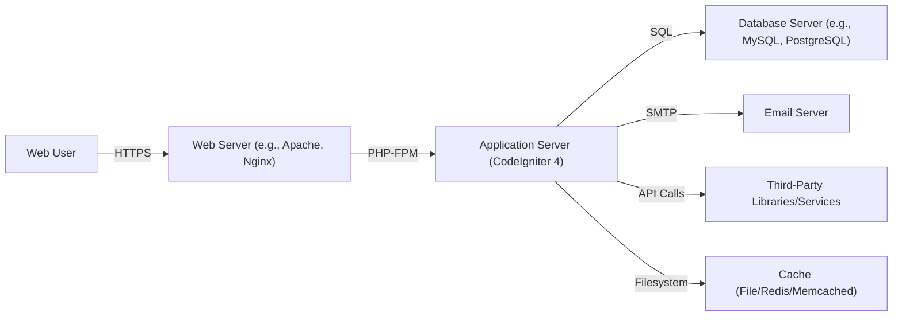
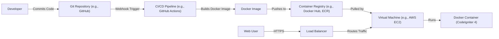
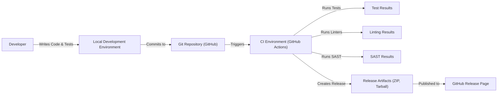

Okay, let's create a design document for the CodeIgniter 4 project, focusing on aspects relevant to threat modeling.

# BUSINESS POSTURE

CodeIgniter 4 is a PHP full-stack web framework that is light, fast, flexible, and secure. It is designed for developers who need a simple and elegant toolkit to create full-featured web applications.  The primary business goal is to provide a robust and efficient framework that enables rapid development of web applications while maintaining a high level of security and performance.  The framework's adoption and community support are key indicators of its success.

Business Priorities:

*   Enable rapid web application development.
*   Provide a secure and stable framework.
*   Maintain a lightweight and performant codebase.
*   Foster a strong and active community.
*   Ensure ease of use and learning for developers.
*   Provide clear and comprehensive documentation.

Business Goals:

*   Increase adoption and usage of the framework.
*   Maintain a positive reputation for security and reliability.
*   Attract and retain contributors to the project.
*   Become a preferred choice for PHP developers.

Most Important Business Risks:

*   Security vulnerabilities in the framework could lead to widespread exploitation of applications built with it, damaging the framework's reputation and user trust.
*   Performance issues or instability could deter developers from using the framework.
*   Lack of community engagement or contributions could lead to stagnation and obsolescence.
*   Failure to keep up with modern PHP standards and best practices could make the framework less attractive compared to alternatives.
*   Inadequate documentation or support could hinder adoption and usage.

# SECURITY POSTURE

Existing Security Controls:

*   security control: Input Validation: CodeIgniter 4 provides built-in libraries and helpers for input validation and filtering, helping to prevent common vulnerabilities like Cross-Site Scripting (XSS) and SQL Injection. (Described in documentation and implemented in system libraries).
*   security control: Output Encoding: The framework encourages output encoding to prevent XSS attacks. (Described in documentation and implemented in system libraries).
*   security control: Cross-Site Request Forgery (CSRF) Protection: CodeIgniter 4 has built-in CSRF protection mechanisms. (Described in documentation and implemented in system libraries).
*   security control: SQL Injection Prevention: The framework's database abstraction layer uses parameterized queries or query builder, which helps prevent SQL injection vulnerabilities. (Described in documentation and implemented in system libraries).
*   security control: Session Management: CodeIgniter 4 provides secure session management features. (Described in documentation and implemented in system libraries).
*   security control: Encryption: The framework offers encryption services for sensitive data. (Described in documentation and implemented in system libraries).
*   security control: Password Hashing: CodeIgniter 4 recommends and supports strong password hashing algorithms (e.g., bcrypt, Argon2). (Described in documentation).
*   security control: Security Policy: CodeIgniter 4 has a security policy that describes how to report security vulnerabilities. (Described in SECURITY.md file).

Accepted Risks:

*   accepted risk: The framework relies on the underlying PHP environment and server configuration for some security aspects. Misconfigurations in these areas could expose applications to risks.
*   accepted risk: While the framework provides security features, developers are ultimately responsible for implementing them correctly and securely in their applications.
*   accepted risk: Third-party libraries or modules used with CodeIgniter 4 may introduce their own security vulnerabilities.

Recommended Security Controls:

*   security control: Implement a robust Content Security Policy (CSP) to mitigate XSS and data injection attacks.
*   security control: Regularly update the framework and all dependencies to patch known vulnerabilities.
*   security control: Conduct regular security audits and penetration testing of applications built with CodeIgniter 4.
*   security control: Implement HTTP Strict Transport Security (HSTS) to enforce HTTPS connections.
*   security control: Use a Web Application Firewall (WAF) to protect against common web attacks.

Security Requirements:

*   Authentication:
    *   The framework should provide mechanisms for secure user authentication, including support for strong password hashing and multi-factor authentication (MFA).
    *   Session management should be secure, protecting against session hijacking and fixation attacks.

*   Authorization:
    *   The framework should support role-based access control (RBAC) or other authorization mechanisms to restrict access to sensitive resources.
    *   Authorization checks should be enforced consistently throughout the application.

*   Input Validation:
    *   All user input should be validated and sanitized to prevent injection attacks (XSS, SQLi, etc.).
    *   Input validation should be performed on both the client-side and server-side.

*   Cryptography:
    *   Sensitive data should be encrypted both in transit (using HTTPS) and at rest.
    *   Strong cryptographic algorithms and key management practices should be used.

# DESIGN

## C4 CONTEXT

C4 Context Element List:

*   Element:
    *   Name: Web User
    *   Type: Person
    *   Description: A user interacting with the CodeIgniter 4 application through a web browser.
    *   Responsibilities: Accessing the application, providing input, viewing output.
    *   Security controls: Browser-based security controls (e.g., same-origin policy), HTTPS.

*   Element:
    *   Name: CodeIgniter 4 Application
    *   Type: Software System
    *   Description: The web application built using the CodeIgniter 4 framework.
    *   Responsibilities: Handling user requests, processing data, interacting with the database and other systems.
    *   Security controls: Input validation, output encoding, CSRF protection, SQL injection prevention, session management, encryption, password hashing.

*   Element:
    *   Name: Database Server
    *   Type: Software System
    *   Description: The database server used to store application data.
    *   Responsibilities: Storing and retrieving data, ensuring data integrity.
    *   Security controls: Access control, encryption at rest, database firewall.

*   Element:
    *   Name: Email Server
    *   Type: Software System
    *   Description: The email server used to send emails from the application.
    *   Responsibilities: Sending emails, handling bounces and delivery failures.
    *   Security controls: Authentication, encryption in transit (TLS), spam filtering.

*   Element:
    *   Name: Third-Party Libraries/Services
    *   Type: Software System
    *   Description: External libraries or services used by the application.
    *   Responsibilities: Providing specific functionalities (e.g., payment processing, social media integration).
    *   Security controls: Dependent on the specific library/service; regular updates and security audits are crucial.

## C4 CONTAINER

C4 Container Element List:

*   Element:
    *   Name: Web User
    *   Type: Person
    *   Description: A user interacting with the CodeIgniter 4 application through a web browser.
    *   Responsibilities: Accessing the application, providing input, viewing output.
    *   Security controls: Browser-based security controls (e.g., same-origin policy), HTTPS.

*   Element:
    *   Name: Web Server
    *   Type: Container
    *   Description: The web server (e.g., Apache, Nginx) that receives requests from users and forwards them to the application server.
    *   Responsibilities: Handling HTTP requests, serving static content, SSL/TLS termination.
    *   Security controls: HTTPS configuration, access control, web application firewall (WAF).

*   Element:
    *   Name: Application Server (CodeIgniter 4)
    *   Type: Container
    *   Description: The CodeIgniter 4 application running on a PHP-FPM server.
    *   Responsibilities: Handling application logic, processing data, interacting with other containers.
    *   Security controls: Input validation, output encoding, CSRF protection, SQL injection prevention, session management, encryption, password hashing.

*   Element:
    *   Name: Database Server
    *   Type: Container
    *   Description: The database server (e.g., MySQL, PostgreSQL) used to store application data.
    *   Responsibilities: Storing and retrieving data, ensuring data integrity.
    *   Security controls: Access control, encryption at rest, database firewall.

*   Element:
    *   Name: Email Server
    *   Type: Container
    *   Description: The email server used to send emails from the application.
    *   Responsibilities: Sending emails, handling bounces and delivery failures.
    *   Security controls: Authentication, encryption in transit (TLS), spam filtering.

*   Element:
    *   Name: Third-Party Libraries/Services
    *   Type: Container
    *   Description: External libraries or services used by the application.
    *   Responsibilities: Providing specific functionalities (e.g., payment processing, social media integration).
    *   Security controls: Dependent on the specific library/service; regular updates and security audits are crucial.

*   Element:
    *   Name: Cache
    *   Type: Container
    *   Description: Caching system (File, Redis, or Memcached) used to improve application performance.
    *   Responsibilities: Storing frequently accessed data to reduce database load.
    *   Security controls: Access control, data validation.

## DEPLOYMENT

Possible Deployment Solutions:

1.  Traditional Hosting: Deploying the CodeIgniter 4 application on a shared or dedicated hosting server.
2.  Virtual Private Server (VPS): Deploying on a VPS provides more control and resources than shared hosting.
3.  Cloud Platforms (IaaS): Using cloud providers like AWS, Azure, or GCP to deploy the application on virtual machines.
4.  Platform as a Service (PaaS): Using PaaS offerings like Heroku, AWS Elastic Beanstalk, or Google App Engine to simplify deployment and scaling.
5.  Containerization (Docker): Packaging the application and its dependencies into a Docker container for consistent deployment across different environments.
6.  Serverless: Deploying individual functions or parts of the application using serverless platforms like AWS Lambda or Azure Functions.

Chosen Deployment Solution (Example: Cloud Platforms - IaaS with Containerization):

This approach combines the flexibility of IaaS with the consistency of containerization.

Deployment Element List:

*   Element:
    *   Name: Developer
    *   Type: Person
    *   Description: A developer working on the CodeIgniter 4 application.
    *   Responsibilities: Writing code, committing changes, testing.
    *   Security controls: Code review, secure coding practices, access control to the Git repository.

*   Element:
    *   Name: Git Repository
    *   Type: System
    *   Description: The repository (e.g., GitHub) where the application code is stored.
    *   Responsibilities: Version control, code collaboration.
    *   Security controls: Access control, branch protection rules, code scanning.

*   Element:
    *   Name: CI/CD Pipeline
    *   Type: System
    *   Description: The continuous integration and continuous deployment pipeline (e.g., GitHub Actions) that automates the build, test, and deployment process.
    *   Responsibilities: Building the Docker image, running tests, deploying the application.
    *   Security controls: Secure configuration, access control, vulnerability scanning.

*   Element:
    *   Name: Docker Image
    *   Type: Artifact
    *   Description: The packaged CodeIgniter 4 application and its dependencies.
    *   Responsibilities: Providing a consistent runtime environment.
    *   Security controls: Vulnerability scanning of the base image and dependencies.

*   Element:
    *   Name: Container Registry
    *   Type: System
    *   Description: The registry (e.g., Docker Hub, AWS ECR) where the Docker image is stored.
    *   Responsibilities: Storing and distributing Docker images.
    *   Security controls: Access control, image scanning.

*   Element:
    *   Name: Virtual Machine
    *   Type: Infrastructure
    *   Description: The virtual machine (e.g., AWS EC2 instance) where the Docker container is deployed.
    *   Responsibilities: Providing the compute resources for the application.
    *   Security controls: Firewall, security groups, intrusion detection system (IDS).

*   Element:
    *   Name: Docker Container (CodeIgniter 4)
    *   Type: Container
    *   Description: The running instance of the CodeIgniter 4 application within a Docker container.
    *   Responsibilities: Handling user requests, processing data.
    *   Security controls: All application-level security controls (see C4 Container section).

*   Element:
    *   Name: Load Balancer
    *   Type: Infrastructure
    *   Description: Distributes incoming traffic across multiple instances of the application.
    *   Responsibilities: Improving availability and scalability.
    *   Security controls: SSL/TLS termination, DDoS protection.

*   Element:
    *   Name: Web User
    *   Type: Person
    *   Description: A user interacting with the CodeIgniter 4 application.
    *   Responsibilities: Accessing the application.
    *   Security controls: Browser security, HTTPS.

## BUILD

The build process for CodeIgniter 4 involves several steps, from development to the creation of release artifacts.  While CodeIgniter 4 itself doesn't have a complex build system like some other projects (e.g., those using Webpack or similar tools), the process of preparing a release and ensuring code quality involves several security-relevant steps.

Build Process Description:

1.  Development: Developers write code and unit tests in their local development environments.
2.  Commit: Code is committed to the Git repository (GitHub).
3.  CI Trigger:  A commit or pull request triggers the CI environment (GitHub Actions).
4.  Testing: The CI environment runs automated tests (unit tests, integration tests).
5.  Linting: Code linters (e.g., PHP_CodeSniffer) check for code style and potential errors.
6.  SAST: Static Application Security Testing (SAST) tools (e.g., PHPStan with security extensions) analyze the code for potential security vulnerabilities.
7.  Release Creation: If all tests and checks pass, the CI environment creates release artifacts (ZIP and tarball archives).
8.  Publication: The release artifacts are published on the GitHub Release page.

Security Controls in the Build Process:

*   security control: Code Review: All code changes are reviewed by other developers before being merged.
*   security control: Automated Testing: Unit and integration tests help ensure code quality and prevent regressions.
*   security control: Linting: Code linters enforce coding standards and identify potential errors.
*   security control: SAST: Static analysis tools scan for potential security vulnerabilities.
*   security control: Dependency Management: Composer is used to manage dependencies, and regular updates are crucial to address vulnerabilities in third-party libraries.
*   security control: CI/CD Pipeline Security: The CI environment (GitHub Actions) is configured securely, with access controls and secrets management.

# RISK ASSESSMENT

Critical Business Processes to Protect:

*   User Authentication and Authorization: Ensuring only authorized users can access sensitive data and functionality.
*   Data Integrity: Maintaining the accuracy and consistency of data stored in the database.
*   Application Availability: Ensuring the application is accessible to users when needed.
*   Reputation Management: Protecting the reputation of the CodeIgniter 4 framework and its community.

Data to Protect and Sensitivity:

*   User Data (e.g., usernames, passwords, email addresses, personal information): High sensitivity.  Requires strong encryption and access controls.
*   Session Data: Medium sensitivity.  Requires secure session management to prevent hijacking.
*   Application Configuration Data (e.g., database credentials, API keys): High sensitivity.  Requires secure storage and access control.
*   Application Code: Medium sensitivity.  Requires protection against unauthorized modification.
*   Logs: Low to high sensitivity, depending on the content.  Requires secure storage and access control, especially if logs contain sensitive information.

# QUESTIONS & ASSUMPTIONS

Questions:

*   What specific third-party libraries are commonly used with CodeIgniter 4 applications, and what are their security implications?
*   What are the most common deployment environments used by CodeIgniter 4 developers?
*   Are there any specific regulatory compliance requirements (e.g., GDPR, HIPAA) that are frequently relevant to CodeIgniter 4 applications?
*   What level of security expertise is assumed for developers using CodeIgniter 4?
*   What is the process for handling security vulnerabilities reported in the framework?

Assumptions:

*   BUSINESS POSTURE: The primary goal is to provide a secure and efficient framework for rapid web application development.
*   SECURITY POSTURE: Developers are expected to have a basic understanding of web security principles and to follow secure coding practices. The framework provides security features, but developers are responsible for implementing them correctly.
*   DESIGN: The application will interact with a database and potentially with other external services (e.g., email server, third-party APIs). A typical deployment will involve a web server, an application server, and a database server. The build process will include automated testing and security checks.