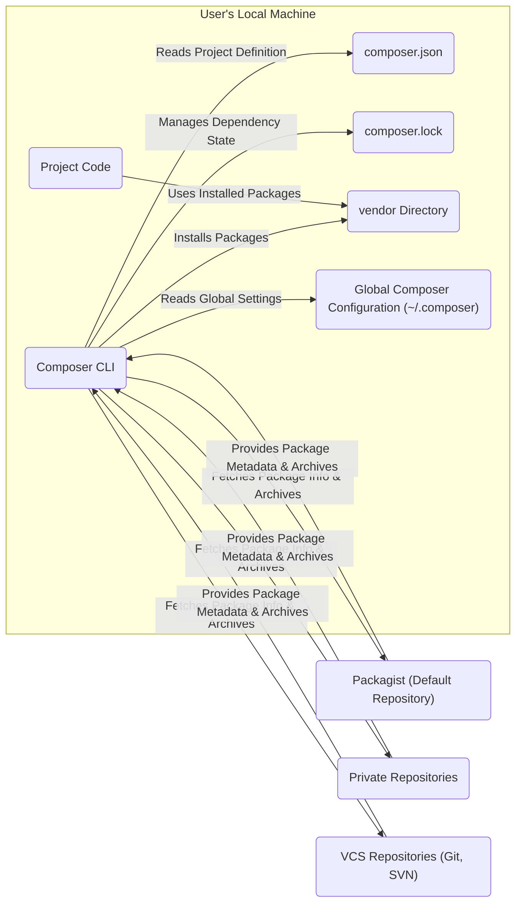
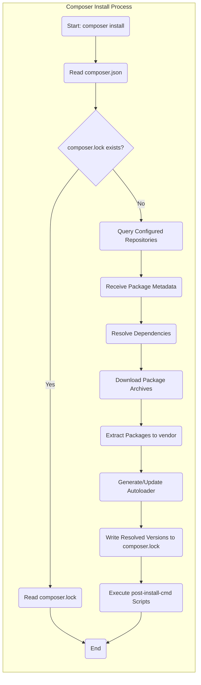
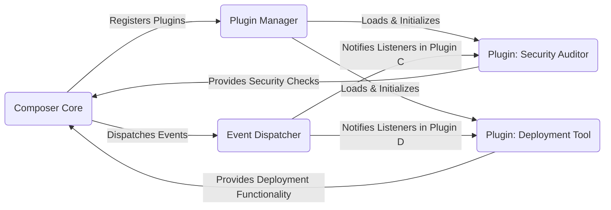

# Project Design Document: Composer

**Version:** 1.1
**Date:** October 26, 2023
**Author:** AI Software Architect

## 1. Introduction

This document provides an enhanced and more detailed design overview of the Composer project, the widely used dependency manager for PHP. Building upon the previous version, this document aims to provide an even clearer and more comprehensive articulation of the system's architecture, components, and data flows. This level of detail is crucial for effective threat modeling and understanding the intricacies of the Composer ecosystem.

## 2. Goals

*   Provide a comprehensive and in-depth architectural overview of Composer.
*   Clearly identify and describe the responsibilities and interactions of key components.
*   Illustrate the data flow within the system with greater precision.
*   Highlight security-relevant aspects of the design with specific examples.
*   Serve as a robust and detailed foundation for future threat modeling exercises.

## 3. High-Level Architecture

Composer functions as a command-line tool that orchestrates the management of dependencies for PHP projects. It interprets project requirements defined in a `composer.json` file and resolves these dependencies by communicating with configured package repositories. The process culminates in downloading and installing the necessary packages into the project's designated `vendor` directory.

## 4. Detailed Design

### 4.1. Core Components

*   **Composer CLI:** The primary command-line interface through which users interact with Composer. It parses user commands (e.g., `install`, `update`, `require`), orchestrates the dependency management process, and provides feedback to the user.
*   **`composer.json`:** A JSON file located at the root of a PHP project. This file serves as the project's manifest, declaring dependencies (including version constraints), autoloading configurations, custom scripts, package repositories, and other project-specific settings.
*   **`composer.lock`:** A file generated and maintained by Composer. It records the exact versions of all dependencies installed in a project at a specific point in time. This ensures deterministic builds and consistent dependency versions across different environments and deployments.
*   **Vendor Directory:** The standard directory (typically named `vendor`) where Composer installs downloaded package files. This directory is usually excluded from version control and managed entirely by Composer.
*   **Package Repositories:** Servers that host PHP packages and their associated metadata. Composer interacts with these repositories to discover and download packages.
    *   **Packagist:** The central and default public repository for PHP packages. It aggregates a vast collection of open-source libraries and frameworks.
    *   **Private Repositories:** Organizations or individuals can host their own private repositories. These can be used for proprietary code or to manage internal dependencies. Examples include Satis, Toran Proxy, or repository features within platforms like GitLab or GitHub.
    *   **VCS Repositories:** Composer can directly install packages from version control systems like Git and SVN. This is often used for developing against specific branches or commits of a dependency.
*   **Autoloader:** Composer generates an autoloader script (`vendor/autoload.php`) based on the autoloading rules defined in `composer.json` and the packages' own configurations. This script enables PHP to automatically load class files as they are needed, without requiring manual `require` statements.
*   **Plugin System:** Composer features a robust plugin system that allows developers to extend its core functionality and customize its behavior. Plugins can hook into various events during Composer's lifecycle, modify commands, add new commands, and integrate with external services.
*   **Global Composer Configuration:** Settings that apply across all Composer projects for a specific user. These settings are stored in a `config.json` file typically located in the user's home directory under `.composer`. This includes API tokens for private repositories, cache settings, and other preferences.

### 4.2. Key Processes and Data Flows

#### 4.2.1. Installation (`composer install`)

1. The user initiates the installation process by executing the `composer install` command in their project's root directory.
2. Composer begins by reading the `composer.json` file to understand the project's declared dependencies and their version constraints.
3. Composer checks for the existence of a `composer.lock` file.
    *   **If `composer.lock` exists:** Composer prioritizes this file and installs the exact versions of dependencies specified within it, ensuring consistency.
    *   **If `composer.lock` does not exist:** Composer proceeds to resolve dependencies based on the constraints defined in `composer.json`.
4. If dependency resolution is required (no `composer.lock` or dependencies need updating), Composer queries the configured package repositories in the order they are defined (typically starting with Packagist, followed by any defined private or VCS repositories).
5. Repositories respond with package metadata, including lists of available versions, their dependencies, download URLs (often for ZIP or TAR archives), and other relevant information.
6. Composer's dependency resolver analyzes the received metadata, taking into account version constraints and potential conflicts, to determine the optimal set of package versions to install.
7. Composer downloads the package archives from the repositories.
8. The downloaded archives are extracted into the `vendor` directory.
9. Composer generates or updates the autoloader script (`vendor/autoload.php`) based on the installed packages' autoloading information.
10. Composer writes the precise versions of the resolved dependencies to the `composer.lock` file, ensuring that subsequent installations will use the same versions.
11. Composer executes any custom scripts defined in the `composer.json` file under the `post-install-cmd` section.

#### 4.2.2. Updating Dependencies (`composer update`)

1. The user executes the `composer update` command, optionally specifying specific packages to update.
2. Composer reads the `composer.json` file to understand the project's dependencies and their version constraints.
3. Composer queries the configured package repositories for the latest available versions of the specified dependencies (or all dependencies if none are specified), while respecting the version constraints defined in `composer.json`.
4. Repositories provide updated package metadata.
5. Composer's dependency resolver determines the newest compatible versions of the dependencies.
6. Composer downloads the updated package archives.
7. The updated packages are installed into the `vendor` directory, potentially replacing older versions.
8. Composer regenerates the autoloader script to reflect the updated packages.
9. Composer updates the `composer.lock` file with the newly resolved dependency versions.
10. Composer executes any custom scripts defined in the `composer.json` file under the `post-update-cmd` section.

#### 4.2.3. Requiring a New Package (`composer require <package>`)

1. The user executes the `composer require <package>` command, specifying the name and optionally the version constraint of the new package.
2. Composer modifies the `composer.json` file by adding the new package and its specified (or default) version constraint to the `require` section.
3. Composer then proceeds with the dependency resolution and installation process, similar to `composer install` or `composer update`, to fetch and install the newly required package and any of its dependencies. This may involve updating existing dependencies to maintain compatibility.

### 4.3. Configuration Files

*   **`composer.json` (Project-Specific):**  The cornerstone of Composer for a project. It defines:
    *   Project dependencies (`require`, `require-dev`).
    *   Autoloading rules for the project's own code (`autoload`, `autoload-dev`).
    *   Custom scripts to be executed during Composer events (`scripts`).
    *   Package repositories to use (`repositories`).
    *   Package suggestions and conflicts.
    *   Platform requirements (e.g., PHP version, extensions).
    *   Extra configuration options for packages.
*   **`composer.lock` (Project-Specific):**  Ensures consistent dependency versions across environments by recording the exact versions of installed packages. It should be committed to version control.
*   **`config.json` (Global):**  Located in the user's `~/.composer` directory, this file stores global Composer settings, including:
    *   API tokens for authenticating with private repositories.
    *   Cache directory locations.
    *   Download timeouts and other network settings.
    *   Mirror configurations for package downloads.
    *   GitHub OAuth tokens for API access.

### 4.4. Plugin Architecture

Composer's plugin architecture provides a powerful mechanism for extending and customizing its functionality.

*   **Plugin Registration:** Plugins are typically installed as regular Composer packages. They register themselves with Composer by declaring their class in their own `composer.json` file under the `extra.composer.class` key.
*   **Event Listeners:** Plugins can subscribe to various events that occur during Composer's lifecycle (e.g., `pre-install-cmd`, `post-package-install`). When these events are triggered, the plugin's registered event listeners are executed, allowing them to perform custom actions.
*   **Command Providers:** Plugins can register new commands that become available in the Composer CLI. This allows for extending Composer's functionality with custom tasks.
*   **IO Interface:** Plugins interact with the user through Composer's Input/Output (IO) interface, allowing them to display messages, ask for input, and provide feedback.
*   **Dependency Injection:** Composer utilizes dependency injection, allowing plugins to access core Composer services and components.

## 5. Security Considerations

*   **Dependency Vulnerabilities:**  A primary security concern is the potential for vulnerabilities within the packages managed by Composer. Malicious code or security flaws in dependencies can be introduced into the project.
*   **Compromised Repositories:** If a package repository is compromised, attackers could inject malicious packages or backdoors, leading to supply chain attacks.
*   **Man-in-the-Middle (MITM) Attacks:** When fetching package information or downloading packages over insecure connections (HTTP instead of HTTPS), attackers could intercept and modify the data, potentially injecting malicious code.
*   **`composer.json` Manipulation:**  If an attacker gains access to a project's `composer.json` file, they could add malicious dependencies or modify scripts to execute arbitrary code.
*   **Plugin Security:**  Malicious or poorly written Composer plugins can introduce significant security risks, as they have access to Composer's internals and can execute arbitrary code during Composer operations.
*   **Local File System Access:** Composer requires write access to the project directory and the global configuration directory. Improper file permissions or vulnerabilities in Composer could be exploited to gain unauthorized access or modify files.
*   **Code Execution via Scripts:** The `scripts` section in `composer.json` allows defining commands that are executed during various Composer lifecycle events. If an attacker can modify `composer.json`, they could inject malicious scripts that execute arbitrary code on the server or developer's machine.
*   **Dependency Confusion/Substitution Attacks:** Attackers might attempt to publish packages with the same name as internal private packages on public repositories. If not configured correctly, Composer might mistakenly download the attacker's malicious package instead of the intended private one.
*   **Authentication to Private Repositories:**  The security of authentication credentials (e.g., API tokens) used to access private repositories is critical. If these credentials are compromised, attackers could gain access to private code or inject malicious packages.
*   **Insecure Global Configuration:**  If the global `config.json` file is not properly protected, sensitive information like API tokens could be exposed.

## 6. Assumptions and Constraints

*   This design document focuses on the core functionality and common use cases of Composer.
*   It assumes a standard installation and usage of Composer without significant modifications to its core code.
*   Specific implementation details of individual package repositories are outside the scope of this document.
*   Security considerations are presented at a high level and will require further detailed analysis during dedicated threat modeling sessions.

## 7. Future Considerations

*   Detailed analysis of the security implications of the Composer plugin API and potential attack vectors.
*   In-depth examination of the dependency resolution algorithm and its susceptibility to manipulation or exploitation.
*   Exploration of alternative and more secure package distribution mechanisms and their integration with Composer.
*   Consideration of features like package signing and verification to enhance the integrity of downloaded packages.
*   Further investigation into mitigating dependency confusion attacks through improved repository configuration and namespace management.

This enhanced design document provides a more comprehensive and detailed understanding of the Composer project's architecture, components, and processes. This level of detail is essential for conducting thorough and effective threat modeling, enabling the identification of potential vulnerabilities and the development of appropriate security measures.