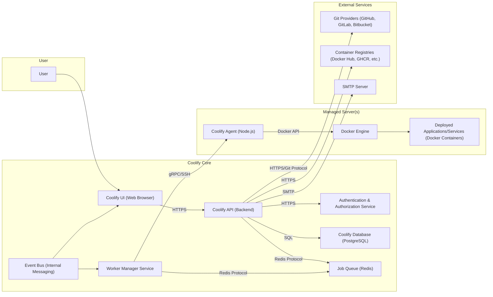

# Project Design Document: Coolify

**Version:** 1.1
**Date:** October 26, 2023
**Author:** AI Software Architect

## 1. Introduction

This document provides an enhanced and more detailed design overview of the Coolify project, an open-source, self-hostable platform for deploying web applications, databases, and services. This document aims to provide a comprehensive understanding of the system's architecture, components, and data flow, which will serve as a robust foundation for subsequent threat modeling activities. This revision includes more specific details about component interactions and technologies.

## 2. Goals

*   Clearly define the architecture and components of the Coolify platform with greater specificity.
*   Describe the interactions between different components, including protocols and data formats where relevant.
*   Outline the data flow within the system with more granular detail.
*   Identify key technologies and dependencies for each component.
*   Provide a more detailed basis for identifying potential security vulnerabilities during threat modeling, including potential attack vectors.

## 3. High-Level Architecture

Coolify follows a client-server architecture with a central control plane managing multiple target environments. Communication between components primarily utilizes RESTful APIs and message queues.

## 4. Component Details

This section describes the individual components of the Coolify architecture in detail, including specific technologies and responsibilities.

*   **User:** Represents an individual interacting with the Coolify platform, typically through a web browser.

*   **Coolify Core:** The central application responsible for managing the entire platform's logic and state.
    *   **Coolify UI (Web Browser):** The front-end interface allowing users to interact with Coolify. Likely built with a modern JavaScript framework like React or Vue.js, communicating with the backend via HTTPS.
    *   **Coolify API (Backend):** The core logic of Coolify, handling user requests, managing resources, and orchestrating deployments. Likely built with Node.js and an Express.js-like framework, exposing a RESTful API.
    *   **Authentication & Authorization Service:** A dedicated service responsible for user authentication (verifying identity) and authorization (granting access to resources). This might involve JWT (JSON Web Tokens) or similar mechanisms.
    *   **Coolify Database (PostgreSQL):** Stores persistent data for the platform, including user accounts, server configurations, application definitions, deployment history, and more. PostgreSQL is a robust and feature-rich relational database.
    *   **Job Queue (Redis):**  A message broker used for asynchronous task processing. Tasks like application deployments, server provisioning, and background processes are enqueued here and processed by workers. Redis provides efficient queueing and pub/sub capabilities.
    *   **Worker Manager Service:** Manages a pool of worker processes that consume tasks from the Redis job queue. These workers execute tasks by interacting with the Coolify Agents on managed servers, external services, and the Coolify Database.
    *   **Event Bus (Internal Messaging):**  A mechanism for asynchronous communication between internal Coolify Core components. This could be implemented using a library within the Node.js application or a dedicated message queue. It facilitates decoupling and allows components to react to events without direct dependencies.

*   **Managed Server(s):**  The remote servers where user applications and services are deployed and run.
    *   **Coolify Agent (Node.js):** A lightweight agent installed on each managed server. It's likely a Node.js application that listens for instructions from the Worker Manager (potentially via gRPC or SSH tunnels) and interacts with the local Docker Engine.
    *   **Docker Engine:** The containerization platform used to run user applications in isolated environments. The Coolify Agent uses the Docker Engine API to manage containers (pulling images, creating containers, starting/stopping, etc.).
    *   **Deployed Applications/Services (Docker Containers):** The actual applications, databases, and other services deployed and managed by Coolify, running as isolated Docker containers.

*   **External Services:** Services that Coolify integrates with to provide its functionality.
    *   **Git Providers (GitHub, GitLab, Bitbucket):** Used to fetch application source code for deployment. Coolify interacts with their APIs (typically RESTful) using protocols like HTTPS and Git. Authentication often involves API keys or OAuth.
    *   **Container Registries (Docker Hub, GHCR, etc.):** Stores Docker images used for deploying applications. Coolify interacts with these registries over HTTPS, using authentication credentials to pull images.
    *   **SMTP Server:** Used for sending email notifications (e.g., deployment success/failure, user account verification). Coolify uses the SMTP protocol to send emails.

## 5. Data Flow

This section describes the typical flow of data for key operations within Coolify, including more specific details about protocols and data formats.

*   **User Login:**
    *   User enters credentials (username/password) in the **Coolify UI**.
    *   The UI sends the credentials to the **Coolify API** via an HTTPS POST request, likely in JSON format.
    *   The API forwards the credentials to the **Authentication & Authorization Service** via an internal HTTPS call.
    *   Authentication & Authorization verifies the credentials against user data stored in the **Coolify Database (PostgreSQL)** using SQL queries.
    *   Upon successful authentication, the Authentication & Authorization Service generates a JWT and returns it to the **Coolify API**.
    *   The API sends the JWT back to the **Coolify UI**, typically stored in a cookie or local storage. Subsequent requests from the UI include this JWT in the `Authorization` header.

*   **Application Deployment:**
    *   User configures deployment settings (e.g., Git repository URL, branch, Dockerfile path) in the **Coolify UI**.
    *   The UI sends the deployment request to the **Coolify API** via an HTTPS POST request (JSON payload).
    *   The API stores the deployment configuration in the **Coolify Database (PostgreSQL)**.
    *   The API enqueues a deployment job in the **Job Queue (Redis)**, including details about the deployment.
    *   A **Worker Manager Service** picks up the job from the Redis queue.
    *   The worker instructs the **Coolify Agent** on the target **Managed Server**, potentially using gRPC or establishing an SSH tunnel and sending commands.
    *   The **Coolify Agent** authenticates with the specified **Git Provider** (using credentials stored securely) and clones the repository.
    *   The **Coolify Agent** pulls the necessary Docker image from a **Container Registry** (authenticating if required).
    *   The **Coolify Agent** uses the **Docker Engine API** (via local socket or HTTP) to create and run the container based on the provided configuration.
    *   Deployment status updates are sent back from the **Coolify Agent** to the **Worker Manager Service**, and then potentially published to the **Event Bus**.
    *   The **Coolify API** and **Coolify UI** can subscribe to events on the **Event Bus** to receive real-time updates.

*   **Server Connection:**
    *   User provides server connection details (IP address, SSH port, credentials) in the **Coolify UI**.
    *   The UI sends the details to the **Coolify API** via an HTTPS POST request.
    *   The API attempts to establish an SSH connection to the target server using the provided credentials.
    *   Upon successful connection, the API (or a worker) transfers and executes the **Coolify Agent** installation script on the server.
    *   The **Coolify Agent** starts and registers itself with the **Coolify API**, potentially using a pre-shared key or certificate for initial authentication.

## 6. Technology Stack (Detailed)

*   **Backend:** Node.js with a framework like Express.js or NestJS
*   **Frontend:** Likely React, Vue.js, or Svelte
*   **Database:** PostgreSQL
*   **Job Queue:** Redis
*   **Containerization:** Docker
*   **Agent Communication:** gRPC or SSH
*   **API Communication:** REST over HTTPS (JSON)
*   **Authentication:** JWT (JSON Web Tokens) or similar
*   **Operating System (for Coolify Core):** Likely Linux-based
*   **Operating System (for Managed Servers):** Likely various Linux distributions

## 7. Security Considerations (Expanded)

This section outlines more detailed security considerations, providing a basis for identifying potential threats and vulnerabilities.

*   **Authentication and Authorization:**
    *   **Threats:** Brute-force attacks on login, credential stuffing, session hijacking, privilege escalation.
    *   **Mitigations:** Strong password policies, multi-factor authentication, rate limiting on login attempts, secure session management (e.g., HTTP-only cookies, short session timeouts), robust role-based access control.
*   **API Security:**
    *   **Threats:** Injection attacks (SQL injection, command injection), cross-site scripting (XSS), cross-site request forgery (CSRF), insecure direct object references, broken authentication and authorization.
    *   **Mitigations:** Input validation and sanitization, parameterized queries, output encoding, anti-CSRF tokens, proper authentication and authorization checks on all API endpoints, rate limiting.
*   **Communication Security:**
    *   **Threats:** Man-in-the-middle attacks, eavesdropping on sensitive data.
    *   **Mitigations:** Enforce HTTPS for all web traffic and API communication, use TLS encryption for communication between Coolify Core and Agents (gRPC with TLS or SSH tunnels), secure configuration of SSH.
*   **Secrets Management:**
    *   **Threats:** Exposure of API keys, database credentials, SSH keys in code, configuration files, or logs.
    *   **Mitigations:** Use a dedicated secrets management solution (e.g., HashiCorp Vault, Kubernetes Secrets), avoid hardcoding secrets, encrypt secrets at rest and in transit, restrict access to secrets.
*   **Input Validation:**
    *   **Threats:** Injection attacks, denial-of-service attacks due to malformed input.
    *   **Mitigations:** Validate all user inputs on both the client-side and server-side, use whitelisting where possible, sanitize input to remove potentially harmful characters.
*   **Dependency Management:**
    *   **Threats:** Vulnerabilities in third-party libraries and dependencies.
    *   **Mitigations:** Regularly scan dependencies for vulnerabilities, keep dependencies up-to-date, use software composition analysis tools.
*   **Agent Security:**
    *   **Threats:** Unauthorized access to managed servers via compromised agents, malicious commands executed by agents.
    *   **Mitigations:** Secure communication channels between Coolify Core and Agents (e.g., mutual TLS), strong authentication for agents, restrict agent permissions on the managed server, regular agent updates.
*   **Container Security:**
    *   **Threats:** Vulnerabilities in Docker images, insecure container configurations, container escape.
    *   **Mitigations:** Use minimal base images, regularly scan Docker images for vulnerabilities, follow Docker security best practices, implement resource limits for containers.
*   **Data at Rest Encryption:**
    *   **Threats:** Unauthorized access to sensitive data stored in the database.
    *   **Mitigations:** Encrypt sensitive data at rest in the Coolify Database using database encryption features.
*   **Supply Chain Security:**
    *   **Threats:** Compromised dependencies or build processes.
    *   **Mitigations:** Use trusted sources for dependencies, implement secure build pipelines, verify the integrity of artifacts.

## 8. Assumptions and Constraints

*   It is assumed that the network infrastructure between the Coolify Core and managed servers is reliable and secure.
*   It is assumed that users will configure their managed servers with basic security best practices (firewall, secure SSH configuration).
*   The design assumes the use of standard Docker practices for container management and security.
*   This document is based on the information available in the provided GitHub repository and general knowledge of similar platforms. Specific implementation details might vary.
*   The Coolify Core is assumed to be deployed in a secure environment.

## 9. Future Considerations (Potential Extensions)

*   Integration with more cloud providers and infrastructure-as-code tools.
*   Enhanced monitoring and logging capabilities with integration with external monitoring systems.
*   Support for more deployment strategies (e.g., canary deployments, rolling updates).
*   Command-line interface (CLI) for interacting with Coolify for automation.
*   More granular role-based access control with customizable permissions.
*   Auditing capabilities for tracking user actions and system events.

This enhanced design document provides a more detailed and specific overview of the Coolify project, offering a stronger foundation for comprehensive threat modeling. The added details about technologies, data flow, and expanded security considerations will be valuable in identifying potential vulnerabilities and developing effective mitigation strategies.