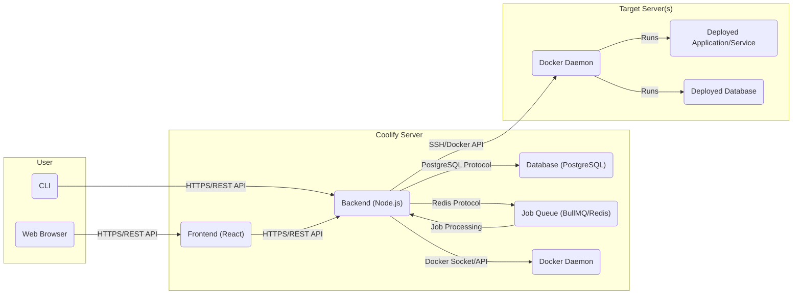
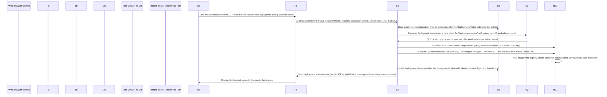
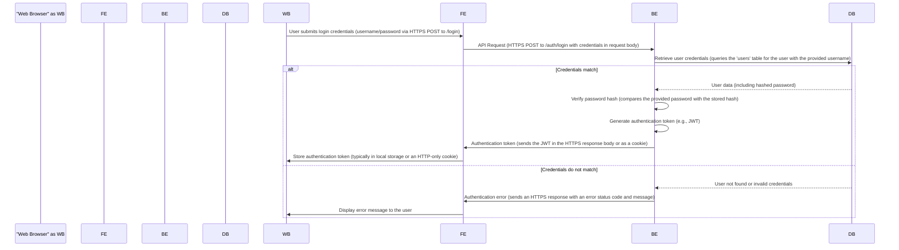
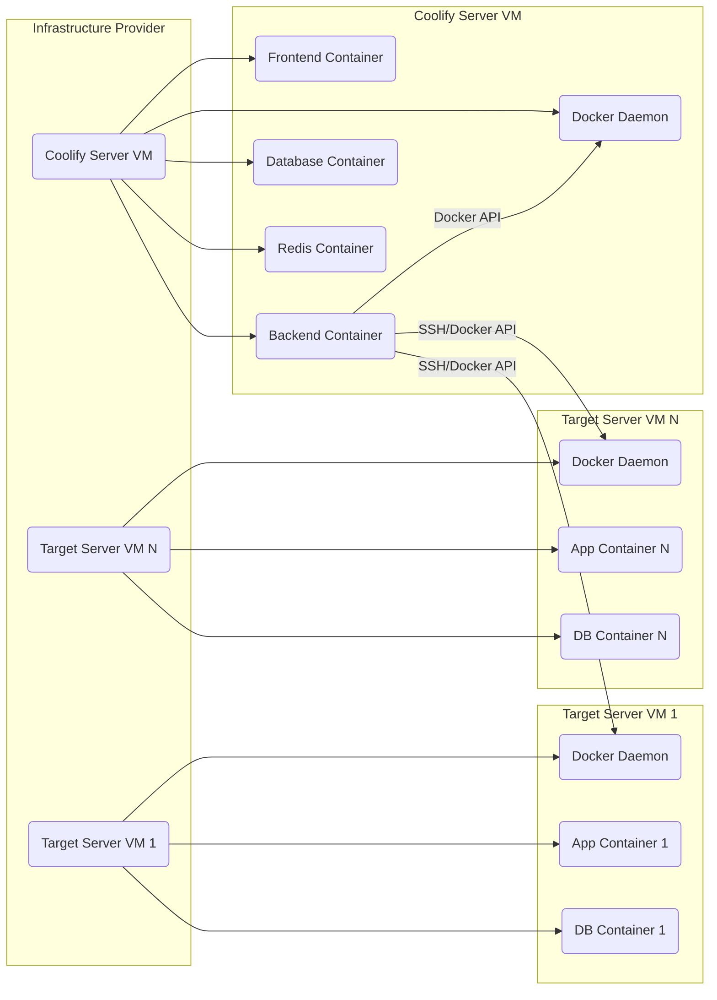

# Project Design Document: Coolify - Self-Hosted Development Platform

**Version:** 1.1
**Date:** October 26, 2023
**Author:** AI Architecture Expert

## 1. Introduction

This document provides an enhanced architectural design for Coolify, a self-hosted platform designed to simplify the deployment and management of applications, databases, and services. This iteration builds upon the previous version, offering more detailed explanations of components, interactions, and security considerations. This comprehensive understanding of the system's architecture is crucial for subsequent threat modeling activities.

## 2. Goals and Objectives

*   Provide a clear and detailed overview of the Coolify architecture with enhanced explanations.
*   Identify key components and their specific responsibilities and technologies.
*   Describe the interactions and data flow between different parts of the system with greater detail on communication protocols.
*   Highlight key technologies and dependencies with specific examples where applicable.
*   Serve as a robust foundation for future threat modeling exercises, providing more granular information.

## 3. High-Level Architecture

*   **User:** Interacts with Coolify through a web browser for a graphical interface or a command-line interface for programmatic access.
*   **Coolify Server:** The central component hosting the application logic, data persistence, and asynchronous task processing.
    *   **Frontend (React):** Provides a dynamic user interface built with React for managing the platform.
    *   **Backend (Node.js):** Handles API requests, implements core business logic, and orchestrates deployment workflows.
    *   **Database (PostgreSQL):** Stores structured data, including application configurations, user details, and deployment metadata.
    *   **Job Queue (BullMQ/Redis):** Manages and processes background tasks like deployments and backups asynchronously.
    *   **Docker Daemon:** Manages container lifecycles for Coolify's internal components and interacts with target server daemons.
*   **Target Server(s):** Remote servers where user applications, databases, and other services are deployed and managed.
    *   **Docker Daemon:**  Receives instructions from the Coolify server to manage containers for user workloads.
    *   **Deployed Application/Service:** The user's applications and services running within isolated Docker containers.
    *   **Deployed Database:** User's databases running within isolated Docker containers.

## 4. Detailed Architecture and Components

### 4.1. Coolify Server Components

*   **Frontend (React):**
    *   **Purpose:** To provide an interactive and user-friendly graphical interface for managing the Coolify platform.
    *   **Technology:** React, JavaScript (ES6+), HTML5, CSS3, potentially a state management library like Redux or Zustand, and a UI framework like Material UI or Ant Design.
    *   **Responsibilities:**
        *   Rendering dynamic UI components based on application state and API responses.
        *   Handling user interactions (clicks, form submissions, etc.).
        *   Making asynchronous API calls to the Backend using `fetch` or `axios`.
        *   Implementing client-side routing and navigation.
        *   Displaying real-time updates using technologies like WebSockets (if implemented).
    *   **Key Interactions:** Communicates with the Backend API via HTTPS using RESTful principles, sending and receiving JSON data.

*   **Backend (Node.js):**
    *   **Purpose:** To handle the core application logic, provide API endpoints for the Frontend and CLI, and orchestrate deployment processes.
    *   **Technology:** Node.js (LTS version), Express.js (or a similar framework like Koa.js or NestJS), an ORM or query builder (e.g., Sequelize, Knex.js, Prisma), potentially Passport.js for authentication, and libraries for interacting with Docker (e.g., `dockerode`) and SSH (e.g., `node-ssh`).
    *   **Responsibilities:**
        *   Implementing authentication and authorization mechanisms to secure API endpoints.
        *   Defining and managing RESTful API endpoints for CRUD operations on resources.
        *   Interacting with the PostgreSQL database using an ORM or query builder for data persistence.
        *   Managing the job queue (BullMQ/Redis) by enqueuing and processing tasks.
        *   Interacting with the local Docker daemon via the Docker socket or API to manage internal containers.
        *   Connecting to remote target servers via SSH and executing Docker commands using an SSH library or the remote Docker API.
        *   Handling error logging and monitoring.
    *   **Key Interactions:**
        *   Receives HTTPS requests from the Frontend and CLI.
        *   Queries and updates the PostgreSQL database using the PostgreSQL protocol.
        *   Interacts with the Redis server using the Redis protocol for job queue management.
        *   Communicates with Docker daemons using the Docker socket/API or SSH.

*   **Database (PostgreSQL):**
    *   **Purpose:** To provide persistent and reliable storage for Coolify's configuration, user data, and deployment status.
    *   **Technology:** PostgreSQL (a specific version), potentially with extensions like `pgcrypto` for password hashing.
    *   **Responsibilities:**
        *   Storing user account information, including hashed passwords and roles.
        *   Storing server configurations, including connection details and resource limits.
        *   Storing application and service definitions, including Docker image names, environment variables, and deployment settings.
        *   Tracking deployment history, logs, and status for each deployment.
        *   Storing database connection details for user-deployed databases.
    *   **Key Interactions:** Receives and processes SQL queries from the Backend via the PostgreSQL protocol.

*   **Job Queue (BullMQ/Redis):**
    *   **Purpose:** To manage and process asynchronous tasks that may be time-consuming or resource-intensive, ensuring the main application remains responsive.
    *   **Technology:** BullMQ (a Node.js library) built on top of Redis, requiring a running Redis server.
    *   **Responsibilities:**
        *   Receiving and storing job definitions from the Backend.
        *   Persisting jobs to ensure they are not lost in case of server restarts.
        *   Managing job priorities and concurrency.
        *   Distributing jobs to worker processes (typically part of the Backend).
        *   Tracking job status (pending, running, completed, failed).
        *   Providing mechanisms for retrying failed jobs.
    *   **Key Interactions:** The Backend enqueues jobs by sending commands to Redis. Worker processes within the Backend subscribe to the queue and process jobs by interacting with Redis.

*   **Docker Daemon (Coolify Server):**
    *   **Purpose:** To manage Docker containers for Coolify's internal services and potentially for building and pushing Docker images for user applications.
    *   **Technology:** Docker Engine (a specific version).
    *   **Responsibilities:**
        *   Running Coolify's internal components (if containerized).
        *   Building Docker images based on user configurations or Dockerfiles.
        *   Pushing built Docker images to container registries.
        *   Managing Docker networks and volumes used by Coolify and potentially user applications.
    *   **Key Interactions:** The Backend interacts with the local Docker daemon via the Docker socket (typically `/var/run/docker.sock`) or the Docker API.

### 4.2. Target Server Components

*   **Docker Daemon (Target Server):**
    *   **Purpose:** To manage the lifecycle of Docker containers for user-deployed applications, databases, and services on the target server.
    *   **Technology:** Docker Engine (a specific version).
    *   **Responsibilities:**
        *   Receiving instructions from the Coolify server (Backend) to pull Docker images from registries.
        *   Creating, starting, stopping, and restarting Docker containers.
        *   Managing container networking and exposing ports.
        *   Managing container volumes for persistent storage.
        *   Monitoring container resource usage.
    *   **Key Interactions:** Controlled by the Coolify Backend via SSH command execution or direct interaction with the remote Docker API (if exposed and configured).

*   **Deployed Application/Service:**
    *   **Purpose:** To run the user's applications and services within isolated and managed Docker containers on the target server.
    *   **Technology:** Varies depending on the user's application stack (e.g., Node.js, Python with frameworks like Django or Flask, Go, etc.), running within a Docker container based on a specific base image.
    *   **Responsibilities:**
        *   Serving user requests over HTTP/HTTPS or other protocols.
        *   Executing application-specific business logic.
        *   Interacting with other services and databases as needed.
        *   Logging application events and errors.
    *   **Key Interactions:** Interacts with the external world via network protocols. May interact with the Deployed Database.

*   **Deployed Database:**
    *   **Purpose:** To provide a persistent data store for user applications, running within a managed Docker container on the target server.
    *   **Technology:** Varies depending on the user's choice (e.g., PostgreSQL, MySQL, MongoDB, Redis), running within a Docker container based on an official or hardened image.
    *   **Responsibilities:**
        *   Storing and managing application data.
        *   Handling database queries from deployed applications.
        *   Ensuring data integrity and consistency.
        *   Potentially handling backups and replication (depending on configuration).
    *   **Key Interactions:** Receives database connection requests and queries from Deployed Applications/Services.

## 5. Data Flow

### 5.1. User Initiated Deployment (Enhanced)

*   The user initiates a deployment through the web browser, which sends an HTTPS request to the Frontend containing the deployment configuration in JSON format.
*   The Frontend forwards this request to the Backend's `/deployments` API endpoint via an HTTPS POST request, including details like application name, target server, and Docker image.
*   The Backend receives the request and stores the deployment configuration in the PostgreSQL database, inserting a new record in a `deployments` table.
*   The Backend then enqueues a deployment job in the BullMQ queue, including the deployment ID and relevant data needed for processing.
*   A worker process within the Backend, which is subscribed to the deployment queue, picks up the job.
*   The Backend establishes an SSH connection to the target server using stored credentials or a provided SSH key.
*   The Backend executes Docker commands on the target server via SSH (e.g., `docker pull`, `docker run`) or interacts with the remote Docker API if configured.
*   The Target Server's Docker daemon pulls the specified image, creates a container based on the configuration, and starts the container.
*   The Backend updates the deployment status in the PostgreSQL database, modifying the corresponding record in the `deployments` table with status updates, logs, and timestamps.
*   The Backend sends real-time deployment status updates to the Frontend using Server-Sent Events (SSE) or WebSockets.
*   The Frontend receives these updates and displays the deployment status to the user in the web browser.

### 5.2. User Login (Enhanced)

*   The user submits their login credentials (username and password) through the Frontend via an HTTPS POST request to the `/login` endpoint.
*   The Frontend sends an API request to the Backend's `/auth/login` endpoint via HTTPS POST, including the credentials in the request body (e.g., as JSON).
*   The Backend receives the request and queries the PostgreSQL database, retrieving the user's record from the `users` table based on the provided username.
*   If the username exists, the Backend retrieves the user data, including the stored hashed password.
*   The Backend then verifies the provided password against the stored hash using a secure hashing algorithm (e.g., bcrypt).
*   If the passwords match, the Backend generates an authentication token (e.g., a JSON Web Token - JWT).
*   The Backend sends the authentication token back to the Frontend in the HTTPS response body or as an HTTP-only cookie.
*   The Frontend stores the authentication token, typically in the browser's local storage or as an HTTP-only cookie for subsequent requests.
*   If the credentials do not match, the Backend sends an authentication error response to the Frontend with an appropriate HTTPS error status code and an error message.
*   The Frontend receives the error response and displays an error message to the user.

## 6. Key Technologies and Dependencies

*   **Programming Languages:** JavaScript (Node.js, React).
*   **Backend Framework:** Express.js (for routing, middleware), potentially with TypeScript for type safety.
*   **Frontend Library/Framework:** React, potentially with a state management library like Redux Toolkit or Zustand, and UI components from libraries like Material UI, Ant Design, or Tailwind CSS.
*   **Database:** PostgreSQL (specific version, e.g., 14 or 15), potentially with extensions like `pgcrypto`.
*   **Job Queue:** BullMQ (or similar like Bee-Queue or Redis Queue), requiring a Redis server (specific version, e.g., 6 or 7).
*   **Containerization:** Docker (specific version of Docker Engine).
*   **Operating System (Server):** Linux (likely distributions like Ubuntu, Debian, or CentOS).
*   **Networking:** TCP/IP, HTTP/HTTPS, SSH.
*   **Security:** TLS/SSL certificates (e.g., Let's Encrypt) for HTTPS, SSH protocol for remote server access, password hashing algorithms (e.g., bcrypt), potentially JSON Web Tokens (JWT) for authentication.

## 7. Deployment Architecture

*   **Coolify Server:** Typically deployed on a dedicated Virtual Machine (VM) or a bare-metal server. This VM hosts containers for the Frontend, Backend, Database (PostgreSQL), and Redis. The Docker daemon on this server manages these containers.
*   **Target Servers:** Can be multiple VMs or physical servers. Each target server runs its own Docker daemon, which is managed remotely by the Coolify server's Backend. User applications and databases are deployed as containers on these target servers.
*   **Networking:** Requires network connectivity between the Coolify server and all target servers, typically over a private network or the public internet. Secure communication channels like SSH are essential. Firewall rules must be configured to allow necessary traffic (e.g., SSH from Coolify server to target servers, HTTPS to the Coolify server).

## 8. Security Considerations (For Threat Modeling)

*   **Authentication and Authorization:**
    *   **Threat:** Brute-force attacks on login forms, credential stuffing, session hijacking, privilege escalation.
    *   **Mitigation:** Strong password policies, rate limiting on login attempts, multi-factor authentication (MFA), secure session management (HTTP-only, Secure cookies), role-based access control (RBAC) enforced at the Backend.
*   **API Security:**
    *   **Threat:** Injection attacks (SQL injection, command injection), cross-site scripting (XSS), cross-site request forgery (CSRF), insecure direct object references (IDOR), mass assignment vulnerabilities.
    *   **Mitigation:** Input validation and sanitization on all API endpoints, parameterized queries for database interactions, protection against XSS (e.g., using appropriate templating engines and Content Security Policy), CSRF protection (e.g., synchronizer tokens), proper authorization checks before accessing resources, using DTOs to control data binding.
*   **Database Security:**
    *   **Threat:** SQL injection, unauthorized access to sensitive data, data breaches.
    *   **Mitigation:** Use of parameterized queries or ORMs to prevent SQL injection, principle of least privilege for database access, encryption of sensitive data at rest and in transit, regular database backups, strong database credentials.
*   **Job Queue Security:**
    *   **Threat:** Unauthorized access to the job queue, manipulation of job data, denial of service by flooding the queue.
    *   **Mitigation:** Secure the Redis instance with authentication and network restrictions, ensure only authorized components can enqueue and process jobs.
*   **Docker Security:**
    *   **Threat:** Container escape, vulnerable container images, insecure Docker daemon configuration, exposure of the Docker socket.
    *   **Mitigation:** Regularly scan container images for vulnerabilities, use minimal and trusted base images, follow Docker security best practices, restrict access to the Docker socket, use tools like Docker Bench for Security.
*   **SSH Security:**
    *   **Threat:** Brute-force attacks on SSH, unauthorized access via compromised SSH keys.
    *   **Mitigation:** Use strong SSH keys, disable password authentication for SSH, restrict SSH access to specific IP addresses, regularly rotate SSH keys.
*   **Network Security:**
    *   **Threat:** Man-in-the-middle attacks, unauthorized network access.
    *   **Mitigation:** Enforce HTTPS for all communication, use firewalls to restrict network access, segment networks where appropriate.
*   **Secrets Management:**
    *   **Threat:** Exposure of sensitive credentials in code or configuration files.
    *   **Mitigation:** Use a dedicated secrets management solution (e.g., HashiCorp Vault, AWS Secrets Manager), avoid hardcoding secrets, encrypt secrets at rest.
*   **Input Validation:**
    *   **Threat:** Various injection attacks, data corruption.
    *   **Mitigation:** Implement robust input validation on both the Frontend and Backend, validate data types, formats, and ranges.
*   **Dependency Management:**
    *   **Threat:** Vulnerabilities in third-party libraries and dependencies.
    *   **Mitigation:** Regularly update dependencies, use tools to scan for known vulnerabilities (e.g., npm audit, Snyk).

## 9. Future Considerations

*   **Enhanced Monitoring and Logging:** Implement more comprehensive monitoring and logging solutions for both the Coolify server and deployed applications, including metrics, alerts, and centralized log management.
*   **Automated Backups and Disaster Recovery:** Implement automated backup strategies for the Coolify database and user data, along with a disaster recovery plan.
*   **Improved Resource Management:** Implement more granular control over resource allocation for deployed applications and services.
*   **Support for More Deployment Methods:** Explore support for deployment methods beyond Docker, such as serverless functions or direct deployments.
*   **Plugin System:** Develop a plugin system to allow users to extend Coolify's functionality.
*   **Integration with CI/CD Pipelines:** Provide tighter integration with CI/CD pipelines for automated deployments.

This improved document provides a more detailed and comprehensive understanding of the Coolify architecture, offering valuable insights for conducting thorough threat modeling and identifying potential security vulnerabilities.