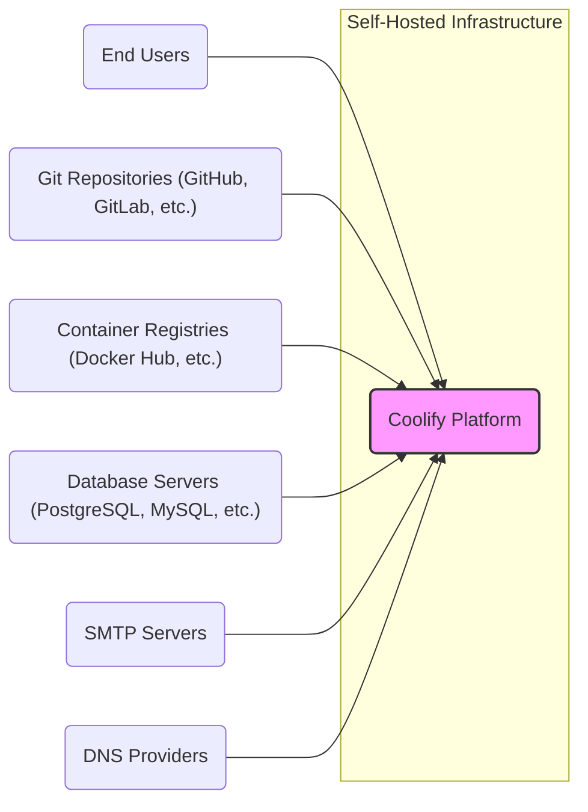
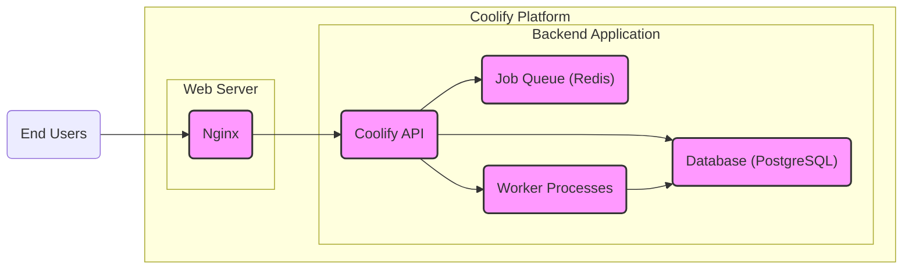
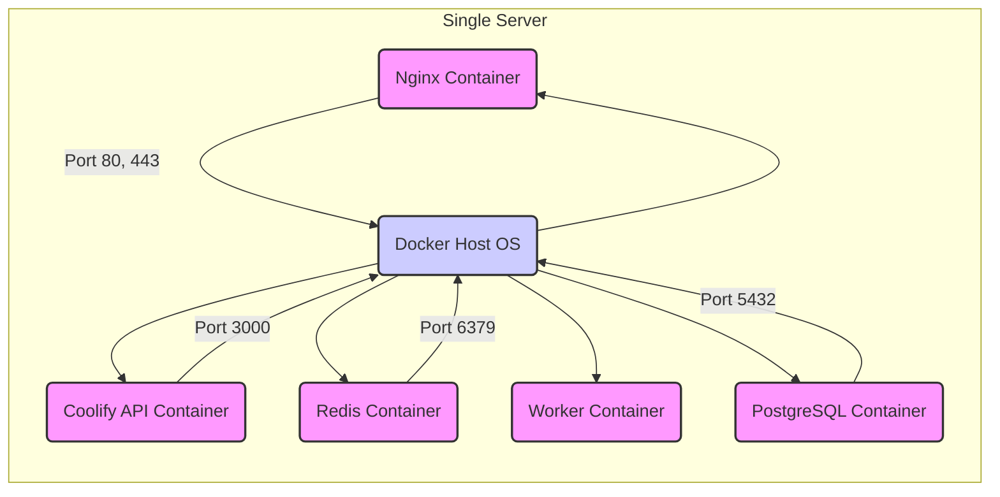
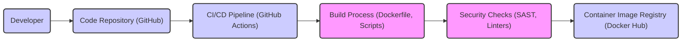

# BUSINESS POSTURE

- Business Priorities and Goals:
  - Coolify aims to simplify and streamline the process of deploying and managing web applications and databases on self-hosted infrastructure.
  - It targets developers and organizations seeking control over their deployment environment and data, offering an alternative to fully managed cloud platforms.
  - Key priorities likely include ease of use, broad compatibility with different technologies, and efficient resource utilization.
  - For a startup like Coolify, rapid user adoption and community growth are crucial for long-term success.

- Business Risks:
  - Security vulnerabilities in the platform could lead to data breaches or service disruptions, damaging user trust and hindering adoption.
  - Complexity in managing diverse deployment environments and technologies could lead to user frustration and churn.
  - Competition from established cloud providers and other self-hosting solutions could limit market share.
  - Lack of clear monetization strategy for an open-source project can impact long-term sustainability.
  - Reliance on community contributions for development and maintenance can introduce unpredictability and potential delays.

# SECURITY POSTURE

- Existing Security Controls:
  - security control: HTTPS is enforced for web access, ensuring encrypted communication between users and the Coolify platform. (Implemented in web server configuration, likely Nginx or similar).
  - security control: Regular dependency updates are likely performed to address known vulnerabilities in underlying libraries and frameworks. (Part of standard software development practice).
  - security control: Input validation is expected to be implemented in the application code to prevent common web vulnerabilities like SQL injection and cross-site scripting (XSS). (Implemented in application code).
  - security control: Role-Based Access Control (RBAC) is likely implemented to manage user permissions and access to different resources within the platform. (Implemented in application backend).
  - accepted risk: As an open-source project, vulnerability disclosure and patching might be publicly visible, potentially giving attackers a window of opportunity.
  - accepted risk: Reliance on user-provided infrastructure introduces variability in security configurations and potential misconfigurations by users.

- Recommended Security Controls:
  - security control: Implement automated security scanning (SAST/DAST) in the CI/CD pipeline to identify vulnerabilities early in the development lifecycle.
  - security control: Conduct regular penetration testing by security professionals to identify and address security weaknesses in the platform.
  - security control: Implement a robust secrets management solution to securely store and manage sensitive credentials like API keys and database passwords.
  - security control: Provide security hardening guidelines and best practices for users deploying Coolify on their infrastructure.
  - security control: Implement rate limiting and DDoS protection to protect the platform from denial-of-service attacks.

- Security Requirements:
  - Authentication:
    - requirement: Secure user authentication mechanism to verify user identity. (e.g., username/password, OAuth).
    - requirement: Multi-factor authentication (MFA) should be offered as an option to enhance account security.
    - requirement: Session management to securely maintain user sessions and prevent unauthorized access.
  - Authorization:
    - requirement: Role-Based Access Control (RBAC) to manage user permissions and access to resources.
    - requirement: Granular authorization policies to control access to specific functionalities and data.
    - requirement: Principle of least privilege should be enforced, granting users only the necessary permissions.
  - Input Validation:
    - requirement: Comprehensive input validation on all user inputs to prevent injection attacks (SQL injection, XSS, command injection, etc.).
    - requirement: Input sanitization and encoding to neutralize potentially malicious input.
    - requirement: Use of secure coding practices to minimize vulnerabilities related to input handling.
  - Cryptography:
    - requirement: Use of strong encryption algorithms for sensitive data at rest and in transit.
    - requirement: Secure storage and management of cryptographic keys.
    - requirement: Proper implementation of cryptographic protocols (e.g., TLS for HTTPS).
    - requirement: Hashing and salting of passwords for secure password storage.

# DESIGN

- C4 CONTEXT

- C4 CONTEXT Elements:
  - - Name: Coolify Platform
    - Type: Software System
    - Description: The Coolify platform itself, responsible for orchestrating application deployments, managing infrastructure, and providing a user interface for administration.
    - Responsibilities:
      - Managing application deployments and lifecycle.
      - Provisioning and managing infrastructure resources (servers, databases, etc.).
      - Providing a user interface and API for users to interact with the platform.
      - Handling user authentication and authorization.
      - Monitoring application and infrastructure health.
    - Security controls:
      - Input validation on user inputs.
      - Authentication and authorization mechanisms.
      - HTTPS for web interface.
      - Secrets management for internal credentials.
      - Logging and monitoring of security events.
  - - Name: End Users
    - Type: Person
    - Description: Developers and DevOps engineers who use the Coolify platform to deploy and manage their applications.
    - Responsibilities:
      - Interacting with the Coolify platform through the user interface or API.
      - Configuring application deployments and settings.
      - Monitoring application status and logs.
    - Security controls:
      - Strong password management.
      - Multi-factor authentication (if enabled).
      - Awareness of secure deployment practices.
  - - Name: Git Repositories (GitHub, GitLab, etc.)
    - Type: External System
    - Description: Source code repositories where application code is stored and version controlled. Coolify integrates with these to fetch application code for deployment.
    - Responsibilities:
      - Storing and managing application source code.
      - Providing access to code for authorized users and systems.
      - Triggering deployment pipelines based on code changes (via webhooks).
    - Security controls:
      - Access control to repositories.
      - Audit logging of code changes.
      - Branch protection and code review processes.
  - - Name: Container Registries (Docker Hub, etc.)
    - Type: External System
    - Description: Registries for storing and distributing container images. Coolify pulls container images from these registries for application deployments.
    - Responsibilities:
      - Storing and managing container images.
      - Providing access to container images for authorized users and systems.
      - Ensuring image integrity and security (vulnerability scanning).
    - Security controls:
      - Access control to container images.
      - Image signing and verification.
      - Vulnerability scanning of container images.
  - - Name: Database Servers (PostgreSQL, MySQL, etc.)
    - Type: External System
    - Description: Database servers used by deployed applications. Coolify configures and manages access to these databases.
    - Responsibilities:
      - Storing and managing application data.
      - Providing database services to deployed applications.
      - Ensuring data integrity, availability, and confidentiality.
    - Security controls:
      - Database access control and authentication.
      - Encryption of data at rest and in transit.
      - Regular backups and disaster recovery.
  - - Name: SMTP Servers
    - Type: External System
    - Description: Simple Mail Transfer Protocol servers used for sending emails, such as notifications and password resets, from the Coolify platform or deployed applications.
    - Responsibilities:
      - Relaying emails sent by the Coolify platform and deployed applications.
      - Ensuring email delivery and reliability.
    - Security controls:
      - SMTP server authentication and authorization.
      - Encryption of email communication (STARTTLS).
      - Spam filtering and email security measures.
  - - Name: DNS Providers
    - Type: External System
    - Description: Domain Name System providers used to manage domain names and DNS records for deployed applications. Coolify integrates with DNS providers to automate DNS configuration.
    - Responsibilities:
      - Resolving domain names to IP addresses.
      - Managing DNS records for domains.
      - Ensuring DNS availability and reliability.
    - Security controls:
      - DNSSEC for DNS record integrity.
      - DDoS protection for DNS infrastructure.
      - Access control to DNS management interfaces.

- C4 CONTAINER

- C4 CONTAINER Elements:
  - - Name: Nginx
    - Type: Web Server
    - Description: Serves static content, reverse proxies requests to the Coolify API, and handles TLS termination.
    - Responsibilities:
      - Serving the Coolify web UI.
      - Handling incoming HTTP/HTTPS requests.
      - TLS termination and certificate management.
      - Reverse proxying API requests to the Coolify API container.
      - Basic security controls like rate limiting and request filtering.
    - Security controls:
      - HTTPS enforcement.
      - TLS configuration and certificate management.
      - Rate limiting and DDoS protection.
      - Web application firewall (WAF) integration (optional).
  - - Name: Coolify API
    - Type: Backend Application
    - Description: The core backend application of Coolify, handling API requests, business logic, and orchestration of deployments. Likely written in Node.js or similar.
    - Responsibilities:
      - Handling user authentication and authorization.
      - Processing API requests from the web UI and CLI.
      - Managing application deployments and lifecycle.
      - Interacting with infrastructure providers (Docker, Kubernetes, etc.).
      - Storing application and infrastructure configuration in the database.
      - Enqueuing background jobs for asynchronous tasks.
    - Security controls:
      - Input validation and sanitization.
      - Authorization checks for API endpoints.
      - Secure coding practices to prevent vulnerabilities.
      - Secrets management for database credentials and API keys.
      - Logging and monitoring of security events.
  - - Name: Job Queue (Redis)
    - Type: Data Store
    - Description: A message broker used for asynchronous task processing, such as deployment tasks and background operations. Redis is a likely candidate.
    - Responsibilities:
      - Queuing and managing background jobs.
      - Ensuring reliable delivery of jobs to worker processes.
      - Providing a mechanism for inter-process communication.
    - Security controls:
      - Access control to the Redis instance.
      - Network segmentation to limit access.
      - Encryption of data in transit (optional, depending on Redis configuration).
  - - Name: Worker Processes
    - Type: Backend Application
    - Description: Processes that execute background jobs from the job queue, performing tasks like application deployments, infrastructure provisioning, and monitoring.
    - Responsibilities:
      - Consuming jobs from the job queue.
      - Executing deployment tasks (e.g., Docker image building, container orchestration).
      - Interacting with infrastructure providers and APIs.
      - Updating application and infrastructure status in the database.
    - Security controls:
      - Secure coding practices to prevent vulnerabilities.
      - Principle of least privilege for access to resources.
      - Input validation for job parameters.
      - Logging and monitoring of job execution.
  - - Name: Database (PostgreSQL)
    - Type: Data Store
    - Description: Persistent database for storing Coolify platform data, including user accounts, application configurations, deployment history, and infrastructure metadata. PostgreSQL is a likely choice.
    - Responsibilities:
      - Storing persistent data for the Coolify platform.
      - Ensuring data integrity, availability, and confidentiality.
      - Providing data access to the Coolify API and worker processes.
    - Security controls:
      - Database access control and authentication.
      - Encryption of data at rest and in transit.
      - Regular backups and disaster recovery.
      - Database hardening and security configuration.

- DEPLOYMENT

- Deployment Architecture Options:
  - Option 1: Docker Compose (Single Server) - Suitable for small deployments and development environments. All containers (Nginx, API, Redis, Worker, PostgreSQL) are deployed on a single server using Docker Compose.
  - Option 2: Docker Swarm (Multi-Server) - Scalable deployment across multiple servers using Docker Swarm orchestration. Provides high availability and scalability.
  - Option 3: Kubernetes (Multi-Server) - Highly scalable and robust deployment on a Kubernetes cluster. Offers advanced features like auto-scaling, self-healing, and complex networking.

- Detailed Deployment Architecture (Docker Compose - Single Server):

- DEPLOYMENT Elements:
  - - Name: Docker Host OS
    - Type: Infrastructure
    - Description: The operating system of the server where Docker and Coolify containers are deployed. Could be Linux (Ubuntu, CentOS, etc.).
    - Responsibilities:
      - Providing the underlying operating system environment for Docker and containers.
      - Managing system resources (CPU, memory, storage, network).
      - Ensuring OS-level security and patching.
    - Security controls:
      - OS hardening and security configuration.
      - Regular OS patching and updates.
      - Firewall configuration to restrict network access.
      - Intrusion detection and prevention systems (optional).
  - - Name: Nginx Container
    - Type: Container
    - Description: Docker container running the Nginx web server.
    - Responsibilities:
      - Serving the Coolify web UI.
      - Reverse proxying API requests.
      - TLS termination.
    - Security controls:
      - Container image security scanning.
      - Minimal container image with only necessary components.
      - Nginx security configuration.
  - - Name: Coolify API Container
    - Type: Container
    - Description: Docker container running the Coolify API backend application.
    - Responsibilities:
      - Handling API requests and business logic.
      - Orchestrating deployments.
    - Security controls:
      - Container image security scanning.
      - Minimal container image.
      - Secure coding practices in the API application.
  - - Name: Redis Container
    - Type: Container
    - Description: Docker container running the Redis job queue.
    - Responsibilities:
      - Managing the job queue.
    - Security controls:
      - Container image security scanning.
      - Redis security configuration (access control, password).
      - Network segmentation.
  - - Name: Worker Container
    - Type: Container
    - Description: Docker container running the Coolify worker processes.
    - Responsibilities:
      - Executing background jobs.
      - Performing deployment tasks.
    - Security controls:
      - Container image security scanning.
      - Minimal container image.
      - Principle of least privilege for container processes.
  - - Name: PostgreSQL Container
    - Type: Container
    - Description: Docker container running the PostgreSQL database.
    - Responsibilities:
      - Storing persistent data.
    - Security controls:
      - Container image security scanning.
      - PostgreSQL security configuration (authentication, access control).
      - Data volume encryption (optional).

- BUILD

- BUILD Elements:
  - - Name: Developer
    - Type: Person
    - Description: Software developers who write and commit code to the code repository.
    - Responsibilities:
      - Writing and maintaining application code.
      - Committing code changes to the repository.
      - Following secure coding practices.
    - Security controls:
      - Secure development environment.
      - Code review processes.
      - Security awareness training.
  - - Name: Code Repository (GitHub)
    - Type: System
    - Description: Git repository hosting the Coolify source code.
    - Responsibilities:
      - Storing and versioning source code.
      - Triggering CI/CD pipelines on code changes.
    - Security controls:
      - Access control to the repository.
      - Branch protection rules.
      - Audit logging.
  - - Name: CI/CD Pipeline (GitHub Actions)
    - Type: System
    - Description: Automated CI/CD pipeline using GitHub Actions (or similar) to build, test, and publish Coolify artifacts.
    - Responsibilities:
      - Automating the build, test, and deployment process.
      - Running security checks during the build process.
      - Publishing build artifacts (container images).
    - Security controls:
      - Secure pipeline configuration.
      - Access control to the CI/CD system.
      - Audit logging of pipeline activities.
  - - Name: Build Process (Dockerfile, Scripts)
    - Type: Process
    - Description: The actual build process defined by Dockerfiles and build scripts, which compiles code, packages dependencies, and creates container images.
    - Responsibilities:
      - Compiling source code.
      - Packaging dependencies.
      - Creating container images.
      - Ensuring reproducible builds.
    - Security controls:
      - Minimal base images for containers.
      - Dependency scanning and vulnerability checks.
      - Build process hardening.
  - - Name: Security Checks (SAST, Linters)
    - Type: Process
    - Description: Automated security checks integrated into the CI/CD pipeline, including Static Application Security Testing (SAST) and linters to identify potential vulnerabilities and code quality issues.
    - Responsibilities:
      - Identifying potential security vulnerabilities in the code.
      - Enforcing code quality standards.
      - Providing feedback to developers on security and code quality issues.
    - Security controls:
      - SAST tools and configurations.
      - Linter configurations.
      - Integration with CI/CD pipeline for automated checks.
  - - Name: Container Image Registry (Docker Hub)
    - Type: System
    - Description: Registry where built container images are stored and published.
    - Responsibilities:
      - Storing and managing container images.
      - Distributing container images for deployment.
    - Security controls:
      - Access control to the registry.
      - Image scanning for vulnerabilities.
      - Image signing and verification.

# RISK ASSESSMENT

- Critical Business Processes:
  - Application Deployment: The core functionality of Coolify is to enable users to deploy and manage their applications. Disruption of this process would directly impact users' ability to deploy and update their services.
  - Platform Management: Management of the Coolify platform itself, including user management, configuration, and monitoring, is critical for its operation and security.
  - Data Storage: The database storing Coolify's configuration and user data is crucial for platform functionality and user data integrity.

- Data Sensitivity:
  - User Credentials: Usernames, passwords (hashed), and API keys used for authentication and authorization are highly sensitive. Compromise could lead to unauthorized access to user accounts and deployed applications.
  - Application Configurations: Configurations for deployed applications, including environment variables, database connection strings, and deployment settings, can contain sensitive information.
  - Infrastructure Credentials: Credentials for accessing infrastructure providers (e.g., cloud provider API keys, server SSH keys) are highly sensitive and could lead to infrastructure compromise.
  - Application Data (Indirect): While Coolify itself might not directly store application data, it manages the deployment and infrastructure for applications that do. Therefore, vulnerabilities in Coolify could indirectly lead to exposure of application data.

# QUESTIONS & ASSUMPTIONS

- Questions:
  - What is the intended scale of deployments for Coolify? Is it primarily for small teams and personal projects, or is it designed for larger organizations and enterprise deployments?
  - What is the expected level of security expertise of Coolify users? Are they expected to be security-conscious DevOps professionals, or are they more general developers?
  - What is the monetization strategy for Coolify? Understanding this can help prioritize security investments and features.
  - Are there any specific compliance requirements that Coolify needs to adhere to (e.g., GDPR, HIPAA, PCI DSS)?

- Assumptions:
  - BUSINESS POSTURE:
    - The primary business goal is user adoption and community growth for an open-source project.
    - Security is a high priority to build user trust and prevent platform misuse.
    - Ease of use and broad compatibility are key features for attracting users.
  - SECURITY POSTURE:
    - Basic security controls like HTTPS and input validation are already in place.
    - Security is an ongoing concern and requires continuous improvement.
    - Users are expected to have some level of technical proficiency but might not be security experts.
  - DESIGN:
    - The architecture is container-based and designed for self-hosted deployments.
    - Docker Compose is a likely deployment option for simpler setups.
    - The build process involves standard CI/CD practices and container image building.