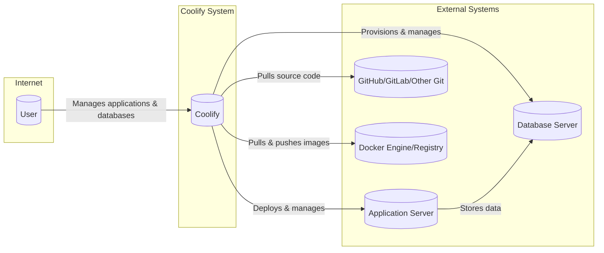
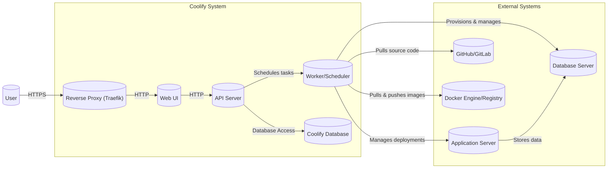
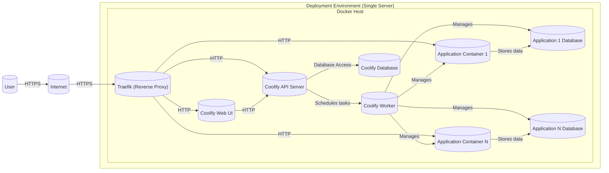
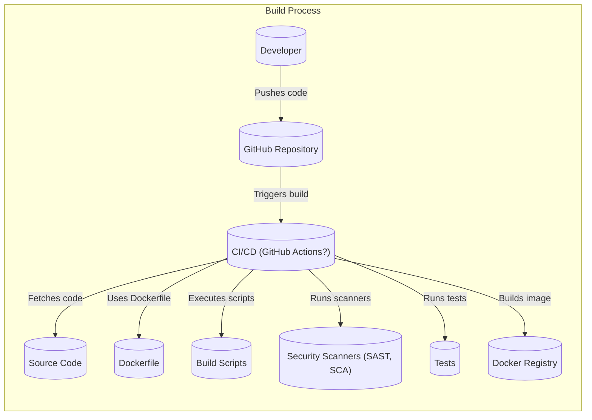

Okay, let's create a design document for Coolify based on the provided GitHub repository.

# BUSINESS POSTURE

Coolify aims to provide an open-source, self-hostable alternative to Heroku and Netlify.  It simplifies application and database deployment, management, and scaling.  The primary business goals appear to be:

*   Provide a cost-effective solution for developers and small teams to deploy and manage applications.
*   Offer a user-friendly experience that abstracts away the complexities of infrastructure management.
*   Foster a community-driven, open-source project with potential for future monetization (e.g., through premium features or support).
*   Reduce reliance on proprietary, "black box" platforms.
*   Enable developers to maintain control over their data and infrastructure.

Key business risks that need to be addressed:

*   Data breaches or loss due to vulnerabilities in the Coolify platform itself or in the underlying infrastructure it manages.
*   Unauthorized access to user applications and databases.
*   Service disruptions or downtime affecting user applications.
*   Supply chain attacks targeting Coolify's dependencies or build process.
*   Reputational damage due to security incidents or poor performance.
*   Failure to comply with relevant data privacy regulations (e.g., GDPR, CCPA) if user data is mishandled.
*   Scalability issues as the user base grows.

# SECURITY POSTURE

Based on the repository and general best practices, here's an assessment of the security posture:

Existing Security Controls:

*   security control: Docker-based deployments: Applications are containerized, providing isolation and reducing the attack surface. (Implemented in deployment scripts and Dockerfiles).
*   security control: Authentication: Coolify likely uses some form of authentication to protect access to the dashboard and API. (Needs further clarification from the repository's code/documentation).
*   security control: Reverse Proxy (Traefik): Traefik is used as a reverse proxy and load balancer, potentially offering some protection against common web attacks. (Mentioned in documentation and configuration files).
*   security control: Automatic HTTPS: Coolify uses Let's Encrypt for automatic HTTPS, ensuring encrypted communication. (Mentioned in documentation).
*   security control: Regular Updates: The project seems to be actively maintained, suggesting regular updates and security patches. (Based on commit history).
*   security control: SSH Key Management: Coolify manages SSH keys for server access, which is a standard security practice. (Mentioned in documentation).

Accepted Risks:

*   accepted risk: Reliance on third-party dependencies: Like any software project, Coolify relies on numerous third-party libraries and tools, each with its own potential vulnerabilities.
*   accepted risk: User-managed server security: While Coolify simplifies deployment, users are ultimately responsible for the security of their underlying servers.
*   accepted risk: Potential for misconfiguration: Incorrect configuration of Coolify or the underlying infrastructure could expose applications to risks.
*   accepted risk: Limited built-in security features for deployed applications: Coolify primarily focuses on deployment and management, not on providing comprehensive security features for the applications themselves (e.g., WAF, intrusion detection).

Recommended Security Controls (High Priority):

*   Implement robust Role-Based Access Control (RBAC) within Coolify to limit user permissions.
*   Integrate Static Application Security Testing (SAST) and Dynamic Application Security Testing (DAST) into the build/deployment pipeline.
*   Implement Software Composition Analysis (SCA) to identify and manage vulnerabilities in third-party dependencies.
*   Provide clear security documentation and guidelines for users.
*   Establish a vulnerability disclosure program.
*   Consider implementing a Web Application Firewall (WAF) either as part of Coolify or as a recommended configuration for users.
*   Implement audit logging for all critical actions within Coolify.
*   Offer options for two-factor authentication (2FA).

Security Requirements:

*   Authentication:
    *   Strong password policies.
    *   Support for 2FA.
    *   Secure session management.
    *   Protection against brute-force attacks.
*   Authorization:
    *   RBAC to restrict access based on user roles.
    *   Principle of least privilege.
*   Input Validation:
    *   Validate all user inputs to prevent injection attacks (e.g., SQL injection, command injection).
    *   Sanitize user inputs to prevent Cross-Site Scripting (XSS) attacks.
*   Cryptography:
    *   Use strong, industry-standard encryption algorithms for data in transit (HTTPS) and at rest (if applicable).
    *   Securely manage cryptographic keys.
    *   Use a cryptographically secure random number generator.

# DESIGN

## C4 CONTEXT

Element Descriptions:

*   Element:
    *   Name: User
    *   Type: Person
    *   Description: A developer or team using Coolify to deploy and manage their applications.
    *   Responsibilities: Interacts with the Coolify dashboard/API, configures applications, manages deployments.
    *   Security controls: Authentication, Authorization (RBAC).

*   Element:
    *   Name: Coolify
    *   Type: Software System
    *   Description: The core Coolify application, responsible for orchestrating deployments, managing resources, and providing a user interface.
    *   Responsibilities: Application deployment, database provisioning, resource management, user interface, API.
    *   Security controls: Authentication, Authorization (RBAC), Input Validation, Secure Configuration, Audit Logging.

*   Element:
    *   Name: Database Server
    *   Type: Software System
    *   Description: A database server (e.g., PostgreSQL, MySQL, MongoDB) provisioned and managed by Coolify.
    *   Responsibilities: Storing application data.
    *   Security controls: Access Control, Encryption (at rest and in transit), Regular Backups, Auditing.

*   Element:
    *   Name: Application Server
    *   Type: Software System
    *   Description: A server (e.g., a virtual machine or container) running the user's application code.
    *   Responsibilities: Executing application logic, serving requests.
    *   Security controls: Secure Configuration, Regular Updates, Least Privilege, Network Segmentation.

*   Element:
    *   Name: GitHub/GitLab/Other Git
    *   Type: Software System
    *   Description: A Git repository hosting the user's application source code.
    *   Responsibilities: Version control, source code management.
    *   Security controls: Access Control, Branch Protection, Code Review.

*   Element:
    *   Name: Docker Engine/Registry
    *   Type: Software System
    *   Description: Docker Engine for running containers and a Docker Registry (e.g., Docker Hub, private registry) for storing container images.
    *   Responsibilities: Container execution, image storage.
    *   Security controls: Image Scanning, Secure Configuration, Access Control (for the registry).

## C4 CONTAINER

Element Descriptions:

*   Element:
    *   Name: Web UI
    *   Type: Web Application
    *   Description: The user interface for interacting with Coolify.
    *   Responsibilities: Provides a user-friendly way to manage applications, databases, and settings.
    *   Security controls: Authentication, Authorization, Input Validation, Output Encoding, Session Management.

*   Element:
    *   Name: API Server
    *   Type: API
    *   Description: The backend API for Coolify, handling requests from the UI and other clients.
    *   Responsibilities: Processes requests, interacts with the database, schedules tasks.
    *   Security controls: Authentication, Authorization, Input Validation, Rate Limiting, Secure Configuration.

*   Element:
    *   Name: Worker/Scheduler
    *   Type: Background Process
    *   Description: Handles asynchronous tasks, such as deployments, database provisioning, and resource management.
    *   Responsibilities: Executes long-running tasks, interacts with external systems.
    *   Security controls: Secure Configuration, Least Privilege, Input Validation (for task parameters).

*   Element:
    *   Name: Coolify Database
    *   Type: Database
    *   Description: Stores Coolify's internal data, such as user accounts, application configurations, and deployment settings.
    *   Responsibilities: Persists Coolify's state.
    *   Security controls: Access Control, Encryption (at rest and in transit), Regular Backups, Auditing.

*   Element:
    *   Name: Reverse Proxy (Traefik)
    *   Type: Reverse Proxy
    *   Description: Handles incoming requests, provides SSL termination, and routes traffic to the appropriate services.
    *   Responsibilities: Load balancing, SSL termination, request routing.
    *   Security controls: Secure Configuration, Regular Updates, potentially WAF capabilities.

*   Element:
    *   Name: Application Server
    *   Type: Container
    *   Description: A container running the user's application code.
    *   Responsibilities: Executing application logic, serving requests.
    *   Security controls: Secure Configuration, Regular Updates, Least Privilege, Network Segmentation (within the container).

*   Element:
    *   Name: Database Server
    *   Type: Container/VM
    *   Description: A database server (e.g., PostgreSQL, MySQL, MongoDB) provisioned and managed by Coolify.
    *   Responsibilities: Storing application data.
    *   Security controls: Access Control, Encryption (at rest and in transit), Regular Backups, Auditing.

*   Element:
    *   Name: GitHub/GitLab
    *   Type: External System
    *   Description: A Git repository hosting the user's application source code.
    *   Responsibilities: Version control, source code management.
    *   Security controls: Access Control, Branch Protection, Code Review.

*   Element:
    *   Name: Docker Engine/Registry
    *   Type: External System
    *   Description: Docker Engine for running containers and a Docker Registry (e.g., Docker Hub, private registry) for storing container images.
    *   Responsibilities: Container execution, image storage.
    *   Security controls: Image Scanning, Secure Configuration, Access Control (for the registry).

* Element:
    *   Name: User
    *   Type: Person
    *   Description: A developer or team using Coolify to deploy and manage their applications.
    *   Responsibilities: Interacts with the Coolify dashboard/API, configures applications, manages deployments.
    *   Security controls: Authentication, Authorization (RBAC).

## DEPLOYMENT

Possible Deployment Solutions:

1.  Single Server Deployment: Coolify and all managed applications/databases run on a single server.
2.  Multi-Server Deployment: Coolify runs on one or more dedicated servers, and applications/databases are deployed to separate servers.
3.  Kubernetes Deployment: Coolify itself and/or the managed applications are deployed to a Kubernetes cluster.

Chosen Solution (for detailed description): Single Server Deployment

This is likely the simplest and most common deployment model for Coolify, especially for smaller projects.

Element Descriptions:

*   Element:
    *   Name: Docker Host
    *   Type: Physical or Virtual Machine
    *   Description: The server where Docker is installed and all containers are running.
    *   Responsibilities: Hosting all Coolify components and deployed applications.
    *   Security controls: Operating System Hardening, Firewall, Regular Updates, Intrusion Detection/Prevention System.

*   Element:
    *   Name: Traefik (Reverse Proxy)
    *   Type: Container
    *   Description: Handles incoming requests, provides SSL termination, and routes traffic.
    *   Responsibilities: Load balancing, SSL termination, request routing.
    *   Security controls: Secure Configuration, Regular Updates.

*   Element:
    *   Name: Coolify Web UI, Coolify API Server, Coolify Worker, Coolify Database
    *   Type: Container
    *   Description:  Coolify's components, running as separate containers.
    *   Responsibilities: (See Container diagram descriptions).
    *   Security controls: (See Container diagram descriptions).

*   Element:
    *   Name: Application Container 1, Application Container N
    *   Type: Container
    *   Description: Containers running user applications.
    *   Responsibilities: Executing application logic.
    *   Security controls: Secure Configuration, Regular Updates, Least Privilege.

*   Element:
    *   Name: Application 1 Database, Application N Database
    *   Type: Container
    *   Description: Databases for user applications.
    *   Responsibilities: Storing application data.
    *   Security controls: Access Control, Encryption, Regular Backups.

*   Element:
    *   Name: User
    *   Type: Person
    *   Description: A developer or team using Coolify.
    *   Responsibilities: Interacts with Coolify.
    *   Security controls: Authentication, Authorization.

*   Element:
    *   Name: Internet
    *   Type: Network
    *   Description: The public network.
    *   Responsibilities: Connect user with Coolify instance.
    *   Security controls: Network firewalls.

## BUILD

Coolify uses a combination of build processes, primarily centered around Docker image creation and potentially some scripting for infrastructure setup.

Build Process Description:

1.  Developers push code changes to the GitHub repository.
2.  This triggers a CI/CD pipeline (likely using GitHub Actions, based on the repository structure).
3.  The CI/CD pipeline fetches the source code, including Dockerfiles and any build scripts.
4.  Security scanners (SAST, SCA) are ideally run as part of the pipeline to identify vulnerabilities in the code and dependencies.
5.  Automated tests (unit tests, integration tests) are executed.
6.  If all checks and tests pass, Docker images are built for the various Coolify components (UI, API, worker).
7.  The built images are pushed to a Docker registry (e.g., Docker Hub, or a private registry).

Security Controls in Build Process:

*   security control: CI/CD Automation: Automates the build process, ensuring consistency and reducing manual errors.
*   security control: Version Control (Git): Tracks all code changes, enabling rollbacks and auditing.
*   security control: Docker Images: Packages applications and dependencies into isolated containers.
*   security control: (Recommended) SAST: Static Application Security Testing to identify code vulnerabilities.
*   security control: (Recommended) SCA: Software Composition Analysis to identify vulnerabilities in dependencies.
*   security control: (Recommended) Image Signing: Digitally sign Docker images to ensure integrity.

# RISK ASSESSMENT

*   Critical Business Processes:
    *   Application Deployment and Management: Ensuring users can reliably deploy and manage their applications.
    *   Database Provisioning and Management: Providing secure and reliable database services.
    *   User Authentication and Authorization: Protecting access to the Coolify platform and user resources.
    *   Data Backup and Recovery: Ensuring data can be recovered in case of failures or disasters.

*   Data Sensitivity:
    *   Coolify Configuration Data (e.g., user accounts, API keys, server configurations): Highly sensitive.
    *   User Application Code: Potentially sensitive, depending on the application.
    *   User Application Data (stored in databases): Potentially highly sensitive, depending on the application (e.g., PII, financial data).
    *   Logs: Potentially sensitive, may contain information about user activity or application behavior.

# QUESTIONS & ASSUMPTIONS

*   Questions:
    *   What specific authentication mechanisms are currently implemented in Coolify? (e.g., password-based, OAuth, etc.)
    *   Are there any existing security audits or penetration tests performed on Coolify?
    *   What is the target deployment environment for most users? (Single server, multi-server, Kubernetes?)
    *   What is the expected scale of the user base and the number of applications/databases to be managed?
    *   What are the specific data privacy regulations that Coolify needs to comply with?
    *   Is there a plan for handling security vulnerabilities discovered in Coolify or its dependencies?
    *   What level of support is provided to users for security-related issues?
    *   Are there plans to implement more advanced security features in the future (e.g., WAF, intrusion detection)?
    *   What specific CI/CD system is used (GitHub Actions, Jenkins, etc.)?
    *   Are there any secrets (API keys, database credentials) stored in the repository or configuration files? (This should be avoided.)

*   Assumptions:
    *   BUSINESS POSTURE: The primary target audience is developers and small teams with limited budgets. The project prioritizes ease of use and cost-effectiveness over enterprise-grade security features.
    *   SECURITY POSTURE: Users are responsible for the security of their own servers and applications. Coolify provides basic security features but does not offer comprehensive protection against all threats. The project relies heavily on Docker for security isolation.
    *   DESIGN: The single-server deployment model is the most common. GitHub Actions is used for CI/CD. Docker Hub is used as the primary Docker registry. The Coolify database is relatively small and does not store highly sensitive user data.