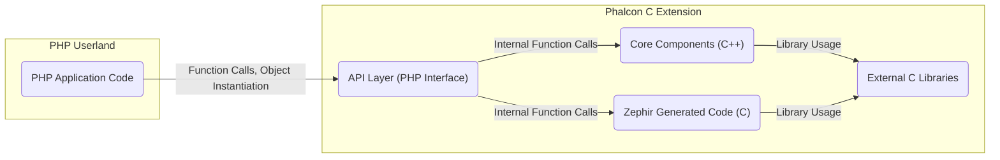

# Project Design Document: Phalcon C Extension

**Version:** 1.1
**Date:** October 26, 2023
**Author:** AI Software Architect

## 1. Introduction

This document provides an enhanced design overview of the Phalcon C extension (cphalcon), a high-performance PHP framework implemented as a C extension. This revised document aims to offer a more detailed and refined understanding of the system's architecture, components, and data flow, specifically tailored for effective threat modeling.

## 2. Goals and Objectives

*   Clearly and comprehensively define the architecture and key components of the Phalcon C extension.
*   Precisely illustrate the interaction between PHP userland code and the underlying C extension.
*   Identify and elaborate on critical data flows within the system, highlighting potential security implications.
*   Thoroughly discuss potential areas of security concern based on the design, providing context for threat identification.
*   Present a well-structured and detailed document specifically designed to facilitate comprehensive threat modeling exercises.

## 3. System Architecture

Phalcon's architecture leverages the performance benefits of a C extension to provide core functionalities to PHP applications. This design choice results in significant speed improvements compared to frameworks written purely in PHP.

### 3.1. High-Level Architecture

*   **PHP Userland:** Represents the standard PHP code written by developers utilizing the Phalcon framework. This code interacts with the Phalcon extension through its exposed API.
*   **Phalcon C Extension:** The fundamental core of the framework, implemented in a combination of C++ and C for optimal performance.
    *   **API Layer (PHP Interface):** This crucial layer acts as the bridge between PHP userland code and the underlying C/C++ implementation. It exposes Phalcon's functionalities as PHP classes, interfaces, and functions. This layer handles the translation of PHP requests into C/C++ function calls and vice versa.
    *   **Core Components (C++):** These are the foundational building blocks of Phalcon, implemented in C++. They manage core functionalities such as:
        *   Request and response handling.
        *   URL routing and dispatching.
        *   Dependency injection and service management.
        *   Event management.
        *   Security features.
    *   **Zephir Generated Code (C):**  A significant portion of Phalcon is written in Zephir, a high-level language specifically designed for creating PHP extensions. Zephir code compiles down to optimized C code, offering a balance between development speed and performance.
    *   **External C Libraries:** Phalcon relies on various well-established external C libraries to provide specific functionalities. Examples include:
        *   `libpq` for PostgreSQL database interaction.
        *   `mysqlnd` for MySQL database interaction.
        *   `OpenSSL` for cryptographic operations.
        *   Potentially others for tasks like string manipulation or network communication.

### 3.2. Detailed Component Architecture

The Phalcon C extension is structured into several interconnected components, each responsible for specific aspects of the framework's functionality:

*   **`Phalcon\Mvc\Application`:** The central orchestrator responsible for bootstrapping the application, processing incoming requests, and managing the overall request/response lifecycle. It initializes core services and dispatches requests to the appropriate handlers.
*   **`Phalcon\Http\Request`:**  Encapsulates and manages incoming HTTP requests. It provides methods for accessing headers, query parameters, POST data, uploaded files, and other request-related information. This component is a key point for input validation considerations.
*   **`Phalcon\Http\Response`:**  Manages the outgoing HTTP response. It allows setting headers, content, status codes, and cookies. Proper handling of this component is crucial for preventing information leakage and ensuring secure communication.
*   **`Phalcon\Router`:**  Responsible for mapping incoming HTTP requests to specific controller actions based on defined routes. Incorrectly configured routes can lead to unintended access to application functionalities.
*   **`Phalcon\Dispatcher`:**  Takes the routed information and instantiates the appropriate controller and executes the designated action method. Security checks and authorization logic are often implemented before or during the dispatching process.
*   **`Phalcon\Mvc\Controller`:**  The base class for application controllers. It provides a structure for organizing application logic and handling specific requests. Controller actions contain the core business logic of the application.
*   **`Phalcon\Mvc\Model`:**  Provides an Object-Relational Mapper (ORM) for interacting with databases. It simplifies database interactions and offers features like data validation and relationships. Securely configuring and using the ORM is vital to prevent database vulnerabilities.
*   **`Phalcon\Db\Adapter`:**  An abstract class defining the interface for database adapters. Concrete implementations exist for various database systems (e.g., MySQL, PostgreSQL, SQLite). These adapters handle the low-level communication with the database.
*   **`Phalcon\Security`:**  Offers a suite of security-related functionalities, including:
    *   Password hashing (using secure algorithms).
    *   Cross-Site Request Forgery (CSRF) protection.
    *   Input filtering and sanitization (though primarily for convenience, dedicated validation is recommended).
    *   Cryptographically secure random number generation.
*   **`Phalcon\Session`:**  Manages user sessions, including session creation, storage, and destruction. Secure session management is critical for maintaining user authentication and preventing session hijacking.
*   **`Phalcon\Crypt`:**  Provides cryptographic functionalities like encryption and decryption of data. Proper key management and algorithm selection are crucial for the security of this component.
*   **`Phalcon\Events\Manager`:**  Implements an event management system that allows decoupling components by enabling them to subscribe to and emit events. While not directly a security component, improper event handling could potentially lead to vulnerabilities.
*   **`Phalcon\Di\FactoryDefault`:**  A default dependency injection container responsible for managing application services and their dependencies. Securely configuring the dependency injection container is important to prevent the injection of malicious services.
*   **`Phalcon\View`:**  Handles the rendering of views and templates, responsible for presenting data to the user. Proper output encoding within the view layer is essential to prevent Cross-Site Scripting (XSS) attacks.
*   **`Phalcon\Flash`:**  Provides a mechanism for displaying one-time informational messages to the user. While seemingly innocuous, improper handling could potentially be exploited in certain scenarios.
*   **`Phalcon\Config`:**  Manages application configuration settings. Securely storing and accessing configuration data, especially sensitive information like database credentials, is paramount.

## 4. Data Flow

The typical lifecycle of an HTTP request within a Phalcon application involves the following data flow, highlighting key components and potential security checkpoints:

```mermaid
graph LR
    subgraph "Client"
        A("Browser / Client")
    end
    subgraph "Web Server (e.g., Nginx, Apache)"
        B("Web Server")
    end
    subgraph "PHP-FPM / PHP SAPI"
        C("PHP-FPM / SAPI")
    end
    subgraph "Phalcon C Extension"
        D("Phalcon\\Mvc\\Application")
        E("Phalcon\\Http\\Request")
        F("Phalcon\\Router")
        G("Phalcon\\Dispatcher")
        H("Controller Action")
        I("Phalcon\\Mvc\\Model")
        J("Database")
        K("Phalcon\\View")
        L("Phalcon\\Http\\Response")
    end

    A -- "HTTP Request" --> B
    B -- "Forward Request" --> C
    C -- "Initialize Phalcon" --> D
    D -- "Parse Request" --> E
    E -- "Determine Route" --> F
    F -- "Dispatch Request" --> G
    G -- "Execute Action" --> H
    H -- "Interact with Database" --> I
    I -- "Database Query" --> J
    H -- "Render View" --> K
    K -- "Prepare Response" --> L
    L -- "Send Response" --> C
    C -- "Return Response" --> B
    B -- "HTTP Response" --> A
    style A fill:#ccf,stroke:#333,stroke-width:2px
    style B fill:#ccf,stroke:#333,stroke-width:2px
    style C fill:#ccf,stroke:#333,stroke-width:2px
    style D fill:#ffc,stroke:#f9f,stroke-width:2px
    style E fill:#ffc,stroke:#f9f,stroke-width:2px
    style F fill:#ffc,stroke:#f9f,stroke-width:2px
    style G fill:#ffc,stroke:#f9f,stroke-width:2px
    style H fill:#ffc,stroke:#f9f,stroke-width:2px
    style I fill:#ffc,stroke:#f9f,stroke-width:2px
    style J fill:#aaf,stroke:#333,stroke-width:2px
    style K fill:#ffc,stroke:#f9f,stroke-width:2px
    style L fill:#ffc,stroke:#f9f,stroke-width:2px
```

1. **Client Request:** The user's web browser or client application initiates an HTTP request targeting the web server.
2. **Web Server Processing:** The web server (e.g., Nginx, Apache) receives the incoming request and, based on its configuration, forwards it to the appropriate PHP processor (typically PHP-FPM).
3. **PHP-FPM Invocation:** PHP-FPM initializes the PHP environment and loads the Phalcon C extension, making its functionalities available.
4. **Application Initialization:** The `Phalcon\Mvc\Application` component takes control, acting as the central point for handling the request.
5. **Request Handling:** The `Phalcon\Http\Request` component parses the raw HTTP request data, extracting headers, query parameters, POST data, and other relevant information. This is a critical stage for initial input validation.
6. **Routing:** The `Phalcon\Router` component analyzes the request URI and matches it against defined routes to determine the appropriate controller and action to handle the request.
7. **Dispatching:** The `Phalcon\Dispatcher` component instantiates the identified controller and invokes the specified action method. Security checks, such as authorization, are often performed before or during this stage.
8. **Controller Logic:** The controller action executes the core business logic required to fulfill the request. This may involve:
    *   **Model Interaction:** Interacting with the database through the `Phalcon\Mvc\Model` and `Phalcon\Db\Adapter` components to retrieve or manipulate data. Secure database interaction practices are crucial here.
    *   **View Rendering:** Preparing data to be displayed to the user and invoking the `Phalcon\View` component to render the appropriate template. Output encoding should be applied at this stage to prevent XSS.
9. **Response Generation:** The controller action prepares the data and instructions for the HTTP response.
10. **Response Handling:** The `Phalcon\Http\Response` component constructs the HTTP response, setting headers, the response body, and the HTTP status code.
11. **PHP-FPM Response:** PHP-FPM sends the generated HTTP response back to the web server.
12. **Web Server Response:** The web server forwards the HTTP response back to the client's browser or application.

## 5. Security Considerations

Based on Phalcon's architecture and data flow, several key security considerations are paramount for building secure applications:

*   **Input Validation and Sanitization:** Rigorous validation and sanitization of all user-supplied input are essential to prevent injection attacks (SQL Injection, Cross-Site Scripting, Command Injection, etc.). While `Phalcon\Filter` offers some basic filtering, comprehensive validation logic should be implemented within the application.
*   **Output Encoding:**  Properly encoding output data before rendering it in views is critical to prevent Cross-Site Scripting (XSS) vulnerabilities. Utilize Phalcon's view engine's escaping mechanisms and be mindful of the context in which data is being displayed.
*   **SQL Injection Prevention:** When interacting with databases, always use parameterized queries or prepared statements provided by `Phalcon\Db`. Avoid concatenating user input directly into SQL queries. Employ the ORM's features for safe data handling.
*   **Cross-Site Request Forgery (CSRF) Protection:** Implement CSRF protection mechanisms using tokens provided by `Phalcon\Security`. Ensure that all state-changing requests are protected against CSRF attacks.
*   **Secure Session Management:** Configure session handling securely. Use secure cookies (HTTPOnly, Secure flags), regenerate session IDs after login, and implement appropriate session timeout mechanisms. Protect against session fixation and hijacking.
*   **Authentication and Authorization:** Implement robust authentication mechanisms to verify user identities and authorization controls to restrict access to resources based on user roles and permissions. Phalcon provides building blocks, but the application developer is responsible for implementing these securely.
*   **Cryptographic Security Best Practices:** When using encryption or hashing, utilize strong, well-vetted algorithms provided by `Phalcon\Crypt` or other reputable libraries. Employ proper key management practices, including secure storage and rotation. Avoid using deprecated or weak cryptographic algorithms.
*   **Dependency Management Security:**  The security of external C libraries used by Phalcon is a critical concern. Regularly update these dependencies to patch known vulnerabilities. Employ tools and processes to monitor for vulnerabilities in these external libraries.
*   **Error Handling and Logging Security:**  Handle errors gracefully and log them securely. Avoid exposing sensitive information in error messages displayed to users. Implement robust logging mechanisms to track application activity and potential security incidents. Secure the log files themselves.
*   **Denial of Service (DoS) Mitigation:** Implement measures to mitigate potential Denial of Service (DoS) attacks. This may include rate limiting, input validation to prevent resource exhaustion, and proper resource management within the application. Web server configurations can also play a role in mitigating DoS attacks.
*   **Secure File Upload Handling:** If the application handles file uploads, implement robust security measures to prevent malicious file uploads. This includes validating file types, sizes, and content, and storing uploaded files in secure locations with appropriate permissions.
*   **Code Compilation and Build Process Security:** Ensure the security of the build environment and the process of compiling the C extension to prevent supply chain attacks. Use trusted build tools and verify the integrity of dependencies.

## 6. Deployment Considerations

Secure deployment of Phalcon applications involves careful configuration of the environment:

*   **Web Server Hardening:**  Properly configure the web server (e.g., Nginx, Apache) by disabling unnecessary modules, setting appropriate security headers (e.g., HSTS, Content-Security-Policy), and restricting access to sensitive files.
*   **PHP Configuration Security:**  Secure PHP configuration settings in `php.ini` (e.g., `open_basedir`, `disable_functions`, `expose_php`) to limit potential attack vectors.
*   **File System Permissions:**  Set restrictive file system permissions for application files and directories to prevent unauthorized access and modification. Follow the principle of least privilege.
*   **SSL/TLS Configuration:**  Enforce HTTPS by using a valid SSL/TLS certificate and configuring the web server to redirect HTTP traffic to HTTPS. Ensure the SSL/TLS configuration uses strong ciphers and protocols.
*   **Firewall Configuration:**  Implement a firewall to restrict network access to the server, allowing only necessary ports and protocols.
*   **Regular Security Audits and Penetration Testing:** Conduct regular security audits and penetration testing to identify potential vulnerabilities in the application and its deployment environment.

## 7. Technologies Used

*   **Core Programming Languages:** C++, C, PHP, Zephir
*   **Common Web Servers:** Nginx, Apache
*   **Typical PHP SAPI:** PHP-FPM, mod_php
*   **Supported Databases:** MySQL, PostgreSQL, SQLite, MariaDB, Oracle, SQL Server (via respective database adapters)
*   **Target Operating Systems:** Linux, macOS, Windows

## 8. Future Considerations

*   Explore further modularization of the C extension to enhance maintainability and facilitate more granular security audits.
*   Investigate and implement additional built-in security features to proactively protect against emerging web vulnerabilities.
*   Improve integration with security scanning tools and static analysis platforms to aid developers in identifying potential security flaws early in the development lifecycle.
*   Continue to prioritize regular security audits, penetration testing, and community engagement to ensure the ongoing security and robustness of the framework.

This enhanced document provides a more detailed and security-focused overview of the Phalcon C extension's design. This information is intended to be a valuable resource for conducting comprehensive threat modeling exercises and building secure applications with Phalcon.
