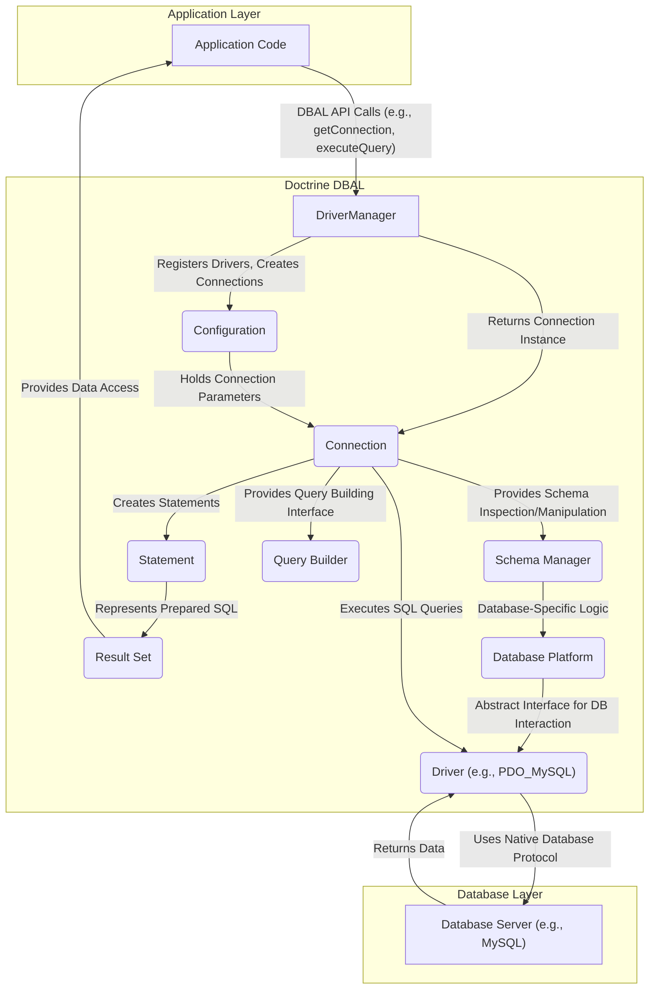

## Project Design Document: Doctrine DBAL (Improved)

**1. Introduction**

This document provides an enhanced design overview of the Doctrine Database Abstraction Layer (DBAL) project, intended for use in subsequent threat modeling activities. It details the key architectural components, data flows, and security considerations to facilitate a comprehensive understanding of the system's structure and potential vulnerabilities. This document builds upon the initial design and provides more granular information.

**2. Project Overview**

Doctrine DBAL is a critical component in many PHP applications, offering a robust and flexible database abstraction layer. Its primary goals are:

* **Achieving Database Independence:** Enables developers to write application code that can interact with different relational database systems (e.g., MySQL, PostgreSQL, SQLite, Oracle, SQL Server) without requiring significant code changes for each database. This is achieved through a consistent API.
* **Simplifying Database Interactions:** Provides a higher-level, object-oriented API for performing common database operations, abstracting away the complexities of native database APIs. This includes features like prepared statements, transaction management, and schema manipulation.
* **Efficient Connection Management:** Handles the lifecycle of database connections, including establishing, maintaining, and closing connections, optimizing resource utilization.
* **Abstracting Data Type Differences:** Manages the variations in data types across different database systems, providing a consistent way to work with data within the application.
* **Ensuring Extensibility and Adaptability:** Designed with extensibility in mind, allowing for the addition of support for new database systems and custom database functionalities through drivers and platform implementations.

**3. Architecture Overview**

The architecture of Doctrine DBAL is layered, effectively decoupling the application logic from the specifics of the underlying database.

**4. Key Components**

* **DriverManager:**  The central point for obtaining database connections. It is responsible for:
    * Registering available database drivers.
    * Reading connection parameters from the `Configuration`.
    * Selecting the appropriate `Driver` based on the connection parameters.
    * Creating and managing `Connection` instances.
* **Configuration:**  A value object that encapsulates all the necessary parameters for establishing a database connection. This includes:
    * Database credentials (username, password).
    * Hostname or IP address of the database server.
    * Database name.
    * Driver-specific options.
    * Character set and other connection attributes.
* **Connection:** Represents an active, established connection to the database server. It provides the core API for interacting with the database:
    * Executing SQL queries (both raw SQL and through `Statement` objects).
    * Managing transactions (begin, commit, rollback).
    * Accessing the `Schema Manager` for schema operations.
    * Utilizing the `Query Builder` for programmatic query construction.
* **Statement:** Represents a prepared SQL statement. Key features include:
    * Parameter binding to prevent SQL injection vulnerabilities.
    * Efficient execution of the same query with different parameters.
    * Fetching results as `Result Set` objects.
* **Result Set:**  Represents the data returned by a query execution. It offers methods for:
    * Iterating over the rows of the result.
    * Fetching data as arrays, objects, or scalar values.
    * Retrieving metadata about the result set (e.g., column names).
* **Driver:** An interface defining the contract for interacting with a specific database system. Concrete implementations (e.g., `PDO_MySQL`, `PDOSqlite`, `OCI8`) handle the database-specific communication and translation of DBAL calls into native database operations.
* **Database Platform:** Provides database-specific information and utilities, including:
    * SQL dialect variations and syntax rules.
    * Data type mappings between DBAL's abstract types and the database's native types.
    * Methods for generating database-specific SQL for schema manipulation.
* **Schema Manager:**  Offers an API for inspecting and modifying the database schema programmatically. This includes operations like:
    * Listing tables, columns, indexes, and foreign keys.
    * Creating, altering, and dropping tables and other schema objects.
* **Query Builder:** A fluent interface for constructing SQL queries programmatically, reducing the need to write raw SQL strings. It supports various query types (SELECT, INSERT, UPDATE, DELETE) and provides methods for adding conditions, ordering, and limiting results.

**5. Data Flow (Detailed)**

The process of executing a database query using Doctrine DBAL involves the following steps:

1. **Application Request:** The application code initiates a database operation, typically by calling a method on the `Connection` object (e.g., `executeQuery`, `prepare`, `insert`).
2. **Connection Acquisition:** If a connection is not already established, the application requests one from the `DriverManager`. The `DriverManager` uses the `Configuration` to select the appropriate `Driver` and establish a connection to the database server.
3. **Statement Preparation (if applicable):** For parameterized queries or when using prepared statements, the application calls the `prepare` method on the `Connection`, which creates a `Statement` object. The SQL query with placeholders is passed to the database.
4. **Parameter Binding (if applicable):** If the `Statement` has parameters, the application binds the actual values to the placeholders using methods like `bindValue` or `bindParam`. This is crucial for preventing SQL injection.
5. **Query Execution:** The application executes the query by calling a method on the `Connection` or `Statement` object (e.g., `execute`).
6. **Driver Interaction:** The `Connection` delegates the query execution to the underlying `Driver`. The `Driver` translates the DBAL request into the native database protocol and sends the SQL query to the database server.
7. **Database Processing:** The database server receives the query, processes it, and generates the results.
8. **Result Retrieval:** The database server sends the results back to the `Driver`.
9. **Result Set Creation:** The `Driver` receives the results and creates a `Result Set` object, which encapsulates the returned data.
10. **Data Access:** The application code uses the `Result Set` object to iterate over the rows and access the data.

**6. Security Considerations (Enhanced)**

Security is a paramount concern when interacting with databases. Here's a more detailed look at potential security considerations for Doctrine DBAL:

* **Connection String Security:**
    * **Threat:**  Exposure of database credentials (username, password) in the `Configuration` can lead to unauthorized database access.
    * **Mitigation:**
        * Store connection parameters securely, avoiding hardcoding them directly in the application. Utilize environment variables, configuration files with restricted access, or dedicated secrets management solutions.
        * Implement proper access controls on configuration files.
        * Consider using connection string encryption if supported by the environment.
* **SQL Injection:**
    * **Threat:**  Constructing SQL queries by directly concatenating user-supplied input can create SQL injection vulnerabilities, allowing attackers to execute arbitrary SQL code.
    * **Mitigation:**
        * **Always use prepared statements with parameter binding.** This is the primary defense against SQL injection. Doctrine DBAL strongly encourages this practice.
        * Avoid dynamic SQL construction where possible. If necessary, carefully sanitize and validate user input before incorporating it into SQL queries.
        * Implement input validation on the application layer to restrict the types and formats of data accepted from users.
* **Database Driver Vulnerabilities:**
    * **Threat:**  Security vulnerabilities in the underlying database drivers (e.g., PDO extensions) can be exploited.
    * **Mitigation:**
        * Keep the PHP installation and database drivers up-to-date with the latest security patches.
        * Be aware of known vulnerabilities in the specific database drivers being used.
        * Consider using reputable and well-maintained database drivers.
* **Data Sanitization and Output Encoding:**
    * **Threat:** While DBAL helps prevent SQL injection, it doesn't inherently protect against other types of injection attacks (e.g., Cross-Site Scripting - XSS) if data retrieved from the database is displayed in a web context without proper sanitization and encoding.
    * **Mitigation:**
        * Sanitize and encode data appropriately when displaying it in web pages or other contexts to prevent XSS and other output-related vulnerabilities. This is the responsibility of the application layer.
* **Access Control (Database Level):**
    * **Threat:**  Insufficiently restrictive database user permissions can allow unauthorized access to sensitive data or the execution of administrative commands.
    * **Mitigation:**
        * Follow the principle of least privilege when granting database permissions. Each application or user should only have the necessary permissions to perform its intended tasks.
        * Regularly review and audit database user permissions.
* **Denial of Service (DoS):**
    * **Threat:**  Maliciously crafted queries or excessive connection requests can overload the database server, leading to denial of service.
    * **Mitigation:**
        * Implement query timeouts to prevent long-running queries from consuming excessive resources.
        * Implement connection pooling and rate limiting to manage connection requests.
        * Monitor database performance and resource utilization.
* **Information Disclosure:**
    * **Threat:**  Errors or misconfigurations can inadvertently expose sensitive database information (e.g., through error messages).
    * **Mitigation:**
        * Configure the database server to avoid displaying sensitive information in error messages.
        * Implement proper error handling in the application to prevent the leakage of database details.
        * Secure database backups and logs.

**7. Deployment Model**

Doctrine DBAL is deployed as a library integrated directly into the PHP application. The application includes the DBAL library as a dependency (typically managed by Composer). There is no separate DBAL server or service to deploy. The application code then utilizes the DBAL API to interact with the configured database.

**8. Technologies Used**

* **PHP (version 7.2 or higher recommended):** The core programming language.
* **PDO (PHP Data Objects):**  Frequently used as the underlying driver interface, providing a consistent way to access various database systems. Specific PDO extensions (e.g., `pdo_mysql`, `pdo_pgsql`) are required for each database.
* **Composer:**  A dependency management tool for PHP, commonly used to install and manage the Doctrine DBAL library.
* **Relational Database Systems:**  Supports a wide array of RDBMS, including:
    * MySQL/MariaDB
    * PostgreSQL
    * SQLite
    * Oracle Database
    * Microsoft SQL Server
    * And others through community drivers.

**9. Assumptions and Constraints**

* The underlying database system is assumed to be properly secured, configured, and patched against known vulnerabilities.
* The PHP environment where Doctrine DBAL is used is assumed to be reasonably secure, with appropriate security measures in place.
* This design document focuses on the core functionality and security aspects of Doctrine DBAL itself and does not delve into the security of specific application logic built on top of it.
* The security considerations outlined are intended to be comprehensive but may not cover all possible attack vectors. A thorough threat modeling exercise is crucial for identifying specific risks in a given context.

**10. Future Considerations**

* **Exploring Advanced Authentication Mechanisms:** Investigating support for more sophisticated database authentication methods beyond basic username/password, such as certificate-based authentication or integration with identity providers.
* **Enhanced Connection Security:**  Further exploring options for securing database connections, such as TLS/SSL encryption and secure connection pooling.
* **Security Auditing and Logging:**  Considering features or best practices for logging database interactions and security-related events for auditing purposes.
* **Security Analysis Tools Integration:**  Exploring integration with static analysis tools or security scanners to identify potential vulnerabilities in code using Doctrine DBAL.
* **Community Security Reviews:**  Encouraging and participating in community security reviews and vulnerability disclosure programs.

This improved design document provides a more detailed and nuanced understanding of Doctrine DBAL, particularly in the area of security. It serves as a more robust foundation for conducting effective threat modeling and identifying potential vulnerabilities within applications utilizing this library.