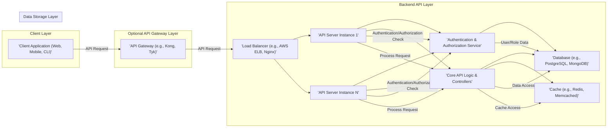
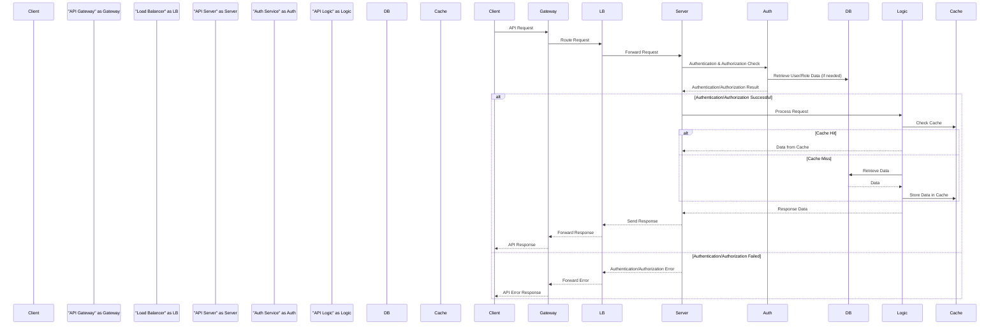

# Project Design Document: dingo/api

**Version:** 1.1
**Date:** October 26, 2023
**Author:** AI Software Architect

## 1. Project Overview

This document details the design of the `dingo/api` project, accessible on GitHub at [https://github.com/dingo/api](https://github.com/dingo/api). This design serves as a blueprint for understanding the system's architecture, individual components, and the flow of data. It is specifically crafted to facilitate subsequent threat modeling activities. Given the open-source nature of the repository, certain aspects of the design are inferred based on common API development methodologies and the anticipated purpose of such a project.

## 2. Goals

*   Present a clear and comprehensive architectural overview of the `dingo/api` project.
*   Pinpoint key components and articulate their respective responsibilities.
*   Illustrate the movement of data within the system.
*   Highlight initial security considerations for each component.
*   Establish a solid foundation for conducting effective threat modeling.

## 3. Architecture Overview

The `dingo/api` project appears to be a backend API, likely constructed using a web framework. A layered architecture is a common approach for such systems.

**Description of Components:**

*   **Client Application (Web, Mobile, CLI):** The application(s) that interact with the API. This could be a web browser, a mobile application, a command-line interface, or another service.
*   **API Gateway (Optional):** A central point of entry for all API requests. It can manage tasks like routing, rate limiting, authentication, authorization, and request transformation. Its presence depends on the API's complexity and scale requirements. Examples include Kong or Tyk.
*   **Load Balancer:** Distributes incoming network traffic across multiple API server instances. This ensures high availability, fault tolerance, and improved performance by preventing any single server from being overwhelmed. Examples include AWS Elastic Load Balancer (ELB) or Nginx.
*   **API Server Instances:** The core of the API, responsible for receiving requests, executing business logic, and returning responses. These are instances of an application server running the API codebase.
*   **Authentication & Authorization Service:**  Handles the verification of user identity (authentication) and the determination of user permissions to access specific resources (authorization). This might involve checking credentials against a database, using JWTs, or integrating with an external identity provider.
*   **Core API Logic & Controllers:** Contains the application's business logic and the controllers that handle specific API endpoints. This includes data validation, processing, and interaction with data storage.
*   **Database:** The persistent storage for the API's data. This could be a relational database like PostgreSQL or MySQL, or a NoSQL database like MongoDB or Cassandra, depending on the data model and requirements.
*   **Cache (Optional):** A temporary storage layer used to store frequently accessed data in memory. This reduces database load and improves response times. Examples include Redis or Memcached.

## 4. Component Details

This section provides a more detailed breakdown of the key components within the architecture.

*   **API Server Instances:**
    *   **Technology:** Likely implemented using a web framework such as Python (Flask, Django), Node.js (Express), Ruby on Rails, Go (Gin, Echo), or Java (Spring Boot). The specific framework can be determined by examining the project's dependencies.
    *   **Functionality:**
        *   Receives and interprets incoming API requests (e.g., using HTTP methods like GET, POST, PUT, DELETE).
        *   Routes requests to the appropriate controller or handler based on the URL path.
        *   Executes business logic to process the request.
        *   Serializes data into a response format (e.g., JSON, XML).
        *   Handles error conditions and returns appropriate error responses.
    *   **Security Considerations:**
        *   Protection against common web vulnerabilities (e.g., Cross-Site Scripting (XSS), Cross-Site Request Forgery (CSRF), injection attacks).
        *   Secure handling of environment variables and secrets.
        *   Regular security audits and penetration testing.

*   **Authentication & Authorization Service:**
    *   **Technology:** Could be a custom-built service or a third-party identity provider (e.g., Auth0, Okta, Keycloak). Common protocols include OAuth 2.0, OpenID Connect, and JWT.
    *   **Functionality:**
        *   Authenticates users based on provided credentials (username/password, API keys, tokens).
        *   Issues access tokens or session cookies upon successful authentication.
        *   Authorizes access to specific resources based on user roles or permissions.
        *   Manages user accounts, roles, and permissions (potentially).
    *   **Security Considerations:**
        *   Secure storage of user credentials using strong hashing algorithms (e.g., bcrypt, Argon2) with salts.
        *   Implementation of multi-factor authentication (MFA).
        *   Protection against brute-force attacks and credential stuffing.
        *   Secure generation, storage, and revocation of access tokens.

*   **Core API Logic & Controllers:**
    *   **Technology:** Implemented within the API server instances using the chosen programming language and framework.
    *   **Functionality:**
        *   Implements the specific endpoints and functionalities of the API (e.g., creating users, retrieving data, processing payments).
        *   Performs data validation on incoming requests.
        *   Interacts with the database and potentially other internal or external services.
        *   Orchestrates complex workflows.
    *   **Security Considerations:**
        *   Implementation of proper authorization checks at the controller level to enforce access control.
        *   Secure coding practices to prevent vulnerabilities like SQL injection, NoSQL injection, and command injection.
        *   Careful handling of sensitive data and compliance with relevant regulations (e.g., GDPR, HIPAA).

*   **Database:**
    *   **Technology:** The specific database technology is unknown without examining the project's configuration or code. Common choices include relational databases like PostgreSQL, MySQL, or cloud-based options like AWS RDS; or NoSQL databases like MongoDB, Cassandra, or cloud-based options like AWS DynamoDB.
    *   **Functionality:**
        *   Provides persistent storage for the application's data.
        *   Supports data retrieval, insertion, updating, and deletion operations.
        *   Ensures data integrity and consistency.
    *   **Security Considerations:**
        *   Secure configuration of the database server, including strong passwords and restricted network access.
        *   Protection against SQL injection (if using a relational database) through parameterized queries or ORM usage.
        *   Implementation of appropriate database user roles and permissions.
        *   Regular database backups and disaster recovery planning.
        *   Encryption of data at rest.

*   **Cache:**
    *   **Technology:** Common caching technologies include in-memory stores like Redis or Memcached, or Content Delivery Networks (CDNs) for static assets.
    *   **Functionality:**
        *   Stores frequently accessed data in a fast, temporary storage layer.
        *   Reduces latency and improves application performance.
        *   Decreases load on the database.
    *   **Security Considerations:**
        *   Secure configuration of the cache server, including access controls.
        *   Careful consideration of what data is cached, especially sensitive information.
        *   Implementation of secure communication channels if the cache is accessed over a network.
        *   Proper cache invalidation strategies to prevent serving stale data.

## 5. Data Flow

A typical API request flow within the `dingo/api` system can be visualized as follows:

**Description of Data Flow:**

1. The **Client** initiates an API request, sending it to the **API Gateway** (if present).
2. The **API Gateway** routes the request to the **Load Balancer**.
3. The **Load Balancer** distributes the request to an available **API Server** instance.
4. The **API Server** forwards the request to the **Authentication Service** for authentication and authorization.
5. The **Authentication Service** may need to retrieve user or role data from the **Database** to perform the checks.
6. The **Authentication Service** returns the authentication and authorization result to the **API Server**.
7. If authentication and authorization are successful:
    *   The **API Server** passes the request to the **API Logic** component.
    *   The **API Logic** first checks the **Cache** for the requested data.
    *   If the data is found in the **Cache** (cache hit), it's returned to the **API Logic**.
    *   If the data is not in the **Cache** (cache miss), the **API Logic** retrieves it from the **Database**.
    *   The **Database** returns the requested data to the **API Logic**.
    *   The **API Logic** may then store the retrieved data in the **Cache** for future requests.
    *   The **API Logic** sends the response data back to the **API Server**.
    *   The **API Server** sends the response to the **Load Balancer**.
    *   The **Load Balancer** forwards the response to the **API Gateway**.
    *   The **API Gateway** sends the final API response back to the **Client**.
8. If authentication or authorization fails:
    *   The **API Server** sends an authentication/authorization error back through the **Load Balancer** and **API Gateway** to the **Client**.

## 6. Security Considerations (Component-Specific)

This section expands on the initial security considerations, providing more specific points for each component.

*   **Client Application:**
    *   Protect API keys or access tokens if stored locally.
    *   Implement proper input validation on the client-side to prevent sending malicious data.
    *   Use HTTPS to ensure secure communication with the API.
*   **API Gateway:**
    *   Implement strong authentication and authorization for access to the gateway itself.
    *   Configure rate limiting and request throttling to prevent denial-of-service attacks.
    *   Use a Web Application Firewall (WAF) to protect against common web attacks.
    *   Securely manage API keys and secrets.
*   **Load Balancer:**
    *   Ensure the load balancer is configured to only accept traffic on necessary ports.
    *   Use HTTPS termination at the load balancer to encrypt traffic.
    *   Regularly update the load balancer software to patch vulnerabilities.
*   **API Server Instances:**
    *   Implement robust input validation and output encoding to prevent injection attacks.
    *   Securely manage environment variables and secrets (e.g., using HashiCorp Vault or cloud provider secrets management).
    *   Implement proper error handling to avoid exposing sensitive information.
    *   Regularly update dependencies to patch known security vulnerabilities.
*   **Authentication & Authorization Service:**
    *   Use strong hashing algorithms with salts for storing passwords.
    *   Implement multi-factor authentication (MFA).
    *   Securely generate, store, and revoke access tokens (e.g., using JWT with appropriate signing algorithms).
    *   Protect against brute-force attacks and credential stuffing.
*   **Core API Logic & Controllers:**
    *   Implement authorization checks at the controller level to enforce access control.
    *   Follow secure coding practices to prevent common vulnerabilities.
    *   Sanitize user-provided data before processing or storing it.
    *   Carefully handle sensitive data and comply with relevant regulations.
*   **Database:**
    *   Securely configure the database server with strong passwords and restricted network access.
    *   Use parameterized queries or an ORM to prevent SQL injection.
    *   Implement the principle of least privilege for database user accounts.
    *   Encrypt data at rest and in transit.
    *   Regularly back up the database and have a disaster recovery plan.
*   **Cache:**
    *   Securely configure the cache server and restrict access.
    *   Avoid caching sensitive information if possible, or encrypt it if necessary.
    *   Implement secure communication channels if the cache is accessed over a network.

## 7. Deployment Model (Likely Scenario)

Based on common practices for deploying modern APIs, a likely deployment model for `dingo/api` is:

*   **Cloud-Native Deployment:** The API is likely deployed on a cloud platform such as AWS, Azure, or Google Cloud Platform (GCP).
*   **Containerization with Docker:** API server instances are packaged as Docker containers for consistent deployment and scalability.
*   **Container Orchestration with Kubernetes:** Kubernetes (or a managed Kubernetes service like Amazon EKS, Azure Kubernetes Service (AKS), or Google Kubernetes Engine (GKE)) is used to manage the deployment, scaling, and health of the containerized API server instances.
*   **Managed Load Balancer:** A cloud-provided load balancer (e.g., AWS ELB/ALB, Azure Load Balancer, GCP Load Balancing) distributes traffic across the API server instances.
*   **Database as a Service (DBaaS):** The database is likely a managed service offered by the cloud provider (e.g., Amazon RDS, Azure SQL Database, Google Cloud SQL) to simplify management, ensure high availability, and provide automated backups.
*   **Caching Service:** A managed caching service like Amazon ElastiCache, Azure Cache for Redis, or Google Cloud Memorystore is likely used for caching.
*   **CI/CD Pipeline:** A Continuous Integration/Continuous Deployment (CI/CD) pipeline automates the build, test, and deployment process.

## 8. Assumptions and Constraints

*   The project is a backend API serving data and functionality.
*   Standard web technologies and protocols (e.g., HTTP, JSON, RESTful principles) are employed.
*   The project adheres to common API design best practices.
*   Specific technologies are inferred based on common practices and may require code review for confirmation.
*   This document is based on publicly available information and general API architecture knowledge.

## 9. Next Steps

*   Conduct a thorough code review of the `dingo/api` project to validate the inferred architecture and identify the precise technologies in use.
*   Perform a comprehensive threat modeling exercise based on this design document to identify potential security vulnerabilities and risks, utilizing frameworks like STRIDE or PASTA.
*   Develop and implement mitigation strategies for the identified threats.
*   Integrate security best practices into the development lifecycle, including secure coding training and regular security testing.
