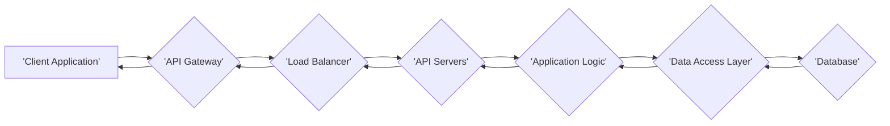
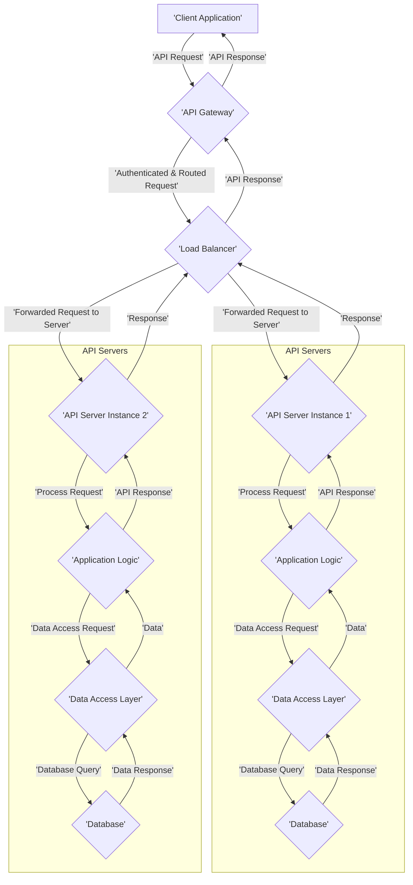
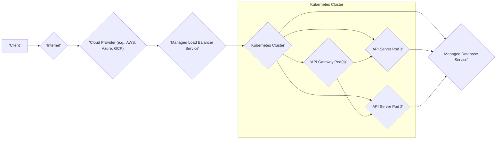

# Project Design Document: dingo/api

**Version:** 1.1
**Date:** October 26, 2023
**Author:** AI Software Architect

## 1. Introduction

This document provides a detailed design overview of the `dingo/api` project, as found in the linked GitHub repository (https://github.com/dingo/api). This document aims to clearly articulate the system's architecture, components, data flow, and key technologies. It will serve as a solid foundation for subsequent threat modeling activities by providing a comprehensive understanding of the system's structure and potential attack surfaces.

## 2. Project Overview

The `dingo/api` project appears to be a backend API designed to provide access to certain functionalities or data. Based on the repository name, it's highly likely a RESTful API. This design document focuses on elaborating the potential architecture and key elements of such an API, making reasonable assumptions based on common API design patterns and best practices.

## 3. Goals and Objectives

*   Provide a clear and comprehensive architectural overview of the `dingo/api` project, detailing its various layers and components.
*   Identify key components and their specific responsibilities and interactions within the system.
*   Describe the data flow within the system for typical API requests and responses.
*   Outline the technologies likely used in the project, providing specific examples where possible.
*   Serve as a robust and detailed basis for identifying potential security threats and vulnerabilities during threat modeling sessions.

## 4. Target Audience

*   Security engineers and architects responsible for conducting threat modeling and security assessments.
*   Development team members involved in the design, development, and maintenance of the `dingo/api` project.
*   Operations team members responsible for the deployment, monitoring, and scaling of the API.
*   Product owners and stakeholders seeking a technical understanding of the system's architecture and security considerations.

## 5. High-Level Architecture

The `dingo/api` project likely follows a standard multi-tier architecture, common for robust web applications and APIs.

*   **Client Application:** Represents any application (web browsers, mobile apps, other backend services) that initiates requests to consume the API.
*   **API Gateway:** Acts as the central entry point for all external requests, providing routing, authentication, authorization, and potentially rate limiting and other cross-cutting concerns.
*   **Load Balancer:** Distributes incoming network traffic across multiple API server instances to ensure high availability, fault tolerance, and optimal performance.
*   **API Servers:** The core processing units of the API, responsible for receiving requests, executing business logic, and generating responses. These are typically stateless for scalability.
*   **Application Logic:** Contains the core business rules, workflows, and functionalities of the API. This layer orchestrates data retrieval and manipulation.
*   **Data Access Layer:** Provides an abstraction layer between the application logic and the underlying database, encapsulating data access logic and simplifying database interactions.
*   **Database:** The persistent storage mechanism for the API's data. This could be a relational database, a NoSQL database, or a combination of both.

## 6. Component Details

This section provides a more detailed breakdown of the likely components within the `dingo/api` system and their functionalities.

*   **API Gateway:**
    *   **Functionality:**
        *   **Request Routing:** Directs incoming requests to the appropriate backend API server based on URL paths or other criteria.
        *   **Authentication:** Verifies the identity of the client making the request (e.g., using API keys, OAuth 2.0 tokens, JWTs).
        *   **Authorization:** Determines if the authenticated client has the necessary permissions to access the requested resource or perform the requested action.
        *   **Rate Limiting:** Enforces limits on the number of requests a client can make within a specific time frame to prevent abuse.
        *   **Cross-Origin Resource Sharing (CORS):** Manages and enforces CORS policies to control which domains can access the API.
        *   **Request Transformation:** Modifies incoming requests before forwarding them to the backend servers.
        *   **Response Transformation:** Modifies outgoing responses before sending them back to the client.
    *   **Potential Technologies:** Nginx with Lua modules, Kong, Tyk, Apigee, AWS API Gateway, Azure API Management, Mulesoft.

*   **Load Balancer:**
    *   **Functionality:**
        *   **Traffic Distribution:** Distributes incoming network traffic evenly across multiple healthy API server instances.
        *   **Health Checks:** Periodically checks the health status of API servers and removes unhealthy instances from the rotation.
        *   **Session Persistence (Optional):**  Ensures requests from the same client are routed to the same server instance (if needed).
        *   **SSL Termination:** Handles the decryption of HTTPS traffic, offloading this task from the API servers.
    *   **Potential Technologies:** HAProxy, Nginx, AWS Elastic Load Balancing (ELB), Azure Load Balancer, Google Cloud Load Balancing.

*   **API Servers:**
    *   **Functionality:**
        *   **Request Handling:** Receives processed requests from the load balancer.
        *   **Business Logic Execution:** Executes the core business logic required to fulfill the request. This might involve data processing, calculations, or interactions with other internal services.
        *   **Data Validation:** Validates the incoming request data to ensure it conforms to expected formats and constraints.
        *   **Response Generation:** Constructs the API response in a structured format (e.g., JSON, XML).
        *   **Error Handling:** Manages and handles errors that occur during request processing.
    *   **Potential Technologies:** Built using web frameworks like:
        *   **Python:** Flask, Django, FastAPI
        *   **JavaScript (Node.js):** Express.js, NestJS
        *   **Java:** Spring Boot, Micronaut
        *   **Go:** Gin, Echo, Fiber
        *   **Ruby:** Ruby on Rails, Sinatra

*   **Application Logic:**
    *   **Functionality:**
        *   **Business Rule Implementation:** Implements the specific business rules and logic of the application.
        *   **Data Processing and Manipulation:** Performs operations on data retrieved from the database or other sources.
        *   **Orchestration of Services:** Coordinates interactions with other internal or external services.
        *   **Workflow Management:** Manages complex workflows or processes.
    *   **Implementation Details:** The specific implementation will heavily depend on the API's purpose and domain. For example, in an e-commerce API, this layer would handle order processing, inventory management, etc.

*   **Data Access Layer:**
    *   **Functionality:**
        *   **Database Interaction:** Provides an interface for querying and manipulating data in the database.
        *   **Connection Management:** Manages connections to the database.
        *   **Query Construction:** Builds and executes database queries.
        *   **Data Mapping:** Maps data between the application's domain model and the database schema.
        *   **Caching (Optional):** Implements caching mechanisms to improve performance by reducing database load.
    *   **Potential Technologies:**
        *   **Object-Relational Mappers (ORMs):** SQLAlchemy (Python), Django ORM (Python), Hibernate (Java), Entity Framework (.NET).
        *   **Data Mappers:** Libraries specific to NoSQL databases (e.g., Mongoose for MongoDB).
        *   **Raw SQL Queries:**  Directly executing SQL queries (less common in modern architectures for maintainability).

*   **Database:**
    *   **Functionality:**
        *   **Persistent Data Storage:** Stores the application's data persistently.
        *   **Data Retrieval:** Allows efficient retrieval of data based on various criteria.
        *   **Data Integrity:** Ensures the consistency and accuracy of the stored data.
        *   **Scalability and Availability:**  Provides mechanisms for scaling and ensuring high availability.
    *   **Potential Technologies:**
        *   **Relational Databases:** PostgreSQL, MySQL, Microsoft SQL Server, Oracle.
        *   **NoSQL Databases:** MongoDB, Cassandra, Redis, Couchbase.

## 7. Data Flow

The typical data flow for an API request and response within the `dingo/api` system is outlined below:

*   The **Client Application** initiates an **API Request**.
*   The **API Gateway** receives the request, performs **authentication** and **authorization**, and **routes** it to the appropriate backend service.
*   The **Load Balancer** receives the routed request and **forwards** it to one of the available and healthy **API Server Instances**.
*   The **API Server Instance** receives the request and starts to **process** it.
*   The **Application Logic** within the API Server executes the necessary business logic.
*   The **Application Logic** makes a **Data Access Request** to the **Data Access Layer**.
*   The **Data Access Layer** constructs and executes a **Database Query** against the **Database**.
*   The **Database** returns the **Data Response** to the **Data Access Layer**.
*   The **Data Access Layer** returns the **Data** to the **Application Logic**.
*   The **Application Logic** constructs the **API Response**.
*   The **API Server Instance** sends the **Response** back to the **Load Balancer**.
*   The **Load Balancer** forwards the **API Response** back to the **API Gateway**.
*   The **API Gateway** sends the final **API Response** to the **Client Application**.

## 8. Technology Stack (Likely Candidates)

Based on common API development practices and the assumed architecture, the following technologies are likely candidates for the `dingo/api` project:

*   **Programming Language:**
    *   Python (with frameworks like Flask or Django)
    *   JavaScript (Node.js with Express.js or NestJS)
    *   Java (with Spring Boot)
    *   Go (with Gin or Echo)
*   **Web Framework:** (See potential technologies under "API Servers")
*   **Database:**
    *   Relational: PostgreSQL, MySQL, MariaDB
    *   NoSQL: MongoDB, Redis (potentially for caching), Cassandra
*   **API Gateway:**
    *   Nginx, Kong, Tyk, AWS API Gateway, Azure API Management
*   **Load Balancer:**
    *   HAProxy, Nginx, AWS ELB, Azure Load Balancer, Google Cloud Load Balancing
*   **Containerization:** Docker
*   **Orchestration:** Kubernetes (likely for managing deployments and scaling)
*   **Caching:** Redis, Memcached
*   **Logging:** ELK stack (Elasticsearch, Logstash, Kibana), Splunk, Graylog
*   **Monitoring:** Prometheus, Grafana, Datadog, New Relic
*   **Message Queue (Optional):** RabbitMQ, Kafka (for asynchronous tasks or inter-service communication)
*   **Authentication/Authorization:** OAuth 2.0, JWT (JSON Web Tokens)

## 9. Deployment Architecture (Probable Scenario)

The `dingo/api` project is highly likely to be deployed in a cloud environment utilizing containerization and orchestration for scalability and resilience.

*   **Cloud Provider:**  Likely hosted on a major cloud platform like AWS, Azure, or GCP, leveraging their managed services.
*   **Managed Load Balancer Service:** Cloud provider's managed load balancing service (e.g., AWS ELB, Azure Load Balancer).
*   **Kubernetes Cluster:** A managed Kubernetes service (e.g., AWS EKS, Azure AKS, Google GKE) for container orchestration.
*   **API Gateway Pod(s):** One or more containerized instances of the API gateway, deployed as pods within the Kubernetes cluster.
*   **API Server Pods:** Multiple containerized instances of the API server application, deployed as pods within the Kubernetes cluster. These can be scaled horizontally as needed.
*   **Managed Database Service:** A managed database service provided by the cloud provider (e.g., AWS RDS, Azure Database, Google Cloud SQL), offering scalability, backups, and high availability.

## 10. Security Considerations (Detailed)

This section expands on the initial security considerations, providing more specific examples of potential vulnerabilities and attack vectors.

*   **Authentication and Authorization:**
    *   **Vulnerabilities:**
        *   **Broken Authentication:** Weak password policies, insecure storage of credentials, lack of multi-factor authentication.
        *   **Broken Authorization:** Privilege escalation, insecure direct object references (IDOR), missing function-level access control.
        *   **JWT Vulnerabilities:** Secret key exposure, algorithm confusion, lack of proper signature verification.
    *   **Mitigation:** Implement strong authentication mechanisms (OAuth 2.0, OpenID Connect), enforce robust authorization policies (RBAC, ABAC), securely manage API keys and secrets, regularly rotate credentials.

*   **Input Validation:**
    *   **Vulnerabilities:**
        *   **SQL Injection:** Malicious SQL code injected through input fields.
        *   **Cross-Site Scripting (XSS):** Malicious scripts injected into web pages viewed by other users.
        *   **Command Injection:** Execution of arbitrary commands on the server through input fields.
        *   **Path Traversal:** Accessing files or directories outside the intended scope.
    *   **Mitigation:** Implement strict input validation on all user-provided data, sanitize input before processing, use parameterized queries or ORM features to prevent SQL injection, encode output to prevent XSS.

*   **Data Protection:**
    *   **Vulnerabilities:**
        *   **Data Breach:** Unauthorized access and exfiltration of sensitive data.
        *   **Man-in-the-Middle (MITM) Attacks:** Interception of data transmitted between the client and the server.
        *   **Insecure Storage:** Sensitive data stored without proper encryption.
    *   **Mitigation:** Encrypt sensitive data at rest and in transit (TLS/HTTPS), enforce strong encryption algorithms, implement access controls to restrict data access, regularly audit data storage and access mechanisms.

*   **Rate Limiting and Abuse Prevention:**
    *   **Vulnerabilities:**
        *   **Denial of Service (DoS) Attacks:** Overwhelming the API with excessive requests, making it unavailable.
        *   **Brute-Force Attacks:** Repeatedly attempting to guess credentials.
        *   **API Abuse:** Exploiting API functionalities for unintended purposes.
    *   **Mitigation:** Implement rate limiting at the API Gateway, use CAPTCHA or other mechanisms to prevent bot activity, monitor API traffic for suspicious patterns, implement IP blocking or throttling.

*   **API Gateway Security:**
    *   **Vulnerabilities:**
        *   **Misconfiguration:** Incorrectly configured API Gateway rules leading to security loopholes.
        *   **Vulnerabilities in Gateway Software:** Exploiting known vulnerabilities in the API Gateway software itself.
    *   **Mitigation:** Regularly update the API Gateway software, follow security best practices for configuration, implement Web Application Firewall (WAF) rules.

*   **Dependency Management:**
    *   **Vulnerabilities:**
        *   **Exploiting Known Vulnerabilities:** Using outdated libraries or components with known security flaws.
    *   **Mitigation:** Regularly scan dependencies for vulnerabilities, keep dependencies up-to-date, use dependency management tools.

*   **Logging and Monitoring:**
    *   **Vulnerabilities:**
        *   **Insufficient Logging:** Lack of detailed logs making it difficult to detect and investigate security incidents.
        *   **Inadequate Monitoring:** Failure to detect suspicious activity in real-time.
    *   **Mitigation:** Implement comprehensive logging of security-related events, monitor API traffic and system metrics, set up alerts for suspicious activity.

*   **Secrets Management:**
    *   **Vulnerabilities:**
        *   **Hardcoded Secrets:** Storing sensitive credentials directly in the codebase.
        *   **Insecure Storage of Secrets:** Storing secrets in easily accessible locations.
    *   **Mitigation:** Use secure secrets management solutions (e.g., HashiCorp Vault, AWS Secrets Manager, Azure Key Vault), avoid hardcoding secrets, encrypt secrets at rest and in transit.

## 11. Non-Functional Requirements (Relevant for Threat Modeling)

Understanding the non-functional requirements is crucial for identifying potential threats related to availability, performance, and scalability.

*   **Availability:** The API should be highly available with minimal downtime.
*   **Scalability:** The API should be able to handle increasing traffic and data volume.
*   **Performance:** The API should respond to requests quickly and efficiently.
*   **Security:** The API should protect sensitive data and prevent unauthorized access.
*   **Maintainability:** The API should be designed for easy maintenance and updates.

## 12. API Endpoints (Hypothetical Examples)

To make the design more concrete for threat modeling, here are some hypothetical examples of API endpoints:

*   `GET /users`: Retrieve a list of users.
*   `POST /users`: Create a new user.
*   `GET /users/{id}`: Retrieve details of a specific user.
*   `PUT /users/{id}`: Update an existing user.
*   `DELETE /users/{id}`: Delete a user.
*   `POST /products`: Create a new product.
*   `GET /products`: Retrieve a list of products.
*   `GET /orders/{id}`: Retrieve details of a specific order.

These examples illustrate the types of operations the API might support and can help in identifying potential vulnerabilities associated with specific endpoints.

## 13. Conclusion

This enhanced design document provides a more detailed and comprehensive overview of the potential architecture and key components of the `dingo/api` project. It elaborates on the data flow, technology stack, and deployment architecture, and significantly expands on the security considerations. This document serves as a robust foundation for the upcoming threat modeling exercise, enabling a thorough analysis of potential security vulnerabilities within the system based on a more complete understanding of its design and functionality.