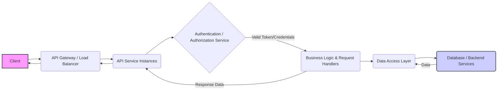
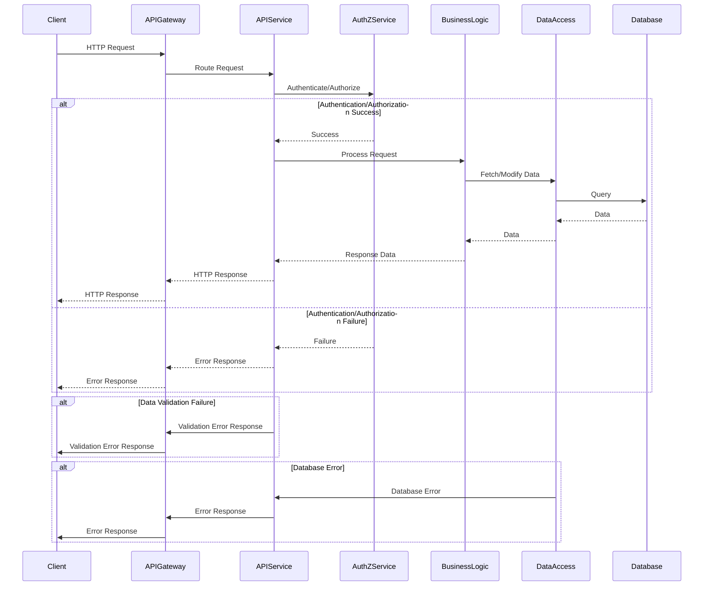
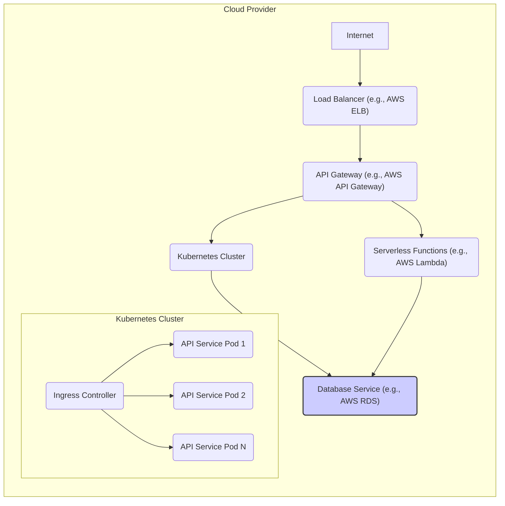

# Project Design Document: dingo/api

**Version:** 1.1
**Date:** October 26, 2023
**Author:** AI Software Architect

## 1. Introduction

This document provides an enhanced and more detailed design overview of the `dingo/api` project, as found on GitHub at [https://github.com/dingo/api](https://github.com/dingo/api). Building upon the initial design, this version aims to provide greater clarity on the system's architecture, components, data flow, and technologies. This document serves as a robust foundation for subsequent threat modeling activities. Assumptions are made based on common API design patterns and the project's name.

## 2. Goals and Objectives

The primary goal of the `dingo/api` project is to provide a robust and well-documented programmatic interface (API) for interacting with a backend system. Key objectives include:

*   Defining and maintaining a clear and comprehensive set of API endpoints.
*   Enabling diverse clients (applications, services, and potentially external partners) to securely access and manipulate data.
*   Implementing core business logic, data validation, and transformation within the API layer.
*   Ensuring the API exhibits high levels of security, reliability, and scalability to meet current and future demands.
*   Supporting standard data formats for request and response payloads, with a likely focus on JSON.
*   Facilitating seamless integration with other systems and services.

## 3. High-Level Architecture

The `dingo/api` likely adheres to a layered architecture, promoting separation of concerns:

*   **Client Layer:** Represents any entity initiating requests to the API.
*   **API Gateway Layer:** Acts as the single entry point, handling routing, load balancing, and potentially cross-cutting concerns.
*   **Service Layer:** Contains the core API logic, including request handling, business logic execution, and data transformation.
*   **Data Access Layer:** Provides an abstraction for interacting with the underlying data storage or backend services.
*   **Data Storage/Backend Services Layer:** The persistent storage or external systems providing the data and core functionalities.

## 4. Detailed Design

This section provides a more granular breakdown of the components.

### 4.1. Client Layer

*   **Description:** Any application, service, or user agent that initiates requests to the `dingo/api` via HTTP.
*   **Responsibilities:**
    *   Constructing well-formed API requests according to the API specification (e.g., using OpenAPI documentation).
    *   Handling various HTTP response codes and parsing response payloads.
    *   Managing authentication credentials or tokens.
*   **Examples:**
    *   Single-page applications (SPAs) built with React, Angular, or Vue.js.
    *   Native mobile applications (iOS, Android).
    *   Internal backend services requiring data from the `dingo/api`.
    *   Third-party applications integrating with the API.
    *   Command-line interfaces (CLIs) or scripting tools.

### 4.2. API Gateway / Load Balancer Layer

*   **Description:** A critical component acting as the central entry point for all external requests. It may also distribute traffic across multiple API service instances for scalability and resilience.
*   **Responsibilities:**
    *   **Request Routing:** Directing incoming requests to the appropriate API service instance based on the requested path or other criteria.
    *   **Load Balancing:** Distributing traffic evenly across available API service instances to prevent overload.
    *   **TLS Termination:** Handling SSL/TLS encryption and decryption, securing communication.
    *   **Authentication and Authorization Enforcement:**  Potentially offloading some authentication and authorization checks before requests reach the API services.
    *   **Rate Limiting:** Protecting the API from abuse by limiting the number of requests from a single source within a given timeframe.
    *   **Request Logging and Monitoring:**  Recording incoming requests for auditing and performance analysis.
    *   **Cross-Origin Resource Sharing (CORS) Handling:** Managing allowed origins for browser-based requests.
*   **Technology (Potential):**
    *   NGINX with reverse proxy capabilities.
    *   HAProxy for high-performance load balancing.
    *   Cloud provider managed API Gateways (e.g., AWS API Gateway, Azure API Management, Google Cloud API Gateway).
    *   Envoy proxy, a modern, high-performance proxy.

### 4.3. API Service Instances Layer

*   **Description:** One or more instances of the core API application responsible for handling business logic and data processing. These instances are typically stateless for horizontal scalability.
*   **Responsibilities:**
    *   Receiving and interpreting client requests after they pass through the API Gateway.
    *   Implementing detailed authentication and authorization logic, potentially using JWT or OAuth 2.0.
    *   Validating the structure and content of incoming request data.
    *   Executing the core business logic associated with each API endpoint.
    *   Interacting with the Data Access Layer to retrieve or persist data.
    *   Transforming data into the appropriate response format (e.g., JSON).
    *   Generating and returning HTTP responses with appropriate status codes.
*   **Components (Logical):**
    *   **Request Handlers/Controllers:**  Specific functions or classes responsible for handling requests to individual API endpoints.
    *   **Authentication/Authorization Middleware/Services:** Components that verify user identity and permissions.
    *   **Input Validation Logic:** Code to ensure request data conforms to defined schemas and constraints.
    *   **Business Logic Layer/Services:** The core of the API, implementing the specific functionalities exposed by the endpoints.
    *   **Data Transformation Layer/Mappers:** Code responsible for converting data between different formats (e.g., database entities to API response objects).

### 4.4. Authentication / Authorization Service Layer

*   **Description:** A dedicated service (or integrated component) responsible for verifying the identity of clients and ensuring they have the necessary permissions. This can be a separate microservice or a library integrated into the API service instances.
*   **Responsibilities:**
    *   **Authentication:** Verifying the identity of the client (e.g., using username/password, API keys, JWT verification, OAuth 2.0 flows).
    *   **Authorization:** Determining if the authenticated client has permission to access the requested resource or perform the requested action (e.g., role-based access control, attribute-based access control).
    *   **Token Issuance and Management (if using JWT or OAuth 2.0):** Generating, refreshing, and revoking access tokens.
*   **Technology (Potential):**
    *   JWT (JSON Web Tokens) for stateless authentication.
    *   OAuth 2.0 for delegated authorization.
    *   Dedicated Identity Providers (IdPs) like Auth0, Okta, Keycloak.
    *   Custom authentication and authorization logic implemented within the API.

### 4.5. Data Access Layer

*   **Description:** An abstraction layer that isolates the API's business logic from the specifics of the underlying data storage or backend services. This promotes maintainability and allows for easier changes to the data layer.
*   **Responsibilities:**
    *   Constructing and executing queries against the database or interacting with other backend services.
    *   Mapping data between the application's domain model and the data store's schema.
    *   Managing database connections and transactions.
    *   Implementing caching strategies to improve performance.
    *   Handling data access-related exceptions.
*   **Technology (Potential):**
    *   Object-Relational Mappers (ORMs) like SQLAlchemy (Python), Hibernate (Java), Entity Framework (.NET).
    *   Data access libraries specific to the database technology (e.g., psycopg2 for PostgreSQL in Python).
    *   Repositories or Data Access Objects (DAOs) for abstracting data access logic.

### 4.6. Database / Backend Services Layer

*   **Description:** The underlying systems responsible for storing and providing the data accessed by the API. This could be a relational database, a NoSQL database, other microservices, or a combination thereof.
*   **Responsibilities:**
    *   Storing data persistently.
    *   Providing efficient data retrieval mechanisms.
    *   Ensuring data integrity and consistency.
    *   Potentially performing data processing or aggregations.
*   **Technology (Potential):**
    *   Relational databases (e.g., PostgreSQL, MySQL, Microsoft SQL Server).
    *   NoSQL databases (e.g., MongoDB, Cassandra, Redis).
    *   Other internal or external APIs providing data or services.
    *   Message queues or event streams for asynchronous communication.

## 5. Data Flow

A more detailed representation of a typical API request flow:

1. A **Client** initiates an HTTP request targeting a specific endpoint of the `dingo/api`.
2. The request reaches the **API Gateway / Load Balancer**.
3. The **API Gateway** performs initial routing and may enforce rate limiting or other policies.
4. The **API Gateway** forwards the request to an available **API Service Instance**.
5. The **API Service Instance** receives the request and passes it through **Authentication / Authorization** middleware or invokes an **Authentication / Authorization Service**.
6. If authentication and authorization are successful, the request is routed to the appropriate **Request Handler/Controller**.
7. The **Request Handler** invokes the necessary **Business Logic**.
8. The **Business Logic** interacts with the **Data Access Layer** to retrieve or modify data.
9. The **Data Access Layer** constructs and executes queries against the **Database / Backend Services**.
10. The **Database / Backend Services** processes the query and returns the requested data.
11. The **Data Access Layer** maps the data and returns it to the **Business Logic**.
12. The **Business Logic** processes the data and prepares the response.
13. The **Request Handler** formats the response (e.g., as JSON).
14. The **API Service Instance** sends the HTTP response back to the **API Gateway**.
15. The **API Gateway** may perform additional processing (e.g., adding headers) and forwards the response to the **Client**.
16. **Error Handling:** If any step fails (e.g., authentication failure, data validation error, database error), an appropriate error response is generated and returned to the client.

## 6. Technology Stack (Assumptions)

Based on common API development practices, the following technologies are likely candidates:

*   **Programming Language:** Python, Node.js (JavaScript/TypeScript), Go, Java, or similar. The GitHub repository's code will be the definitive source.
*   **Framework:** Flask/Django (Python), Express.js/NestJS (Node.js), Spring Boot (Java), Gin/Echo (Go).
*   **API Definition:** OpenAPI (Swagger) for design and documentation.
*   **Data Serialization:** JSON is the most probable format.
*   **Database:** PostgreSQL, MySQL, MongoDB, or a similar database system.
*   **Containerization:** Docker for packaging and deployment.
*   **Orchestration:** Kubernetes for managing containerized applications.
*   **Cloud Provider (Optional):** AWS, Azure, GCP, or other cloud platforms for hosting.
*   **Message Queue (Optional):** RabbitMQ, Kafka for asynchronous tasks.
*   **Caching:** Redis, Memcached for improving performance.

## 7. Deployment Architecture (Potential)

The `dingo/api` could be deployed using various strategies:

*   **Containerized Deployment on Kubernetes:** API service instances are containerized with Docker and managed by a Kubernetes cluster for scalability, resilience, and automated deployments.
*   **Serverless Deployment:** Utilizing serverless functions (e.g., AWS Lambda, Azure Functions, Google Cloud Functions) to handle API requests on demand, reducing operational overhead.
*   **Virtual Machines with Load Balancer:** Deploying API instances on virtual machines behind a load balancer for distributing traffic.

## 8. Security Considerations

Security is paramount. Key considerations include:

*   **Authentication:**
    *   Implementing strong authentication mechanisms (e.g., OAuth 2.0, JWT with proper signing and verification).
    *   Enforcing password complexity policies and secure storage of credentials (if applicable).
    *   Considering multi-factor authentication (MFA).
*   **Authorization:**
    *   Implementing granular authorization controls based on roles or permissions.
    *   Following the principle of least privilege.
    *   Protecting against common authorization vulnerabilities like insecure direct object references (IDOR).
*   **Input Validation:**
    *   Thoroughly validating all incoming data to prevent injection attacks (e.g., SQL injection, cross-site scripting).
    *   Using input validation libraries and frameworks.
    *   Sanitizing user-provided data before processing.
*   **Rate Limiting and Throttling:**
    *   Implementing rate limits to prevent denial-of-service attacks and abuse.
    *   Using throttling to manage resource consumption.
*   **TLS Encryption (HTTPS):**
    *   Enforcing HTTPS for all communication between clients and the API.
    *   Using valid SSL/TLS certificates.
*   **CORS (Cross-Origin Resource Sharing):**
    *   Configuring CORS policies carefully to allow only trusted origins to access the API.
*   **API Key Management:**
    *   If using API keys, ensure secure generation, storage, and rotation.
    *   Implement mechanisms for revoking compromised API keys.
*   **Vulnerability Management:**
    *   Regularly scanning dependencies and application code for vulnerabilities.
    *   Applying security patches promptly.
*   **Logging and Monitoring:**
    *   Implementing comprehensive logging of API requests and responses for auditing and security analysis.
    *   Monitoring for suspicious activity and security incidents.
*   **Output Encoding:**
    *   Encoding output data to prevent cross-site scripting (XSS) attacks.
*   **Data Security:**
    *   Encrypting sensitive data at rest and in transit.
    *   Implementing access controls to protect sensitive data.

## 9. Non-Functional Requirements

Beyond functional requirements, the `dingo/api` should meet certain non-functional criteria:

*   **Performance:** The API should respond to requests quickly and efficiently.
    *   Target response times for different types of requests.
    *   Strategies for optimizing performance (e.g., caching, database optimization).
*   **Scalability:** The API should be able to handle increasing traffic and data volume.
    *   Horizontal scaling capabilities (adding more instances).
    *   Strategies for handling peak loads.
*   **Reliability:** The API should be available and function correctly under various conditions.
    *   Target uptime and availability metrics.
    *   Redundancy and failover mechanisms.
*   **Maintainability:** The API codebase should be well-structured, documented, and easy to maintain.
    *   Adherence to coding standards.
    *   Use of modular design principles.
*   **Testability:** The API should be designed to facilitate thorough testing.
    *   Unit tests, integration tests, and end-to-end tests.
*   **Security:** As detailed in the Security Considerations section.

## 10. Future Considerations

*   **API Versioning:** Implementing a strategy for versioning the API to allow for non-breaking changes and support for older clients.
*   **Comprehensive Monitoring and Observability:** Implementing tools and dashboards for real-time monitoring of API performance, errors, and security events.
*   **Caching Strategies:** Implementing more sophisticated caching mechanisms (e.g., content delivery networks (CDNs), distributed caching).
*   **Webhooks or Real-time Updates:** Adding support for push notifications or webhooks to provide real-time data updates to clients.
*   **GraphQL Support:** Potentially exploring GraphQL as an alternative or complementary API technology.

This enhanced document provides a more detailed and comprehensive design overview of the `dingo/api` project, making it even more suitable for thorough threat modeling and further development. The assumptions made should be validated against the actual implementation.