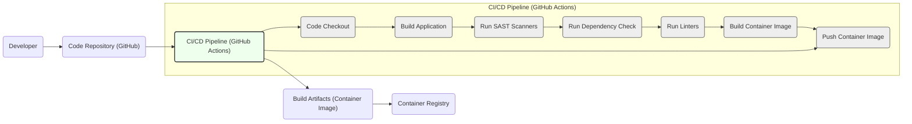

# BUSINESS POSTURE

The project 'dingo/api' is assumed to be a RESTful API designed to provide data or functionality to client applications or other services.

Business Priorities and Goals:
- Provide a reliable and performant API service.
- Enable efficient data access and manipulation for consumers.
- Ensure data integrity and consistency through the API.
- Facilitate integration with other systems and applications.
- Maintain the confidentiality and availability of the API and its underlying data.

Business Risks:
- Data breaches due to unauthorized access to the API.
- Service disruption leading to unavailability for consumers.
- Data corruption or loss due to API vulnerabilities.
- Compliance violations if the API handles sensitive data and security is insufficient.
- Reputational damage due to security incidents or service outages.

# SECURITY POSTURE

Existing Security Controls:
- security control: Code reviews are likely performed before merging code changes. (Location: Development process)
- security control: Basic infrastructure security measures are assumed to be in place for the hosting environment. (Location: Infrastructure)

Accepted Risks:
- accepted risk: Reliance on default configurations for some components.
- accepted risk: Limited security tooling in place during initial development phases.
- accepted risk: Potential vulnerabilities in third-party libraries or dependencies.

Recommended Security Controls:
- security control: Implement automated input validation for all API endpoints.
- security control: Implement robust authentication and authorization mechanisms.
- security control: Integrate static application security testing (SAST) into the build pipeline.
- security control: Implement dependency scanning to identify and manage vulnerable dependencies.
- security control: Implement rate limiting and request throttling to protect against denial-of-service attacks.
- security control: Implement security logging and monitoring to detect and respond to security incidents.

Security Requirements:
- Authentication:
  - Requirement: The API must authenticate all incoming requests to verify the identity of the caller.
  - Requirement: Support for API key based authentication is required.
  - Requirement: Consider future support for OAuth 2.0 for delegated authorization.
- Authorization:
  - Requirement: The API must authorize access to resources based on the authenticated user or application and their roles or permissions.
  - Requirement: Implement role-based access control (RBAC) to manage permissions.
  - Requirement: Ensure least privilege principle is applied for all API access.
- Input Validation:
  - Requirement: All API endpoints must validate all incoming data to prevent injection attacks and ensure data integrity.
  - Requirement: Implement validation on both client-side and server-side.
  - Requirement: Sanitize user inputs to prevent cross-site scripting (XSS) attacks.
- Cryptography:
  - Requirement: Sensitive data at rest must be encrypted. (e.g., database encryption)
  - Requirement: All communication between clients and the API must be encrypted using HTTPS.
  - Requirement: Securely store and manage cryptographic keys.

# DESIGN

## C4 CONTEXT

```mermaid
flowchart LR
    subgraph "Organization"
        A("API Consumer Application")
        B("External System")
    end
    C("dingo/api")
    D("Database System")

    A -->> C : Uses API
    B -->> C : Integrates with API
    C -->> D : Stores and retrieves data

    style C fill:#f9f,stroke:#333,stroke-width:2px
```

Context Diagram Elements:
- Element:
  - Name: API Consumer Application
  - Type: External System
  - Description: Applications that consume the 'dingo/api' to access data or functionality. These could be web applications, mobile applications, or other services within the organization.
  - Responsibilities: Consume API endpoints to perform operations, display data to users, and trigger workflows.
  - Security controls: Authentication to 'dingo/api' using API keys, authorization to access specific API resources based on application roles.
- Element:
  - Name: External System
  - Type: External System
  - Description: Third-party systems or services that integrate with 'dingo/api' for data exchange or process automation.
  - Responsibilities: Exchange data with 'dingo/api' for integration purposes, trigger API endpoints for specific functionalities.
  - Security controls: Authentication to 'dingo/api' using API keys, authorization to access specific API resources based on system integration requirements, secure communication channels (HTTPS).
- Element:
  - Name: dingo/api
  - Type: Software System
  - Description: The RESTful API project being designed. It provides a set of endpoints to access and manipulate data, and interact with backend systems.
  - Responsibilities: Receive and process API requests, authenticate and authorize requests, validate input data, interact with the database, return API responses, handle errors, and provide logging and monitoring.
  - Security controls: Input validation, authentication, authorization, HTTPS encryption, security logging, rate limiting, vulnerability scanning in build pipeline.
- Element:
  - Name: Database System
  - Type: External System
  - Description: The database system used by 'dingo/api' to store and retrieve persistent data.
  - Responsibilities: Persist data for 'dingo/api', provide data access and retrieval capabilities, ensure data integrity and availability.
  - Security controls: Access control lists, database encryption at rest, regular security patching, database activity monitoring.

## C4 CONTAINER

```mermaid
flowchart LR
    subgraph "dingo/api System"
        A("Web Server")
        B("API Application")
        C("Database")
    end

    A -->> B : Routes requests
    B -->> C : Data access

    style A fill:#fbb,stroke:#333,stroke-width:2px
    style B fill:#fbb,stroke:#333,stroke-width:2px
    style C fill:#fbb,stroke:#333,stroke-width:2px
```

Container Diagram Elements:
- Element:
  - Name: Web Server
  - Type: Container
  - Description:  A web server (e.g., Nginx, Apache) that handles incoming HTTP requests, routes them to the API Application, and serves static content if needed.
  - Responsibilities:  Receive HTTP requests, route requests to the API Application, handle HTTPS termination, serve static files, implement rate limiting and request throttling.
  - Security controls: HTTPS configuration, rate limiting, web server hardening, security updates, access logging.
- Element:
  - Name: API Application
  - Type: Container
  - Description: The core application logic of 'dingo/api', responsible for processing API requests, implementing business logic, input validation, authentication, authorization, and interacting with the Database.
  - Responsibilities:  Implement API endpoints, handle business logic, perform input validation, authenticate and authorize requests, interact with the Database, generate API responses, handle errors, security logging, application-level security controls.
  - Security controls: Input validation, authentication and authorization logic, secure coding practices, dependency management, security logging, error handling, vulnerability scanning in build pipeline.
- Element:
  - Name: Database
  - Type: Container
  - Description:  The persistent data storage for 'dingo/api'. This could be a relational database (e.g., PostgreSQL, MySQL) or a NoSQL database.
  - Responsibilities:  Store and retrieve data, ensure data persistence, provide data integrity, manage data access.
  - Security controls: Database access control lists, database user management, database encryption at rest, regular security patching, database activity monitoring, backups and recovery.

## DEPLOYMENT

Deployment Architecture Option: Cloud-based Deployment (AWS)

```mermaid
flowchart LR
    subgraph "AWS Cloud"
        subgraph "VPC"
            subgraph "Public Subnet"
                A("Internet Gateway")
                B("Load Balancer")
            end
            subgraph "Private Subnet"
                C("API Application Instance 1")
                D("API Application Instance 2")
                E("Database Instance")
            end
        end
    end

    A -->> B : Routes traffic
    B -->> C : Forwards requests
    B -->> D : Forwards requests
    C -->> E : Data access
    D -->> E : Data access

    style B fill:#ccf,stroke:#333,stroke-width:2px
    style C fill:#ccf,stroke:#333,stroke-width:2px
    style D fill:#ccf,stroke:#333,stroke-width:2px
    style E fill:#ccf,stroke:#333,stroke-width:2px
```

Deployment Diagram Elements:
- Element:
  - Name: Internet Gateway
  - Type: Infrastructure
  - Description: AWS Internet Gateway to allow communication between the VPC and the internet.
  - Responsibilities: Provide internet connectivity to the VPC.
  - Security controls: AWS managed service, security configurations managed by AWS.
- Element:
  - Name: Load Balancer
  - Type: Infrastructure
  - Description: AWS Elastic Load Balancer (ELB) to distribute incoming traffic across multiple API Application Instances for high availability and scalability.
  - Responsibilities: Distribute traffic, perform health checks on application instances, provide SSL/TLS termination.
  - Security controls: HTTPS configuration, security groups to control access, access logging, DDoS protection (AWS Shield).
- Element:
  - Name: API Application Instance 1 & 2
  - Type: Infrastructure (Compute Instance)
  - Description: EC2 instances running the API Application container. Deployed in a private subnet for security.
  - Responsibilities: Run the API Application, process API requests, interact with the Database.
  - Security controls: Security groups to restrict inbound and outbound traffic, regular patching of OS and application dependencies, hardened OS configuration, access logging, intrusion detection system (IDS).
- Element:
  - Name: Database Instance
  - Type: Infrastructure (Database Service)
  - Description: AWS RDS instance running the Database. Deployed in a private subnet for security.
  - Responsibilities: Store and manage persistent data for the API.
  - Security controls: Database access control lists, database user management, database encryption at rest (RDS encryption), regular security patching (AWS managed), database activity monitoring (RDS logging), backups and recovery (RDS backups), security groups to restrict database access.

## BUILD



Build Process Description:
- Developer commits code changes to the Code Repository (GitHub).
- CI/CD Pipeline (GitHub Actions) is triggered on code commits or pull requests.
- Pipeline Stages:
  - Code Checkout: Retrieve the latest code from the repository.
  - Build Application: Compile the application code and build the API application.
  - Run SAST Scanners: Perform Static Application Security Testing to identify potential vulnerabilities in the code.
  - Run Dependency Check: Scan dependencies for known vulnerabilities.
  - Run Linters: Analyze code for code quality and style issues.
  - Build Container Image: Build a container image containing the API application and its dependencies.
  - Push Container Image: Push the built container image to a Container Registry.
- Build Artifacts (Container Image) are generated and stored in the Container Registry.
- Container Registry stores the built container images, ready for deployment.

Build Security Controls:
- security control: Secure code repository (GitHub) with access controls and audit logs.
- security control: Automated CI/CD pipeline (GitHub Actions) to ensure consistent and repeatable builds.
- security control: Static Application Security Testing (SAST) integrated into the pipeline to identify code vulnerabilities early.
- security control: Dependency scanning to detect and manage vulnerable dependencies.
- security control: Code linters to enforce code quality and security best practices.
- security control: Container image scanning for vulnerabilities before deployment.
- security control: Secure Container Registry with access controls to protect container images.
- security control: Pipeline configuration as code, version controlled and reviewed.

# RISK ASSESSMENT

Critical Business Processes:
- Providing API access to consumer applications.
- Data retrieval and manipulation through the API.
- Integration with external systems.

Data to Protect and Sensitivity:
- Data stored in the Database System accessed by the API.
- Sensitivity depends on the type of data stored. Assume data is moderately sensitive, requiring confidentiality, integrity, and availability.
- API keys used for authentication are sensitive credentials that need to be protected.
- Logs may contain sensitive information and need to be secured.

# QUESTIONS & ASSUMPTIONS

Questions:
- What type of data does the API handle and what is its sensitivity level?
- What are the specific performance and availability requirements for the API?
- What are the compliance requirements that the API needs to adhere to (e.g., GDPR, HIPAA)?
- What type of authentication and authorization mechanisms are currently in use or planned?
- What is the expected volume of API traffic and number of concurrent users?
- What are the disaster recovery and business continuity requirements for the API?

Assumptions:
- BUSINESS POSTURE: The API is critical for business operations and data access. Availability and security are important business priorities.
- SECURITY POSTURE: Basic security controls are in place, but there is room for improvement, especially in areas like automated security testing and dependency management. API key authentication is assumed as a starting point.
- DESIGN: The API is designed as a RESTful service, deployed in a cloud environment using containers and a managed database service. A standard CI/CD pipeline is used for building and deploying the API.