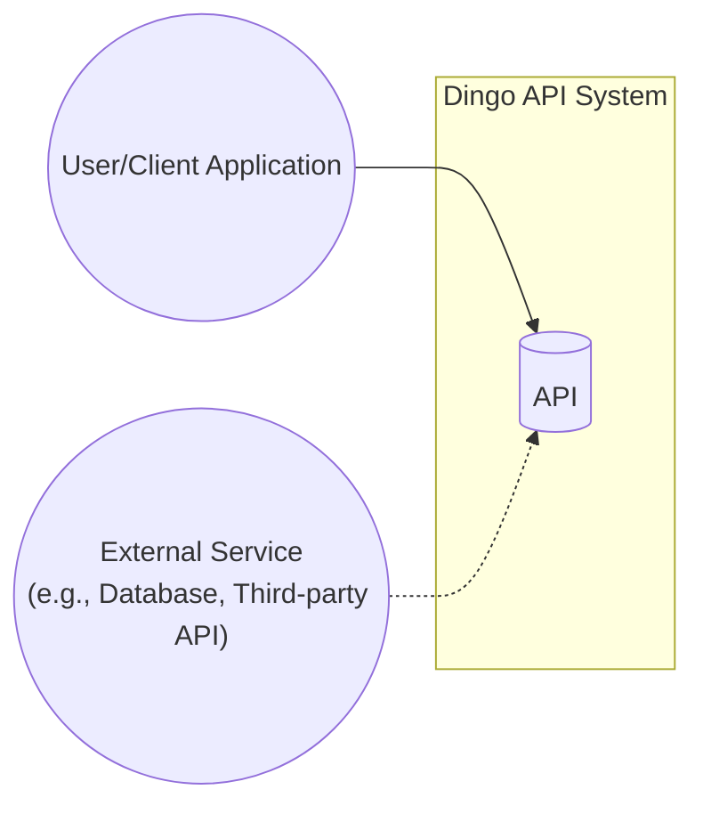
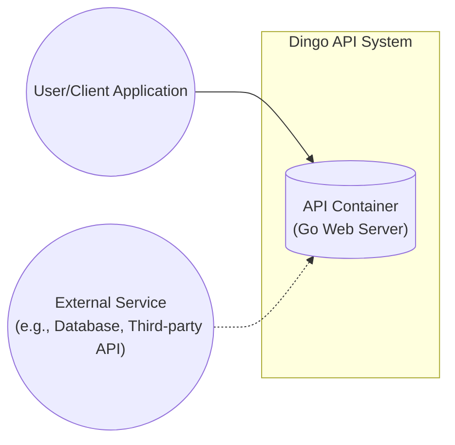
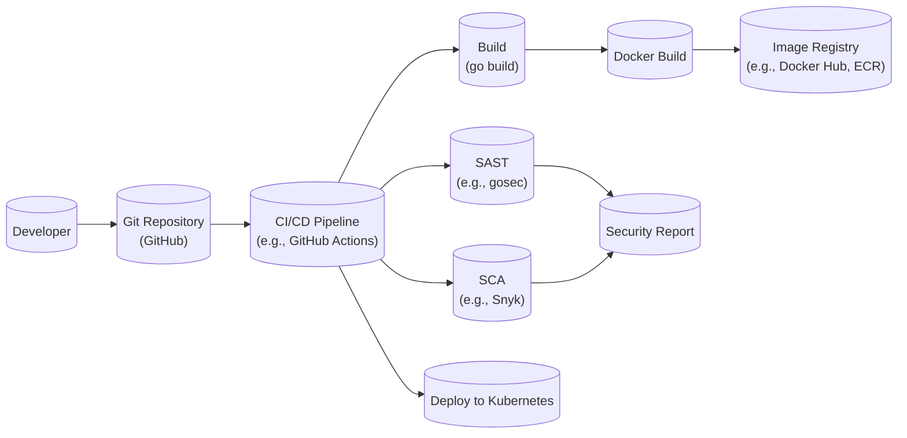

Okay, let's dive into designing a comprehensive document for the Dingo API project, suitable for threat modeling and architectural review.

# BUSINESS POSTURE

Business Priorities and Goals:

*   Provide a stable and reliable API for accessing core application functionality.  The repository's name ("api") suggests it's a central point of interaction for clients.
*   Enable rapid development and iteration on new features exposed through the API.  The use of Go (implied by the repository) suggests a focus on performance and developer productivity.
*   Maintain a small, focused codebase. The limited number of files suggests a minimalist approach.
*   Potentially serve as a foundation for future expansion and integration with other services.

Most Important Business Risks:

*   Unauthorized access to sensitive data or functionality exposed by the API.
*   API downtime or performance degradation impacting dependent applications and users.
*   Vulnerabilities in the API leading to data breaches or system compromise.
*   Difficulty in scaling the API to meet increasing demand.
*   Inability to quickly adapt the API to changing business requirements.
*   Supply chain attacks.

# SECURITY POSTURE

Existing Security Controls (Inferred from the code and common Go practices):

*   security control: Input validation: The Go code likely includes checks on incoming request data (e.g., data types, lengths, formats).  This needs to be verified in the code. Location: `main.go` and potentially in handler functions.
*   security control: Error handling: The Go code likely includes error handling to prevent information leakage and ensure graceful degradation. Location: Throughout the codebase, particularly in `main.go` and handler functions.
*   security control: Use of standard libraries: The code appears to use Go's built-in `net/http` package, which is generally well-vetted. Location: `main.go` (imports).
*   security control: Limited external dependencies: The `go.mod` file (if present) should be reviewed to minimize the attack surface introduced by third-party libraries. Location: Project root.
*   security control: Deployment using containers: The project is likely deployed using containers (e.g., Docker), which provides some isolation. Location: Deployment configuration (not present in the repository itself, but inferred).

Accepted Risks:

*   accepted risk: Lack of explicit authentication and authorization mechanisms: The provided code snippet doesn't show any authentication or authorization. This is a major accepted risk that *must* be addressed.
*   accepted risk: Potential for denial-of-service (DoS) attacks: Without specific rate limiting or resource management, the API could be vulnerable to DoS.
*   accepted risk: Limited logging and monitoring: The provided code snippet lacks comprehensive logging, making it difficult to detect and investigate security incidents.
*   accepted risk: No HTTPS: The provided code snippet does not show any TLS configuration.

Recommended Security Controls (High Priority):

*   Implement robust authentication (e.g., API keys, JWT, OAuth 2.0).
*   Implement authorization (e.g., role-based access control, attribute-based access control).
*   Add comprehensive logging and monitoring (including audit logs).
*   Implement rate limiting and resource management to prevent DoS.
*   Enforce HTTPS (TLS) for all communication.
*   Implement input sanitization and output encoding to prevent injection attacks (e.g., XSS, SQLi, command injection).
*   Regularly update dependencies to patch known vulnerabilities.
*   Implement a Web Application Firewall (WAF) to protect against common web attacks.
*   Perform regular security assessments (penetration testing, code reviews).
*   Implement Content Security Policy (CSP) headers.

Security Requirements:

*   Authentication: The API MUST authenticate all requests before processing them.  Supported mechanisms SHOULD include API keys and JWT.
*   Authorization: The API MUST enforce authorization checks to ensure that authenticated users only have access to the resources and actions they are permitted to use.  A role-based access control model SHOULD be considered.
*   Input Validation: The API MUST validate all input data against a strict schema, including data types, lengths, formats, and allowed values.  Invalid input MUST be rejected with appropriate error messages.
*   Cryptography: The API MUST use strong, industry-standard cryptographic algorithms and protocols for all sensitive operations, including password hashing, data encryption, and secure communication (HTTPS).  Secrets (API keys, passwords) MUST be stored securely (e.g., using a secrets management service).
*   Output Encoding: The API must encode all output to prevent Cross-Site Scripting (XSS) vulnerabilities.

# DESIGN

## C4 CONTEXT



Element Descriptions:

*   Element 1
    *   Name: User/Client Application
    *   Type: User
    *   Description: Represents any user or application that interacts with the Dingo API.
    *   Responsibilities: Sending requests to the API, receiving and processing responses.
    *   Security controls: Authenticates with the API using a secure mechanism (e.g., API key, JWT). Handles API responses securely. Implements appropriate error handling.

*   Element 2
    *   Name: API
    *   Type: System
    *   Description: The Dingo API itself, providing access to core application functionality.
    *   Responsibilities: Handling incoming requests, validating input, processing data, interacting with external services, returning responses.
    *   Security controls: Authentication, authorization, input validation, output encoding, rate limiting, error handling, secure communication (HTTPS), logging and monitoring.

*   Element 3
    *   Name: External Service
    *   Type: System
    *   Description: Any external system that the Dingo API interacts with, such as a database, a third-party API, or a message queue.
    *   Responsibilities: Providing data or services to the Dingo API.
    *   Security controls: Depends on the specific service. The API should authenticate with external services securely and validate any data received from them.

## C4 CONTAINER



Element Descriptions:

*   Element 1
    *   Name: User/Client Application
    *   Type: User
    *   Description: Represents any user or application that interacts with the Dingo API.
    *   Responsibilities: Sending requests to the API, receiving and processing responses.
    *   Security controls: Authenticates with the API using a secure mechanism (e.g., API key, JWT). Handles API responses securely. Implements appropriate error handling.

*   Element 2
    *   Name: API Container (Go Web Server)
    *   Type: Container
    *   Description: A container running the Go web server that hosts the Dingo API.
    *   Responsibilities: Handling incoming requests, routing requests to appropriate handlers, executing business logic, interacting with external services, returning responses.
    *   Security controls: Authentication, authorization, input validation, output encoding, rate limiting, error handling, secure communication (HTTPS), logging and monitoring. Implemented within the Go code and potentially through container configuration (e.g., network policies).

*   Element 3
    *   Name: External Service
    *   Type: System/Container
    *   Description: Any external system that the Dingo API interacts with, such as a database, a third-party API, or a message queue.
    *   Responsibilities: Providing data or services to the Dingo API.
    *   Security controls: Depends on the specific service. The API should authenticate with external services securely and validate any data received from them.

## DEPLOYMENT

Possible Deployment Solutions:

1.  **Bare Metal/Virtual Machine:** Deploy the Go binary directly onto a server.  Least desirable due to management overhead.
2.  **Docker Container (Standalone):** Package the API into a Docker container and run it on a single host.  Simple, but limited scalability.
3.  **Docker Compose:** Use Docker Compose to define and manage the API container and any dependent services (e.g., database).  Suitable for development and small-scale deployments.
4.  **Kubernetes:** Deploy the API as a set of pods within a Kubernetes cluster.  Provides high availability, scalability, and resilience.  Most complex, but best for production.
5.  **Cloud-Specific Managed Services (e.g., AWS ECS, Google Cloud Run, Azure Container Instances):** Leverage cloud provider services for container orchestration.  Balances ease of use with scalability.

Chosen Solution (for detailed description): **Kubernetes**

```mermaid
graph LR
    subgraph Kubernetes Cluster
        subgraph Namespace (dingo-api)
            Pod1(("API Pod 1"))
            Pod2(("API Pod 2"))
            Pod3(("API Pod 3"))
            Service[("API Service\n(Load Balancer)")]
        end
    end
    Ingress[("Ingress\n(e.g., Nginx)")] --> Service
    User(("User/Client Application")) --> Ingress
    ExternalService(("External Service\n(e.g., Managed Database)")) -.-> Pod1
    ExternalService -.-> Pod2
    ExternalService -.-> Pod3

```

Element Descriptions:

*   Element 1
    *   Name: User/Client Application
    *   Type: User
    *   Description: Represents any user or application that interacts with the Dingo API.
    *   Responsibilities: Sending requests to the API, receiving and processing responses.
    *   Security controls: Authenticates with the API using a secure mechanism (e.g., API key, JWT). Handles API responses securely. Implements appropriate error handling.

*   Element 2
    *   Name: Ingress
    *   Type: Infrastructure
    *   Description: An Ingress controller (e.g., Nginx Ingress Controller) that routes external traffic to the API Service.
    *   Responsibilities:  Terminating TLS, routing traffic based on hostnames and paths, potentially performing authentication/authorization (depending on configuration).
    *   Security controls: TLS termination, WAF integration, potentially authentication/authorization offloading.

*   Element 3
    *   Name: API Service
    *   Type: Kubernetes Service
    *   Description: A Kubernetes Service that provides a stable endpoint for accessing the API Pods.  Acts as a load balancer.
    *   Responsibilities:  Distributing traffic across the available API Pods.
    *   Security controls: Network policies to restrict access to the Service.

*   Element 4, 5, 6
    *   Name: API Pod 1, API Pod 2, API Pod 3
    *   Type: Kubernetes Pod
    *   Description:  Instances of the Dingo API container running within the Kubernetes cluster.
    *   Responsibilities:  Handling incoming requests, processing data, interacting with external services, returning responses.
    *   Security controls:  All security controls implemented within the API container (see C4 Container section).  Additionally, Kubernetes-specific controls like network policies, pod security policies, and resource quotas.

*   Element 7
    *   Name: External Service
    *   Type: External System
    *   Description: Any external system that the Dingo API interacts with (e.g., a managed database service).
    *   Responsibilities: Providing data or services to the Dingo API.
    *   Security controls: Managed by the cloud provider or the external service provider. The API Pods should authenticate securely with the external service.

## BUILD



Build Process Description:

1.  **Developer:** The developer writes code and pushes it to the Git repository (GitHub).
2.  **Git Repository:** The code is stored in the Git repository.
3.  **CI/CD Pipeline:** A CI/CD pipeline (e.g., GitHub Actions) is triggered by changes to the repository.
4.  **SAST:** A Static Application Security Testing (SAST) tool (e.g., `gosec`) analyzes the Go code for potential vulnerabilities.
5.  **SCA:** A Software Composition Analysis (SCA) tool (e.g., Snyk, Dependabot) analyzes the project's dependencies for known vulnerabilities.
6.  **Build:** The Go code is compiled into an executable binary (`go build`).
7.  **Docker Build:** The executable binary is packaged into a Docker image.
8.  **Image Registry:** The Docker image is pushed to an image registry (e.g., Docker Hub, Amazon ECR, Google Container Registry).
9.  **Security Report:** The SAST and SCA tools generate reports that are reviewed for any identified vulnerabilities.
10. **Deploy:** The CI/CD pipeline deploys the new Docker image to the Kubernetes cluster.

Security Controls in Build Process:

*   security control: Code review: All code changes should be reviewed by another developer before being merged.
*   security control: SAST: Static analysis to identify vulnerabilities in the code.
*   security control: SCA: Dependency analysis to identify vulnerabilities in third-party libraries.
*   security control: Build automation: The build process is automated to ensure consistency and repeatability.
*   security control: Immutable infrastructure: Docker images are immutable, ensuring that the same code is deployed to all environments.
*   security control: Least privilege: The CI/CD pipeline should run with the minimum necessary privileges.
*   security control: Secret management: Secrets (e.g., API keys, database credentials) should be stored securely and not hardcoded in the code or build scripts.

# RISK ASSESSMENT

Critical Business Processes:

*   API request handling: The core process of receiving, processing, and responding to API requests.
*   Data access: Accessing and manipulating data stored in external services (e.g., databases).
*   Integration with external services: Interacting with third-party APIs and services.

Data Sensitivity:

*   The API likely handles data, but the sensitivity is unknown without more context.  Examples of potential data and sensitivity levels:
    *   **Usernames/Emails:** Personally Identifiable Information (PII) - Medium sensitivity.
    *   **Passwords (hashed):** Sensitive authentication data - High sensitivity.
    *   **Financial data (transaction history, account balances):** Highly sensitive PII - High sensitivity.
    *   **Internal application data (non-PII):** Low to medium sensitivity, depending on the specific data.
    *   **API Keys/Tokens:** High sensitivity.

# QUESTIONS & ASSUMPTIONS

Questions:

*   What specific data does the API handle? What are the data sensitivity classifications?
*   What are the expected traffic patterns and scalability requirements?
*   Are there any existing security policies or compliance requirements (e.g., GDPR, HIPAA, PCI DSS)?
*   What external services does the API interact with?
*   What is the intended user base (internal users, external developers, public)?
*   Is there any existing infrastructure (e.g., Kubernetes cluster, cloud account)?
*   What is the budget for security tools and infrastructure?
*   What level of logging and monitoring is required?
*   Are there any specific performance requirements?
*   What is the development team's experience with secure coding practices?

Assumptions:

*   BUSINESS POSTURE: The API is intended for production use and requires a reasonable level of security.
*   SECURITY POSTURE: No existing authentication or authorization is in place. HTTPS is not currently enforced. Basic input validation is likely present, but needs verification.
*   DESIGN: The API is relatively simple and can be deployed as a single containerized application. Kubernetes is a suitable deployment platform for scalability and resilience. A CI/CD pipeline is desirable for automated builds and deployments.