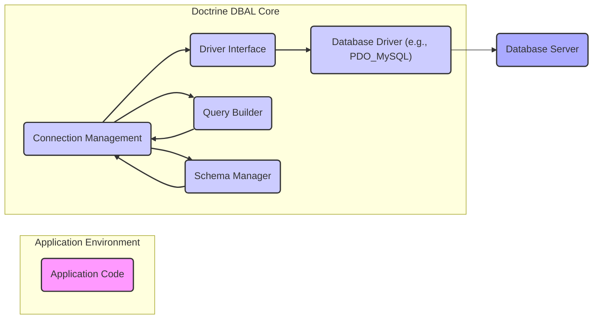
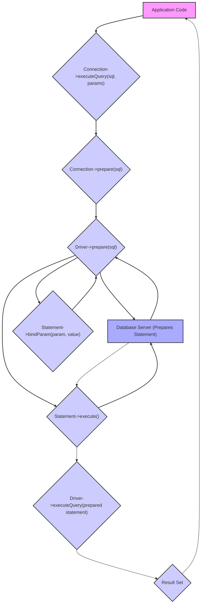

# Project Design Document: Doctrine DBAL

**Version:** 1.1
**Date:** October 26, 2023
**Author:** AI Software Architect

## 1. Introduction

This document provides an enhanced design overview of the Doctrine Database Abstraction Layer (DBAL) project, intended for use in threat modeling and general understanding. It details the architecture, key components, and data flow within the system. This document serves as the foundation for identifying potential security vulnerabilities and designing mitigation strategies.

Doctrine DBAL is a foundational PHP library offering a database-agnostic interface. It abstracts interactions with various database systems, enabling developers to write database logic independent of specific database vendors. This promotes code portability, simplifies database management, and enhances application maintainability.

## 2. Goals and Objectives

The core objectives of Doctrine DBAL are:

* **Database Abstraction:** To provide a consistent and unified API for interacting with diverse database systems (e.g., MySQL, PostgreSQL, SQLite, SQL Server).
* **Connection Management:** To efficiently handle the establishment, management, and pooling of database connections.
* **Secure Query Building:** To offer a programmatic approach to constructing SQL queries, significantly reducing the risk of SQL injection vulnerabilities through features like parameterized queries.
* **Data Type Abstraction:** To abstract away the nuances of database-specific data type implementations, providing a consistent representation within the application.
* **Transaction Management:** To provide robust mechanisms for managing database transactions, ensuring data consistency and integrity.
* **Schema Management:** To offer tools for programmatically creating, modifying, and managing database schemas in a database-agnostic manner.
* **Extensibility through Drivers:** To provide a flexible architecture allowing for the integration of new database systems through a well-defined driver interface.
* **Event System Integration:** To enable developers to intercept and react to various stages of the database interaction lifecycle, facilitating logging, auditing, and other cross-cutting concerns.

## 3. Target Audience

This document is primarily intended for:

* Security engineers responsible for threat modeling and security assessments.
* Software developers working with or contributing to the Doctrine DBAL project.
* System architects designing applications that utilize Doctrine DBAL as a data access layer.
* Technical stakeholders seeking a comprehensive understanding of Doctrine DBAL's internal workings and design principles.

## 4. Scope

This design document focuses on the core functionalities of Doctrine DBAL that are most relevant to database interaction and management from a security perspective. The scope includes:

* Management and establishment of database connections, including connection parameters and security considerations.
* Construction, preparation, and execution of database queries, with emphasis on parameter binding and prevention of SQL injection.
* Handling and processing of result sets returned from database queries.
* Management of database transactions, including atomicity, consistency, isolation, and durability (ACID) properties.
* Operations related to database schema management, such as creating, altering, and dropping tables and indexes.
* The architecture and role of the underlying database driver system and its interaction with DBAL.
* The event system and its potential security implications.

## 5. High-Level Architecture

**Description:**

* **Application Code:** The PHP application logic that interacts with the database through Doctrine DBAL.
* **Connection Management:** This central component is responsible for managing database connections, including establishing new connections, reusing existing connections (pooling), and handling connection lifecycle events. It provides the interface for the application to interact with the database.
* **Driver Interface:** Defines a standardized interface that concrete database drivers must implement. This abstraction layer ensures that DBAL can interact with different database systems without requiring significant code changes.
* **Database Driver (e.g., PDO_MySQL):** A specific implementation of the `Driver Interface` tailored for a particular database system. It utilizes the underlying database extension (like PDO) to communicate directly with the database server.
* **Query Builder:** A component that offers a programmatic and secure way to construct SQL queries. It encourages the use of parameterized queries, which helps prevent SQL injection vulnerabilities.
* **Schema Manager:** Provides functionalities for inspecting and manipulating the database schema, such as retrieving table definitions, creating new tables, or altering existing ones.
* **Database Server:** The actual database system (e.g., MySQL, PostgreSQL) where the data is stored and managed.

## 6. Key Components

This section provides a more detailed description of the major components within Doctrine DBAL and their functionalities, with a focus on security-relevant aspects.

* **Connection Management:**
    * Handles the lifecycle of database connections, including establishing, maintaining, and closing connections.
    * Manages connection parameters such as hostname, username, password, and database name. Secure storage and retrieval of these credentials are critical.
    * Supports connection pooling to improve performance by reusing existing connections. Improperly configured connection pooling can lead to resource exhaustion.
    * Provides methods for executing SQL queries (`executeQuery`, `executeStatement`) and managing transactions.
    * Offers features for setting connection attributes and character sets.
    * Emits events during connection lifecycle stages (e.g., `preConnect`, `postConnect`) that can be intercepted for logging or auditing.

* **Driver Interface and Database Drivers:**
    * The `Driver` interface defines the contract for database-specific implementations, ensuring a consistent API for DBAL.
    * Concrete drivers (e.g., `PDO_MySQL`, `PDO_PgSQL`, `OCI8`) implement this interface, handling database-specific communication.
    * Drivers are responsible for:
        * Establishing a physical connection to the database server.
        * Preparing SQL statements for execution.
        * Executing prepared statements and raw SQL queries.
        * Fetching results from the database server.
        * Escaping user-provided values to prevent SQL injection when using raw queries (though parameterized queries are the recommended approach).
        * Handling database-specific error codes and messages.
        * Providing metadata about the database server (e.g., version, platform). Vulnerabilities in the underlying driver can directly impact DBAL's security.

* **Query Builder:**
    * Offers a fluent and object-oriented interface for constructing SQL queries programmatically.
    * Supports building `SELECT`, `INSERT`, `UPDATE`, and `DELETE` statements.
    * Enforces the use of parameterized queries through its API, significantly reducing the risk of SQL injection. Developers should be strongly encouraged to use the Query Builder instead of writing raw SQL.
    * Provides methods for adding conditions (`WHERE`), ordering (`ORDER BY`), grouping (`GROUP BY`), and limiting results (`LIMIT`).
    * Allows for the construction of complex queries in a structured and readable manner.

* **Statement:**
    * Represents a prepared SQL statement that can be executed multiple times with different parameters.
    * Created by the `Connection` object using the `prepare()` method.
    * Crucially, it allows for binding parameters to placeholders in the SQL query, which is the primary mechanism for preventing SQL injection.
    * Provides methods for binding parameters by value or by reference (`bindParam`, `bindValue`).
    * Offers methods for executing the statement (`execute`) and fetching results.

* **Result Set:**
    * Represents the collection of rows returned by a database query.
    * Provides methods for iterating over the rows and accessing the data.
    * Allows fetching data as associative arrays, numeric arrays, or objects.
    * The structure and content of the result set are determined by the executed query.

* **Schema Manager:**
    * Provides functionalities for inspecting and manipulating the database schema.
    * Allows retrieving information about tables, columns, indexes, and foreign keys.
    * Offers methods for creating, altering, and dropping database objects (tables, columns, indexes, etc.). Access to schema management functions should be carefully controlled as they can have significant impact on the database.
    * Provides a database-agnostic way to manage schema changes, abstracting away database-specific syntax.

* **Transaction Management:**
    * The `Connection` object provides methods for managing database transactions, ensuring data integrity.
    * `beginTransaction()` initiates a new transaction.
    * `commit()` saves all changes made within the transaction.
    * `rollback()` discards all changes made within the transaction.
    * Proper use of transactions is essential for maintaining data consistency, especially in concurrent environments.
    * Supports nested transactions (savepoints) in some database systems.

* **Event System:**
    * Allows developers to hook into various events during the database interaction lifecycle.
    * Examples of events include: `preConnect`, `postConnect`, `preExecute`, `postExecute`, `onTransactionBegin`, `onTransactionCommit`, `onTransactionRollback`.
    * Enables the implementation of cross-cutting concerns such as logging, profiling, auditing, and security monitoring. Care must be taken to ensure event listeners do not introduce security vulnerabilities.

## 7. Data Flow

The following diagram illustrates a typical data flow for executing a parameterized query using Doctrine DBAL, highlighting the steps involved in preventing SQL injection.

**Description:**

1. **Application Code** initiates a query execution by calling a method on the `Connection` object, providing the SQL query with placeholders and an array of parameters (e.g., `executeQuery(sql, params)`).
2. The **Connection** prepares the SQL statement by calling the `prepare()` method, which is delegated to the underlying **Driver**. The SQL sent to the driver contains placeholders, not the actual data.
3. The **Driver** sends the prepare request with the SQL containing placeholders to the **Database Server**.
4. The **Database Server** parses and prepares the statement structure.
5. The **Driver** receives confirmation that the statement is prepared.
6. The **Application Code** or **Connection** binds the actual parameter values to the placeholders in the prepared statement using the `bindParam()` method on the **Statement** object. This binding is typically handled by the driver, ensuring proper escaping and preventing SQL injection.
7. The **Statement** executes the prepared statement by calling the `execute()` method, which is delegated to the **Driver**. The actual data values are sent separately from the SQL structure.
8. The **Driver** sends the execute request with the bound parameters to the **Database Server**.
9. The **Database Server** executes the query using the provided parameters.
10. The **Driver** receives the results and creates a **Result Set** object.
11. The **Result Set** is returned to the **Application Code**.

## 8. Security Considerations

This section expands on the initial security considerations, providing more detail and context for threat modeling.

* **SQL Injection Vulnerabilities:**
    * **Primary Threat:** Improper handling of user input when constructing SQL queries remains the most significant threat.
    * **Mitigation:** Doctrine DBAL's parameterized queries are the primary defense. Developers must consistently use the Query Builder or prepared statements with parameter binding.
    * **Risk Areas:**  Careless use of raw SQL, especially when concatenating user input, bypasses DBAL's protection and introduces vulnerabilities. Dynamic SQL generation without proper escaping can also be risky.
* **Database Connection Security:**
    * **Credential Management:** Securely storing and managing database credentials is paramount. Avoid hardcoding credentials in the application code. Utilize environment variables, configuration files with restricted access, or dedicated secret management services.
    * **Connection String Security:** Connection strings themselves can contain sensitive information. Ensure they are not exposed in logs or version control systems.
    * **Network Security:**  Secure the network communication between the application and the database server using encryption (e.g., TLS/SSL).
* **Denial of Service (DoS) Attacks:**
    * **Malicious Queries:**  Attackers could craft complex or resource-intensive queries to overload the database server. Implement query timeouts and resource limits on the database server.
    * **Connection Exhaustion:**  Excessive connection attempts can exhaust database resources. Implement connection pooling and rate limiting at the application level.
* **Data Exposure:**
    * **Unauthorized Access:** Ensure proper database user permissions are configured, granting only the necessary privileges to the application's database user.
    * **Data Leaks:**  Avoid logging sensitive data in plain text. Implement proper logging practices and consider data masking or anonymization where appropriate.
* **Privilege Escalation:**
    * **Overly Permissive Database Users:**  Avoid granting excessive privileges to the database user used by the application. Follow the principle of least privilege.
    * **Exploiting Application Vulnerabilities:**  Vulnerabilities in the application code could be exploited to execute unauthorized database operations if the database user has excessive permissions.
* **Database Driver Vulnerabilities:**
    * **Third-Party Risk:**  Vulnerabilities in the underlying database drivers (e.g., PDO extensions) can directly impact the security of the application. Keep drivers updated with the latest security patches.
* **Schema Manipulation Risks:**
    * **Unauthorized Schema Changes:**  Restrict access to schema management functions. If the application requires dynamic schema modifications, carefully validate input and implement robust authorization checks.
    * **Data Corruption:**  Malicious schema changes can lead to data corruption or loss.

## 9. Assumptions

The following assumptions underpin this design document:

* Readers possess a foundational understanding of database concepts, SQL, and common security principles.
* The primary focus is on the core functionalities of Doctrine DBAL relevant to security and data interaction.
* Specific configuration details for individual database systems and advanced features are not exhaustively covered.
* Developers utilizing Doctrine DBAL adhere to best practices for secure coding, including using parameterized queries and avoiding raw SQL where possible.

## 10. Out of Scope

This design document explicitly excludes the following:

* Detailed configuration options for specific database systems and their security configurations.
* Advanced features of Doctrine DBAL, such as custom data types, result set hydration strategies, and database replication configurations.
* Performance optimization techniques and benchmarking.
* Specific implementation details of individual database drivers beyond their interaction with the DBAL interface.
* The architecture and security considerations of the Doctrine ORM (Object-Relational Mapper), which builds upon Doctrine DBAL.

## 11. Future Considerations

Potential future enhancements to Doctrine DBAL that could impact its security posture include:

* **Enhanced Asynchronous Operations:**  Introducing asynchronous database operations could introduce new concurrency-related security challenges.
* **Improved Error Handling and Security Logging:** More granular and security-focused logging could aid in detecting and responding to attacks.
* **Standardized Security Auditing Features:**  Built-in mechanisms for auditing database interactions could enhance security monitoring.
* **Further Abstraction of Driver-Specific Security Features:**  Providing a more consistent way to leverage database-specific security features could improve overall security.

This enhanced design document provides a more detailed and security-focused overview of Doctrine DBAL. It aims to equip security engineers and developers with the necessary information for effective threat modeling and the development of secure applications.