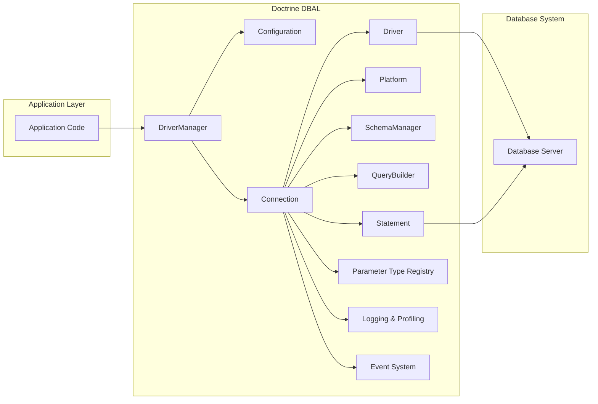
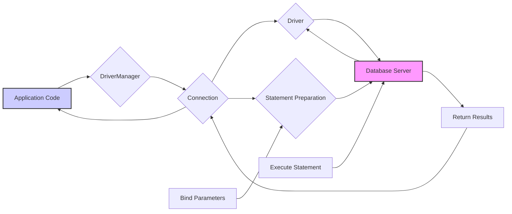

# Project Design Document: Doctrine DBAL

**Version:** 1.1
**Date:** October 26, 2023
**Author:** AI Software Architect

## 1. Introduction

This document provides an enhanced and more detailed design overview of the Doctrine Database Abstraction Layer (DBAL) project, specifically tailored for threat modeling purposes. It elaborates on the key architectural components, data flow, and interactions within the system, with a strong emphasis on security considerations.

Doctrine DBAL serves as a foundational library for PHP applications requiring database interaction. Its core strength lies in providing a database-agnostic interface, enabling developers to work with diverse database systems (e.g., MySQL, PostgreSQL, SQLite, Oracle, SQL Server) through a unified API. This abstraction significantly enhances code portability and reduces the complexities associated with managing database-specific implementations.

## 2. Goals and Objectives

The fundamental goals of Doctrine DBAL are:

*   **Robust Database Abstraction:** To offer a comprehensive and consistent API for interacting with a wide range of relational database systems, hiding their implementation specifics.
*   **Seamless Portability:** To facilitate the migration of applications between different database systems with minimal code modifications, reducing vendor lock-in.
*   **Enhanced Security Posture:** To provide built-in mechanisms and guidelines that help developers prevent common database vulnerabilities, most notably SQL Injection attacks.
*   **Optimized Performance:** To offer efficient methods for executing database queries, managing connections, and leveraging database-specific performance features where appropriate.
*   **Flexible Extensibility:** To allow developers to extend and customize DBAL's functionality to accommodate new database features, custom data types, or specific application requirements.
*   **Simplified Database Management:** To provide tools and utilities for managing database schemas and performing common database administration tasks programmatically.

## 3. Architectural Overview

Doctrine DBAL employs a layered and modular architecture, promoting separation of concerns and maintainability. The interaction between its core components is crucial to delivering its database abstraction capabilities.

### 3.1. High-Level Architecture Diagram

### 3.2. Component Descriptions

*   **DriverManager:** The central point for obtaining `Connection` instances. It reads configuration details, selects the appropriate `Driver`, and manages the connection lifecycle.
*   **Configuration:** Holds all configuration settings for DBAL, including connection parameters (DSN, username, password), driver options, logging settings, and custom type mappings. This is a critical component for security, as it contains sensitive information.
*   **Connection:** Represents an active, stateful connection to a specific database. It provides the primary interface for executing queries, managing transactions (commit, rollback), and accessing schema information. It acts as a facade to the underlying `Driver`.
*   **Driver:** An interface defining the contract for database-specific adapters. Concrete implementations (e.g., `PDOMySql`, `PDOPgSql`, `SQLSrv`) handle the low-level communication with the database server using native protocols. The `Driver` is responsible for translating DBAL's generic calls into database-specific commands.
*   **Platform:** Provides database-specific metadata and functionalities. This includes data type mappings, SQL dialect variations (e.g., quoting identifiers, date/time formats), and schema manipulation commands. It ensures that DBAL generates SQL that is compatible with the target database.
*   **SchemaManager:** Responsible for inspecting and manipulating the database schema. It allows developers to retrieve information about tables, columns, indexes, and foreign keys, and to execute schema-altering statements (e.g., CREATE TABLE, ALTER TABLE).
*   **QueryBuilder:** A powerful and secure API for constructing SQL queries programmatically. It uses a fluent interface to build queries, automatically handling quoting and parameter binding, significantly reducing the risk of SQL injection.
*   **Statement:** Represents a prepared SQL statement that can be executed multiple times with different parameters. It encapsulates the SQL query and its associated parameters, providing methods for binding parameters and fetching results. Prepared statements are a key security feature.
*   **Parameter Type Registry:** Manages the mapping between PHP data types and database-specific parameter types. This ensures that data is passed to the database with the correct type, preventing potential errors and security issues.
*   **Logging & Profiling:** Provides mechanisms for logging SQL queries and profiling database interactions. This is useful for debugging, performance analysis, and security auditing. Sensitive information in logs should be handled carefully.
*   **Event System:** Allows developers to hook into various stages of the DBAL lifecycle, such as before and after query execution. This enables the implementation of custom logic for tasks like auditing, caching, or security enforcement.

## 4. Data Flow

The following details the typical data flow for executing a database query using Doctrine DBAL, highlighting key steps and component interactions:

1. **Application Request:** The application code initiates a database operation, such as retrieving data or modifying records.
2. **Connection Acquisition:** The application requests a `Connection` instance from the `DriverManager`, providing necessary connection parameters (often read from `Configuration`).
3. **Query Construction:** The application constructs the SQL query. This can be done directly as a string (less secure) or, preferably, using the `QueryBuilder`.
4. **Statement Preparation:** The `Connection` uses the appropriate `Driver` (determined by the connection parameters) to prepare the SQL query. This involves sending the query to the `Database Server` for parsing and optimization. A `Statement` object is created to represent the prepared query.
5. **Parameter Binding (if applicable):** If the query includes parameters, the application binds the parameter values to the `Statement`. The `Parameter Type Registry` ensures correct type conversion before sending data to the database. This is a critical step in preventing SQL injection.
6. **Statement Execution:** The `Connection` instructs the `Driver` to execute the prepared `Statement` against the `Database Server`. The `Driver` handles the low-level communication.
7. **Result Handling:** The `Database Server` processes the query and returns the result set to the `Driver`.
8. **Data Fetching:** The application uses the `Statement` to fetch the results. DBAL provides various methods for fetching data as arrays, objects, or iterators.
9. **Response to Application:** The fetched data is returned to the application code for further processing.
10. **Logging (Optional):** If configured, the query and its parameters might be logged by the `Logging & Profiling` component.

### 4.1. Data Flow Diagram (Query Execution with Prepared Statement)

## 5. Key Interactions

*   **Application Code <-> DriverManager:** The application initiates database interactions by requesting `Connection` objects from the `DriverManager`.
*   **DriverManager <-> Configuration:** The `DriverManager` reads connection details and other settings from the `Configuration` component.
*   **DriverManager <-> Connection:** The `DriverManager` creates and manages the lifecycle of `Connection` instances.
*   **Connection <-> Driver:** The `Connection` delegates all low-level database communication to the specific `Driver` implementation.
*   **Connection <-> Platform:** The `Connection` utilizes the `Platform` to understand database-specific nuances and generate compatible SQL.
*   **Connection <-> SchemaManager:** The `Connection` provides access to the `SchemaManager` for inspecting and modifying the database schema.
*   **Connection <-> QueryBuilder:** The application obtains a `QueryBuilder` instance from the `Connection` to construct queries securely.
*   **Connection <-> Statement:** The `Connection` creates and manages `Statement` objects for executing both raw and prepared SQL queries.
*   **Statement <-> Driver:** The `Statement` uses the `Driver` to send the SQL query and bound parameters to the `Database Server` and retrieve results.
*   **Driver <-> Database Server:** The `Driver` handles the direct, low-level communication with the underlying `Database Server` using its specific network protocol.
*   **Connection <-> Logging & Profiling:** The `Connection` sends information about executed queries and their performance to the `Logging & Profiling` component.
*   **Connection <-> Event System:** Various events during the connection and query lifecycle trigger listeners in the `Event System`.

## 6. Security Considerations

Security is a paramount concern in the design and usage of Doctrine DBAL. The following points highlight key security aspects and potential threats:

*   **SQL Injection Prevention:**
    *   **Prepared Statements with Parameter Binding:** DBAL's primary defense against SQL injection is the enforced use of prepared statements with proper parameter binding. When using the `QueryBuilder` or manually preparing statements, DBAL ensures that user-provided data is treated as data, not executable code.
    *   **Automatic Quoting:** The `QueryBuilder` automatically handles quoting of identifiers (table and column names) to prevent injection in these contexts.
    *   **Developer Responsibility:** While DBAL provides strong protection, developers must still avoid concatenating user input directly into raw SQL queries.
*   **Connection String Security:**
    *   **Secure Storage:** Database credentials stored in the `Configuration` are highly sensitive. They should never be hardcoded directly in the application. Environment variables, secure configuration files with restricted access, or dedicated secret management services are recommended.
    *   **Principle of Least Privilege:** Database users configured in the connection string should have the minimum necessary privileges required for the application's operations. Avoid using administrative accounts for routine tasks.
*   **Data Integrity:**
    *   **Transactions:** DBAL's transaction management features (commit, rollback) help ensure data consistency and atomicity of operations, preventing data corruption in case of errors.
    *   **Data Type Handling:** The `Parameter Type Registry` ensures that data is passed to the database with the correct data type, preventing potential data truncation or misinterpretation.
*   **Error Handling and Information Disclosure:**
    *   **Controlled Error Reporting:** Production environments should be configured to avoid displaying detailed database error messages to end-users, as these can reveal sensitive information about the database structure.
    *   **Secure Logging:** While logging can be valuable for auditing, ensure that sensitive data (like user input that might contain passwords) is not logged or is properly sanitized before logging. Access to log files should be restricted.
*   **Dependency Management:**
    *   **Vulnerability Scanning:** Regularly scan DBAL and its dependencies for known security vulnerabilities and update to the latest versions promptly.
*   **Secure Configuration:**
    *   **Disable Unnecessary Features:** If certain features of DBAL are not required, consider disabling them to reduce the attack surface.
    *   **Secure Defaults:** Rely on DBAL's secure default configurations and avoid making changes that could weaken security.
*   **Denial of Service (DoS):**
    *   **Connection Pooling Limits:** Properly configure connection pooling to prevent resource exhaustion on the database server due to excessive connection requests.
    *   **Query Timeouts:** Implement query timeouts to prevent long-running or malicious queries from tying up database resources.
*   **Man-in-the-Middle Attacks:**
    *   **Secure Connections:** Ensure that connections to the database server are encrypted using protocols like TLS/SSL, especially when connecting over a network.

## 7. Deployment Considerations

Deploying applications using Doctrine DBAL requires careful consideration of several factors:

*   **PHP Version Compatibility:** Ensure the PHP version on the deployment environment is compatible with the specific version of Doctrine DBAL being used.
*   **Database Driver Availability:** The appropriate PHP database driver extension (e.g., `pdo_mysql`, `pdo_pgsql`, `pdo_sqlsrv`) must be installed and enabled on the server.
*   **Configuration Management:** Securely manage database connection parameters. Avoid hardcoding credentials. Utilize environment variables, secure configuration files, or secret management services.
*   **Performance Tuning:**
    *   **Connection Pooling:** Implement connection pooling to reuse database connections and reduce the overhead of establishing new connections for each request.
    *   **Caching:** Consider implementing caching mechanisms (e.g., using Doctrine Cache) to reduce the number of database queries for frequently accessed data.
    *   **Query Optimization:** Optimize database queries for performance to reduce load on the database server.
*   **Security Hardening:**
    *   **Restrict File Permissions:** Ensure that configuration files containing database credentials have appropriate file permissions to prevent unauthorized access.
    *   **Network Security:** Secure the network communication between the application server and the database server.
*   **Monitoring and Logging:** Implement robust monitoring and logging to track database interactions, identify potential performance issues, and detect security incidents.

## 8. Future Considerations

Ongoing development and potential future enhancements for Doctrine DBAL include:

*   **Enhanced Asynchronous Support:** Further improving support for asynchronous database operations to enhance application responsiveness and scalability, particularly in non-blocking environments.
*   **More Advanced Data Type Handling:** Expanding support for complex and database-specific data types, including JSON, spatial data, and others.
*   **Improved Schema Migration Tools:** Enhancing the schema migration capabilities to provide more robust and flexible ways to manage database schema changes.
*   **Further Security Enhancements:** Continuously evaluating and incorporating new security best practices and features to address emerging threats. This might include more granular control over data access or integration with security scanning tools.
*   **Performance Optimizations:** Exploring further optimizations for query execution, result hydration, and connection management.
*   **Integration with Cloud Database Services:**  Improving integration and support for various cloud-based database offerings.

This improved document provides a more detailed and security-focused overview of the Doctrine DBAL project design, making it more suitable for comprehensive threat modeling activities.