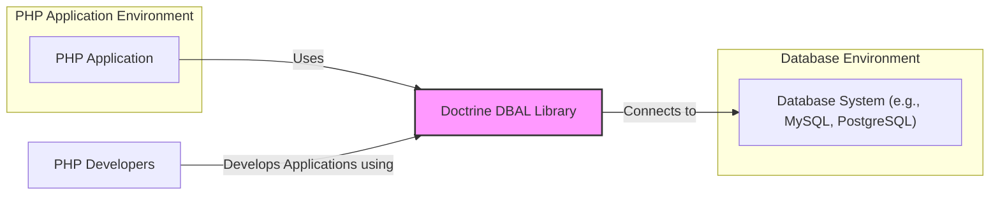
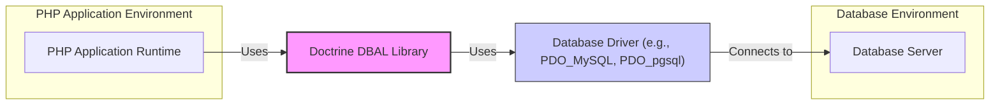

# BUSINESS POSTURE

This project, Doctrine DBAL (Database Abstraction Layer), aims to provide a powerful and feature-rich abstraction layer for accessing various database systems from PHP applications. It simplifies database interactions by providing a consistent API regardless of the underlying database engine.

## Business Priorities and Goals

-   Provide a stable and reliable database abstraction layer for PHP developers.
-   Support a wide range of database systems, ensuring compatibility and ease of switching databases.
-   Offer a performant and efficient way to interact with databases, minimizing overhead.
-   Simplify database operations, reducing code complexity and development time for PHP applications.
-   Maintain a high level of security to protect applications and data from database-related vulnerabilities.
-   Foster a strong community and provide ongoing maintenance and updates.

## Business Risks

-   Data breaches due to vulnerabilities in the DBAL leading to SQL injection or other database exploits.
-   Application downtime or instability caused by bugs or performance issues in the DBAL.
-   Compatibility issues with new database versions or PHP versions, requiring significant maintenance effort.
-   Loss of developer trust and adoption if the DBAL is perceived as insecure or unreliable.
-   Supply chain attacks targeting dependencies of the DBAL project.

# SECURITY POSTURE

## Existing Security Controls

-   security control: Open Source Code - The project is open source, allowing for community review and scrutiny of the codebase. Implemented in: GitHub repository.
-   security control: Public Issue Tracker - Security vulnerabilities can be reported and tracked publicly. Implemented in: GitHub Issues.
-   security control: Community Contributions -  Security patches and improvements can be contributed by the community. Implemented in: GitHub Pull Requests.
-   security control: Unit and Integration Tests -  Tests are in place to ensure the functionality and stability of the DBAL, which can indirectly contribute to security by preventing bugs. Implemented in: GitHub repository - tests directory.
-   security control: Version Control - Git is used for version control, allowing for tracking changes and reverting to previous versions if necessary. Implemented in: GitHub.

## Accepted Risks

-   accepted risk: Vulnerabilities in dependencies - The project relies on third-party libraries, which may contain vulnerabilities.
-   accepted risk: Undiscovered vulnerabilities - Despite efforts, there may be undiscovered security vulnerabilities in the codebase.
-   accepted risk: Security misconfigurations by users - Users may misconfigure the DBAL or their database connections, leading to security issues.
-   accepted risk: Denial of Service attacks against applications using DBAL.

## Recommended Security Controls

-   security control: Static Application Security Testing (SAST) - Implement automated SAST tools in the CI/CD pipeline to detect potential vulnerabilities in the code.
-   security control: Dependency Scanning - Regularly scan project dependencies for known vulnerabilities and update them promptly.
-   security control: Fuzzing - Perform fuzz testing to identify potential input validation vulnerabilities and edge cases.
-   security control: Security Audits - Conduct periodic security audits by external security experts to identify and address potential weaknesses.
-   security control: Secure Release Process - Implement a secure release process that includes security checks and code signing.
-   security control: Input Validation Framework -  Promote and document best practices for input validation when using DBAL to prevent SQL injection.

## Security Requirements

-   Authentication:
    -   Requirement: DBAL itself does not handle user authentication, but it must securely manage database credentials provided by the application.
    -   Requirement: Connection strings should be handled securely and not hardcoded in the application.
-   Authorization:
    -   Requirement: DBAL should facilitate the implementation of database-level authorization by the application.
    -   Requirement:  Ensure that database connections are established with the principle of least privilege.
-   Input Validation:
    -   Requirement: DBAL must provide mechanisms to prevent SQL injection vulnerabilities by properly escaping or parameterizing user inputs in database queries.
    -   Requirement:  The API should encourage or enforce the use of prepared statements and parameterized queries.
-   Cryptography:
    -   Requirement: DBAL should support secure connections to databases using encryption (e.g., TLS/SSL).
    -   Requirement:  If DBAL handles sensitive data in transit or at rest (e.g., connection strings), it should be encrypted appropriately.

# DESIGN

## C4 CONTEXT



### Context Diagram Elements

-   Name: PHP Application
    -   Type: Software System
    -   Description: The PHP application that utilizes Doctrine DBAL to interact with a database.
    -   Responsibilities: Implementing business logic, handling user requests, and using DBAL for database operations.
    -   Security controls: Application-level authentication and authorization, input validation, session management, secure coding practices.

-   Name: Database System (e.g., MySQL, PostgreSQL)
    -   Type: Software System
    -   Description: The database server that stores and manages application data. Examples include MySQL, PostgreSQL, SQLite, etc.
    -   Responsibilities: Storing data, processing queries, enforcing data integrity, managing user access.
    -   Security controls: Database authentication and authorization, access control lists, encryption at rest and in transit, database auditing, security hardening.

-   Name: Doctrine DBAL Library
    -   Type: Software System
    -   Description: The Database Abstraction Layer library that provides an interface for PHP applications to interact with various database systems.
    -   Responsibilities: Abstracting database differences, providing a consistent API, handling database connections, executing queries, and managing transactions.
    -   Security controls: Input validation (parameterized queries), secure connection handling, protection against SQL injection, adherence to secure coding practices.

-   Name: PHP Developers
    -   Type: Person
    -   Description: Developers who build and maintain PHP applications using Doctrine DBAL.
    -   Responsibilities: Writing application code, configuring DBAL, ensuring secure database interactions, and deploying applications.
    -   Security controls: Secure development practices, code reviews, security training, using secure development environments.

## C4 CONTAINER



### Container Diagram Elements

-   Name: PHP Application Runtime
    -   Type: Container
    -   Description: The runtime environment where the PHP application executes, including the PHP interpreter and necessary extensions.
    -   Responsibilities: Executing PHP code, managing application resources, and interacting with the operating system.
    -   Security controls: Operating system security hardening, web server security configuration, PHP security settings, resource limits.

-   Name: Database Server
    -   Type: Container
    -   Description: The database server process responsible for managing the database instance.
    -   Responsibilities: Handling database requests, managing data storage, enforcing database security policies.
    -   Security controls: Database server hardening, access control lists, network firewalls, database auditing, encryption at rest and in transit.

-   Name: Doctrine DBAL Library
    -   Type: Container
    -   Description: The DBAL library code that is included in the PHP application.
    -   Responsibilities: Providing the database abstraction API, managing connections, and executing queries.
    -   Security controls: Input validation (parameterized queries), secure connection handling, protection against SQL injection, adherence to secure coding practices.

-   Name: Database Driver (e.g., PDO_MySQL, PDO_pgsql)
    -   Type: Container
    -   Description:  A specific database driver (e.g., PDO extension for MySQL or PostgreSQL) used by DBAL to communicate with the database server.
    -   Responsibilities:  Translating DBAL commands into database-specific commands, handling low-level communication with the database server.
    -   Security controls:  Driver-specific security features, secure communication protocols, vulnerability patching of the driver.

## DEPLOYMENT

Doctrine DBAL is a library and is deployed as part of a PHP application. The deployment architecture of the PHP application will determine how DBAL is deployed. Here we consider a common deployment scenario using a web server and a separate database server.

```mermaid
flowchart LR
    subgraph "Deployment Environment"
        subgraph "Web Server Instance"
            A["Web Server (e.g., Apache, Nginx)"]
            B["PHP Runtime"]
            C["PHP Application Code (including DBAL)"]
        end
        subgraph "Database Server Instance"
            D["Database Server (e.g., MySQLd)"]
        end
        E["Operating System (e.g., Linux)"]
        F["Network"]
    end

    A -- "Runs on" --> E
    B -- "Runs on" --> E
    C -- "Deployed to" --> B
    B -- "Runs within" --> A
    A -- "Serves requests over" --> F
    B -- "Uses" --> C
    C -- "Uses" --> DBAL_Lib["Doctrine DBAL Library (within C)"]
    DBAL_Lib -- "Connects to" --> D
    D -- "Runs on" --> E
    A -- "Communicates with" --> D via F

    style DBAL_Lib fill:#f9f,stroke:#333,stroke-width:2px
```

### Deployment Diagram Elements

-   Name: Web Server (e.g., Apache, Nginx)
    -   Type: Infrastructure
    -   Description: The web server software responsible for handling HTTP requests and serving the PHP application.
    -   Responsibilities: Receiving HTTP requests, routing requests to the PHP runtime, serving static content, handling SSL/TLS termination.
    -   Security controls: Web server hardening, access control configurations, DDoS protection, SSL/TLS configuration, security modules (e.g., mod_security).

-   Name: PHP Runtime
    -   Type: Infrastructure
    -   Description: The PHP interpreter and associated modules that execute the PHP application code.
    -   Responsibilities: Executing PHP scripts, managing application resources, interacting with the operating system.
    -   Security controls: PHP security configuration (php.ini), disabled functions, open_basedir restrictions, resource limits, regular patching.

-   Name: PHP Application Code (including DBAL)
    -   Type: Software
    -   Description: The deployed PHP application code, including the Doctrine DBAL library and application-specific logic.
    -   Responsibilities: Implementing application functionality, using DBAL for database interactions, handling user requests.
    -   Security controls: Secure coding practices, input validation, output encoding, session management, access control within the application.

-   Name: Database Server (e.g., MySQLd)
    -   Type: Infrastructure
    -   Description: The database server process running on a dedicated server or instance.
    -   Responsibilities: Managing the database, storing data, processing queries, enforcing database security policies.
    -   Security controls: Database server hardening, access control lists, network firewalls, database auditing, encryption at rest and in transit, regular patching.

-   Name: Operating System (e.g., Linux)
    -   Type: Infrastructure
    -   Description: The operating system on which the web server and database server are running.
    -   Responsibilities: Providing the underlying platform for software execution, managing system resources, providing security features.
    -   Security controls: OS hardening, access control, firewalling (iptables, firewalld), security updates and patching, intrusion detection systems.

-   Name: Network
    -   Type: Infrastructure
    -   Description: The network infrastructure connecting the web server and database server, and allowing access from users.
    -   Responsibilities: Providing network connectivity, routing traffic, enforcing network security policies.
    -   Security controls: Network segmentation, firewalls, intrusion detection/prevention systems, network monitoring, VPNs for remote access.

## BUILD

The build process for Doctrine DBAL, being an open-source PHP library, typically involves the following steps, focusing on security aspects:

```mermaid
flowchart LR
    A["Developer"] --> B["Code Changes (Git)"]
    B --> C["GitHub Repository"]
    C --> D["GitHub Actions CI"]
    D --> E["Build & Test (PHPUnit)"]
    E --> F["Static Analysis (e.g., Psalm, PHPStan)"]
    F --> G["Security Scans (Dependency Check)"]
    G --> H["Artifacts (Distribution Files)"]
    H --> I["Release (Packagist, GitHub Releases)"]
    style D fill:#ccf,stroke:#333,stroke-width:1px
    style E fill:#ccf,stroke:#333,stroke-width:1px
    style F fill:#ccf,stroke:#333,stroke-width:1px
    style G fill:#ccf,stroke:#333,stroke-width:1px
```



### Build Process Elements

-   Name: Developer
    -   Type: Person
    -   Description: A software developer contributing to the Doctrine DBAL project.
    -   Responsibilities: Writing code, fixing bugs, implementing new features, and submitting code changes.
    -   Security controls: Secure development environment, code reviews, security awareness training, using version control.

-   Name: Code Changes (Git)
    -   Type: Process
    -   Description: Code modifications made by developers and tracked using Git version control.
    -   Responsibilities: Versioning code changes, tracking history, facilitating collaboration.
    -   Security controls: Code commit signing, branch protection, access control to the repository.

-   Name: GitHub Repository
    -   Type: System
    -   Description: The central repository hosting the Doctrine DBAL source code on GitHub.
    -   Responsibilities: Storing code, managing branches, tracking issues, hosting pull requests.
    -   Security controls: Access control, branch protection rules, audit logs, vulnerability scanning by GitHub.

-   Name: GitHub Actions CI
    -   Type: System
    -   Description: GitHub's built-in Continuous Integration and Continuous Delivery service used to automate the build, test, and release process.
    -   Responsibilities: Automating build steps, running tests, performing static analysis, and security scans.
    -   Security controls: Secure workflow definitions, secret management, access control to workflows, audit logs.

-   Name: Build & Test (PHPUnit)
    -   Type: Process
    -   Description: The step where the code is built and unit tests are executed using PHPUnit to ensure code quality and functionality.
    -   Responsibilities: Compiling code (if necessary), running automated tests, verifying code correctness.
    -   Security controls: Test coverage, secure test environment, vulnerability scanning of test dependencies.

-   Name: Static Analysis (e.g., Psalm, PHPStan)
    -   Type: Process
    -   Description: Automated static analysis tools are used to scan the codebase for potential bugs, code quality issues, and security vulnerabilities without executing the code.
    -   Responsibilities: Identifying potential code defects, enforcing coding standards, detecting security weaknesses.
    -   Security controls: Regularly updated analysis rules, configuration to detect security-relevant issues, integration into CI pipeline.

-   Name: Security Scans (Dependency Check)
    -   Type: Process
    -   Description: Automated tools are used to scan project dependencies for known security vulnerabilities.
    -   Responsibilities: Identifying vulnerable dependencies, alerting maintainers about vulnerabilities, ensuring dependencies are up-to-date.
    -   Security controls: Regularly updated vulnerability databases, automated alerts, integration into CI pipeline.

-   Name: Artifacts (Distribution Files)
    -   Type: Data
    -   Description: The packaged and built files ready for distribution, such as ZIP archives or Phar files.
    -   Responsibilities: Packaging the library for distribution, ensuring integrity of distribution files.
    -   Security controls: Code signing of artifacts, checksum generation, secure storage of artifacts.

-   Name: Release (Packagist, GitHub Releases)
    -   Type: Process
    -   Description: Publishing the built artifacts to package repositories like Packagist (for PHP Composer) and GitHub Releases, making the library available to users.
    -   Responsibilities: Distributing the library, making it accessible to developers, managing releases.
    -   Security controls: Secure release process, access control to release platforms, monitoring for compromised releases.

# RISK ASSESSMENT

## Critical Business Processes

The critical business processes that Doctrine DBAL helps to protect are those of the applications that depend on it for database access. These processes include:

-   Data storage and retrieval for applications.
-   Transaction processing and data integrity within applications.
-   Application functionality that relies on database interactions (which is often a core part of many applications).

If DBAL is compromised or has vulnerabilities, it can directly impact the confidentiality, integrity, and availability of these business processes.

## Data Sensitivity

The data being protected is the data stored in the databases accessed through Doctrine DBAL. The sensitivity of this data varies greatly depending on the application using DBAL. It can range from publicly available information to highly sensitive personal data, financial records, or trade secrets.

-   Sensitivity levels can include:
    -   Public: Data intended for public consumption.
    -   Internal: Data intended for internal use within an organization.
    -   Confidential: Sensitive data that requires protection to prevent unauthorized disclosure, such as personal data or financial information.
    -   Highly Confidential: Extremely sensitive data that requires the highest level of protection, such as trade secrets or critical infrastructure data.

The security measures implemented for applications using DBAL must be commensurate with the sensitivity of the data being processed and stored.

# QUESTIONS & ASSUMPTIONS

## Questions

-   What is the target audience for this design document? Is it primarily for developers, security auditors, or project maintainers?
-   Are there specific deployment environments or scenarios that are of particular concern for security?
-   Are there any known past security incidents or vulnerabilities related to Doctrine DBAL that should be considered?
-   What is the expected lifespan of this version of Doctrine DBAL, and are there plans for future major architectural changes?
-   Are there specific regulatory compliance requirements that applications using DBAL need to adhere to (e.g., GDPR, HIPAA, PCI DSS)?

## Assumptions

-   BUSINESS POSTURE:
    -   The primary business goal is to provide a secure, reliable, and widely adopted database abstraction layer for PHP.
    -   Security is a high priority for the Doctrine DBAL project and its users.
    -   The project aims for broad compatibility with various database systems and PHP environments.

-   SECURITY POSTURE:
    -   The project follows open-source security principles, relying on community review and transparency.
    -   Security vulnerabilities are taken seriously and addressed promptly.
    -   Users of DBAL are expected to implement their own application-level security controls in addition to the security features provided by DBAL.
    -   The development team is aware of common web application security risks, such as SQL injection.

-   DESIGN:
    -   DBAL is designed as a library to be integrated into PHP applications.
    -   It relies on database-specific drivers (e.g., PDO) for actual database communication.
    -   The build process is automated using GitHub Actions and includes basic security checks.
    -   Deployment of DBAL is inherently tied to the deployment of the PHP applications that use it.