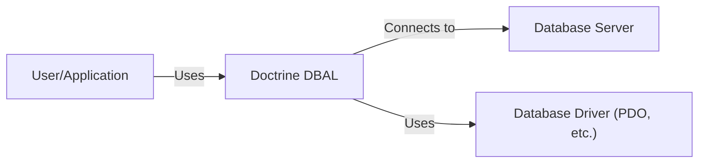
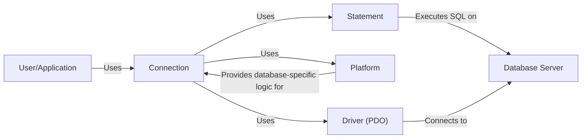
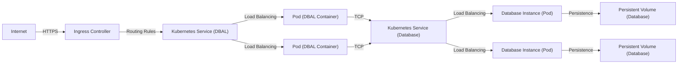
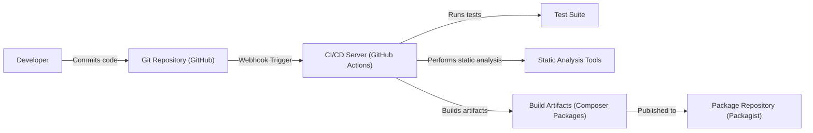

# BUSINESS POSTURE

Business Priorities and Goals:

*   Provide a powerful and flexible database abstraction layer (DBAL) that simplifies database interactions for PHP applications.
*   Offer compatibility with a wide range of database systems, allowing developers to switch databases with minimal code changes.
*   Ensure high performance and efficiency in database operations.
*   Maintain a stable and reliable library that is well-tested and actively maintained.
*   Provide clear and comprehensive documentation to facilitate ease of use.
*   Foster a strong community around the project, encouraging contributions and feedback.

Business Risks:

*   Data breaches or unauthorized access to sensitive data stored in databases.
*   Data corruption or loss due to bugs in the DBAL or underlying database systems.
*   Performance bottlenecks that impact the responsiveness of applications using the DBAL.
*   Compatibility issues with specific database systems or versions, leading to application failures.
*   Security vulnerabilities in the DBAL that could be exploited by attackers.
*   Lack of adoption or community support, hindering the long-term viability of the project.

# SECURITY POSTURE

Existing Security Controls:

*   security control: Input validation: The DBAL uses prepared statements and parameterized queries to prevent SQL injection vulnerabilities. (Implemented in the `Connection` and `Statement` classes).
*   security control: Escaping: The DBAL provides mechanisms for escaping user-provided data to prevent SQL injection. (Implemented in the `Connection` and `Platform` classes).
*   security control: Error handling: The DBAL provides detailed error messages and exceptions to help developers identify and resolve database-related issues. (Implemented throughout the codebase).
*   security control: Testing: The DBAL has an extensive test suite that covers a wide range of scenarios and database systems. (Located in the `tests/` directory).
*   security control: Code reviews: All code changes are reviewed by multiple developers before being merged. (Enforced by GitHub pull request process).
*   security control: Static analysis: The DBAL uses static analysis tools to identify potential security vulnerabilities and code quality issues. (Configured in CI workflows).
*   security control: Dependency management: The DBAL uses Composer to manage its dependencies and ensure that they are up-to-date. (Defined in `composer.json`).

Accepted Risks:

*   accepted risk: The DBAL relies on the security of the underlying database systems and drivers. Any vulnerabilities in these components could potentially impact the security of the DBAL.
*   accepted risk: The DBAL does not provide built-in encryption for data at rest or in transit. This is left to the underlying database system or application-level logic.
*   accepted risk: The DBAL does not provide built-in auditing or logging of database operations. This is left to the underlying database system or application-level logic.

Recommended Security Controls:

*   security control: Implement stricter input validation and sanitization, even for seemingly safe data types, to mitigate potential edge cases and future vulnerabilities.
*   security control: Consider integrating with security linters and static analysis tools that specifically focus on database security, such as those that detect potential SQL injection flaws beyond prepared statements.
*   security control: Provide documentation and examples on how to securely configure database connections, including recommendations for TLS/SSL encryption and secure authentication mechanisms.

Security Requirements:

*   Authentication: The DBAL should rely on the underlying database system's authentication mechanisms. It should not store or manage credentials directly.
*   Authorization: The DBAL should rely on the underlying database system's authorization mechanisms (e.g., GRANT/REVOKE). It should not implement its own authorization logic.
*   Input Validation: The DBAL must use prepared statements and parameterized queries for all database interactions to prevent SQL injection. All user-provided data must be properly escaped and validated.
*   Cryptography: The DBAL should support secure communication with the database server using TLS/SSL encryption where available. It should not handle data encryption/decryption itself, relying on database or application-level solutions.

# DESIGN

## C4 CONTEXT

Element Descriptions:

*   Element:
    *   Name: User/Application
    *   Type: Person/System
    *   Description: A PHP application or user that utilizes the Doctrine DBAL to interact with a database.
    *   Responsibilities: Initiates database requests, processes data returned from the database.
    *   Security controls: Application-level security controls, such as authentication, authorization, and input validation.

*   Element:
    *   Name: Doctrine DBAL
    *   Type: System
    *   Description: The Doctrine Database Abstraction Layer library.
    *   Responsibilities: Provides an abstraction layer for interacting with various database systems, handles connection management, query building, and result processing.
    *   Security controls: Input validation, prepared statements, escaping, error handling.

*   Element:
    *   Name: Database Server
    *   Type: System
    *   Description: The database server (e.g., MySQL, PostgreSQL, SQL Server).
    *   Responsibilities: Stores and manages data, processes queries, enforces access controls.
    *   Security controls: Database-level security controls, such as authentication, authorization, encryption, and auditing.

*   Element:
    *   Name: Database Driver
    *   Type: System
    *   Description: The low-level driver that facilitates communication between the DBAL and the database server (e.g., PDO, mysqli).
    *   Responsibilities: Handles the actual communication with the database server, executes queries, and returns results.
    *   Security controls: Driver-level security controls, such as connection security and parameter handling.

## C4 CONTAINER

Element Descriptions:

*   Element:
    *   Name: User/Application
    *   Type: Person/System
    *   Description: A PHP application or user that utilizes the Doctrine DBAL to interact with a database.
    *   Responsibilities: Initiates database requests, processes data returned from the database.
    *   Security controls: Application-level security controls, such as authentication, authorization, and input validation.

*   Element:
    *   Name: Connection
    *   Type: Container
    *   Description: Represents a connection to a database.
    *   Responsibilities: Manages the connection to the database, provides methods for executing queries and managing transactions.
    *   Security controls: Uses prepared statements, escaping.

*   Element:
    *   Name: Statement
    *   Type: Container
    *   Description: Represents a prepared statement.
    *   Responsibilities: Executes prepared statements with bound parameters, fetches results.
    *   Security controls: Parameterized queries.

*   Element:
    *   Name: Platform
    *   Type: Container
    *   Description: Provides database-specific functionality.
    *   Responsibilities: Handles differences between database systems, such as SQL dialects and data type conversions.
    *   Security controls: Escaping, data type validation.

*   Element:
    *   Name: Driver
    *   Type: Container
    *   Description: Low-level driver (e.g., PDO).
    *   Responsibilities: Handles communication with the database.
    *   Security controls: Driver-level security.

*   Element:
    *   Name: Database Server
    *   Type: System
    *   Description: The database server (e.g., MySQL, PostgreSQL).
    *   Responsibilities: Stores and manages data.
    *   Security controls: Database-level security.

## DEPLOYMENT

Possible Deployment Solutions:

1.  Traditional LAMP/LEMP stack: PHP application deployed on a server with Apache/Nginx, MySQL/PostgreSQL, and PHP.
2.  Containerized deployment: PHP application and database server deployed as Docker containers, orchestrated by Docker Compose or Kubernetes.
3.  Cloud-based deployment: PHP application deployed on a cloud platform (e.g., AWS, Azure, GCP) using services like Elastic Beanstalk, App Service, or Cloud Run, with a managed database service (e.g., RDS, Cloud SQL).
4.  Serverless deployment: PHP application deployed as serverless functions (e.g., AWS Lambda, Azure Functions) that connect to a managed database service.

Chosen Deployment Solution (Containerized Deployment with Kubernetes):

Element Descriptions:

*   Element:
    *   Name: Internet
    *   Type: External
    *   Description: The public internet.
    *   Responsibilities: Source of external requests.
    *   Security controls: Firewall, DDoS protection.

*   Element:
    *   Name: Ingress Controller
    *   Type: Infrastructure
    *   Description: Kubernetes Ingress controller (e.g., Nginx Ingress Controller).
    *   Responsibilities: Routes external traffic to the appropriate Kubernetes services.
    *   Security controls: TLS termination, request filtering, rate limiting.

*   Element:
    *   Name: Kubernetes Service (DBAL)
    *   Type: Infrastructure
    *   Description: Kubernetes Service for the DBAL application.
    *   Responsibilities: Provides a stable endpoint for accessing the DBAL application pods.
    *   Security controls: Network policies.

*   Element:
    *   Name: Pod (DBAL Container)
    *   Type: Container
    *   Description: Kubernetes Pod running the Doctrine DBAL application container.
    *   Responsibilities: Executes the DBAL application code.
    *   Security controls: Container security context, resource limits.

*   Element:
    *   Name: Kubernetes Service (Database)
    *   Type: Infrastructure
    *   Description: Kubernetes Service for the database.
    *   Responsibilities: Provides a stable endpoint for accessing the database instances.
    *   Security controls: Network policies.

*   Element:
    *   Name: Database Instance (Pod)
    *   Type: Container
    *   Description: Kubernetes Pod running the database server (e.g., MySQL, PostgreSQL).
    *   Responsibilities: Stores and manages data.
    *   Security controls: Database-level security controls, container security context.

*   Element:
    *   Name: Persistent Volume (Database)
    *   Type: Infrastructure
    *   Description: Kubernetes Persistent Volume for database storage.
    *   Responsibilities: Provides persistent storage for the database.
    *   Security controls: Storage encryption, access controls.

## BUILD

Build Process Description:

1.  Developer commits code changes to the Git repository (GitHub).
2.  A webhook triggers the CI/CD server (GitHub Actions).
3.  The CI/CD server runs the test suite.
4.  The CI/CD server performs static analysis using tools like PHPStan and Psalm.
5.  If tests and static analysis pass, the CI/CD server builds the artifacts (Composer packages).
6.  The artifacts are published to the package repository (Packagist).

Security Controls:

*   security control: Code reviews: All code changes are reviewed before merging.
*   security control: Automated testing: Extensive test suite ensures code quality and prevents regressions.
*   security control: Static analysis: Static analysis tools identify potential vulnerabilities and code quality issues.
*   security control: Dependency management: Composer manages dependencies and ensures they are up-to-date.
*   security control: CI/CD pipeline: Automated build and deployment process ensures consistency and reduces manual errors.
*   security control: Signed commits: Developers should sign their commits to ensure authenticity.
*   security control: Two-factor authentication: Enforce two-factor authentication for all contributors to the repository.

# RISK ASSESSMENT

Critical Business Processes:

*   Database interaction for PHP applications: The DBAL is a critical component for any PHP application that needs to interact with a database.
*   Data persistence: The DBAL is responsible for ensuring that data is stored and retrieved correctly from the database.

Data Sensitivity:

*   The DBAL itself does not handle sensitive data directly. However, it facilitates access to databases, which may contain sensitive data such as:
    *   Personally Identifiable Information (PII)
    *   Financial data
    *   Authentication credentials
    *   Application-specific sensitive data
*   The sensitivity of the data depends on the specific application and database using the DBAL.

# QUESTIONS & ASSUMPTIONS

Questions:

*   Are there any specific compliance requirements (e.g., GDPR, HIPAA) that the applications using the DBAL must adhere to?
*   What are the specific database systems and versions that the DBAL needs to support?
*   What is the expected load and performance requirements for applications using the DBAL?
*   Are there any existing security policies or guidelines that need to be followed?

Assumptions:

*   business posture: The primary goal is to provide a secure and reliable database abstraction layer.
*   security posture: The underlying database systems and drivers are properly secured.
*   security posture: Application developers using the DBAL will implement appropriate security measures at the application level.
*   design: The DBAL will be used in a standard PHP environment.
*   design: The deployment environment will be properly secured.