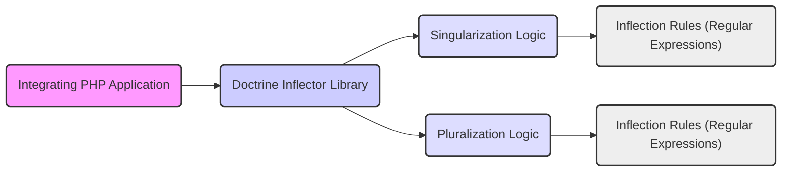

# Project Design Document: Doctrine Inflector Library

**Document Version:** 1.1
**Date:** October 26, 2023
**Author:** AI Software Architect

## 1. Introduction

This document provides a detailed design overview of the Doctrine Inflector library, a PHP library dedicated to the singularization and pluralization of words. This document is intended to serve as a foundational resource for subsequent threat modeling activities, offering a comprehensive understanding of the library's architecture, internal components, and the flow of data during its operation.

## 2. Goals and Non-Goals

**Goals:**

* To present a clear and comprehensive description of the Doctrine Inflector library's architectural design and operational functionalities.
* To precisely identify the key internal components of the library and elucidate their interactions.
* To meticulously outline the data flow within the library during the inflection process.
* To highlight potential areas of interest and concern from a security perspective, thereby guiding subsequent threat modeling efforts.

**Non-Goals:**

* To provide an exhaustive, line-by-line code-level implementation guide for the library.
* To include performance benchmarks, optimization strategies, or detailed resource consumption metrics.
* To offer a complete and finalized security analysis or threat assessment of the library (this document acts as a preliminary input for such analyses).
* To detail the library's internal testing strategy, specific test cases, or code coverage metrics.

## 3. System Architecture

The Doctrine Inflector library is designed as a self-contained PHP library intended for integration within other PHP applications. It does not function as a standalone service or application. Its primary function is to offer methods for transforming words between their singular and plural forms based on defined rules.

**Components:**

* **Integrating PHP Application:** The external PHP application that instantiates and utilizes the functionalities provided by the Doctrine Inflector library.
* **Doctrine Inflector Library:** The core library containing the logic and rules for performing word inflection.
* **Singularization Logic:** The specific set of algorithms and rules responsible for converting plural words to their grammatically correct singular form.
* **Pluralization Logic:** The specific set of algorithms and rules responsible for converting singular words to their grammatically correct plural form.
* **Inflection Rules (Regular Expressions):** A collection of predefined rules, frequently implemented using regular expressions, that dictate how words are transformed during the inflection process. These rules are often language-specific to ensure grammatical accuracy.

## 4. Component Design

The Doctrine Inflector library is primarily structured around classes and methods that implement the core singularization and pluralization functionalities.

* **`Inflector` Class:** This class serves as the primary interface for interacting with the library. It typically exposes static methods or can be instantiated to access inflection functionalities.
    * **`singularize(string $word)`:**  A public method that accepts a string representing a word as input and returns its singular form as a string.
    * **`pluralize(string $word)`:** A public method that accepts a string representing a word as input and returns its plural form as a string.
    * **`isSingular(string $word)`:** A public method that checks if the given word is considered singular, returning a boolean value.
    * **`isPlural(string $word)`:** A public method that checks if the given word is considered plural, returning a boolean value.
    * **Rule Management (Potentially):** The `Inflector` class might internally manage the loading, caching, and application of the defined inflection rules.

* **Rule Definition Classes (Potentially):** These classes encapsulate the individual transformation rules. The specific structure might vary, but they generally include:
    * **`pattern` (Regular Expression):** The regular expression used to match parts of the input word.
    * **`replacement` (String):** The string that will replace the matched portion of the word.
    * **`options` (Array, Optional):**  Additional options or flags that modify the behavior of the rule (e.g., case-insensitive matching).

* **Uncountable Strategy:**  A mechanism for handling words that do not follow standard pluralization rules. This often involves:
    * **Uncountable Word List:** An internal list (array or set) of words that should not be pluralized or singularized (e.g., "equipment", "information", "news"). The library checks against this list before applying regular expression rules.

## 5. Data Flow

The data flow within the library is relatively direct and follows a predictable path.

1. An integrating PHP application initiates the inflection process by calling either the `singularize()` or `pluralize()` method of the `Inflector` class, providing the target word (as a string) as input.
2. The `Inflector` class, upon receiving the input word, first checks if the word exists within the internal "uncountable word list". If the word is found in this list, it is considered an exception, and the original word is immediately returned without further processing.
3. If the input word is not present in the uncountable list, the library proceeds to retrieve the appropriate set of inflection rules based on the method called (singularization or pluralization).
4. The library then iterates through the retrieved rules, applying each rule's regular expression to the input word. The order of rule application can be significant.
5. When a rule's regular expression matches a portion of the input word, the corresponding replacement string is applied, transforming the word. Typically, only the *first* matching rule is applied, and the process stops.
6. The transformed word (or the original word if no rules matched) is then returned to the calling PHP application.

## 6. Security Considerations (For Threat Modeling)

While the Doctrine Inflector library's primary function is linguistic transformation and it doesn't directly handle sensitive user data or manage authentication, several potential security considerations are relevant, particularly concerning input processing and the context of its usage.

* **Regular Expression Denial of Service (ReDoS):** A significant risk stems from the use of regular expressions within the inflection rules. Poorly constructed or overly complex regular expressions can be vulnerable to ReDoS attacks. If an attacker can influence the input word passed to the `singularize()` or `pluralize()` methods, they might be able to craft a malicious string that causes the regular expression engine to enter a computationally expensive state, leading to excessive CPU consumption and a denial of service.
* **Input Validation and Handling:** Although the library expects string input, the robustness of the integrating application in sanitizing and validating input *before* passing it to the inflector is crucial. Passing unexpected input types (e.g., arrays, objects) could lead to unexpected errors, exceptions, or potentially exploitable behavior within the library or the calling application.
* **Dependency Security:** The overall security posture of the library is also influenced by the security of its underlying dependencies, primarily the PHP runtime environment itself. Maintaining an up-to-date and secure PHP installation is essential.
* **Contextual Security Implications:** The way in which the inflected words are subsequently used within the integrating application can introduce indirect security vulnerabilities. For instance:
    * **URL Generation:** If inflected words are used to construct URLs without proper sanitization, it could lead to injection vulnerabilities (e.g., if an unexpected pluralization creates a path traversal issue).
    * **Database Queries:** If inflected words are incorporated into database queries (e.g., dynamically generating table names), vulnerabilities could arise if the inflection logic produces unexpected or malicious outputs.
    * **Code Generation/Interpretation:** In scenarios where inflected words are used to dynamically generate or interpret code, vulnerabilities like code injection could be a concern.
* **Locale/Language Specific Vulnerabilities:** If the library supports multiple languages with different inflection rules, vulnerabilities might exist in specific language rule sets that are not present in others. Thorough testing of all supported locales is important.

## 7. Dependencies

The Doctrine Inflector library has minimal external dependencies. Its primary dependency is:

* **PHP:** The library is written in the PHP programming language and requires a compatible PHP version to execute. The specific minimum required version should be documented within the library's `composer.json` file.

## 8. Deployment

The standard deployment method for the Doctrine Inflector library is as a dependency within a PHP project, typically managed using the Composer dependency manager. Developers include the library as a required package in their project's `composer.json` file. Composer then handles the download, installation, and autoloading of the library.

**Deployment Steps:**

* **Add Dependency:** Include the `doctrine/inflector` package in the `require` section of your project's `composer.json` file.
* **Install Dependencies:** Run the `composer install` command in your project's root directory.
* **Autoloading:** Composer automatically configures autoloading, allowing you to use the library's classes in your project.

## 9. Future Considerations

* **Expanded Language Support:**  Future development could focus on extending the library's capabilities to support a wider range of languages and their nuanced inflection rules. This would involve the creation and maintenance of additional language-specific rule sets.
* **Customizable Inflection Rules:**  Providing mechanisms for developers to define custom inflection rules or extend the existing rule sets could significantly enhance the library's flexibility and adaptability to specific project needs.
* **Performance Enhancements:** While correctness is paramount, exploring opportunities to optimize the performance of the regular expression matching and rule application processes could be beneficial, especially for applications that perform a high volume of inflection operations.
* **Rule Validation and Testing Tools:**  Developing tools to aid in the validation and testing of inflection rules could improve the robustness and accuracy of the library, reducing the risk of errors or unexpected behavior.
* **Integration with Natural Language Processing (NLP) Libraries:** Exploring potential integrations with more advanced NLP libraries could open up possibilities for more sophisticated inflection logic and handling of edge cases.

This document provides a comprehensive design overview of the Doctrine Inflector library, intended to facilitate effective threat modeling. The detailed descriptions of components, data flow, and security considerations outlined here serve as crucial inputs for identifying and mitigating potential security risks associated with the library's use.